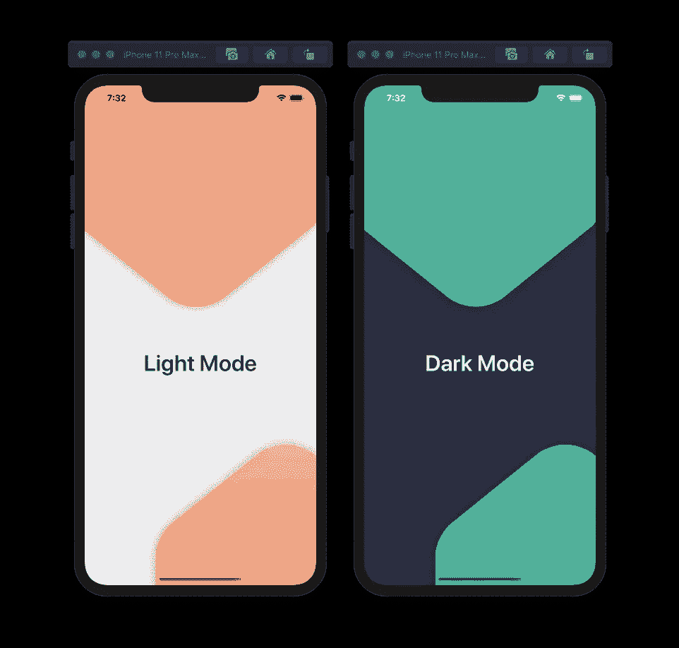
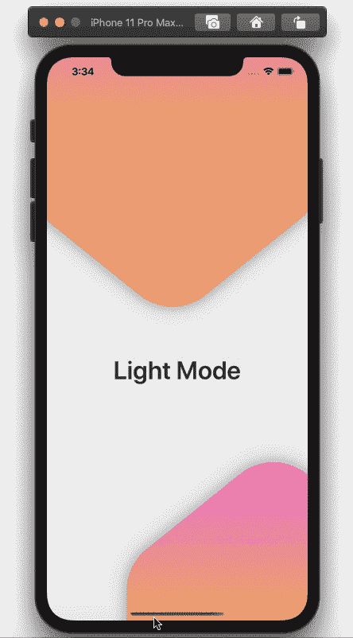

# 如何在 SwiftUI 中检测明暗模式

> 原文：<https://betterprogramming.pub/how-to-detect-light-and-dark-modes-in-swiftui-eef21ba4d11d>

## 在 iOS 13 中检测用户何时从亮模式变为暗模式



项目截图——iPhone 亮暗模式示例

你可以用一个名为`ColorScheme`的环境键来检测 iOS 13 中从亮到暗模式的变化(反之亦然)。

`ColorScheme`列举明暗模式的设置选项。使用此值调整应用程序中的颜色，甚至更改一些其他变量。例如，我修改了一个文本来反映当前的 iPhone 模式(“亮模式”或“暗模式”)

首先，你需要为你的浅色和深色创建常量变量。您可以将它们添加到内容视图中，为它们创建扩展或结构，或者在结构和类之外添加颜色。

现在，您可以将`ColorScheme`变量添加到内容视图中，并使用它根据您的喜好调整视图。

```
@Environment(\.colorScheme) **var** colorScheme
```

您可以更改形状或视图背景颜色，如下面的代码所示:

```
.background(colorScheme == .light ? bgColorLight: bgColorDark)
```

您还可以更改其他变量，如下文所示:

```
Text(colorScheme == .light ? "Light Mode" : "Dark Mode")
```



您可以使用以下代码片段获得与左上图类似的结果:

完整的项目代码，[点击这里](https://github.com/SarahAlsharif/LightAndDarkModeUsingSwiftUI)。