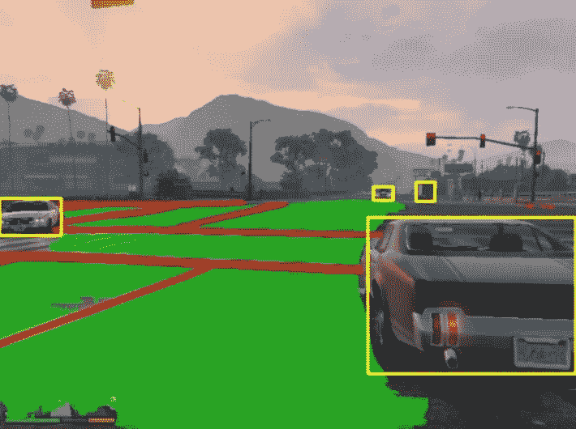
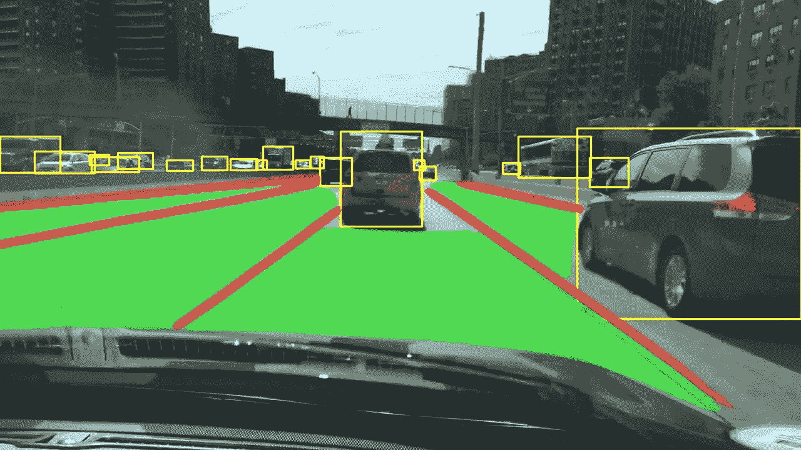
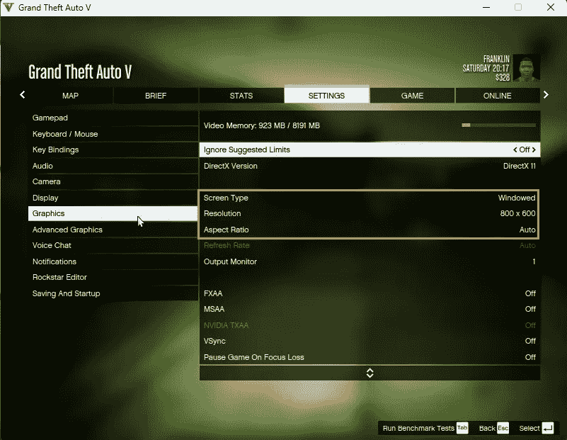
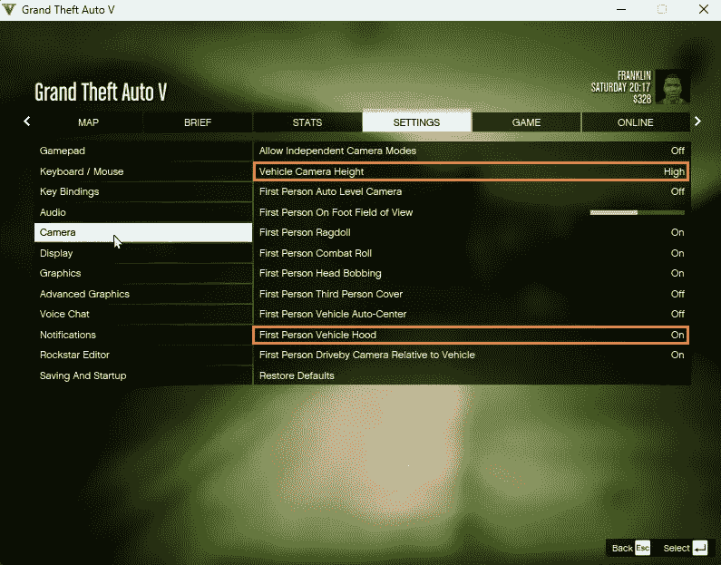
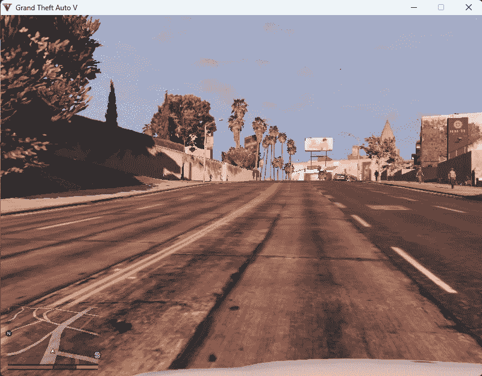
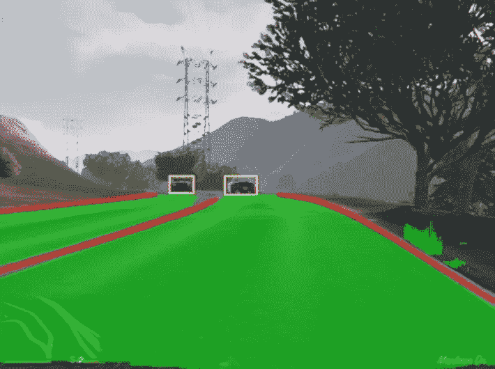
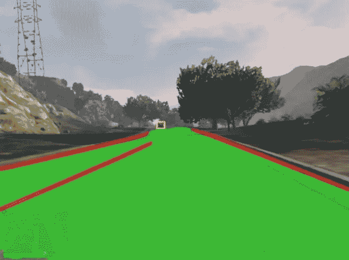
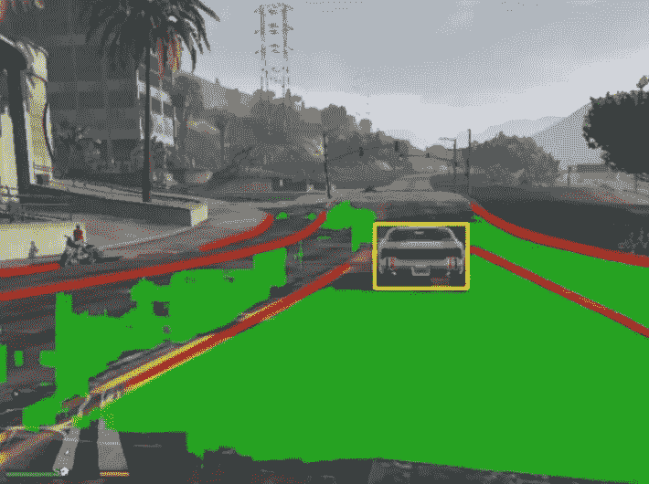
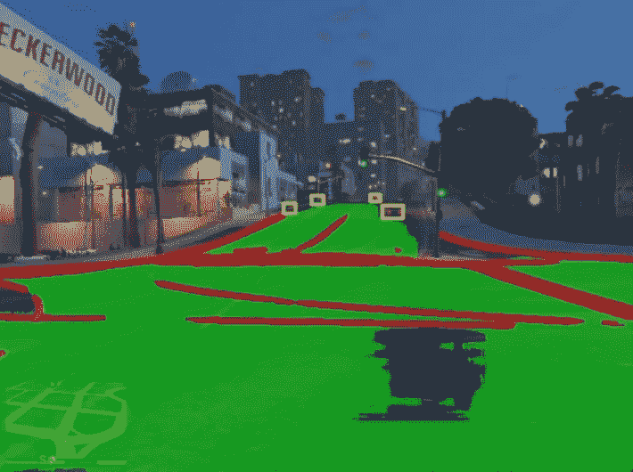

# 在侠盗猎车手 5 中使用 YOLOPv2 检测道路和车辆

> 原文：<https://betterprogramming.pub/how-to-detect-roads-and-vehicles-with-yolopv2-in-gta-v-7e74a853cc17>

## 安装并设置 YOLOPv2，这样您就可以在视频游戏 GTA V 中将它用于可驾驶表面、车道线和车辆检测



下面，我将向您展示如何从 GitHub 安装和设置 YOLOPv2 项目。此外，我将向您展示如何测试安装。在那之后，我将回顾在视频游戏《侠盗猎车手 5》中使用 YOLOPv2 的代码。最后，我将向您展示用游戏运行代码的结果。

# 安装和设置 YOLOPv2

你可以在 Github [这里](https://github.com/CAIC-AD/YOLOPv2)找到 YOLOPv2 的描述。

要安装项目文件，您可以执行以下操作:

```
git clone [https://github.com/CAIC-AD/YOLOPv2.git](https://github.com/CAIC-AD/YOLOPv2.git)
cd yolopv2
pip install -r requirements.txt
```

项目的目录布局如下所示:

```
D:.
├───data
│   ├───demo
│   ├───log
│   └───weights
└───utils
```

从[这里](https://github.com/CAIC-AD/YOLOPv2/releases/download/V0.0.1/yolopv2.pt)下载`yolopv2.pt`模型文件，放在`weights`目录下。

您可以运行演示来检查安装是否正确执行:

```
python demo.py
```

你可以在`/runs/detect/exp`目录中找到结果。

```
D:.
├───data
│   ├───demo
│   ├───log
│   └───weights
├───runs
│   └───detect
│       ├───exp
└───utils
```

结果应该是这样的:



# 将 YOLOPv2 与 GTA V 一起使用的代码

要对来自游戏的视频流执行检测，您可以使用以下代码:

将上述代码放在 YOLOPv2 项目目录的上层。

如果您的系统上还没有安装 Python 的`mss`和`win32gui`，请务必安装它们。你可以这样做:

```
pip install mss
pip install pywin32
```

在第 8 行和第 9 行，我们从原始 YOLOPv2 项目的`util`目录中的`util.py`文件导入了一些函数。

在第 11–13 行，我们找到了包含 GTA V 游戏的窗口，并使其在前景中可见。后者是截图功能所必需的。

在第 15-18 行，游戏窗口的位置和大小被确定。此外，我们添加了一些修正，从截图坐标中删除菜单栏和边框。

在第 20–32 行，我们定义了一个函数，它可以截取屏幕上任何一个矩形的截图。输入参数决定了这个矩形。

在第 34–38 行，加载了 YOLOPv2 模型。我必须写出完整的路径来找到模型文件`yolopv2.pt`。随后，模型文件被发送到 GPU (cuda)，精度减半以加快推理过程，并对模型进行评估。

在第 40 行，图像尺寸`imgsz`被设置为 640。这是因为 YOLOPv2 类神经网络接受 640x640 的输入。在下面一行中，网络被“预热”

在第 45 行，我们设置了`torch.no_grad()`来减少内存使用和加速计算。

在第 46 行中，设置了一个无限循环，不断地从游戏中截取截图，并对每个截图执行检测。

在第 48 行，我们截取了游戏的截图。在这里，我们确保不要截图菜单栏等。

在第 51 行，我们缩小了截图大小以适应 YOLOPv2 网络。如前所述，网络可以接受最大 640x640 像素的图像作为输入。我们的截图因此缩小到 640x480。

在第 56–61 行，我们更多地调整了图像数据。维度被转置，图像矩阵被转换为 Pytorch 张量，发送到 GPU，数字被转换为浮点，精度减半，数字被归一化…

在第 62 行，图像最终被输入到 YOLOPv2 模型中。输出为`[pred, anchor_grid]`中的车辆检测、`seg`中的可行驶路面(道路)和`ll`中的车道线。

在第 67–84 行中，我们对输出图像上的可行驶表面和道路上的线条进行了遮罩。这是基于`seg`和`ll`的。

在第 86–96 行，车辆检测被添加到输出图像中。这里重用了原 YOLOPv2 项目中的几个现有函数。这主要是基于`pred`。

在第 98 行，最终的输出图像显示在使用 OpenCV 的窗口中。

在第 102–105 行，有一些标准的 OpenCV 代码用于处理输出的显示，并等待“q”键关闭输出窗口。

# 使用 GTA V 运行 YOLOPv2

我已经将 GTA V 设置为以 800x600 像素的分辨率窗口运行。据我所知，下面显示的游戏内部设置已经足够了。



一旦游戏加载完毕，我们进入了“故事模式”，我们的角色就可以通过按“f”进入某处的一辆汽车。然后，你可以按“v”几次来获得汽车引擎盖的视图。



不幸的是，视野并不集中在引擎盖上，而是在驾驶员的前方。

> 注意一旦你在游戏窗口内点击并运行游戏，光标就不能离开窗口。您需要按下`Shift-Tab`来释放光标。

现在，我们可以运行上面这段 Python 代码…

```
python gtav_yolopv2.py
```

命令行输出将以 FPS 为单位显示帧速率，一个窗口将显示覆盖了 YOLOPv2 检测的游戏视频流。

下面，你可以看到一个展示结果的视频。

我只想指出，我的硬件设置是连接到 Razer Core X eGPU 机箱中的 NVidia GTX 1080 FE 的英特尔 NUC 10。连接是通过迅雷。

该设置以其独特的方式引人入胜，但在性能方面却不尽如人意。至少没有达到目前(2022 年 10 月)的标准。因此，事实上 YOLOPv2 网络推理工作得如此之快令人印象深刻。

下面也是我另一次跑步的一些照片。有时道路和车道线检测工作完美，但有时它们可能会令人困惑。



使用 YOLOPv2 进行两次非常好的道路和线路检测



使用 YOLOPv2 进行的两种略微令人困惑的道路和线路检测

# 结论

总的来说，我认为 YOLOPv2 工作得非常好，因为它不是为视频游戏输入而设计的，也因为我的硬件不是特别高性能。

车辆(汽车和卡车)的检测精度非常高。可行驶的道路和车道线检测得非常好，但是可以改进。

也许在将截图输入神经网络之前，对其进行一些简单的图像处理会进一步提高质量。在这种情况下，应用高斯模糊或调整截图的 HSV 边界可能会有所帮助。

# 参考

[“无法安装 win32gui”在 Stackoverflow 上](https://stackoverflow.com/questions/52806906/cant-install-win32gui)

[“py torch 的 torch.no_grad 有什么用？”在 Stackoverflow 上](https://datascience.stackexchange.com/questions/32651/what-is-the-use-of-torch-no-grad-in-pytorch)

[“yolop v2🚀:更好、更快、更强的全景驾驶感受”](https://github.com/CAIC-AD/YOLOPv2)