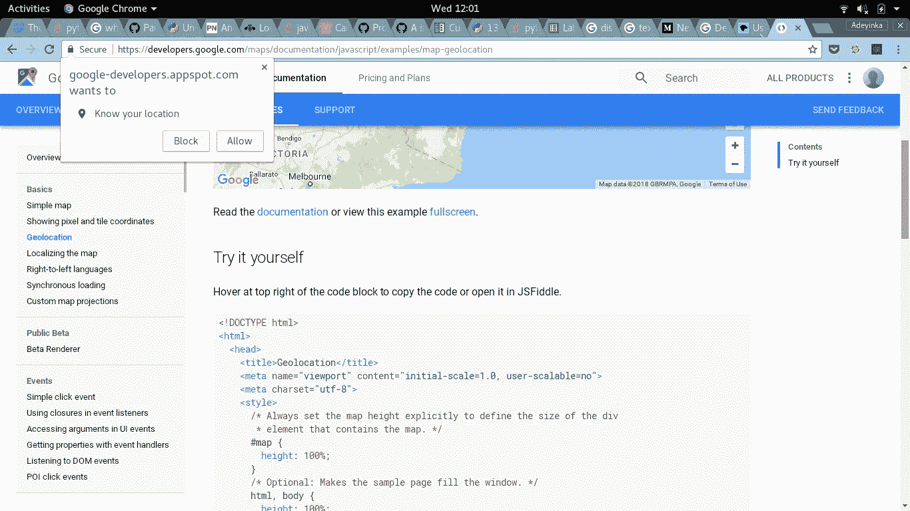
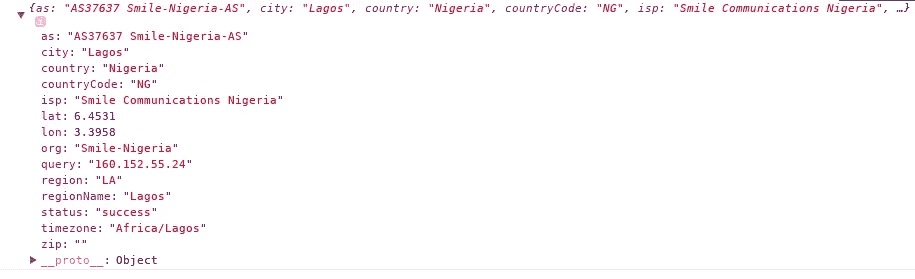
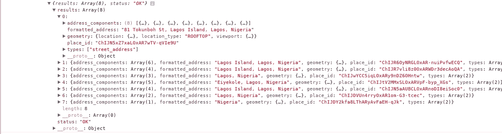

# 如何使用 JavaScript 检测网站访问者的位置

> 原文：<https://betterprogramming.pub/how-to-detect-the-location-of-your-websites-visitor-using-javascript-92f9e91c095f>

戈兰·艾沃斯在 [Unsplash](https://unsplash.com/search/photos/javascript?utm_source=unsplash&utm_medium=referral&utm_content=creditCopyText) 上的照片

出于多种原因，检测网站用户的位置非常有用。

例如，您可能希望为来自不同国家的人显示不同的内容(可能使用不同的语言),或者向来自不同位置的访问者显示有针对性的信息。

不管你的理由是什么，你有两个选择:

1.  [地理定位 API](https://developers.google.com/maps/documentation/geolocation/intro) 和
2.  IP 地址查找

# 地理定位 API

地理位置 API 是 HTML5 的一个新特性，它允许网页的访问者与你共享他们的位置，如果他们愿意的话。

当您尝试使用这个 API 检索位置时，会向用户显示一个提示，询问他们是否愿意与您的站点共享他们的位置。

向用户显示的提示类型的示例

显然，这意味着如果用户决定不与您共享他们的位置，您将无法获得位置。

缺点:它只能在安全服务器(https)上工作。它在 Internet Explorer 10 和更低版本上不受支持，OperaMini 也不受支持。

代码的输出只给了我们坐标。如果您需要实际位置，或者用文字获取地址，该怎么办？我们将在讨论完 IP 查找后讨论这个问题。

# IP 地址查找

IP 地址查找是获取访问者位置的另一种方式。对于这个选项，我们通常使用公共 IP 查找服务/API。其中有些是付费服务，有些是免费的。

例子包括 [IP 地理定位 API](http://ip-api.com/) 、 [IPinfo](https://ipinfo.io/) 和 [GEOIP DB](http://geoip-db.com/) 。他们还提供各种格式的数据，比如 JSON、XML 和 CSV。为了更好地理解如何使用这些服务，请阅读它们的文档。

在我的例子中，我将使用 IP 地理定位 API。我可以使用普通的 JavaScript，但是我不会。使用像 [jQuery](http://jquery.com) 这样的库更容易。

这是我的控制台上的输出:

缺点:虽然大多数 IP 查找服务给出的国家几乎总是准确的，但坐标并不总是准确的。此外，如果你要进行大量的请求，这些服务中的一些需要你获得一个 API 密钥，你可能需要为服务付费。

对于不支持地理定位的浏览器中的地理定位 API，您可以使用 IP 查找作为替代或备份，或者在发生错误时通知您，如下所示:

现在我们已经以某种方式获得了我们的位置，我们将使用 [Google Maps 反向地理编码 API 将检索到的纬度和经度转换为更全面的地址。](https://developers.google.com/maps/documentation/geocoding/intro)

根据谷歌的说法，*反向地理编码是将地理坐标转换成人类可读地址的过程。我们只需要一个 api 密钥。按照步骤在这里得到一个。*

*这是我得到的:*

**

*反向地理编码 API 的输出示例*

*您可以随意摆弄该对象，以您最喜欢的格式获得所需的地址。*

*把这些放在一起，我们有下面的代码。(注意`ipLookUp`功能被修改。)*

*至此，我们知道了如何在任何情况下检索用户的位置，现在您可以根据自己独特的项目定制代码。*

*希望你有所收获，感谢阅读！*

# *源代码*

*您可以在 [GitHub](https://github.com/AdeyinkaAdegbenro/Detect_Location/blob/master/detect_location.js) 上找到本文的代码。*

 *[## AdeyinkaAdegbenro/Detect _ Location

### 通过在 GitHub 上创建一个帐户，为 AdeyinkaAdegbenro/Detect _ Location 开发做出贡献。

github.com](https://github.com/AdeyinkaAdegbenro/Detect_Location/blob/master/detect_location.js)*