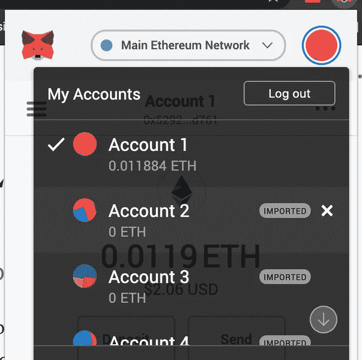
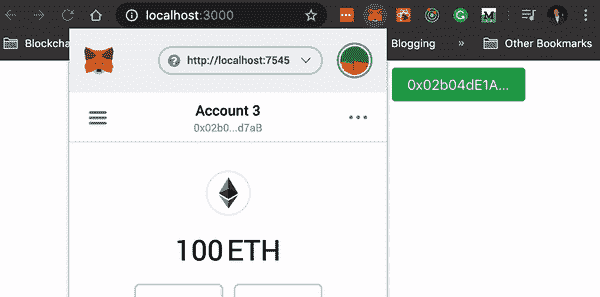

# 如何检测用户何时更改其元掩码帐户

> 原文：<https://betterprogramming.pub/how-to-detect-when-a-user-changes-their-metamask-account-4611845b6415>

## 确保您跟踪的是用户正确的 ETH 帐户

在 [Unsplash](https://unsplash.com?utm_source=medium&utm_medium=referral) 上由[杰森·伊吉塔](https://unsplash.com/@jeison?utm_source=medium&utm_medium=referral)拍摄的照片。

*先决条件:对以太坊和 web3.js 的初级理解*

用户体验是让用户加入你的去中心化应用的最大障碍之一(DApp)。现代网络浏览器默认不支持 [web3](https://web3.foundation/) ，所以大多数用户不得不通过 [Metamask](https://metamask.io/) 浏览器扩展与 DApps 交互。

元掩码允许用户更改网络，并通过分机更改他们的活动钱包地址。

图 1

不幸的是，DApps 不会知道用户何时更改帐户，除非专门检查它。这意味着，如果用户在使用您的 DApp 时更改帐户，他们将看到与以前帐户相关的过期信息。这就像登录您的脸书帐户，看到前一个用户的仪表板。显然是不能接受的。

幸运的是，Metamask 现在允许您通过一段简单的代码实时监听用户何时更改他们的帐户。

# 检测帐户更改

让我们假设您有一个名为`getAccount()`的函数，它连接到以太坊并加载正在使用的活动帐户。每当加载 DApp 时都会发生这种情况。

Metamask 在帐户选择改变时触发一个`accountsChanged`事件，我们可以监听这个事件。图 2 显示了这样的代码:

图 2

使用该事件监听器，您的 DApp 可以实时获得最新的钱包数据，从而使您的用户体验更加流畅和及时。图 3 显示了一个 DApp，当触发`accountsChanged`事件时，它检索活动的钱包地址并将其显示在一个按钮中。

图 3

有关该功能的更多信息，请参见 [Metamask 的文档](https://docs.metamask.io/guide/accessing-accounts.html)。

# 进一步阅读

如果你对区块链开发感兴趣，我会写一些关于如何开始和建立投资组合的教程、演练、提示和技巧。查看以下资源:

 [## 区块链开发资源马上跟进

### 学习区块链、以太坊和 DApp 开发的资源列表

medium.com](https://medium.com/blockcentric/blockchain-development-resources-b44b752f3248)