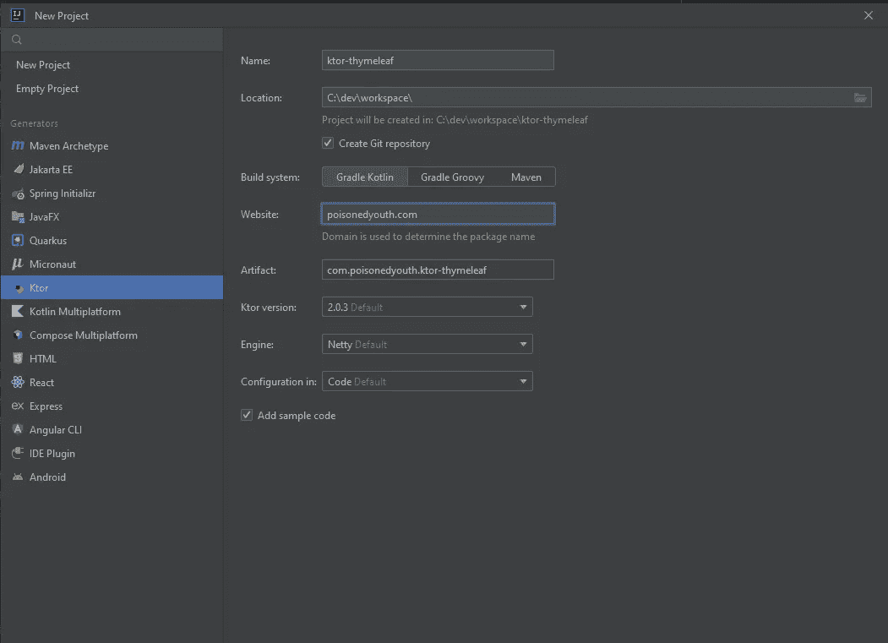
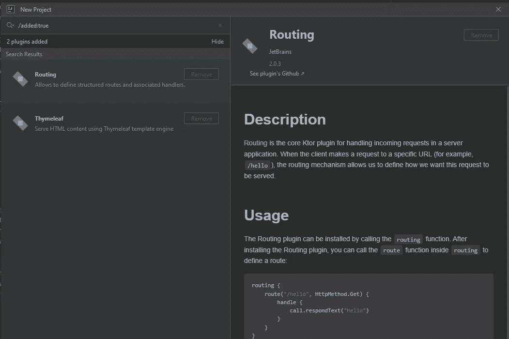
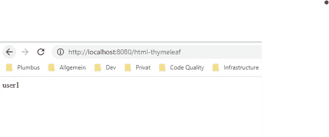
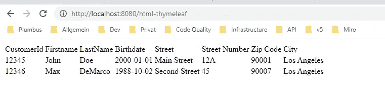
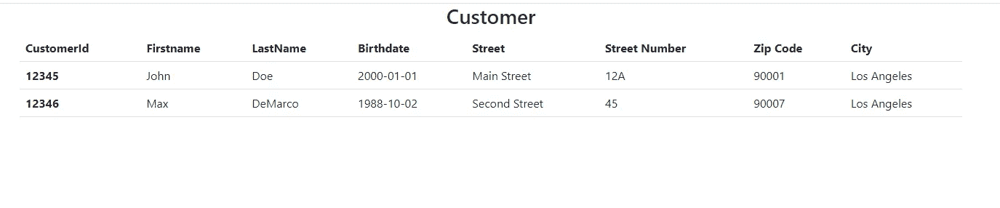
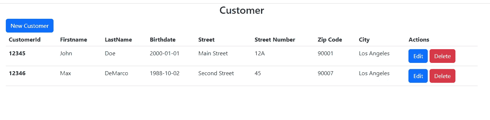

# 如何用 Ktor 和百里香叶开发一个 Web 应用

> 原文：<https://betterprogramming.pub/how-to-develop-a-web-application-with-ktor-and-thymeleaf-ccbb23776252>

## Ktor 和百里香叶配合得很好


在我的文章“[从 Spring Boot 切换到 Ktor](https://link.medium.com/ZGxGDMpfVrb) ”中，我展示了使用 Ktor 框架(结合 Koin 和 Exposed)开发 API 端点是多么容易。

开发一个只被 REST API 客户端访问的应用程序是一个需求，但是如果我想为用户提供一个图形界面呢？Ktor 如何帮助我解决这个问题？

Ktor [为 JVM 模板引擎提供支持](https://ktor.io/docs/working-with-views.html)。所以对我来说，使用我在 Java 开发中了解的一个著名引擎是可能的。

在这篇文章中，我将展示如何使用 **Ktor** 和 **Thymeleaf** 开发一个支持基本 CRUD 操作的简单用户界面。

起点是 Intellij 的“新建项目”向导:



我将路由和百里香插件添加到项目中。



创建的项目包含以下代码部分，这些代码部分提供了示例页的功能:

当服务器成功启动时，我可以浏览显示用户名的示例页面。



**所以让我们开始添加功能。**

# 域:

作为第一步，我创建了代表我的业务用例的域对象。我使用两个相互关联的类。有一个客户有地址。为简单起见，每个客户都有他/她自己的地址对象。

为了能够在第一个可见页面上显示域对象，我创建了一个硬编码的域对象列表，它保存在内存中。并且可以显示在表格中。

我编辑示例`index.html`以在 html 表格中显示示例数据。

启动服务器并浏览`index.html`，结果看起来不太好，即使对于主要是后端开发者的我来说也是如此。



为了不费吹灰之力改进设计，我在项目中添加了**bootstrap**([https://get bootstrap . com/docs/5.2/getting-started/introduction/](https://getbootstrap.com/docs/5.2/getting-started/introduction/))。有了这个，现在看起来好多了。



到目前为止，我只有一个静态页面，显示我硬编码的静态内容。下一步是添加创建新客户的功能。

为了能够创造新客户，我必须做以下改变:

*   将 html 页面的一般标题部分提取到一个片段中。
*   添加导航到 index.html 页面，允许导航到 newcustomer.html 页面
*   添加 newcustomer.html 页面
*   添加一个按钮来保存新创建的客户并导航回`index.html`页面。

我们走吧。

# 创建新客户:

我添加了`newcustomer.html`页面，可以看到带有引导配置的标题是重复的。为了防止重复添加这个部分，我将这个部分提取到一个片段中。[百里香允许将](https://www.thymeleaf.org/doc/articles/layouts.html)通用功能提取到一个片段中，该片段可以跨不同页面使用。

为了能够为新客户添加数据，我必须添加一个新页面和一个在`index.html`页面上导航的按钮。

对于导航，我添加了一个链接，它有一个`th:href`属性和一个相对于根目录的 URL(默认为 localhost:8080)。你可以在[文档](https://www.thymeleaf.org/doc/articles/standardurlsyntax.html)中寻找更多关于如何使用百里香中的链接的信息。

当点击链接时，会发送一个 URL 为`http:localhost:8080/new`的请求。我的路由部分需要一个端点来处理这些请求。

为了将表单数据反序列化为对象，我需要在应用程序中添加内容协商。

Ktor 目前不支持将表单数据反序列化为现成的对象(就像使用 Spring 时可以做到的那样)。使用时

```
call.receive<CustomerData>()
```

我得到一个错误，通知我将请求内容转换为 DTO 对象是不可能的:

```
Cannot transform this request’s content to com.poisonedyouth.CustomerData
```

从 HTTP post 请求返回的数据具有以下形式:

```
firstName=John&lastName=Doe&birthdate=2000-08-06&street=Main+Street&streetNumber=1&zipCode=90001&city=Los+Angeles
```

所以我有两个选择:

1.  编写一个自定义的反序列化程序，将表单数据转换为对象。
2.  以字符串形式检索表单数据，并使用`ObjectMapper`手动转换为对象。

为了简单起见，我使用第二个选项:

我以字符串形式检索表单数据，并将内容拆分成键值对。生成的地图可以通过 Jackson 的`ObjectMapper`转换成我的 DTO 对象。

通过这些更改，可以创建新客户并返回到`index.html`页面。

# 编辑现有客户:

为了能够从 index.html 页面编辑现有的客户，我必须在客户表中添加一个按钮，该按钮导航到编辑客户页面，我可以在那里更新现有的数据。

必须进行以下更改:

*   添加 editcustomer.html 页面
*   提取一般客户输入表单进行分段
*   添加一个按钮，从 index.html 页面导航到 editcustomer.html 页面
*   添加按钮以保存更新的客户并定位回 index.html

作为第一步，我添加了新的 editcustomer.html 页面，它看起来几乎完全一样的 newcustomer.html 页面。只有`th:action`属性有不同的 URL 目的地。

为了不复制整个表单，我将代码提取到一个片段中，并为`th:action`和`th:object` 指定变量，这些变量可以通过实现页面来设置。

有了这个表单片段，两个页面看起来都很整洁。

为了完成编辑现有客户的任务，我需要添加一个到`index.html`的链接，该链接导航到`editcustomer.html`页面并在 URL 中传递所选客户的 customerId。

在`Templating.kt`类中，我提取请求路径的`customerId`，在列表中搜索相应的客户，并将数据放入`editcustomer.html`页面的模型中。

完成这些更改后，可以点击客户行中的编辑按钮，编辑输入表单中的数据。

# 删除现有客户:

从`index.html`页面的表格中删除现有客户，需要在客户表格中有一个按钮，该按钮触发一个从现有客户列表中删除客户的请求。

必须进行以下更改:

*   添加按钮删除客户并重新加载页面

我需要添加一个链接到 index.html，这是导航到一个包含所选客户的`customerId`的 URL。

目前，只可能从 HTML 表单发送 GET 和 POST 请求。因此，我需要滥用 GET 请求来发送由路由端点处理的 customerId。

到现在为止`index.html`看起来如下:



可以创建新客户、编辑客户和删除现有客户。此外，页面之间的导航是可行的。

但是每次应用程序启动时，我都从相同的初始静态数据开始。为了有一个持久的客户名单，我需要添加一个数据库。

为了保持简单，我使用暴露+ H2 数据库。

通过下面的配置，可以在我的应用程序中使用这两者。

我用一个使用 H2 文件数据库的持久层代替了内存中的`DataHolder`。我使用暴露的 DAO 的实体类实现了基本的 CRUD 功能。

`DataHolder`作为一个服务层，将持久层从应用程序的其余部分中分离出来(使得与其他持久性框架进行交换成为可能)。

有了这些改变，我有了一个简单的 CRUD 应用程序，使用百里香的模板引擎提供了一个基本的用户界面。

百里香提供了更多的功能。一个很好的概述可以在[官方文档](https://www.thymeleaf.org/documentation.html)中找到。

# 附录

因为我对从`Thymeleaf`发送的表单内容的反序列化的解决方案不太满意，所以我尝试用一个更通用的变体来替换当前的手动将表单内容映射到我的 d to 对象的解决方案。我可以为表单数据注册一个自定义的`ContentConverter`。

当提交表单时，我通过`deserialize(…)`方法获得以下信息:

*   使用的字符集
*   `typeInfo`包含关于所使用的模型类的信息
*   内容为`ByteReadChannel`

要有一个通用的解决方案，能够将表单数据反序列化为不同的模型类，就必须处理 Kotlins 的反射机制。这给我带来了很多额外的工作来解决这个问题。所以我决定把它放在一篇额外的文章里，我将在未来发表。

# 摘要

Ktor 和百里香叶配合得很好，但与 Spring Boot 和百里香叶相比，我可能错过了一些关键的功能，如反序列化机制或发送“删除”表单请求的功能。这里是官方文件参考 [Ktor 和百里香叶](https://ktor.io/docs/thymeleaf.html#install_plugin)。

如果您对我的应用程序的代码感兴趣，您可以在 GitHub 上找到这个库:

[](https://github.com/PoisonedYouth/ktor-thymeleaf.git) [## GitHub-PoisonedYouth/ktor-百里香叶

### 此时您不能执行该操作。您已使用另一个标签页或窗口登录。您已在另一个选项卡中注销，或者…

github.com](https://github.com/PoisonedYouth/ktor-thymeleaf.git)