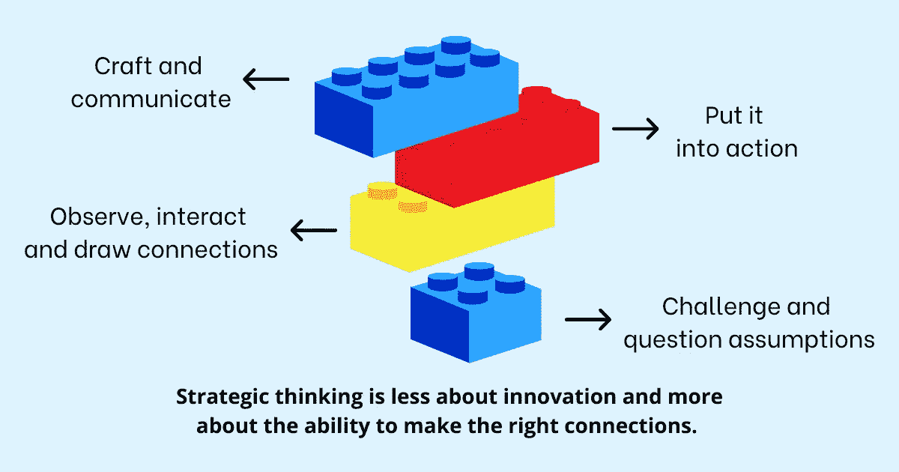

# 如何发展你的战略思维能力并保持领先

> 原文：<https://betterprogramming.pub/how-to-develop-your-strategic-thinking-skills-and-stay-ahead-7ec300a41df2>

## 跨越你舒适区的边界，在没有精神护栏的情况下思考一个想法的极端

战略思维在生活中是如此重要的一项技能，然而我们中的许多人在生活中第一次听到这个问题是通过我们的经理“你很擅长执行，但你需要开始战略思维。”

在我职业生涯的早期，战略思维并不是一个流行的概念。我大概认为，战略思维是为企业和公司高层人员保留的，他们需要围绕一个组织的未来做出关键决策。我从来没有想到过，战略性思考不是你到达某个位置时获得的技能，而是你为了到达某个位置而建立的技能。

我还相信，当我准备好攀登公司的阶梯时，我的经理会给我培训，帮助我建立战略思维技能，并给我实践这些技能的机会。你可以说我天真，但那是我当时生活的企业界。自那以后，情况发生了很大变化，但有一点是不变的。战略思维现在和很多年前一样重要(甚至可能更重要)。

虽然普遍来说，每个人都被期望在职业生涯的某个阶段拥有战略思维技能，但没有人在工作中、在大学或在学校被教导要进行战略思维。我们教育体系的大部分是围绕着课程和如何把我们的思想装进一个盒子来构建的。在学校，我们因坚持传统智慧和不问太多问题而受到表扬。这种趋势在大学继续。在我们职业生涯的早期，我们因为我们的执行速度而获得了如此多的奖励，以至于我们没有意识到我们未来的旅程与其说是做事情，不如说是决定做正确的事情。

当我们生活中的大部分时间都花在执行别人的想法上时，打破这种模式并重新连接我们的大脑去思考超越是不容易的。但是，战略思维不是一种不经过实践就能发展起来的技能。

> “与我们被引导去相信的相反，更好地思考并不意味着成为天才。它是关于我们用来发现真相的过程，以及我们一旦发现真相后所做的选择。”—谢恩·帕里什

战略思维是我们都需要锻炼的肌肉，因为在工作中正确使用它可以成为你个人职业发展的战略优势。很像橡皮筋，需要拉伸，锻炼思维。它需要跨越舒适区的边界，在没有精神护栏的情况下将一个想法思考到极致。它需要发现温和思维永远不会出现的新见解。

# 开始战略思维模式

在我们开始采用战略思维之前，这里有几个问题可以帮助你开始思考。你需要不时地问自己这些问题。如果你想让它们更有效，就把它们写下来:

*   你现在站在哪里？
*   明年和后年你想去哪里？
*   需要什么技能才能达到？
*   你如何练习那些技能？
*   你如何增加你成功的机会？
*   你如何有效地利用你的时间并最大限度地发挥它的影响力？
*   谁能帮助你验证你的想法，并给你反馈以拓展你的思维？

一旦你能够花一些时间深入思考这些问题，你就准备好接受战略思维的心态。遵循以下四个关键策略:

# 1.挑战和质疑假设

许多家长甚至老师都讨厌孩子问太多问题:“为什么我必须去上学？”"你可以睡到很晚，为什么我要早睡？"“为什么我不能玩电子游戏？”“为什么我必须完成作业？”

作为一个孩子，你可能没有得到所有这些答案。我们都没有。但是作为一个孩子没有得到这些答案不应该阻止你作为一个成年人问问题。好奇心和建设性地表达这种好奇心的能力是工作中的一项重要技能。

我在组织中看到的最大问题之一是人们如何做某些事情，因为他们一直都是这样做的。每天早上通过电子邮件向数百名员工发送一份无人愿意打开的报告。当几个月后没人关心这些计划时，花了几个小时的会议时间来计划讨论。在很长一段时间里，太多的低效率悄悄进入企业系统。

建立战略思维心态的一个重要组成部分是挑战你的组织是如何做某些事情的——不是为了贬低某人或建立你的优势，而是为了找到做得更好的方法。针对你的组织或工作中的具体问题提出有针对性的问题。从别人对这些问题的反应或思考中学习。对这些问题的不同观点不仅会拓展你的思维，还会给你一个方向，让你知道哪些领域值得投入时间。

# 2.观察、互动和建立联系

匆匆忙忙地把事情做完，越走越快，让事情发生，会阻止你注意和投资于那些从长远来看更重要，但现在需要你关注的活动、想法和项目。

我们都被诱惑去关注紧急的事情，而把重要的事情推到一边。在短期内解决问题的即时满足感总是比谨慎的决定更有吸引力。我们可能会为了一时的小收益而优化，而不会分析我们的决策对[未来](https://www.techtello.com/second-order-thinking/)的潜在影响。

建立战略性思维的心态需要延迟这种满足感。它需要面对一个小的、不重要的问题，并把你所有的精力和注意力放在其他需要长期计划和执行的重要想法和活动上。

> “在做小事的时候，你必须考虑大事，这样所有的小事才会朝着正确的方向发展。”—大卫·艾伦在《把事情做好:无压力生产力的艺术》中

你怎么能这样做？

为新想法的产生创造思维空间。没有安静的时间坐下来思考，面对令人不安的沉默，让你的思想开小差，你就无法建立有用的联系。这种情况不会发生第一次，甚至可能不会发生第二次。但是如果你坚持不懈地努力，远离日常生活中的数字和其他[干扰，你会开始注意到新的思维模式。你以前从未想过的新想法将开始浮出水面。](https://www.techtello.com/managing-distractions/)

另一个很好的策略是不要把自己局限在当前工作范围内的知识上。花时间了解你的业务和行业。与组织内的其他职能部门会面，了解他们是如何运作的，他们面临的挑战是什么，以及他们如何做出决策。所有这些知识将使你能够应用不同的心智模型来连接来自不同领域的想法，从而扩大你的能力范围并建立你的战略思维技能。

记住，培养战略思维技能包括超越明显的现在，去激励和塑造不确定的未来。如果你不愿意面对现在的一点不适来建立未来所需的技能，你就做不到这一点。

# 3.付诸行动

现在，到了最重要的部分。我以前讨论过这个问题。在任何组织中，宏观思维和具体细节都很重要。战略思维要求在现在行动的同时，正确平衡未来的思考。这是对未来和现在必须做的事情的完美融合，以使未来成为可能。

战略思维不仅包括对未来的长期展望，还包括你需要做出的选择，以使未来成为可能。这需要决定走哪条路，放弃哪条路。这需要评估成本并做出权衡。做某件事总会以不做其他事为代价。

虽然一个好的策略对开始很重要，但是一个策略本身不会让你去任何地方。你既需要战略，“意图”，也需要[战术](https://www.techtello.com/strategy-vs-tactics/)，“将意图付诸行动。”将你的策略分解成你需要做的具体事情。计划好一周中的哪一天，以及一天中的哪一个特定时间，你将真正赋予你的策略以生命。为了确保你不会错过机会，在你的日历上计划这些活动。不要让缺乏时间或其他借口成为不作为的理由。计划你的时间让事情发生。

# 4.制作和交流

最后，要拥抱战略思维的心态，不要在筒仓里工作。寻找你身边可以信任、尊重或钦佩的人。与他们交流你的想法，要求他们挑战你的想法，让他们问你一些棘手和不舒服的问题。

通过回答这些问题，你不仅可以拓展你的思维，还可以打开你的思维去考虑新的可能性。你会愿意挑战你的假设，而不是坚持你最初的结论。

# 战略思考是一个持续的过程

除非你审核你的结果，询问其他意见并适应你周围的变化，否则你无法建立战略思维能力。世界变化非常快，你需要让你的思维适应明天的需求，而不是过去的期望。

为了调整你的思维，请遵循以下三个实践:

# **1。审计**

养成一种习惯，对照你的目标回顾你是如何做的。一般来说，每个月一次简短的回顾和每个季度一次的深入调查就足以让你了解自己的状况。

> “如果梯子没有靠在正确的墙上，我们每走一步都会更快地到达错误的地方。”—斯蒂芬·R·科维

不时检查你的策略，审核它以确保你仍然靠在正确的墙上。

当事情进展顺利的时候，戴上你的战略思考帽来决定你如何能做得更好。

*   某个领域看起来比你最初设想的更有前途吗？
*   在那个领域投入更多的资源有意义吗？
*   根据市场变化或其他行业趋势，你能预见什么样的变化？
*   你怎么能确定你的想法没有[偏见](https://www.techtello.com/confirmation-bias/)仅仅依靠确认证据而拒绝与之相矛盾的数据。

当事情不像预期的那样发展时，问自己这些问题:

*   是不是某个特定的策略导致了你的策略不起作用？你应该重新考虑另一个策略吗？
*   如果战术不成问题，是否需要重新考虑策略本身？
*   有没有可能是你无法控制的外部环境导致你的策略不起作用？
*   自从你实施了这个策略后，有没有一些你还没有考虑到的事情发生了变化？有没有可能是变化让你的策略失效了？
*   你的自我妨碍了你，让你投资一个失败的事业吗？你能越过沉没成本去寻找其他更好的机会吗？

# **2。查询**

我们很容易混淆自己的思维，以为自己做出了正确的决定，即使事实并非如此。别人能清楚地看到我们自己有时看不到的东西。

寻求外部意见并鼓励挑战我们观点的不同观点是发现我们[盲点](https://www.techtello.com/leadership-blind-spots/)的好方法。你个人生活的策略？向亲密的家人和朋友寻求反馈。一个组织的战略？寻求同事和其他同事的意见。

除非你有可靠的数据和人来支持你的想法，否则不要坚持你的观点。问其他人这些问题:

*   我的策略有什么问题吗？
*   我可以用我的策略做得更好的一件事是什么？
*   如果你处在我的位置，你会怎么做？
*   如果你处在我的位置，你不会做什么？
*   什么样的环境或事件会让你考虑其他选择？

# **3。适应**

最后，利用审计和调查的结果来调整你的策略。根据过去的经验，调整未来的策略。什么奏效了？什么没用？你犯了哪些[错误](https://www.techtello.com/learning-from-mistakes/)？

战略思维是关于未来的，也是关于从过去中学习的。想象你的未来。看看你的过去。用你需要做出的改变来调整差距，为自己和他人构建未来。你不需要一个突破性的想法，只需要简单的选择，让你朝着目标一步一步地前进。

许多人犯了这个错误，认为如果他们没有一个创新的想法，他们就没有进行战略性的思考。战略思维不是关于创新，而是关于建立正确联系的能力。

# 摘要

1.  战略思维，即在规划短期目标的同时着眼于长期目标的能力，是生活中的一项重要技能。
2.  就像生活中的其他事情一样，战略思维是一块肌肉，通过重复和练习会变得更好。
3.  要开始你的战略思考之旅，从挑战和质疑假设开始。找出在工作中做小事的新方法。
4.  腾出时间和空间让你的大脑形成新的联系。了解你所在的行业、业务和组织中的其他职能，将你的思维扩展到当前工作范围之外。
5.  将你的策略付诸行动，赋予它生命力。把你的战略分解成战术，你需要做的具体事情来实现你的战略。
6.  不要思想僵化。通过寻求他人的意见，鼓励他们挑战你的假设，打开你的大脑，迎接新的可能性。
7.  最后，战略思考是一个持续的过程。你需要根据过去的经验和未来的需求来审核、查询和调整你的策略。

感谢阅读。在 Twitter 上关注我，了解更多故事。

*这个故事最初发表于*[*【https://www.techtello.com】*](https://techtello.com/how-to-develop-strategic-thinking-skills/)*。*