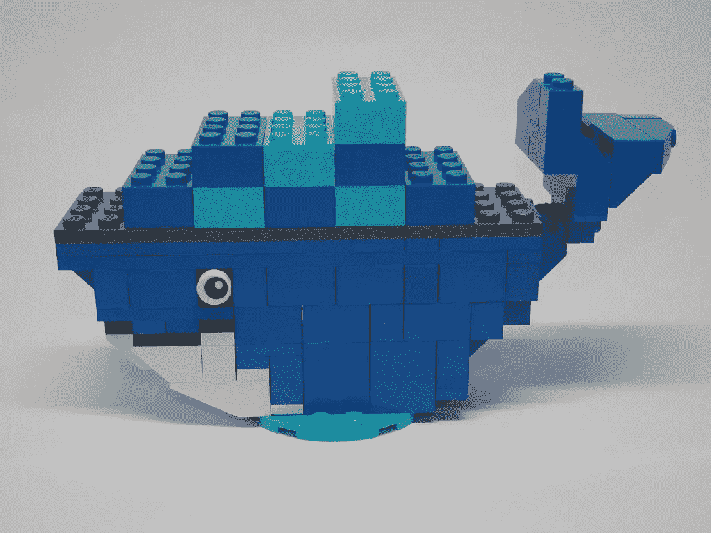
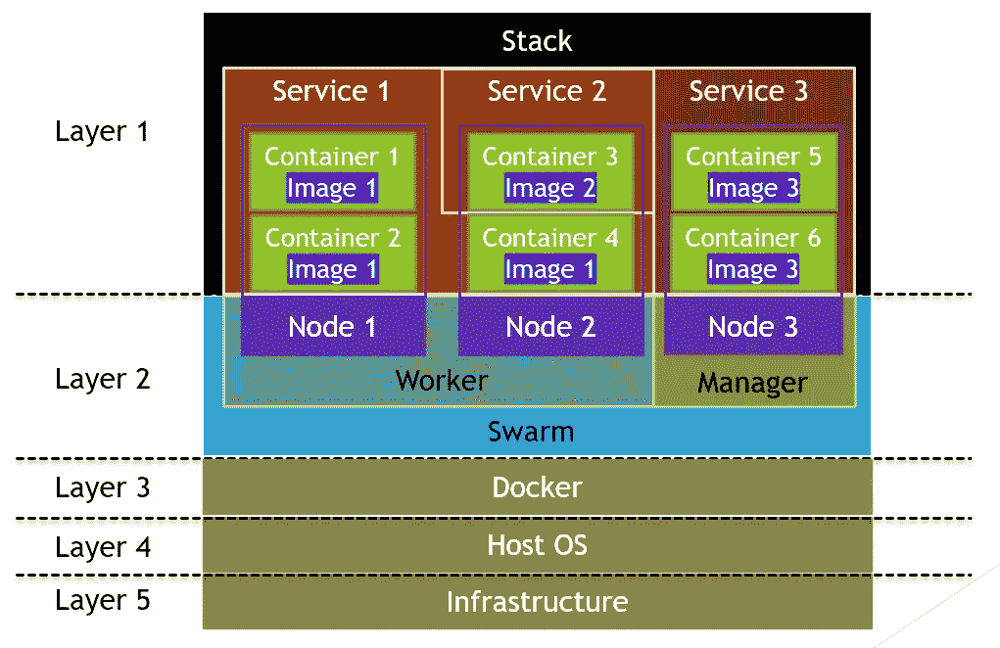

# 如何区分 Docker 映像、容器、堆栈、机器、节点和集群

> 原文：<https://betterprogramming.pub/how-to-differentiate-between-docker-images-containers-stacks-machine-nodes-and-swarms-fd5f7e34eb9f>

## 它们是什么，它们是如何组合在一起的？

当我半年前还是一名 Docker 新手时，我有许多关于如何区分 Docker 映像、Docker 容器、Docker 堆栈、Docker 机器、Docker 节点和 Docker 群的问题。今天，让我们来看看这张图表，它可以很容易地区分它们:

图表:所有 Docker 组件都在一张图中

# Docker 图像和容器

容器是整个 Docker 架构的最小单位。在容器启动之前，它被称为映像。根据 Docker 文档中提供的定义，映像是一个可执行包，包括运行应用程序所需的一切，从应用程序代码到运行时、库、环境变量和配置文件。容器是图像的运行时实例。

如果你还是不明白，我来打个比方。想象你买了一个烤箱，你把食物放进烤箱。您的食物现在代表可执行包，包括运行应用程序所需的一切。在您打开烤箱之前，您的烤箱处于“关闭”状态或不执行任何操作。烤箱是一个形象的比喻。当您打开烤箱时，烤箱处于“打开”状态，正在进行操作。烤箱现在被比喻成一个容器。

简单地说，图像是容器的“非运行”单元，或者容器是图像的运行单元。

# 码头服务

在分布式应用程序中，应用程序的不同部分被称为“服务”。

例如，考勤 web 应用程序通常包含不同类型的服务，如与用户交互的前端、处理用户输入的后端以及存储用户数据的存储器。

一个服务只运行一种类型的映像。在服务中运行的单个容器称为任务。参考上图——相同服务下的容器运行相同的映像，或者执行相同的功能。服务规定了映像应该如何运行的方法，比如端口号和容器副本的数量。向上扩展服务将增加服务中容器的数量，从而提高特定服务的吞吐量。

服务中的容器不一定都位于同一个节点上。根据上图，在服务 1 下部署了三个容器，其中两个位于节点 1 上，另一个位于节点 2 上。

# 码头栈

根据 Docker 文档中提供的定义，堆栈是一组相互关联的服务，这些服务共享依赖关系，并且可以一起协调和扩展。参考上图，单个堆栈下有三个服务。单个堆栈能够定义和协调整个应用程序的功能— *除非*应用程序非常复杂，需要拆分成多个堆栈。

# 码头机器

Docker Machine 是一个让用户在虚拟主机上安装 Docker 引擎并使用`docker-machine`命令管理虚拟主机的工具。

# Docker 节点

Docker 节点相当于虚拟主机。如上图所示，有三个虚拟主机或节点。每个节点可以代表物理机或虚拟机。同样，托管在同一节点上的容器不一定提供相同的服务。

# 码头工人成群结队

通常，一个群由多个节点组成。一些节点将被选为管理者，一些节点将被选为工作者。在此图中，有一个管理节点和两个工作节点。管理者节点负责管理成员资格和授权，工作者节点负责执行群体服务。

# 结论

*   Docker 容器是 Docker 映像的运行时实例。
*   Docker 服务可以在位于不同节点的各种容器上运行一种类型的 Docker 映像来执行相同的功能。
*   Docker 栈由多个 Docker 服务组成。
*   Docker Machine 是一个用来安装和管理虚拟主机或 Docker 节点的工具。
*   Docker Swarm 包含管理成员资格和委托的管理者节点以及运行 Swarm 服务的工作者节点。

# 参考

1.  Docker 入门:[https://docs.docker.com/get-started/](https://docs.docker.com/get-started/)
2.  群体模式关键概念:[https://docs.docker.com/engine/swarm/key-concepts/](https://docs.docker.com/engine/swarm/key-concepts/)