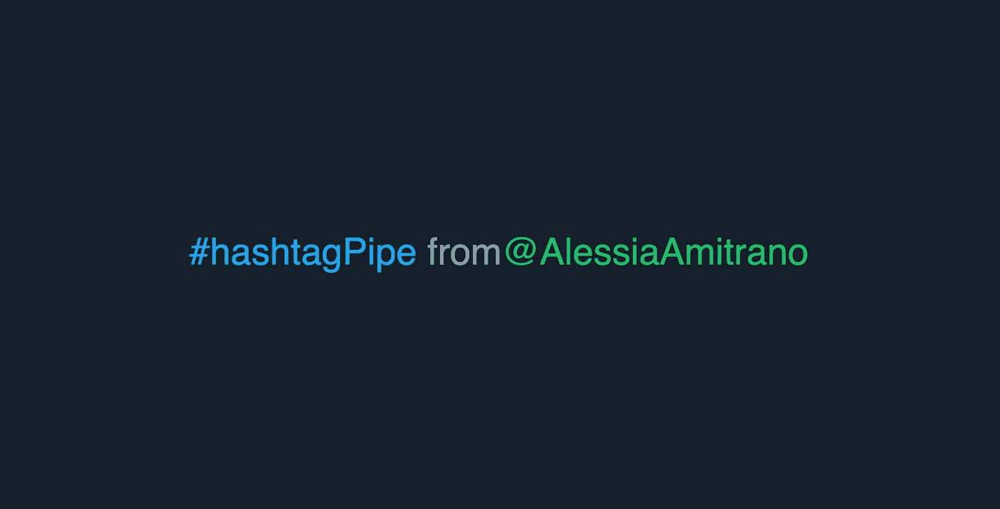
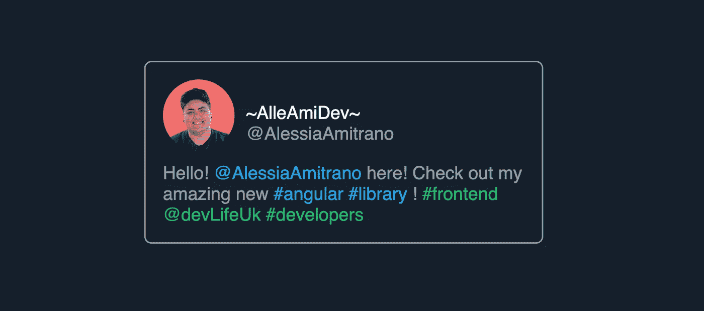

# 如何在你的 Angular 应用中显示丰富多彩的推文

> 原文：<https://betterprogramming.pub/how-to-display-colorful-tweets-in-your-angular-app-4ee61ff59125>

## 一个简单的库，可以给你文章中的#标签和@提及着色



前端开发人员开发社交 feed 功能是很常见的。

在许多情况下，可以使用嵌入式代码或小部件来显示最近的 tweets 或帖子，但有时客户端可能需要自定义界面。这就是我这个星期的遭遇。

# 问题是

我必须制作一个动画 Twitter feed，我被要求为文本中的标签和提及指定一种特定的颜色。

然而，由于整个 tweet 是以字符串的形式来自 API，我必须想出一种处理文本的函数式方法来提取以#和@开头的单词，并为它们赋予不同于文本其余部分的颜色。

所以，我创建了一个小图书馆！

# 介绍标签提及上色器

是一个小的库，它公开了一个有角度的管道。您可以使用它来查找字符串中的标签和提及，并通过将颜色代码作为管道的参数进行传递来对它们进行着色。

您可以使用以下命令安装它:

```
npm i hashtag-mention-colorizer
```

然后将其包含在您的首选模块中:

现在`hmcolor` 管道就可以在应用程序模板中使用了。

# 一个简单的例子

所以，假设我们想找到这篇文章中所有的标签和提及:

我们可以使用管道来实现这一点！

如果我们不向它传递一种特定的颜色，它将对文本中的所有标签和提及应用一种标准的浅蓝色。我们可以使用这个模板进行试验:

如你所见，对于`text1` *，*我使用了管道，没有声明自定义颜色。相反，用`text2`，我指定我想应用颜色`‘#18BE63’`。

**注意**:管道只能通过`[innerHtml]`属性将处理过的字符串传递给 HTML 元素。

结果将如下所示:



呈现的 app.component。

瞧啊！你可以在库的 [GitHub repo](https://github.com/alessiaAmitrano/hashtag-mention-colorizer) 里查看完整的代码。