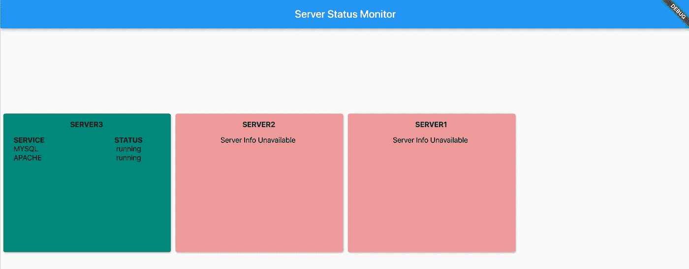

# 如何使用 Spring Boot REST 服务在 Flutter 中显示数据

> 原文：<https://betterprogramming.pub/how-to-display-data-in-flutter-using-spring-boot-rest-service-e722ceb80d97>

## 从 Spring REST 服务获取数据，并在动态网格卡中显示结果


照片由[克里斯蒂娜@ wocintechchat.com](https://unsplash.com/@wocintechchat?utm_source=medium&utm_medium=referral)在 [Unsplash](https://unsplash.com?utm_source=medium&utm_medium=referral) 上拍摄。

在本教程中，我们将学习如何从 [Spring Boot](https://spring.io/projects/spring-boot) REST 服务获取数据，并在 Flutter UI 中显示结果。

为此，我们将构建一个应用程序来收集关于一些所需服务状态的服务器数据。

假设您有多台服务器，其中需要运行一些服务。我们将创建一个为我们显示所有数据的服务检查器应用程序，而不是通过 SSH 手动连接到服务器并执行服务检查命令。

我们开始吧！

# 准备后端

首先，让我们创建一个非常基本的 Spring Boot 项目。在本教程中，我使用 Gradle 作为构建工具。我们只需要获得`org.springframework.boot:spring-boot-starter-web`依赖关系:

如果您需要更多关于如何开始使用 Spring Boot 的信息，请参考[文档](https://docs.spring.io/spring-boot/docs/current/reference/html/getting-started.html)。

## 1.创建应用程序启动器

## 2.创建 DTO 对象

`ServerInfo.java`保存有关服务器数据的信息，包括所需服务的状态:

`ServiceInfo.java`包含服务的名称和状态:

## 3.配置全局属性

为了保持代码有条理，让我们设置一些全局属性。

在项目的`/resources`文件夹下创建一个名为`application.properties`的文件。如果需要修改默认端口，也可以配置服务器端口。查看[文档](https://docs.spring.io/spring-boot/docs/current/reference/html/appendix-application-properties.html)看看你能设置什么。

现在，让我们保持这样:

## 4.创建服务器数据文件

如何收集服务器数据超出了本教程的范围。它可以通过 bash 脚本等。为了简单起见，我们将服务信息硬编码到一个服务器文件中。

*   创建一个名为`server1`的文件，插入以下服务状态信息，其中`0`代表*停止*,`1`代表*运行*:

```
mysql:1,apache:0
```

*   如果您想覆盖一个错误案例，创建另一个服务器文件并插入`error`:

```
error
```

## 5.创建数据服务

现在让我们创建执行我们逻辑的`DataService.java`。注意，我是使用`@Value( “${datapath}” )` 注释来引用`datapath`的。

这个代码片段显示了如何读取服务器文件并收集服务数据:

然后，我们将处理收集的信息，并将其映射到我们的最终结果。

如果服务器数据文件包含字符串`error`，这意味着没有可用的信息。例如，当服务器不可用时，就会发生这种情况。

## 6.将数据服务添加到应用程序控制器

最后，让我们将`DataService`与应用程序的控制器挂钩。目标 URL 将指向`/api`:

## 7.运行应用程序

为了检查到目前为止一切是否正确，运行 Gradle task `bootRun`启动应用程序，或者右键单击`Api.java`并选择“运行文件”

应用程序将在`[http://localhost:8080/api](http://localhost:8080/api)`上响应，您应该会看到一个 JSON 字符串，表示服务器及其服务状态。

# 准备前端

## 1.颤振的先决条件

要开始，您应该安装 Flutter SDK。有关如何安装 Flutter 的更多信息，请参考[文档](https://flutter.dev/docs/get-started/codelab)。

## 2.创建 DTO 对象

类似于我们的后端，为服务器和服务分别创建两个 dto:`serverinfo.dart`和`serviceinfo.dart`。

注意，需要使用`fromJson(Map<String, dynamic> json)`方法来消费来自 REST 服务的响应。我们将很快看到完整的响应处理实现。

## 3.创建 StartPage 小部件

创建一个负责在屏幕上显示数据的`startpage.dart`文件。对于这个例子，我想在一个`GridView`中显示所有服务器的卡片。每张卡代表一台服务器，并显示所需服务的状态。

通常，我们有许多服务器要处理，所以为了使它更具挑战性，让我们动态地创建卡片。

要创建`StartPage`小部件，请键入以下代码:

*   建造`GridView`。

这个片段展示了如何构建`GridView`:

*   确定屏幕上显示多少张卡片。

我计划在网页浏览器中使用这个应用程序，它看起来很好。但是，为了获得更好的体验，应该为移动设备调整卡的数量。

为此，创建一个名为`utils.dart`的实用程序类:

*   创建`ServerInfo`卡片。

然后使用此代码为服务器信息准备卡片:

*   创建包含`GridView`的`Table`小部件。

现在让我们通过创建标题和单元格来继续创建`Table`小部件:

*   将`TextStyle`添加到`Text`小部件中。

为了更好的用户体验和可读性，添加*斜体*样式来表示服务没有运行。

*   定义网格卡的颜色。

当然，我们需要卡片的颜色。如果所有必要的服务都在运行，颜色应该是绿色。如果需要服务或没有服务正在运行，颜色应为红色。

## 4.处理 REST 服务响应

现在让我们通过创建一个`dataservice.dart`文件来使用 REST 服务响应:

在这一步你会得到一个编译错误，因为`http`和`js`包还没有下载。要更新依赖关系，请打开`pubspec.yaml`文件，并在依赖关系部分键入以下内容:

```
http: any
html: any
```

成功提取依赖项后，我们就差不多准备好了。

## 5.创建主应用程序小部件

应用程序的核心是`main.dart`文件。键入下面的代码来创建主小部件:

我们需要一个有状态的小部件，因为我们希望它改变外观来响应由接收到的数据触发的事件。关于有状态和无状态窗口小部件的更多信息可以在 [Flutter 的文档](https://flutter.dev/docs/development/ui/interactive#)中找到。

## 6.启动颤振应用程序

在本教程中，我们将使用需要启用的 web 平台。在终端窗口中键入以下命令:

*   `flutter channel beta`
*   `flutter config -enable-web`
*   `flutter create web`
*   `flutter run -d web`

主机和端口将显示在终端窗口中。将地址复制到浏览器进入 UI。

## 7.启用跨来源资源共享

现在，如果你在浏览器中输入 Flutter 应用程序的 URL，你会看到一个奇怪的错误信息。这是因为浏览器允许包含在第一个网页中的脚本访问第二个网页中的数据，但前提是两个网页具有相同的来源 T4。

要解决这个问题，请在您的浏览器上安装`Access-Control-Allow-Origin` [插件](https://chrome.google.com/webstore/detail/allow-cors-access-control/lhobafahddgcelffkeicbaginigeejlf?hl=en)。它通过请求特定来源来实现跨来源访问。

下次加载 UI 时，只需启用插件。

因此，您应该会看到类似这样的内容:



显示最终结果的我的笔记本截图。

不要忘记禁用插件，以避免其他网站出现问题。

# 结论

我们已经到了本教程的结尾。我希望你今天学到了一些新东西。感谢您的阅读和快乐编码！

# **参考文献**

1.  [https://github.com/kirshiyin89/flutter_springboot_demo](https://github.com/kirshiyin89/flutter_springboot_demo)
2.  [https://flutter.dev/docs/development/ui/interactive#](https://flutter.dev/docs/development/ui/interactive#:~:text=to%20Managing%20state.-,Stateful%20and%20stateless%20widgets,are%20examples%20of%20stateless%20widgets.)
3.  [https://flutter.dev/docs/get-started/codelab](https://flutter.dev/docs/get-started/codelab)
4.  [https://docs . spring . io/spring-boot/docs/current/reference/html/getting-started . html](https://docs.spring.io/spring-boot/docs/current/reference/html/getting-started.html)
5.  [https://docs . spring . io/spring-boot/docs/current/reference/html/appendix-application-properties . html](https://docs.spring.io/spring-boot/docs/current/reference/html/appendix-application-properties.html)
6.  [https://en.wikipedia.org/wiki/Same-origin_policy](https://en.wikipedia.org/wiki/Same-origin_policy)