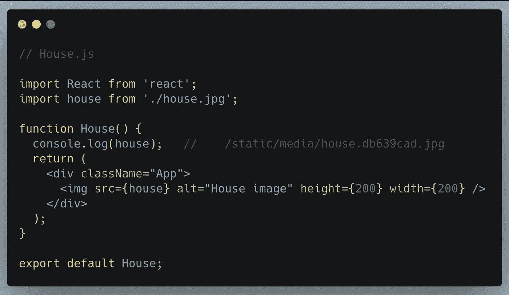
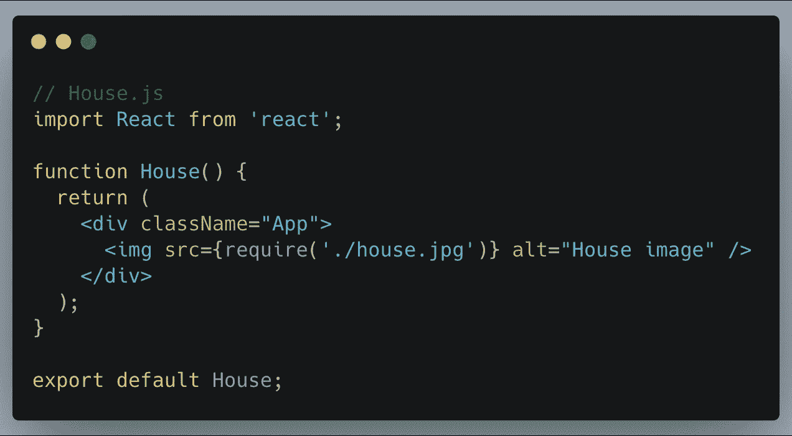
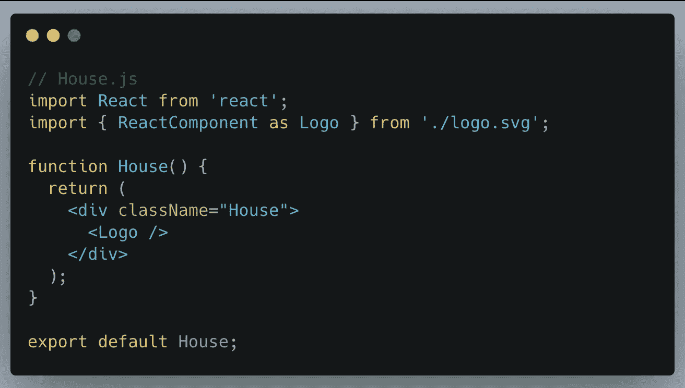
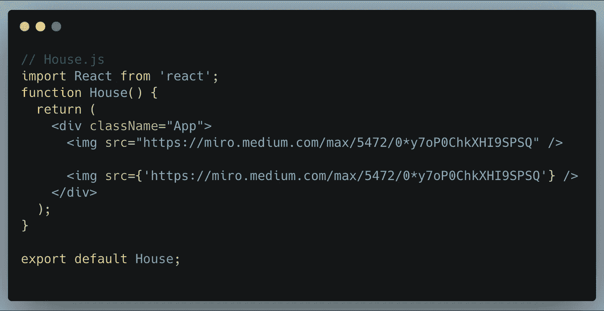

# React 应用程序中显示图像的不同方式

> 原文：<https://betterprogramming.pub/how-to-display-images-in-react-dfe22a66d5e7>

## 无论你的代码是什么风格，都可以显示出色的图像

[伊旺·辛科](https://unsplash.com/@iwnph?utm_source=medium&utm_medium=referral)在 [Unsplash](https://unsplash.com?utm_source=medium&utm_medium=referral) 上拍照。

在本文中，我将解释在 React 应用程序中包含图像的不同方式。在一般实践中，我们会像这样在 HTML 中包含图像:

但是在 React 应用程序中包含图像需要稍微不同的方法。

# 使用 import 关键字

你可以在 JavaScript 模块中直接`import`一个文件。这告诉 webpack 将该文件包含在包中。您的代码应该如下所示:

这确保了在构建项目时，webpack 会正确地将图像移动到构建文件夹中，并为我们提供正确的路径。

ReactJS 中显示图像的不同方式

# **使用 require 关键字**

我们还可以使用`require`关键字将图像加载到组件中。在这种情况下，您的代码应该如下所示:

`require`也可用于在项目中包含音频、视频或文档文件。最常见的类型有. mp3、.wav，. mp4，.mov，。html 和. pdf。

# 添加 SVG

上面描述了一种添加 SVG 文件的方法。您也可以将 SVG 直接作为 React 组件导入。您可以使用这两种方法中的任何一种。在您的代码中，它看起来像这样:

如果您不想将 SVG 作为一个单独的文件加载，这是很方便的。别忘了导入中的花括号！`ReactComponent`导入名称很重要，它告诉 Create React App 您想要一个呈现 SVG 的 React 组件，而不是它的文件名。

react-scripts@2.0.0 和更高版本以及 react@16.3.0 和更高版本都提供了这个特性。

# 添加网络图像

如果你从网络上下载图片，这是一个非常简单的方法。在您的代码中，它看起来像这样:

这些是在 React 应用程序中包含图像的不同方法。有关更多信息，请参见 [Create React App 文档](https://create-react-app.dev/docs/adding-images-fonts-and-files/)。

# 结论

我希望这篇文章能够帮助您在 React 应用程序中加载图像。感谢阅读。