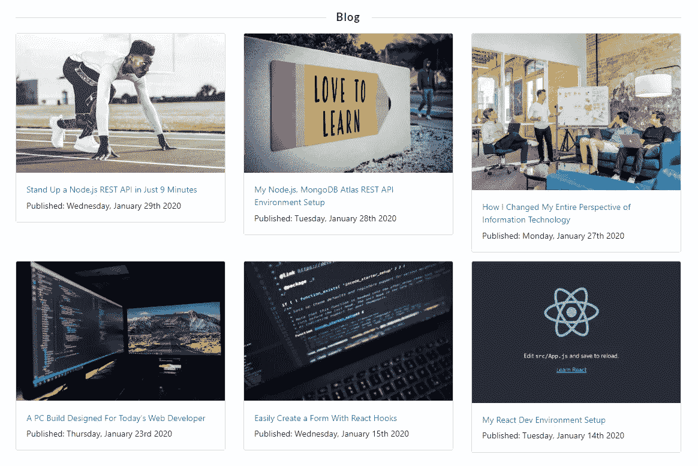
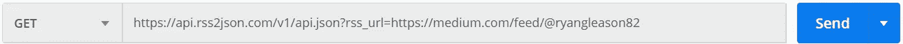
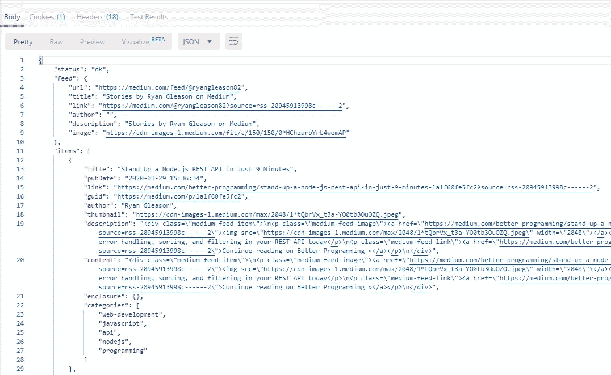
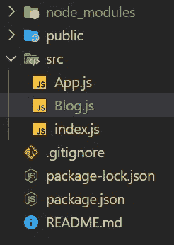
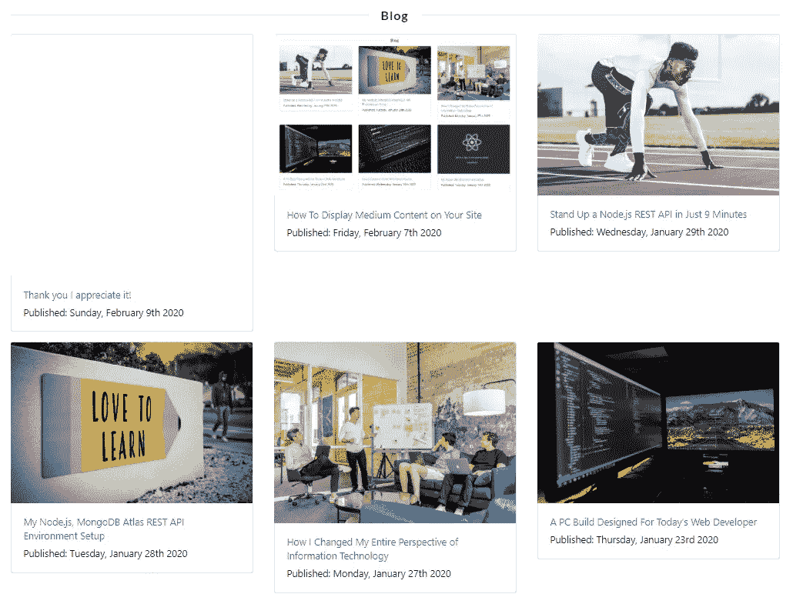
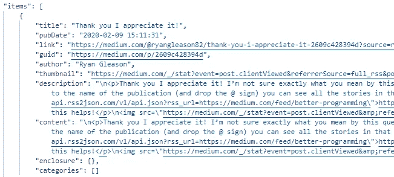

# 如何在你的网站上显示媒体内容

> 原文：<https://betterprogramming.pub/how-to-display-medium-content-on-your-site-6ae6adf8a304>

## 今天就把你的中型作品加入你的个人网站吧

如果你不能展示你写的这些精彩的故事，那还有什么意义呢？今天，我将向您展示如何将它们构建到您的网站中！下面是最终产品。



# 目标

构建一个 React 组件来显示您的媒体故事。

这个过程与你想象的有点不同，但仍然非常简单。我们将向 Medium 允许公众访问的 RSS 提要发出一个 API 请求，将其转换为`.json`，解析出我们需要的内容，并在我们的站点上显示出来。

因为我们所有的内容都是公开的，所以不需要认证。此外，Medium 没有构建 API 路由来访问单个故事(至少在撰写本文时是这样)，因此这是我们将采用的方法。

我已经将它构建到我的个人文件夹中(我希望你也这样做)，但是为了本教程，我已经创建了一个新的 React 项目，只包含单个组件。

如果你对我如何设置我的环境有任何问题，我已经在[我的 React 开发环境设置](https://medium.com/better-programming/my-react-dev-environment-setup-ded7cedb87a)中一步一步地写出了如何复制我的开发环境(Visual Studio 代码，React，git)。我的应用程序设置(reactstrap)是在[开始时用 React 钩子轻松创建一个表单。](https://medium.com/better-programming/easily-create-a-form-with-react-hooks-1cab17e2be0d)

完整的项目可以在这个 [GitHub 库](https://github.com/ryangleason82/BlogComponent)中看到。

我们开始吧！

# API 请求

为了访问我们需要的所有数据，我们将到达以下端点:

```
[https://api.rss2json.com/v1/api.json?rss_url=https://medium.com/feed/${name}](https://api.rss2json.com/v1/api.json?rss_url=https://medium.com/feed/${name}) 
```

我知道这看起来有点乱。如果你正在寻找一个例子，这就是在[邮递员](https://www.postman.com/)中的样子。



您可以看到我们正在使用 [rss2json](https://rss2json.com/#rss_url=https%3A%2F%2Ftechcrunch.com%2Ffeed%2F) 来将响应转换成我们可以使用的格式(`.json`)。

点击“发送”，您应该会看到类似下图的内容。作为提醒，这将是一个有力的回应:



来自邮递员的截图

您可以看到与您的订阅源相关的所有信息，以及您的每个故事。

[仅用 9 分钟就立起一个 node . js REST API](https://medium.com/better-programming/stand-up-a-node-js-rest-api-in-just-9-minutes-1a1f60fe5fc2)是我最近的一篇文章，所以这是最先出现的，因为它是按发布日期排序的。我发布到 Medium 的所有故事都会被退回。

完美！现在我们已经有了数据，我们准备构建 React 组件。

# 反应组分

我们首先要创建一个名为`Blog.js`的空组件。这是我们的目录结构的样子:



在`Blog.js`内部，我们将使用`state`来存储我们的 API 响应。`useState()`挂钩将帮助我们做到这一点。

让我来告诉你。

这里我们将有两种不同的状态——一种存储 API 请求，另一种存储加载状态。当我们的 API 获取数据时，我们希望将`isLoading`状态设置为`true`。这将给`fetch()`一些时间来发出请求并正确接收响应。

一旦 API 请求完成，我们得到了响应，我们希望将它设置为我们的`mediumData`状态。数据将存储在一个数组中，其中每一篇文章都是该数组中的一个不同元素。

如果你想确保你已经成功地执行了你的请求，我建议加上一个`console.log(mediumData)`。它还为您提供了正在处理的数据的可视化效果。

现在我们将显示我们的数据！

下面我来解释。

我只想显示我的提要中的前六篇文章。你可以通过使用`slice()`方法把它变成你想要的任何数字，如下所示:

```
const finalData = mediumData.slice(0, 6);
```

您会注意到，当我们的数据被获取并且`isLoading`状态被设置为`true`时，“从介质获取数据！”显示在屏幕上。你可以用 Spinner gif 或者任何你想要的东西来代替它。这要感谢这里有用的`JSX`:

```
{isLoading && <p>Fetching data from Medium!</p>}
```

然后我们`.map`遍历数组的每个元素，取出缩略图、标题和出版日期。我们将这个信息放在一个反应陷阱`Card`中。

我使用了`Moment`库以一种更方便读者的方式来格式化发布日期:

```
{moment(article.pubDate).format(“dddd, MMMM Do YYYY”)}
```

它获取一个看起来像`2020–01–29 15:36:34`的日期，并将其转换为`Wednesday, January 29th 2020`。非常容易。

就是这样！这是一种非常简单的方法，可以从源中提取关于媒体内容的信息，并在任何需要的地方显示。

# 更新

因为这是我密切关注的事情，因为它是在我的个人网站上，我会在每次看到问题时发布更新。

2020 年 2 月 9 日:我最近回复了对我的一个故事的评论，如下图所示。所以现在每次我从 Medium 中提取数据时，回复都被算作一篇文章。我只想显示我的实际文章，而不是回应。我们如何解决这个问题？



非常容易。在创建新的切片数组之前，我们可以对其进行过滤。



如果您查看响应中的 JSON 对象，您会注意到 categories 数组是空的。对于每一篇发表的文章(我们想要的),数组中有 5 个元素。我们要做的就是过滤掉没有`categories.length > 0.`的数组元素

这是整个系列的外观:

```
const newArray = mediumData
 .filter(article => article.categories.length > 0)
 .slice(0, 6);
```

# 回顾

我们刚刚做了什么？

*   找到了包含所有文章信息的端点
*   将信息从`RSS`转换为`JSON`
*   使用`useEffect()`钩子发出一个 API 请求
*   创建了一个可以在任何地方使用的简单组件

我希望你在你的网站上使用这个！如果你有任何问题、意见或顾虑，欢迎在评论区留言。