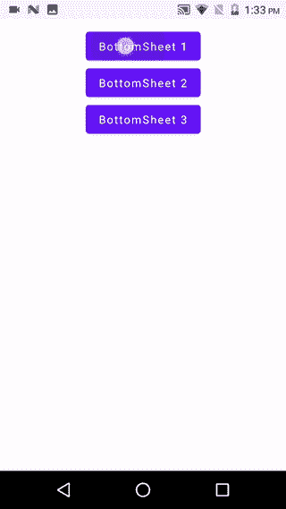

# 如何在 Jetpack Compose 中显示多个 Android 底部表单

> 原文：<https://betterprogramming.pub/how-to-display-multiple-android-bottom-sheets-in-jetpack-compose-6c46e3536ab>

## 构建可定制的 Android 应用


照片由 [XPS](https://unsplash.com/@xps?utm_source=medium&utm_medium=referral) 在 [Unsplash](https://unsplash.com?utm_source=medium&utm_medium=referral) 上拍摄

在这篇文章中，我们将学习如何基于用户交互显示多个底部表单。要学习 compose 中底层工作表的基础知识，我强烈建议您阅读先决条件一节中的文章。

# 介绍

Jetpack Compose 是谷歌最近试图让 Android 开发者轻松构建 UI 的尝试之一。

> *“Jetpack Compose 是一个用于构建原生 Android UI 的现代工具包。Jetpack Compose 以更少的代码、强大的工具和直观的 Kotlin APIs 简化并加速了 Android 上的 UI 开发。”—* [*安卓开发者*](https://developer.android.com/jetpack/compose/tutorial)

Jetpack Compose 的稳定版本 1.0 最近发布，这意味着它的生产就绪。因此，这将是学习如何使用下一代 UI 套件进行 Android 开发的大好时机。

您需要安装 Android Studio —北极狐(2020.3.1) 版本才能使用 Jetpack Compose。

# 先决条件

在进一步学习之前，您必须具备如何使用 Jetpack Compose 的基本知识。如果你是作曲新手，我强烈推荐阅读以下文章:

*   [喷气背包构成组件(第一部分)](/jetpack-compose-components-part-1-a80717dbfb59)
*   [探索 Jetpack Compose 中的 Android 底部表单](/explore-android-bottom-sheets-in-jetpack-compose-50eff0257231)
*   [在 JetPack Compose 中构建 Android 布局](/build-android-layouts-in-jetpack-compose-bda2e0837f5e)
*   [Android 底部导航栏与 Jetpack 组合](/android-bottom-navigation-bar-with-jetpack-compose-8c2aa02b933d)

# 设计多重交互

在探索了 compose 中的底部表单之后，我在这里记录了[，我非常兴奋地尝试如何基于用户交互显示多个底部表单。为了做到这一点，我们首先需要在实际的布局中添加多个交互，在我们的例子中只是三个按钮。看一看:](/explore-android-bottom-sheets-in-jetpack-compose-50eff0257231)

# 底部板材类型

让我们通过使用一个枚举类来定义我们所有的底部表单类型。看一看:

```
enum class BottomSheetType() {
    TYPE1, TYPE2, TYPE3
}
```

下一步是在`BottomSheetType`的主布局中定义一个记忆变量。

```
var currentBottomSheet: BottomSheetType? by remember{
        mutableStateOf(null)
    }
```

# `BottomSheetScaffold`

`ModalBottomSheetLayout`是一个简单的可组合函数，类似于`BottomSheetScaffold`，用于显示模态底部表单。现在我们需要将`mainScreen`中的脚手架更新到`ModalBottomSheetLayout`。

这种改变需要三个方面的改变:

1.  ModalBottomSheetValue，用于在重新组合过程中保持底部工作表状态的变化。
2.  `ModalBottomSheetLayout`的`sheetContent`参数，用于绘制底层表内容。
3.  我们需要用`ExperimentalMaterialApi` **来注释`MainScreen`可组合函数。**

现在为了简单起见，我们将创建 Kotlin lambda 函数来关闭和打开底部的工作表。这些功能将通过点击主屏幕上的按钮和底部工作表中的关闭按钮来调用。在调用`openSheet`之前，我们将为`currentBottomSheet`类型分配适当的值，以便调用预期的底部表单。看一下代码:

# 多层底板

首先，我们需要创建三个底层的可组合函数，它们将在主应用程序的各个交互中被调用。它们有一个简单的框布局，用简单的文本显示底部工作表的类型，用一个按钮关闭工作表。看看这段代码:

现在我们需要基于`BottomSheetType`触发适当的底层可组合函数。看一下代码:

```
@Composable
fun SheetLayout(
    bottomSheetType: BottomSheetType,
    closeSheet : () -> Unit
){

    when(bottomSheetType){
        BottomSheetType.*TYPE1* -> Screen1(closeSheet)
        BottomSheetType.*TYPE2* -> Screen2(closeSheet)
        BottomSheetType.*TYPE3* -> Screen3(closeSheet)
    }

}
```

# 将事情整合在一起

现在我们只需要将我们的`SheetLayout` 可组合函数赋给`*ModalBottomSheetLayout*` *的`sheetContent`参数。*剩下的事情通过重组来处理。看一下代码:

现在只需从您的活动中触发它，看看代码:

看看最终的输出:



# 奖金

我最近看到了 Satya Pavan Kantamani 发表的这篇关于 Kotlin 代表的优秀文章。强烈建议:

[](https://pavan-careers5208.medium.com/kotlin-delegates-19d0445848eb) [## 科特林代表

### 了解科特林的不同代表

pavan-careers5208.medium.com](https://pavan-careers5208.medium.com/kotlin-delegates-19d0445848eb) 

目前就这些。希望你学到了有用的东西。快乐作曲！

感谢阅读。