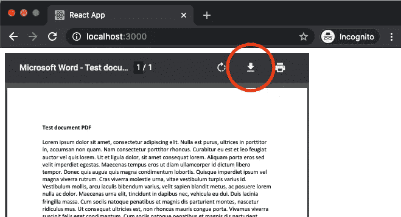
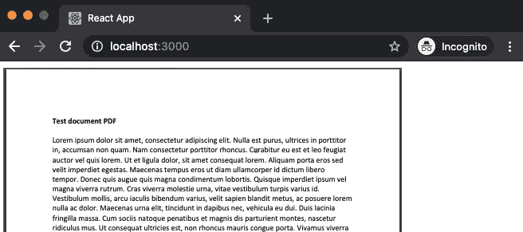
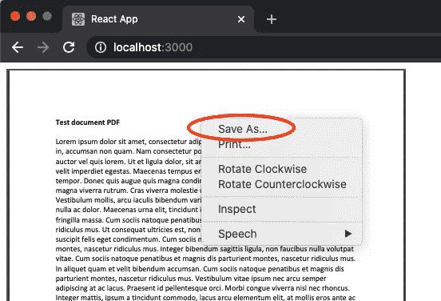
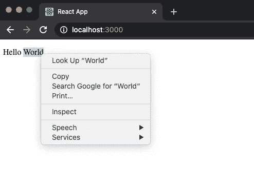
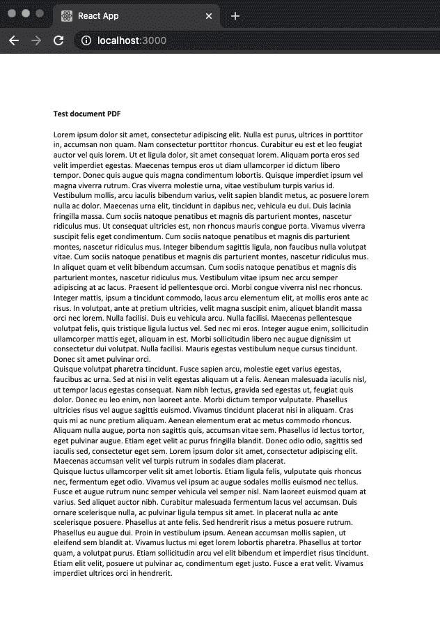
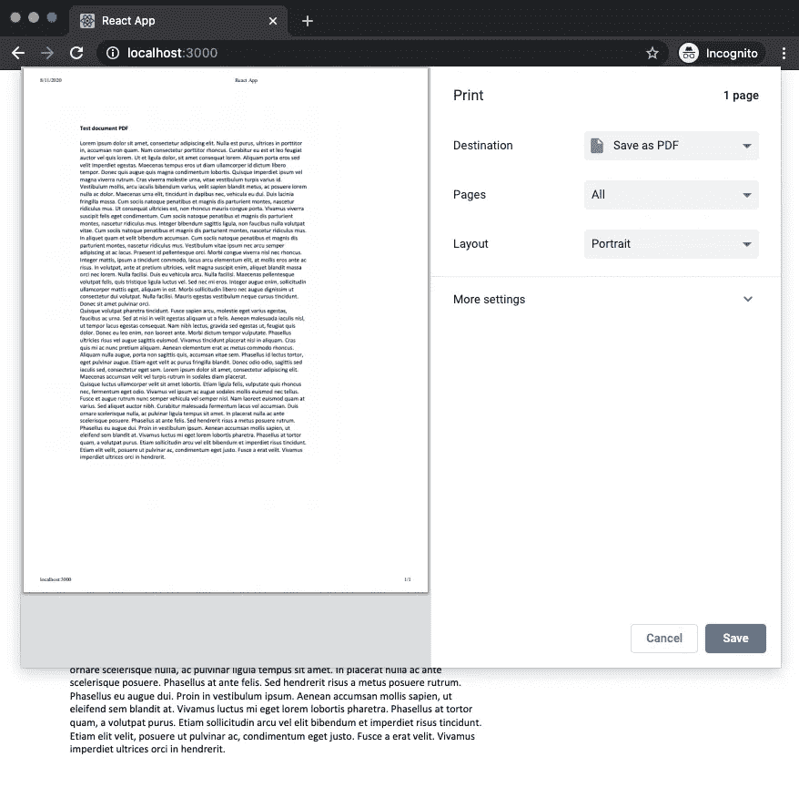
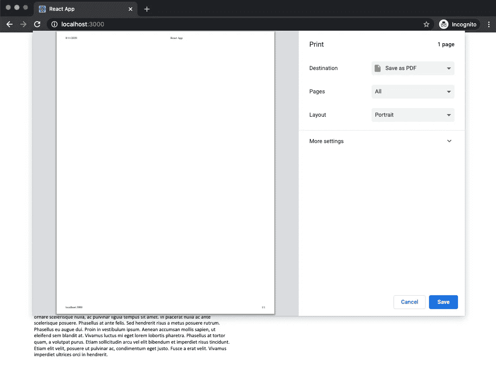
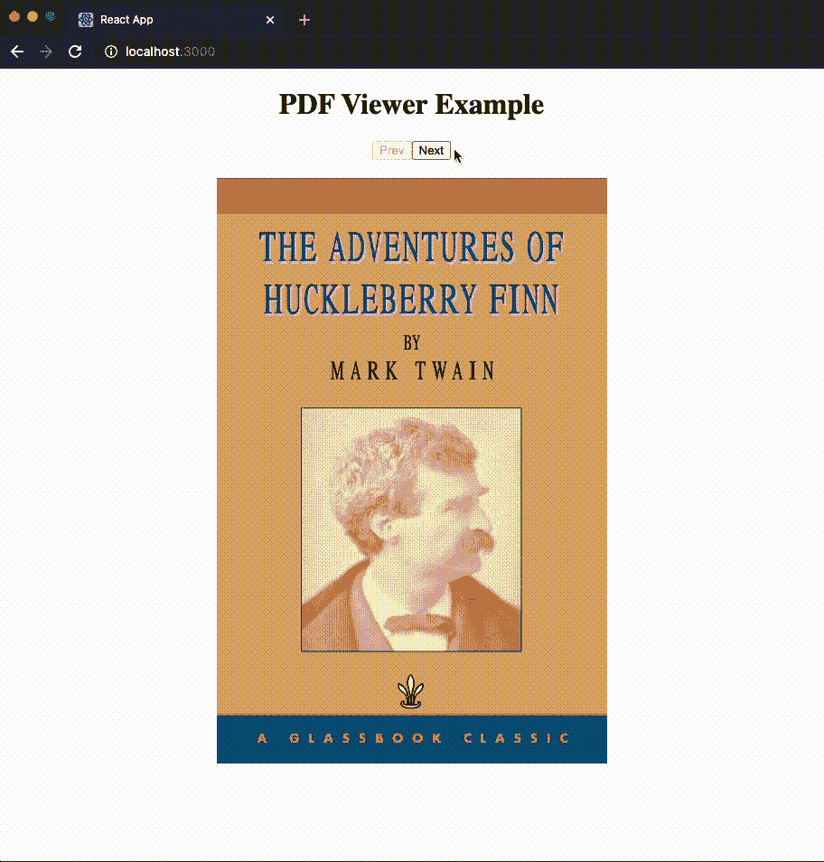

# 如何在 React 中显示 pdf 但阻止下载

> 原文：<https://betterprogramming.pub/how-to-display-pdfs-but-prevent-them-from-downloading-in-react-2e77292ca9a5>

## 寻求删除不需要的功能

照片由 [Cleo Vermij](https://unsplash.com/@cleovermij?utm_source=medium&utm_medium=referral) 在 [Unsplash](https://unsplash.com?utm_source=medium&utm_medium=referral) 上拍摄。

在你的网站上嵌入一个 PDF 文件很容易，但是这可能会给你的用户更多的访问权限。

也许你想在你的网站上展示你的书，但是你不想让用户下载它，因为这会减少你的广告收入。也许您希望向站点成员显示一个文档，但不希望他们与非成员共享该文档。

无论你的理由是什么，本教程将向你展示如何在你的 React 应用程序中阻止 PDF 下载。

# 用户下载 pdf 的每一种方式

在解决任何问题之前，我们需要更好地定义问题是什么。

## **用户可以通过三种主要方式下载 pdf 文件**

1.  单击浏览器的 PDF 查看器上的下载按钮。
2.  右键单击 PDF 并选择“另存为”
3.  打印网页并选择“另存为 PDF”

我们将探索所有这些方法的解决方案！

## 限制

我想坦率地指出本教程的局限性。由于您的网站上的信息是在公共网站上，总会有一些方法让用户通过您网站上的数据检索或重新创建 PDF。本教程只是防止“普通用户”下载您的 pdf，而不是“专家用户”或开发者。本教程也不阻止截图，因为这是在操作系统的控制下，不会受到浏览器中运行的代码的影响。

现在我们已经解决了技术问题，让我们开始吧！

# 移除下载按钮

在网站上嵌入 PDF 的最简单方法是使用`<embed>`标签:

但是，这使用浏览器的内置 PDF 查看器，它通常为用户提供下载选项:

我们可以通过在 PDF 的内容中添加`#toolbar=0`来解决这个问题:

这将删除整个工具栏，并因此删除下载按钮:

如果您选择嵌入带有`iframe`的 PDF，这也是同样的方式:

使用`<embed>`或`<iframe>` web 组件时，用户仍然可以右键单击文档并选择“另存为”:

这很不幸，因为这仍然是用户下载 PDF 的一个非常简单的方法。

# 防止右键单击

如果你曾经使用过`onClick`事件处理程序，阻止右键点击会让你感觉像在家里一样。我们只是使用了`onContextMenu`事件处理程序！

默认情况下，右键单击元素将显示上下文菜单，该菜单为用户提供了几个选项:

您可以通过阻止右键单击事件的默认事件处理程序来阻止上下文菜单显示:

这将阻止上下文菜单出现。我省略了一个截图，因为没什么可展示的。右键单击时，不会显示任何内容。

唯一的问题是有一些 web 组件不支持`onContextMenu`。可悲的是，这包括`<embed>`和`<iframe>`。重申一下，您无法阻止右键单击显示 PDF 的`<embed>`或`<iframe>`，所以我们需要找到另一个选项。

# react-pdf 简介

在这一点上，我们不能再使用`<embed>`或`<iframe>`，因为它们不提供禁用右击的灵活性。我们将使用一个名为 [react-pdf](https://www.npmjs.com/package/react-pdf) 的 npm 模块。

这个模块是 pdf.js 的包装器，pdf . js 是 Mozilla 开发的一个开源项目，以 HTML 格式显示 pdf。就基本 web 组件而言，react-pdf 在一个`<canvas>`标签中呈现 pdf，该标签支持`onContextMenu`事件处理程序。

要安装该模块，运行`yarn add react-pdf`。如果使用 npm，运行`npm install react-pdf --save`。

下面是 react-pdf 的一个简单例子:

这将在页面上清晰地呈现 PDF，而无需浏览器的默认 PDF 查看器。因此，不同浏览器的浏览体验更加一致，并且不包含工具栏。

在后台，react-pdf 将您的 pdf 转换为图像，然后在网页上显示该图像。默认情况下，浏览器仍会提供保存此图像的选项:

因为这会呈现一个`<canvas>` web 组件，所以阻止上下文菜单出现是很简单的。我们可以只应用`onContextMenu`事件处理程序:

很不错，对吧？

# 阻止打印和“另存为 PDF”

现在，用户仍然很容易通过简单地将网页保存为 PDF 来保存 PDF 的副本。这可以通过打印当前网页并选择打印目的地“另存为 PDF”来完成:

为了防止这种情况，我们可以利用 CSS 媒体查询。媒体查询允许您根据媒体类型定义某些样式，例如`screen`、`speech`或(出于我们的目的)`print`。确保向您的组件添加一个`className`并导入您的 CSS 文件:

我创建了一个名为`App.css`的 CSS 文件，并添加了媒体查询:

现在，如果您尝试打印该页面，PDF 不会出现。

太好了！现在，我们让用户很难下载你在网站上展示的 pdf 文件。

# 更强大的 PDF 查看器

到目前为止，我们的代码非常简单，应该足以让你开始在你的网站上添加这个功能。然而，为了尽可能彻底，我想包括一个完整的 PDF 查看器的例子，所以在这里！

这个示例项目的代码可以从 GitHub 上的[获得。该链接还包括如何设置它并让它在您的机器上工作的说明。](https://github.com/alexanderqchen/pdf-viewer)

# 结论

我希望这篇教程对你有所帮助，并且你在这个过程中学到了一些东西。如果你有任何问题，不要犹豫地问。我喜欢帮助我的开发伙伴，并将更新文章中任何有用的信息。如果你喜欢阅读，想要小块的、可消费的内容，你应该关注我的推特。

祝你好运，并获得编码！