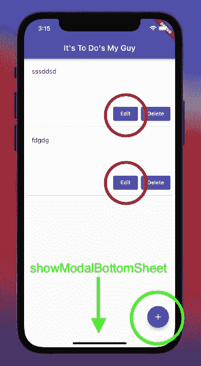
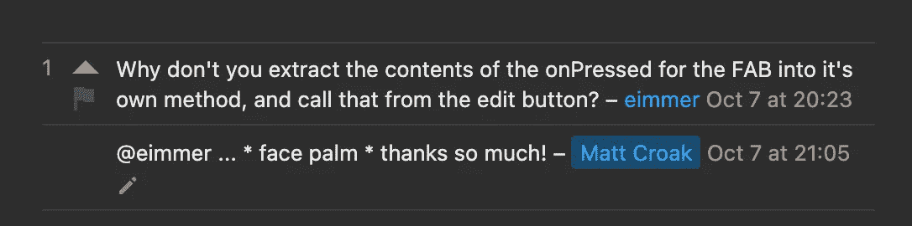
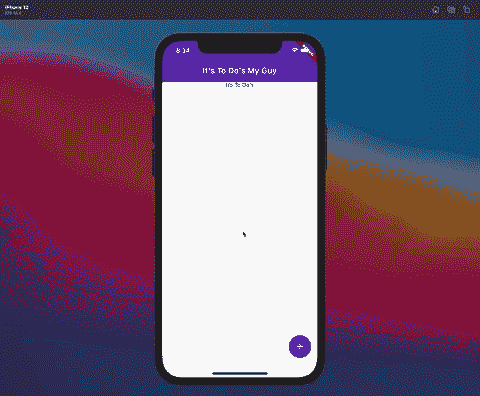
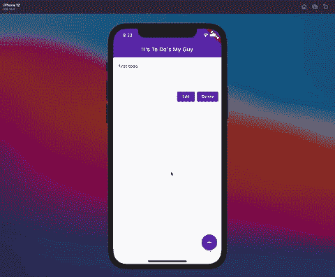

# 如何在 Flutter 中以编程方式显示模态底板

> 原文：<https://betterprogramming.pub/how-to-display-the-modal-bottom-sheet-programmatically-in-flutter-d1fad5fdd462>

## 无需按下浮动动作按钮


由[马尔扬·格拉博斯基](https://unsplash.com/@knaggit?utm_source=unsplash&utm_medium=referral&utm_content=creditCopyText)在 [Unsplash](https://unsplash.com/s/photos/modal-on-phone?utm_source=unsplash&utm_medium=referral&utm_content=creditCopyText) 拍摄的照片

如果你是从我的[上一篇文章](/how-to-update-the-state-of-a-widget-from-another-widget-in-flutter-25922ca5dd78)来到这里的，你会看到我启动了我的待办事项应用程序，并修复了当我的状态更新时无法用`[showModalBottomSheet](https://api.flutter.dev/flutter/material/showModalBottomSheet.html)`方法更新`NewToDo`的问题。

在问了一个关于[堆栈溢出](https://stackoverflow.com/questions/69471054/unable-to-reflect-updated-parent-state-in-showmodalbottomsheet)的问题后，我终于能够把我的`NewToDo`小部件放到一个`showModalBottomSheet`里了。这样,`NewToDo`小部件将只在我点击`FloatingActionButton`时可见，而不是一直可见。

然而，在实现这一点后不久，我注意到我的应用程序中的另一个问题。

当我选择一个`ToDo`项目进行编辑时，我希望能够重用我的`NewToDo`。我认为这是有意义的，因为同样的两个输入可以用来改变同样的两个状态值`title`和`content`。

问题？



除了在我的`FloatingActionButton`小部件(绿色圆圈)的`onPressed`方法内，我无法在任何地方执行`showModalBottomSheet`(绿色箭头)。

每当我点击伴随每个`ToDo`项目的编辑`ElevatedButton`小部件(用红圈标出)时，我需要能够触发`onPressed`方法。

我想我应该如何找到一种方法来模拟`onPressed`事件，以便执行`showModalBottomSheet`回调。

无法模拟`onPressed`事件(并且很沮丧),我去[栈溢出](https://stackoverflow.com/questions/69486752/trigger-floatingactionbutton-onpressed-without-pressing-the-button)看看是否还有人知道如何实现我正在寻找的东西。

过了一会儿，我得到了答案。我松了一口气…也谦卑了。



如此简单…如此纯粹。

我接受了 [eimmer 的](https://stackoverflow.com/users/1647098/eimmer)建议，没有把我的`showModalBottomSheet`放在`onPressed`方法中，而是把它分解成它自己的函数`_renderShowModal`。见下文:

```
_renderShowModal(){
  return showModalBottomSheet<void>(
    context: context,
    builder: (BuildContext context) {
      return ValueListenableBuilder(
        valueListenable: titleController,
        builder: (context, _content, child) {
          return NewToDo(titleController, contentController, _addTodo, _clear, _todo);
        });
    },
  );
}
```

这样做之后，我能够重写我的`onPressed`方法。

```
onPressed: _renderShowModal,
```

既然我们已经将`showModalBottomSheet`放入单独的函数中，让我们看看它是否工作:



厉害！我们现在需要做的就是在我们的`editTodo`函数的末尾调用同样的函数，当你点击编辑`EelevatedButton`时，这个函数就会被调用。

```
void _editTodo(ToDo todoitem){
  setState(() {
    _todo = todoitem;
    content = todoitem.content;
    title = todoitem.title;
  });
  contentController.text = todoitem.content;
  titleController.text = todoitem.title;
  **_renderShowModal();**
}
```

现在让我们看看当我们点击我们的`ToDo`项旁边的编辑时它是否工作。



维奥拉。

就在那里！我们现在可以使用`NewToDo`来创建新的`ToDo`条目和编辑现有的条目。

通过将我们的`showModalBottomSheet`包装在一个单独的函数中，我们使得我们的应用程序能够在任何我们想要的时候简单地通过调用`_renderShowModal`来呈现`NewToDo`。

这个应用的所有代码都在 [GitHub](https://github.com/macro6461/flutter_to_do) 上。

[***升级您的免费媒体会员资格***](https://matt-croak.medium.com/membership) *并接收各种出版物上数千名作家的无限量、无广告的故事。这是一个附属链接，你的会员资格的一部分帮助我为我创造的内容获得奖励。*

你也可以通过电子邮件 *订阅，当我发布新内容时，你会收到通知！*

*谢谢！*

# 参考

1.  [无法在 showModalBottomSheet 中反映更新的父状态](https://stackoverflow.com/questions/69471054/unable-to-reflect-updated-parent-state-in-showmodalbottomsheet)
2.  [未按下按钮时触发浮动操作按钮](https://stackoverflow.com/questions/69486752/trigger-floatingactionbutton-onpressed-without-pressing-the-button)
3.  [用户艾默](https://stackoverflow.com/users/1647098/eimmer)