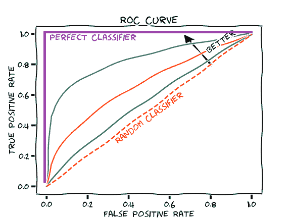
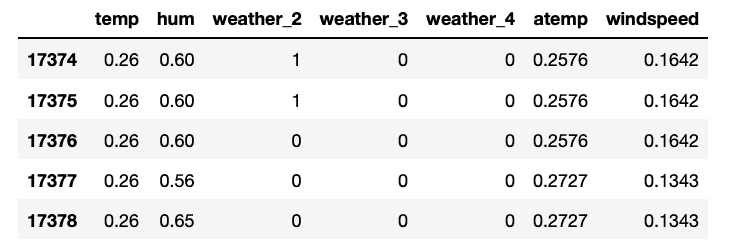
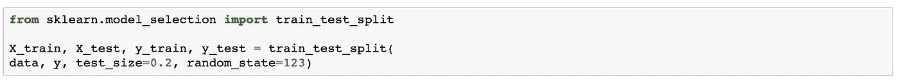
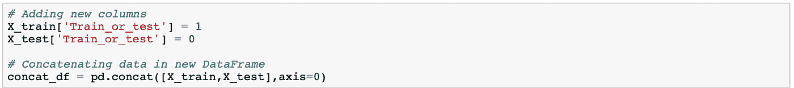
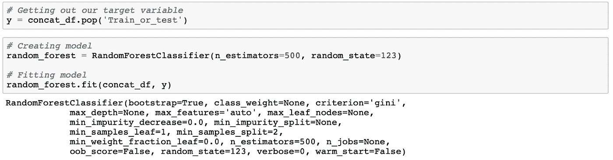
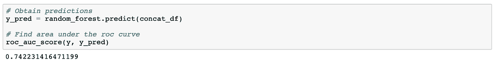
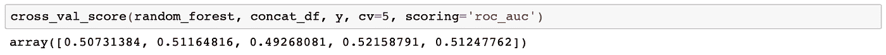

# 使用随机森林将数据分成训练和测试以保证代表性

> 原文：<https://betterprogramming.pub/how-to-divide-data-into-train-and-test-assuring-representativeness-c4c12c215d79>

由 [kazuend](https://unsplash.com/@kazuend?utm_source=unsplash&utm_medium=referral&utm_content=creditCopyText) 在 [Unsplash](https://unsplash.com/s/photos/forest?utm_source=unsplash&utm_medium=referral&utm_content=creditCopyText) 拍摄的照片

## 使用 Python 和 Sklearn

假设检验是数据科学和机器学习中的基本工具。除了测试我们的数据是否代表更广泛的人群，它的另一个用途是检查我们的测试组是否代表我们的训练组。我们为什么要担心这个？因为当进行训练测试验证分割时，我们希望我们的测试组来自我们的训练组的更广泛的人群。它必须代表我们用来训练模型的数据，否则，我们会认为我们有一个糟糕的模型，而事实可能并非如此。

例如，假设您正在处理来自一个电子商务产品的数据，该产品希望进行机器学习、数据科学和人工智能实验。他们给了你一些数据，但尽管你的训练数据包含 2017 年的交易，但你的测试组是由 2019 年的交易组成的。在这种情况下，很容易诊断出问题，但是假设您的数据中没有日期或年份字段。你会怎么抓住它？除了使用假设检验之外，我们还可以通过将挑战转化为分类问题来检查这一点，而不涉及技术细节。听起来很令人惊讶，使用[随机森林分类器](http://scikit-learn.org/stable/modules/generated/sklearn.ensemble.RandomForestClassifier.html)我们可以在几分钟内解决这个问题。

# 为什么是随机森林？

首先，让我们通过查看它的[维基百科定义](https://en.wikipedia.org/wiki/Random_forest) : *随机森林*或*随机决策森林*是一种用于分类、回归和其他任务的集成学习方法，它通过构建大量决策树并输出类的模式(分类)或个体树的均值预测(回归)来操作。换句话说，随机森林将创建几个决策树，在分类中，它将选择由它们更经常预测的类。

该模型特别适合于此任务，因为随机森林的算法将*打包*(引导聚合)的一般技术应用于所创建的决策树，从数据集中选择具有替换的随机样本，并将树拟合到这些样本。替换样本是这样一种样本，其中每个项目都是从上一个项目中独立选择的，因此您可以以一个项目在最终样本中出现多次来结束。

这是针对树的原始 bagging 算法，随机森林与这种通用方案只有一个不同之处:它们使用一种修改的树学习算法，在学习过程中的每个候选分裂处选择一个随机的特征子集。随机森林模型提供的这种随机性对于测试我们的训练组和测试组来说是理想的，因为随机森林将采用我们数据集的任何给定数量的元素和特征，确保我们的组是不同的。

为了测试该技术的有效性，以验证我们的训练数据相对于我们的测试组的代表性，我们将使用受试者操作特征曲线 (AUC-ROC)下的*区域。长话短说，AUC-ROC 曲线是一种在数据科学和机器学习中用于分类问题的性能测量，使用真阳性和假阳性率。ROC 是概率曲线，AUC 代表可分性的程度或度量。它描述了模型在多大程度上能够区分不同的类。AUC 越高，模型预测 0 为 0 和 1 为 1 的能力越强。*

来源:https://glassboxmedicine.com

所以，当我们有一个等于 1 的面积时，这意味着我们完美地，或者几乎完美地预测了类。如果分数在 0.5 左右，这意味着我们只是预测基线，也就是说，我们预测的是多数类。因为我们希望我们的训练组和测试组尽可能相似，所以我们希望获得接近 0.5 的面积。这将意味着我们不能预测类，因此，我们的测试组将类似于我们的训练数据，这意味着我们可以假设代表性。

# 如何实现随机森林

为了使用这种方法，我们需要:

1.  将我们的数据分为训练组和测试组；
2.  向我们的数据中添加一列，例如为我们的训练组中的所有行指示 0，为我们的测试数据中的所有行指示 1；
3.  将两个组再次连接成一个新的数据集，并将新列作为随机森林模型的目标变量；
4.  创建随机森林模型。

让我们使用一个关于自行车共享的流行样本数据集来创建一个示例。假设我们试图根据以下数据字段预测季节:

我们将数据分为训练组和测试组，

获得以下信息:

现在，为了检查我们的测试组是否代表训练数据，我们需要在每个组中添加一个新列，指示它是训练数据还是测试数据:

下一步，我们从数据集中弹出我们的目标变量并创建我们的随机森林。为此，我们将使用 [Sklearn](https://scikit-learn.org/) 工具`RandomForestClassifier`:

我们剩下的就是在 ROC 指标下评估我们的预测。为此，我们将使用另一个名为`roc_auc_score`的 Sklearn 工具:

但是，等等，这不是我们想要的分数。事实上，0.75 意味着我们对数据有相当准确的预测。这里发生了什么事？我们的随机森林过度拟合了我们的数据。这就是为什么我们应该使用 Sklearn 的`cross_val_score`工具:

那就好多了！现在我们知道我们的测试组代表了我们的数据集，我们可以继续我们的项目，知道我们的训练测试部门没有偏见。

如果你想自己复制这个练习，并验证这种测试代表性的方法的结果，[这里是使用的数据集](https://archive.ics.uci.edu/ml/datasets/bike+sharing+dataset)，来自加州大学欧文分校机器学习知识库。

感谢阅读！