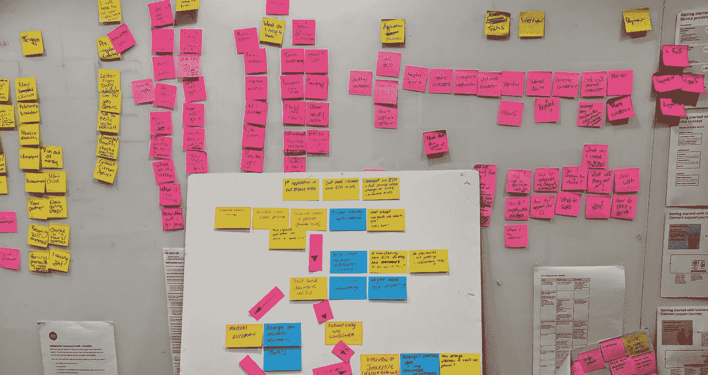

# 如何做敏捷策略工作

> 原文：<https://betterprogramming.pub/how-to-do-agile-policy-work-4b5fcf6d4b9e>

## 你能测试和重复你的政策论点，同时还能切入吗？

[拉拉·阿兹利](https://unsplash.com/@lazizli?utm_source=medium&utm_medium=referral)在 [Unsplash](https://unsplash.com?utm_source=medium&utm_medium=referral) 上的照片

早在 7 月份，我[写了一篇文章](https://medium.com/@jamestplunkett/can-you-do-agile-policy-work-319b6445d5e8)，探索敏捷政策工作的案例。

我的基本论点是，敏捷软件开发的许多基本原理也适用于政策工作。这是一个快速变化的环境，你需要跨领域的合作，而且你不知道你的论点将如何落地，直到你在现实世界中测试它们。那么为什么不看看敏捷方法是否能有所帮助呢？

正如我在 7 月份写的，我们已经在[公民建议](http://www.citizensadvice.org.uk/)尝试了一段时间，效果很好。

通过组建基于结果的政策团队，在所有关键学科的参与下，我们发现我们可以更快地转向，更深入地合作，更紧密地关注重要的事情——即像政策报告一样，出*出*，而不是出**出*。*

*话虽如此，我们发现有一个敏捷原则很难转化为政策工作:尽早和经常发布软件的想法。*

*在敏捷软件开发中，这个想法是基本的；你甚至可以说它是敏捷的核心。这使得快速的反馈循环成为可能，有助于消除过去那些漫长且注定失败的软件开发项目的风险。*

*早期和定期的发布也有助于推动价值，因为你越早将软件呈现在用户面前，它就越早为你工作。因此，所有这些关于构建简单事物的敏捷隐喻。俗话说，一个半成品的软件就像一辆半成品的汽车；对谁都没多大用。所以不要从造车开始，从造滑板开始。*

*从表面上看，你可以明白为什么所有这些论点同样适用于政策工作。尽早测试你的政策论点是有好处的，这样你可以更快地学习。而且，不管它是多么的杰作，你硬盘上的半成品政策报告对任何人都没有帮助。*

*那么滑板的政策等价物是什么呢？*

**

*不均匀图像*

# ***最小可行自变量***

*在软件开发中，用来鼓励构建滑板的机制当然是最小可行产品的概念。*

*一个团队从构建 MVP 开始——最简单的版本，做手头任务所需的最少工作。*

*如果你的任务是把一个人从 A 带到 B，你不需要动力方向盘和雨刷。你只需要一块带轮子的木板。*

*那么政策等同于什么呢？*

*最简单的开始可能是说它不是什么:一份简短的政策报告。*

*那会把形式和功能混淆。这就像通过建造一辆更小的汽车来回应敏捷滑板的比喻。*

*毕竟，政策工作的最终成果并不是一份冗长而复杂的报告——而是一份有效的政策*论证。**

*所以我们需要缩减的是论点，而不是报告。*

*如果我们以这种方式思考政策工作，MVP 就变得非常清楚了。这是最小可行的论点——你的论点的最小版本，可以貌似合理地改变一个有影响力的人的观点。*

*因此，如果我们坚持敏捷原则，你的任务就是尽可能快地将你的 MVA 推向世界，看看它进展如何，然后从那里开始构建。*

*在实践中，就像软件原型一样，MVA 可能非常简单。例如，它可能意味着:*

*   *与决策者交谈，看看他们是否接受你的想法——有点像在你写任何代码之前，在用户面前放一个纸上原型*
*   *把你的论点作为一条线索，贯穿你的逻辑，看看人们如何回应*
*   *写博客或拍摄视频，用散漫和含糊的方式来阐述你的想法*

*正如敏捷原则经常出现的情况一样，许多最好的政策专家已经凭直觉这样工作了。即便如此，将这些工作方式整理成文还是很有价值的，尤其是如果你在一家大公司工作的话。*

*例如，在你的工作实践中嵌入 MVA 的概念可能是有用的。尝试开始每一个新的政策项目，尽可能快地组装你的 MVA——聊天/话题/博客所需的逻辑/证据的基本框架。然后真正有意识地考虑如何测试、收集反馈、迭代和衡量成功。*

# *策略硬件*

*我对 MVA 的想法思考得越多，就越觉得它是如何做好政策工作的答案的*部分*。*

*但我也认为，作为一个更广泛、更融合的方法的一部分，它可能会发挥最大的作用。*

*更具体地说，我想知道有效的政策工作是否需要敏捷和传统/瀑布方法的有意混合。*

*为了解释我这么说的意思，让我们来看看政策工作的经典瀑布方法。任何从事政策工作的人都会对此感到熟悉。你设定了一个不可更改的出版截止日期，也许由一个发布活动来支持，你埋头写了一篇长长的报告，然后在发布日你得到了尽可能多的媒体报道。*

*在发送一封时间戳为 01:47 的睡眼惺忪的电子邮件并附上 vFINAL_FINAL_v2_v3JPEdits.doc 之前，我痛苦地感觉对这种模式非常熟悉，过去我花了太多的深夜在政策报告中寻找流氓逗号*

*现在，毫无疑问，这个模型是非常僵化和老派的，并且非常容易暴露瀑布方法的所有缺陷。如果外部条件发生变化，就很难改变，这导致了起伏不定的规划周期，将许多鸡蛋放在一个篮子里，并且它适合于学科之间合作的接力棒传递方法——政策制定者将报告交给新闻发布者，就像要出售的产品一样。*

*出于所有这些原因，我认为这种旧模式已经过时，尝试更敏捷的方法是正确的。但是，这些瀑布过程确实有一些对他们有利的东西。毕竟，第二天早上，报告打印出来了，新闻稿发出去了，你要么引起轰动，要么没有——不管怎样，你都要继续前进。*

*我认为，这一切都说明了纯粹敏捷的政策工作方法的一个基本问题:在政策辩论中，捷径问题。*

*因为在公共政策辩论中有如此多的噪音，通常一个大的媒体热点比十个小片段要好。如果你的政策主张只出现在第 12 页，或者被埋在 BBC 网站上，那么你试图接触的很多人将不会注意到。但是，如果你在 7:10 获得一个今日节目时段，或者一份大报，人们可能至少会听到你并记住你的观点。*

*敏捷方法在这里有一种真正的紧张感；如果你只做增量工作，你永远也不会引起轰动。在政策工作的某些方面，没事，但在其他方面就不是了。*

*所以我有个想法。也许答案是以类似于科技公司处理软件和硬件的方式来处理政策工作。[1]*

*你可以把你的政策*论点*想象成你的软件。它需要以敏捷的方式运行，就像谷歌对 Gmail 所做的那样。你不需要大张旗鼓地推出第 11 版。随着时间的推移，软件会变得越来越好。*

*你的政策*车辆*不一样。像硬件一样，it *也需要一个大的发布日。你需要对你的最新政策报告大唱特唱，就像谷歌对 Pixel 的新模型所做的那样——毕竟，你需要人们来消费它。你需要它来切开。**

*但是请记住:在这个特定的例子中，你试图交付的*东西*是一辆车。它就像硬件一样，包含你的软件，或者在这种情况下，包含你的政策论点。*

*我有一种感觉，这种区分可能有助于组织在政策工作中采取更有意识的方法。*

*这意味着你会以不同的方式对待政策争论和工具。[2]为了展开有力的政策辩论，你应该坚持敏捷原则。尽可能快地开发你的 MVA，并尽早、经常地完善它。但是，要产生成功的政策工具——一种通过报告、演讲、书籍、视频或事件来传递大量论点的方式——你需要设定一个期限，最好是由一个不可动摇的外部承诺来确定。*

*我对这个整体模型思考得越多，就越觉得它也有助于理解政策工作中的陷阱。也许政策工作中的一个常见错误是，组织混淆了他们试图做的两件事——提炼论点和提供政策工具——把一件事当作另一件事。*

*反正这些真的只是想法。本着敏捷的精神，我很想知道人们的想法。这个诊断对您的组织来说是否正确？你认为 MVA 和软件/硬件的区别会有帮助吗？*

**如果你对数字化转型和公共政策感兴趣，你可能会对我的书感兴趣，***，或者我的新博客探索* [*我们如何管理未来*](https://medium.com/@jamestplunkett/how-do-we-govern-the-future-da6204a315e7) *。***

## ****脚注****

1.  **我知道这是软件/硬件区别的简化版本，实际上更加微妙。我真的只是用这个作为一个心理模型来澄清手头的问题。**
2.  **您甚至可以考虑让不同的人从事这两种类型的政策工作。(例如，制作政策工具所需的技能——写报告或制作视频——可能是写作或视频制作之类的技能；也许它们根本就不是政策技巧。)**