# 如何在带有 Firebase 的 React 原生应用中使用分析

> 原文：<https://betterprogramming.pub/how-to-do-analytics-in-your-react-native-app-with-firebase-152868772a6f>

## 每个平台上更好的分析

您正在使用 React Native 构建两个移动应用程序(iOS 和 Android)。这些应用在他们的商店里获得批准。你如何知道你的客户是否喜欢你的作品，并认为它有用？除非你找到一种方法来获得洞察力，并了解你的应用程序是如何使用的。

首先，必须决定应该使用什么库。幸运的是，有一些很好的选择使集成变得很容易，比如:

*   [AWS Amplify 的分析](https://aws-amplify.github.io/docs/js/analytics)
*   Firebase analytics :在本文中，我将重点介绍 Firebase analytics，因为它是最受欢迎的分析工具之一，尤其是因为它可以轻松地与 Google Analytics 集成。不管你喜不喜欢，谷歌服务仍然(可以说)是最受欢迎的，原因有很多。

在为 React Native 集成 Firebase 之前，您需要在[控制台](https://console.firebase.google.com/)中有一个 Firebase 项目。这个项目将持有 iOS 和 Android 应用程序的信息。在我的例子中，我将项目命名为`tutorial-demo`。

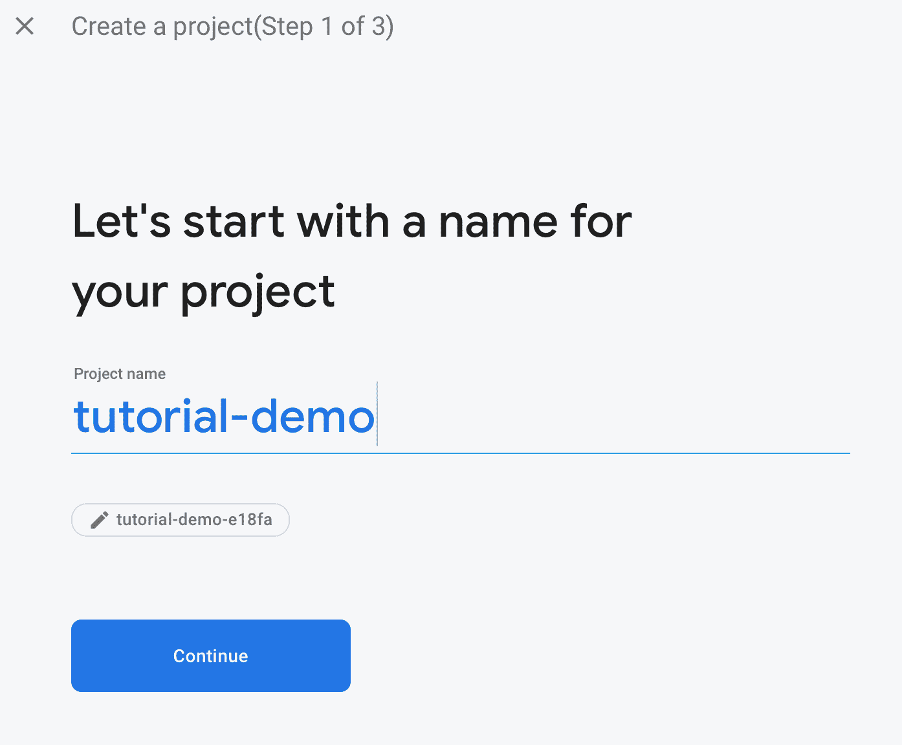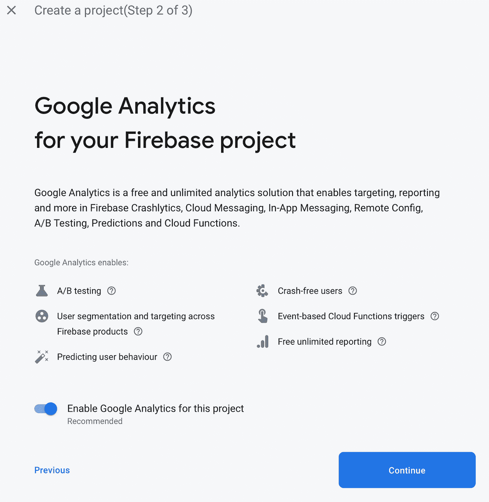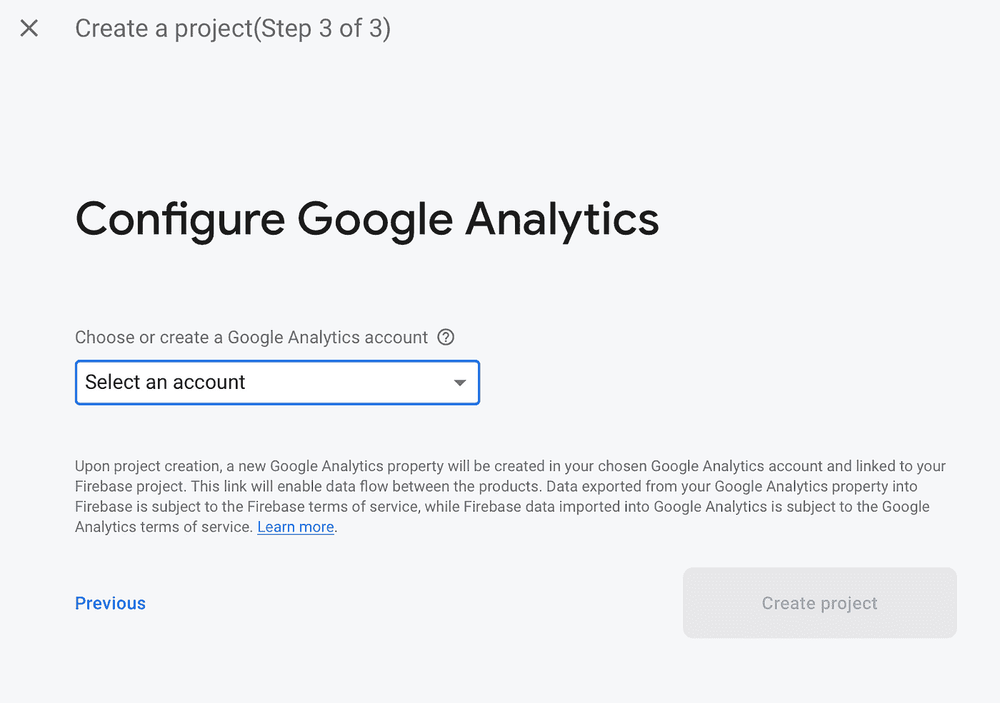

完成向导后，选择新创建的项目。

现在，我们需要为不同的平台添加不同的应用程序。对于 iOS，选择 iOS 图标。输入原生项目的捆绑包 ID(和 App Store ID，如果您有)，给它一个昵称，然后按“注册应用程序”

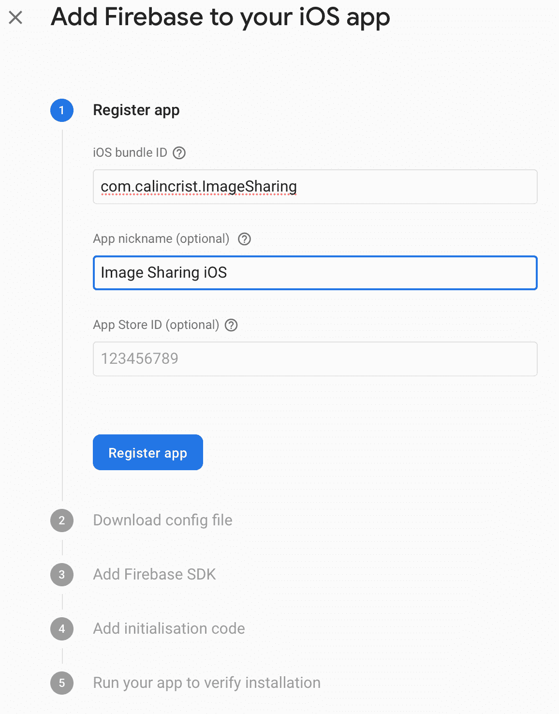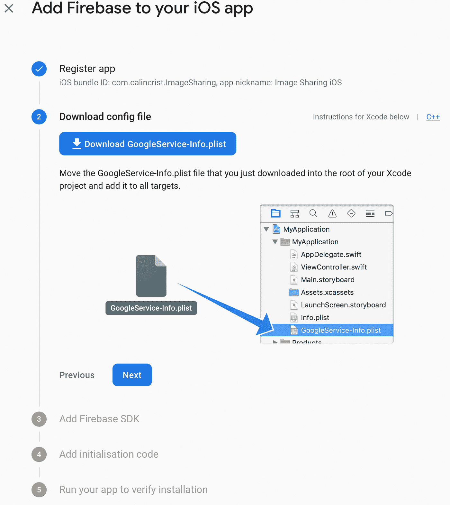

Firebase 控制台提供了一个`GoogleService-Info.plist`文件。这包含了一组 iOS 设备在 Firebase 项目中进行身份验证时使用的凭证。

下载第二步中呈现的`GoogleService-Info.plist`，并将其添加到 iOS 原生项目中。如果你有多个目标，不要忘记选择正确的目标。另外，不要忘记选择“如果需要，拷贝项目”

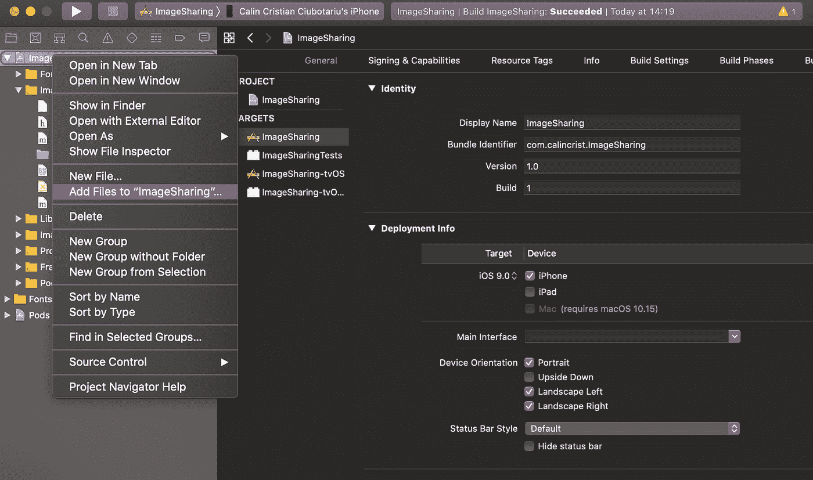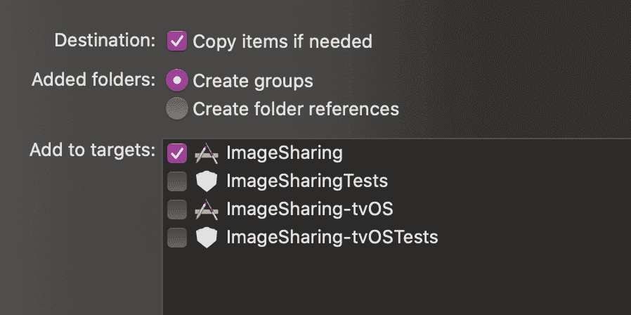

**注**:打开`GoogleService-Info.plist`，设置“是”启用分析关键是`IS_ANALYTICS_ENABLED`。

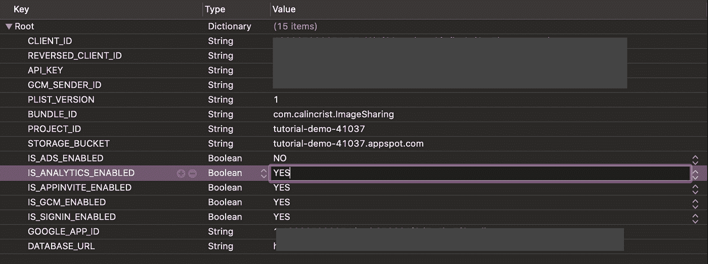

第三步与我们无关，因为我们被 Firebase 包覆盖，它会为我们添加吊舱。第四步是我们稍后可以添加的内容。现在，让我们完成 Firebase 控制台配置。

Android 方面的事情非常相似。进入项目主页，选择 Android 图标。

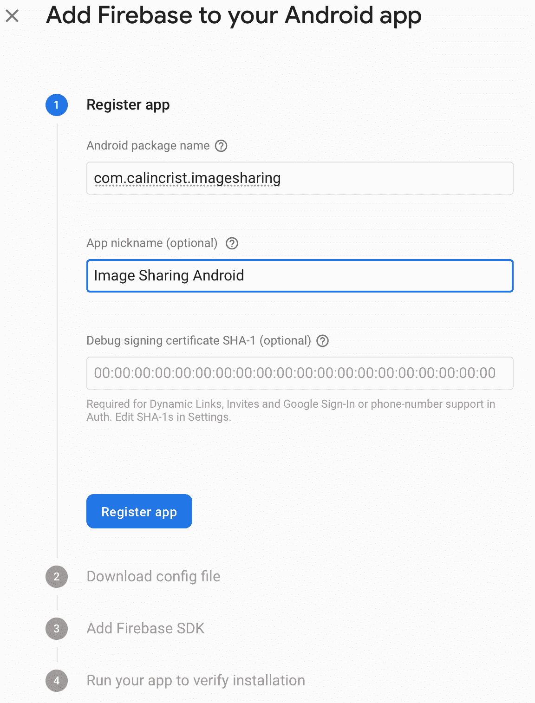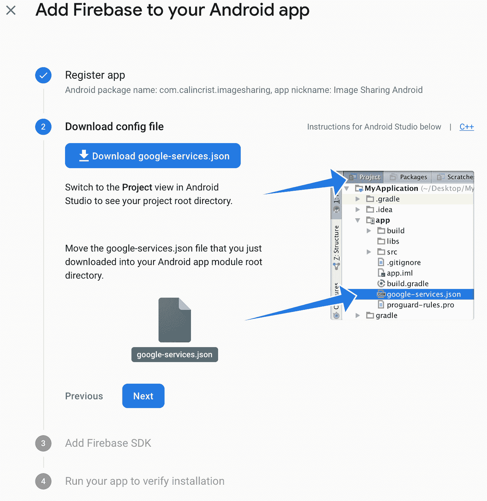

这里，我们又有了一个配置文件—这次叫做`google-services.json`。将其从 Android 项目文件夹添加到`app`文件夹内的原生项目中。

对于 React Native，有官方的 [Firebase 包](https://invertase.io/oss/react-native-firebase/)。它包含所有的 Firebase 服务，我们将安装并使用它。[安装核心和分析包](https://gist.github.com/5b47446012666496ccceef937f794856)。

假设 React 本地版本> = 0.60，那么该模块应该会自动链接到您的项目。如果没有，您需要手动将`app`模块集成到您的项目中。

有关手动链接的更多信息，请参见针对 [Android](https://invertase.io/oss/react-native-firebase/v6/app/android) 和 [iOS](https://invertase.io/oss/react-native-firebase/v6/app/ios) 的以下步骤。为 iOS 应用安装 pod:`cd ios && pod install && cd`

对于 iOS，我注意到在集成 Firebase 包之后，我需要做一些额外的步骤来使它工作:

*   清除派生数据
*   清理项目
*   从模拟器/测试设备中删除现有应用程序

对于 Android，以防构建或 gradle 同步失败——我曾经遇到过这种情况——[这是我修改的](https://gist.github.com/940649832e0edb7fe07d5e55dc17e785)。我认为这与自动链接由于某种原因失败有关。这是 android/app/build.gradle 。

仅仅通过集成分析包，就有一些事件被自动收集，如:`first_open`、`user_engagement`、`app_clear_data`。此处提供了更多详细信息[。](https://support.google.com/firebase/answer/6317485)

这个包的酷之处在于，它根据你的应用程序的性质(电子商务、游戏等)为不同的用例提供了预定义的方法。)还提供了定制您自己的事件日志记录的基本功能。长话短说，我们可以使用`react-native-firebase`做的是:

在幕后，这些特定的事件(`logAppOpen`、`logLogin`、`logSignUp`)正在使用`logEvent`方法为您指定键和一些属性。

强烈建议不要向 Firebase 发送任何脆弱和秘密的数据(电子邮件、密码、姓名等)。)—从不散列。

这些只是其中的一部分。[这里的](https://invertase.io/oss/react-native-firebase/v6/analytics/reference/module#logViewItem)是所有支持的方法。

现在来演示这些事件:[让我们做一个老式的类](https://gist.github.com/2569f979bcde2f34f8b837a3b0b4b14c)，它将用于集中分析代码。这种方法的一个优点是，我们可以通过更新一个文件来使用多个分析解决方案/包。(当然，它不需要是一个类，但我们在这里。)

剩下的就是[在代码中使用我们的分析静态方法](https://gist.github.com/a40ddb5dce09773713bde422eefa82c1)。

在这里，我们有多种选择，取决于我们需要什么。要么在安装后在每个组件中单独跟踪它们，要么利用我们项目中可能有的其他包的事件。一个例子可能是心爱的和经常使用的`react-navigation`。

一个例子是[追踪一个图片分享应用](https://gist.github.com/404619fb72bc56905147d0cbe4a94ea4):要么用户更倾向于使用相机，要么使用相机胶卷。

一切都已安装、配置和实现。让我们看看我们是否能从 Firebase 控制台的应用程序中获得一些东西。什么都没有？嗯，在记录和在仪表板上看到事件之间有大约一个小时的延迟。好消息是我们可以做些事情来快速测试它——延迟大约一秒钟。叫做`DebugView`。

对于 iOS 项目，我们可以通过编辑方案来传递一个关于`run`过程的参数。这个论点叫做`-FIRDebugEnabled`。

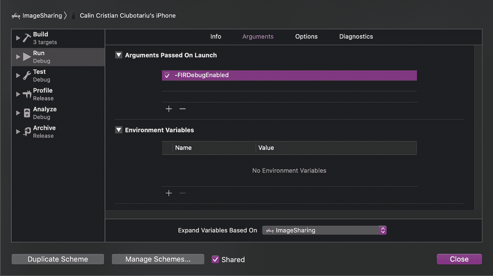

对于发布版本，我们应该指定`argument-FIRDebugDisabled`。

要在 Android 上启用调试模式，只需运行:`adb shell setprop debug.firebase.analytics.app package_name`。这种行为会一直存在，直到您通过指定以下命令行参数来显式禁用调试模式:`adb shell setprop debug.firebase.analytics.app .none`。现在再次运行应用程序，您应该会在 Firebase 控制台中看到一些操作:

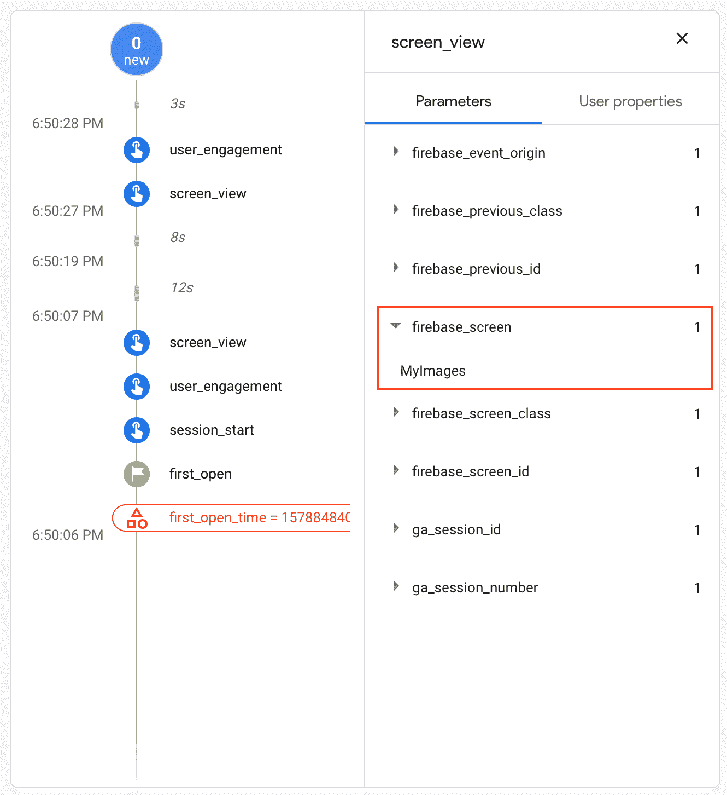

根据我的经验:如果出于某种神秘的原因，它在 iOS 上不能工作，我的诀窍是手动链接 Xcode 中的库，如下图所示。

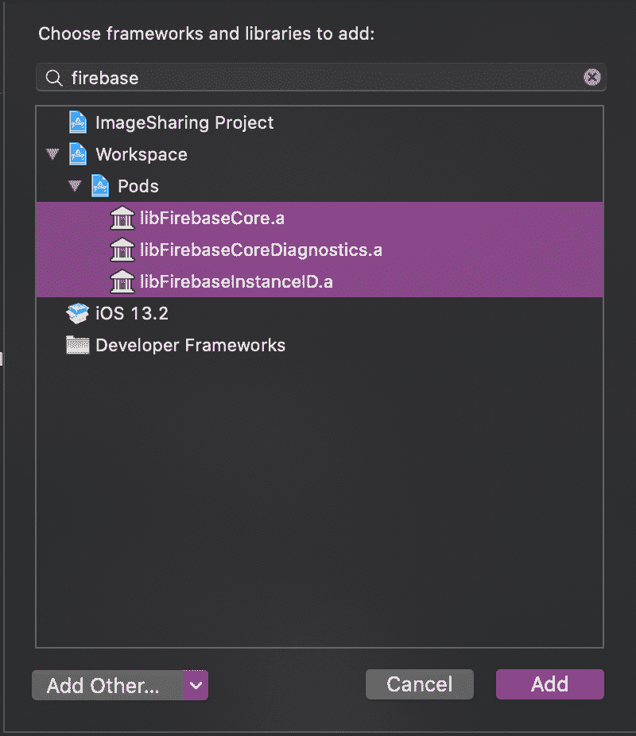

差不多就是这样。你可以从这里发布你的应用程序，收集有价值的信息。将它与来自谷歌分析的数据结合起来，你就有能力(以及支持它的数据)来决定下一步最好的行动。完整的代码，[这里是 GitHub 链接](https://github.com/calincrist/imageSharingApp.)。