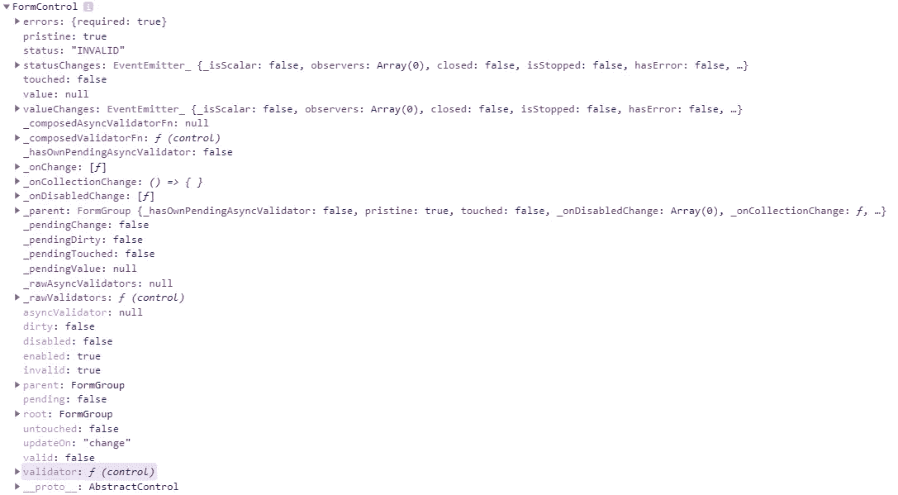

# 如何进行角反应形式验证

> 原文：<https://betterprogramming.pub/how-to-do-angular-reactive-form-validation-ecda45afa11f>

## 在 Angular 9+中验证表单的有用代码示例


照片由[vini cius“amnx”Amano](https://unsplash.com/@viniciusamano?utm_source=medium&utm_medium=referral)在 [Unsplash](https://unsplash.com?utm_source=medium&utm_medium=referral) 上拍摄。

本文通过构建一个注册表单，提供了一个在 Angular 9+中进行简单表单验证的例子。

*   我们将使用 Angular 的内置`Validators`来验证用户输入，这是框架提供的一组函数。
*   我们将访问表单控件属性来管理何时应该显示哪些错误。
*   只有当所有表单控件都有效时，我们才会启用提交按钮。

# 验证器

Angular 为我们提供了一个`Validators`类，它包含一组静态函数，涵盖了常见的表单输入类型:

这些函数接受一个表单控件，如果验证失败，返回一个错误映射(如果输入有效，返回`null`)。

# 验证注册表单

## 开发环境

*   如果你在你的机器上使用过 Angular 应用程序，确保你已经安装了 [Node.js](https://nodejs.org/en/) 和 [Angular CLI](https://angular.io/guide/setup-local) 。
*   我将展示如何使用 [Git](https://git-scm.com/book/en/v2/Getting-Started-Installing-Git) 下载启动文件，如果您以前从未使用过，这也需要安装。

## 起始文件

要获得启动项目，从这个 GitHub [repo](https://github.com/jessipearcy/form-validation-start) 中把它拉下来。要从命令行执行此操作，请导航到您想要下载应用程序的位置，并键入以下 Git 命令:

```
git clone [https://github.com/jessipearcy/form-validation-start.git](https://github.com/jessipearcy/form-validation-start.git)
```

这将把文件复制到文件夹中。接下来，运行以下两个命令导航到该文件夹，并安装 Angular 应用程序运行所需的软件包:

```
cd form-validation-start
npm ci
```

在所有的软件包安装完成后，在命令行中输入`ng serve`，按 enter 键，然后导航到`[http://localhost:420](http://localhost:4202/)0`，你应该会看到正在运行的应用程序。

# 必填字段

如果您现在就检查正在运行的应用程序，用户可以输入几乎任何数据(或者没有数据！)到表单中，并在没有任何防护栏的情况下提交它，以确保我们从它们那里获得一些有用的东西。让我们首先确保用户必须输入所需的数据，以便我们知道他们是谁以及注册所需的任何信息。

在`form.component.ts`中，让我们将`required`验证器添加到所有必填字段:

其次，让我们添加一些 getter 属性，这样我们就可以轻松地从 HTML 模板中访问与每个表单控件相关联的数据:

在`form.component.html`中，我们将添加错误消息和逻辑来指示消息何时出现:

# 控制属性

如果您将这些表单控件之一注销到控制台，您将能够看到我们可以访问的属性，以便知道我们何时需要显示错误:



因为在有输入之前，必填字段会将控件的状态设置为“无效”，所以我们需要使用`touched`属性来知道用户已经尝试填写表单，但是没有满足我们的验证要求。类似地，当一个字段有多个验证类型时，我们稍后将使用`errors`属性来管理我们的消息传递。

# 对无效输入禁用提交

`signup`表单组还有一个`status`属性，我们可以检查这个属性，以了解所有的字段都已经过验证并且是可接受的。要禁用按钮，我们只需将`disabled`属性绑定到表单的`invalid`属性的值:

```
<button [disabled]="signup.invalid" type="submit">Submit</button>
```

现在，保存后，您应该会看到按钮被禁用，直到所有字段都已填写完毕！

# 验证数据

接下来，我们将添加一些额外的验证器来确保用户不仅输入了*一些东西*，而且这也是我们所期望的。两个突出的字段是电子邮件地址(我们希望确保它是一个真实的地址)和消息长度(我们不希望有人只输入一个字符就可以提交表单！).让我们更新这两个控件，使用内置的`email`和`minLength`验证器:

注意，当使用多个验证器时，您将一个数组作为第二个参数传递给`FormControl`构造函数。

我们将在 HTML 中添加两个额外的提醒。我们可以使用括号符号和错误名称来检查`errors`对象中我们期望错误:

# 业务逻辑验证

假设我们的客户不仅要求我们验证基本的表单功能，还要求一些额外的验证来满足他们的特殊需求。接下来，我们将添加验证来检查输入的数量是否可被客户端接受，并验证用户是否已经注册。

让我们将以下代码添加到`form.component.ts`:

关于这段代码的几点说明:

*   验证我们的客户列表超出了 Angular 的 Validators 类提供的内置函数的范围，所以我们创建了自己的函数！是一个函数，我们可以将它添加到传递给表单控件的验证器数组中。
*   对于这个例子，我们的客户列表只是一个简单的硬编码在类中的字符串数组。在现实生活中，您最有可能遇到从某个地方的存储中检索客户列表的服务。
*   validator 函数中的语法有点不可靠，乍一看可能会觉得奇怪！这个函数在说，“返回一个新函数”，这个函数本身将返回一个格式为`{ [key: string]: any }`的对象，它与我们期望用于验证控件对象的`errors`对象相匹配。
*   您在返回对象中命名的属性就是我们将在 HTML 中检查的内容。它将是`errors`对象中的键，并将导致表单无效，直到它通过验证。

在`form.component.html`，让我们连接新的验证:

就是这样！一个经过验证的表单，它将确保我们总是得到一些数据，我们不会得到错误的数据，并且我们满足工作流所需的要求。

# 资源

*   [Stackblitz 演示](https://stackblitz.com/edit/angular-ivy-95kx4c)
*   [Github 回购](https://github.com/jessipearcy/form-validation)
*   [角形验证文件](https://angular.io/guide/form-validation)
*   [FreeCodeCamp 表单验证教程](https://www.freecodecamp.org/news/how-to-validate-angular-reactive-forms/)

# 附加媒体文章

[](https://medium.com/better-programming/learn-angular-basics-by-building-a-simple-app-using-angular-material-9bbc19aa33cf) [## 通过使用角度材料构建一个简单的应用程序来学习角度基础知识

### 奖励:包括使用角度反应形态的一瞥

medium.com](https://medium.com/better-programming/learn-angular-basics-by-building-a-simple-app-using-angular-material-9bbc19aa33cf) [](https://medium.com/better-programming/routing-101-in-angular-9-c76144b28cbd) [## 角度为 9+的路径 101

### 关于使用角度布线显示视图和在零部件之间传递数据的快速教程

medium.com](https://medium.com/better-programming/routing-101-in-angular-9-c76144b28cbd) [](https://medium.com/better-programming/teaching-yourself-to-code-focus-on-getting-in-the-reps-2ef979ee971b) [## 自学编码？专注于销售代表

### 如何通过更多、更高质量的练习来取得显著的进步

medium.com](https://medium.com/better-programming/teaching-yourself-to-code-focus-on-getting-in-the-reps-2ef979ee971b)