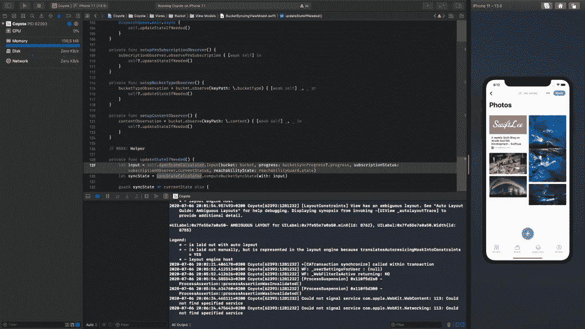

# 如何使用 Xcode 和模拟器进行全屏开发

> 原文：<https://betterprogramming.pub/how-to-do-full-screen-development-with-xcode-and-the-simulator-b524bef01563>

## 进入你的心流，更快地发展


[米米·蒂安](https://unsplash.com/@mimithian?utm_source=unsplash&utm_medium=referral&utm_content=creditCopyText)在 [Unsplash](https://unsplash.com/collections/9908797/people-studying-?utm_source=unsplash&utm_medium=referral&utm_content=creditCopyText) 上的照片

在开发应用程序时，创建一个焦点很重要，这样你就可以进入流程并加速开发。全屏模式可以帮助您集中注意力，不受其他应用程序的干扰。

直到 Xcode 12 全屏幕支持隐藏在用户默认标志之后。有了最新版本的 Xcode，我们现在可以简单地利用 mission control 进入一种专注的开发应用程序的方式。

# 并排使用 Xcode 和模拟器进入全屏模式

全屏模式如下所示，这是让您专注于编写代码和开发应用程序的好方法:



用 Xcode 和模拟器在全屏模式下开发

如你所见，唯一可见的是左边的 Xcode 和右边的模拟器。这是一个专注的环境，看不到 dock 或 menubar 这可能会分散注意力。

要进入此模式，您必须先将 Xcode 切换到全屏模式，然后按照下面的步骤操作:

*   通过点击左上角交通灯上的绿色按钮或使用快捷键`⌃ CTRL + ⌘ CMD + F`进入 Xcode 全屏模式
*   确保模拟器窗口打开，点击`F3`键打开任务控制
*   拖移“模拟器”窗口，并将其放在 Xcode 旁边

仅此而已！我在一个视频中演示了这一切(这篇文章的原始版本中有)。

# 在 Xcode 的旧版本中使用全屏幕模式

使用旧版本的 Xcode 尝试上述场景会导致阻塞符号:


默认情况下，Xcode 11 及更早版本不支持全屏幕模式

我们可以通过在终端中执行以下命令来解决这个问题:

```
defaults write com.apple.iphonesimulator AllowFullscreenMode -bool YES
```

如果模拟器是打开的，请确保重新启动它，这样您就可以在 Xcode 11 上以全屏模式工作了。

# 结论

保持专注本身就是一种技能。编写高质量的代码已经很有挑战性了，所以任何有助于我们改进代码编写的东西都非常受欢迎。通过在全屏模式下使用 Xcode 和模拟器，我们可以消除可能的干扰，让自己进入状态。

谢谢！