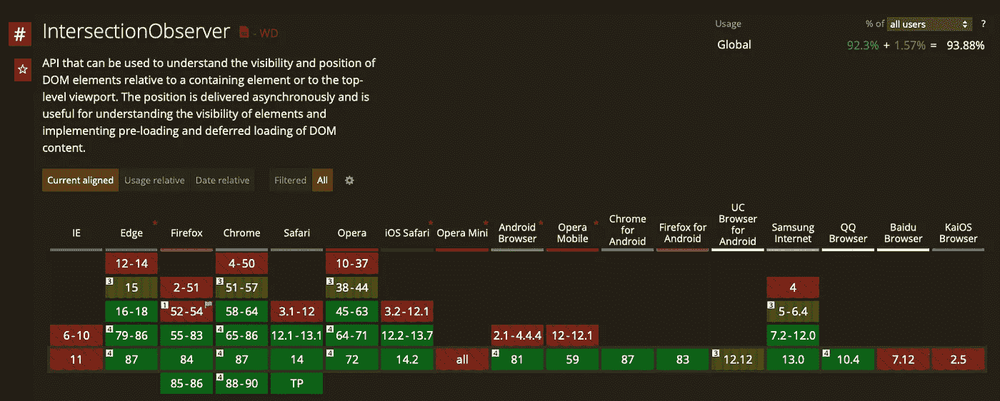

# 如何以正确的方式进行无限滚动

> 原文：<https://betterprogramming.pub/how-to-do-infinite-scrolling-the-right-way-a64e3463b0e3>

## 使用 React 钩子实现简单高效的无限滚动

[卢德·洛伦兹](https://unsplash.com/@luddelorentz?utm_source=medium&utm_medium=referral)在 [Unsplash](https://unsplash.com?utm_source=medium&utm_medium=referral) 上拍照。

无限滚动是一种 UX 设计技术，它在用户向下滚动页面时不断加载内容。这种方法不需要任何分页元素。通过将用户从这种负担中解放出来，它带来了干净的 UX 体验。您肯定经历过这种行为，因为流行的社交媒体提要使用这种技术实现。

最明显的好处是，只有相关信息在用户需要时才被加载。它减少了初始请求数据的大小，并让应用程序有机会根据需要逐步呈现元素。它不需要显示任何分页元素，也不需要用导航操作来打扰用户。

当处理大量的条目时，这种技术与列表虚拟化相结合，但这是另一篇文章的主题。在这里，我们将着重于如何使无限滚动发生。

我们将探索传统的实现方式，看看如何改进。作为一个技术栈，我将使用 React Hooks 和 TypeScript 来取乐，但用普通的 JavaScript 也可以轻松做到。

# 最常见的方法

如果你在网上搜索，你会发现最常见的方法是依靠浏览器滚动事件。您可以设置一个句柄来检查滚动的位置，并查看滚动是在最后一个元素之前还是之后。有了这些信息，您就可以决定是否触发无限滚动回调。

我们所做的是在列表的末尾定义一个元素，并检查用户是否滚动到最后一项来触发新元素的加载。

下面是如何呈现该列表的示例:

让我们从定义我们的`hasReachedBottom`函数开始:

如您所见，这个特定的实现依赖于页面上最后一项的元素。这并不十分相关，对于您的具体情况，还有其他计算方法。

现在让我们使用这个函数:

1.  检查当前没有挂起的请求。
2.  检查元素是否已到达底部。
3.  执行网络请求。

注意`offset`变量。我们使用偏移量只是为了预测最后一个元素何时可见。如果您想在用户到达最后一个元素之前加载内容，这很方便。如果内容加载速度很快，这将是一个完美的体验。

另一个重要的注意事项是，总是清理自己。使用`useEffect`时，可以返回一个负责清理的函数。在这种情况下，我们需要清理滚动事件处理程序。否则，我们会遇到内存泄漏。

虽然这种方法很简单，但不是最有效的。对于每个用户滚动事件，我们手动检查他们是否到达了列表的底部。我们可以比这更有效率。

如果您查看 Mozilla 开发者页面，您会看到以下警告:

> 因为`scroll`事件可以高速触发，事件处理器不应该执行计算量大的操作，比如 DOM 修改。相反，建议使用`[requestAnimationFrame()](https://developer.mozilla.org/en-US/docs/Web/API/window/requestAnimationFrame)`、`[setTimeout()](https://developer.mozilla.org/en-US/docs/Web/API/WindowOrWorkerGlobalScope/setTimeout)`或`[CustomEvent](https://developer.mozilla.org/en-US/docs/Web/API/CustomEvent)`抑制事件，如下所示。”— [MDN 网络文档](https://developer.mozilla.org/en-US/docs/Web/API/Document/scroll_event)

# 十字路口观察员前来救援

不久前发布了`IntersectionObserver`功能。这使我们能够被动地观察元素，并在这些元素在视口中变得可见或隐藏时获取事件。

如果您阅读 MDN 文档，您会发现推荐的用例之一确实是无限滚动特性。

> -页面滚动时延迟加载图像或其他内容。
> 
> - **实现“无限滚动”网站，当你滚动的时候，越来越多的内容被加载和呈现，这样用户就不用翻页了。**
> 
> -报告广告的可见性，以便计算广告收入。
> 
> -根据用户是否会看到结果来决定是否执行任务或动画过程。”— [MDN 网络文档](https://developer.mozilla.org/en-US/docs/Web/API/Intersection_Observer_API)

我们该拿它怎么办？我们将在列表的末尾放置一个元素。将监控该元素，一旦它变得可见，它将触发回调，我们可以有条件地决定是否要获取更多的项目。

作者的图式方法

让我们看看 React 挂钩和 TypeScript 的实现细节:

这导致了更干净的实现。我们不必处理一种强制性的方法来知道用户是否到达了最后一个元素。当项目的可见性发生变化时，浏览器会通知我们。当元素在屏幕上出现或消失时，交叉点观察器 API 将做出反应。

浏览器将为我们做繁重的工作。这种实现导致委托给我们的事件更少，因此实现的性能更高。

注意，我们之前使用的偏移方法在这里也是可行的。`Intersection Observer`接受第二个参数，这是一组选项。如果您想预测用户对该元素的访问，可以使用`rootMargin: -100px`。

# 支持交叉观察器

对这个功能的支持度还是蛮大的:92.3%。

如果你担心的是 7.7%的用户，不要慌。你可以只使用:

如果你的浏览器不支持的话，这个工具会添加`IntersectionObserver`功能。这段代码将只在这种情况下下载 polyfill，不会影响已经支持`IntersectionObserver`的用户。聚合填充是最大化新浏览器功能覆盖范围的好方法。

# **包装完毕**

[Adrian Dascal](https://unsplash.com/@dascal?utm_source=medium&utm_medium=referral) 在 [Unsplash](https://unsplash.com?utm_source=medium&utm_medium=referral) 上拍摄的照片。

我们已经探讨了实现无限滚动的最常见方法及其缺陷。我们已经看到了一个性能更好、更具声明性、更易于使用的解决方案。

唯一的警告是，它需要使用 polyfill 来确保它覆盖我们 100%的用户群，但在工具的帮助下这是可能的。

我写了另一篇关于`IntersectionObserver`的文章。如果您对这个 API 感兴趣，值得一看:

 [## 用正确的方法制作粘性 HTML 元素

### 创建滚动时保持不变的元素的最佳实践

medium.com](https://medium.com/better-programming/sticky-done-the-right-way-880af0122a71) 

干杯！