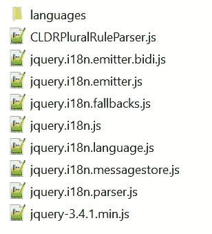

# 如何用 jQuery.i18n 做 JavaScript 本地化

> 原文：<https://betterprogramming.pub/how-to-do-javascript-localization-with-jquery-i18n-1320ff5d7a4e>

## 基于 jQuery 的 JavaScript 国际化库


照片由[凯尔·格伦](https://unsplash.com/@kylejglenn?utm_source=unsplash&utm_medium=referral&utm_content=creditCopyText)在 [Unsplash](https://unsplash.com/s/photos/international?utm_source=unsplash&utm_medium=referral&utm_content=creditCopyText) 拍摄

这篇文章讲述了通过一个叫做 jQuery.i18n 的 JavaScript 框架为你的网站进行本地化的必要步骤。

> jQuery.i18n 是一个基于 jQuery 的 JavaScript 国际化库。它帮助您轻松地国际化您的 web 应用程序。
> 
> 这是维基媒体基金会[语言工程团队](https://www.mediawiki.org/wiki/Wikimedia_Language_engineering)的一个项目，用于维基媒体基金会的一些项目，如通用语言选择器。
> 
> jquery.i18n 库使用基于 JSON 的本地化文件格式“banana”，它被用作 MediaWiki 和其他项目的本地化文件格式。

让我们来看看下面的[演示](https://thottingal.in/projects/js/jquery.i18n/demo/)，了解更多关于如何在不重新加载页面的情况下本地化 web 应用程序的内容。

本文分为四个部分:

1.  设置
2.  消息文件格式
3.  基本用法
4.  结论

# 1.设置

在 web 应用程序的根目录下创建一个文件夹。我就把它命名为`jquery.i18n`。然后，我们将包含必要的 JavaScript 文件。您可以克隆 git 文件，或者只是从 GitHub 文件夹中逐个保存所需的文件。

## 克隆(方法 1)

打开 Git 终端，运行以下命令:

```
git clone https://github.com/wikimedia/jquery.i18n.git
```

## Zip 下载(方法 2)

你可以通过官方的 [GitHub](https://github.com/wikimedia/jquery.i18n) 页面下载 zip 文件。

## i18n JavaScript 文件

进入你的`src`文件夹，将以下所有文件复制到`jquery.i18n`文件夹(除了`languages` 文件夹):

1.  jquery.i18n.emitter.bidi.js
2.  jquery.i18n.emitter.js
3.  jquery.i18n.fallbacks.js
4.  jquery.i18n.js
5.  jquery.i18n .语言. js
6.  jquery.i18n.messagestore.js
7.  jquery.i18n.parser.js

## CLDRPluralRuleParser

转到 libs/[CLDRPluralRuleParser](https://github.com/santhoshtr/CLDRPluralRuleParser/tree/8baf9aedc428924fe6ee508b3d952cb5564efb3a/src)/src 文件夹，将以下文件复制到您的`jquery.i18n`文件夹中:

1.  CLDRPluralRuleParser.js

## jQuery

本库基于 jQuery，，推荐最新版本。访问下面的[链接](https://code.jquery.com/)，下载你想要的版本。我将使用缩小版 3.4.1。

## 语言文件

在同一个目录下创建一个`languages`文件夹。稍后我们会用所需的文件填充它。

在`jquery.i18n`文件夹中应该有以下文件。



# 2.消息文件格式

所有语言文件都将基于 JSON 文件格式。强烈建议您在命名每种语言或区域设置文件时使用语言代码。例如:

*   英语:en.json
*   日语:ja.json
*   中文:zh.json

让我们使用以下模板作为样板文件来创建一个简单的 JSON 文件:

元数据标记用于存储不是用作参考或自述信息的消息的数据。官方网站推荐:

> 消息是键值对。将您的`appname`作为消息键的前缀是一个很好的惯例，这样可以使消息具有唯一性。它充当消息键的名称空间。消息键用`-`分隔单词也是一个很好的约定，全部用小写字母。

该文件必须是有效的 JSON。在处理键值对时，避免使用单引号。您可以查看下面的[库](https://github.com/wikimedia/mediawiki/tree/master/languages/i18n)以获得更多有效 JSON 文件的例子。

# 3.基本用法

使用定制的 JavaScript 代码或通过 HTML 标记定义的数据 API 可以很容易地完成本地化。

## 设置

您需要将 JavaScript 文件链接到 web 应用程序的 HTML 页面。下面是我如何将它添加到我的项目中的一个例子。

## 现场

首先，您需要定义区域设置，因为显示的消息将基于该参数。您可以使用以下代码轻松定义它:

```
$.i18n( {
    locale: 'en' // Locale is English
} );
```

如果没有区域设置的定义，这个框架将依赖于 HTML 标签的语言属性。

```
<html lang="en">
```

假设这些都没有指定。最后的退路是它将使用浏览器指定的区域设置。可以通过调用以下函数来更改区域设置:

```
$.i18n().locale = 'ja'; //Switching locale to Japanese
```

## 装货

有很多方法可以加载 JSON 格式的语言文件。它们可以按部件加载，但最简单的方法是通过外部 URL，如下所示:

```
$.i18n().load( {
	en: {
		'message-hello': 'Hello World',
		'message-goodbye': 'Good bye'	},
	ja: 'i18n/messages-ja.json', // Messages for Japanese
	zh: 'i18n/messages-zh.json' // Messages for Chinese
} );
```

记得编辑语言文件，给它添加`message-hello`和`message-goodbye`。

## 数据 API

显示消息的基本代码如下:

```
$.i18n( 'message-hello' );
```

为了在没有 JavaScript 代码的情况下显示它，您需要添加一个 data-i18n 属性，其值作为消息键。

```
<li data-i18n="message-hello"></li>
```

您可以指定后备文本，以防`message-hello`在您加载的 JSON 文件中不作为键出现。

```
<li data-i18n="message-hello">Fallback text here!</li>
```

## 占位符

消息能够采用占位符，占位符使用美元符号(例如$1、$2、$3 等)表示。).它们将在运行时被替换。

```
var message = "Welcome to Medium, $1";
$.i18n(message, 'Wai Foong'); // "Welcome to Medium, Wai Foong"
```

通过在函数中传递多个参数，可以指定多个占位符。

```
var message = "Welcome to $1, $2";
$.i18n(message, 'Medium', 'Wai Foong'); // "Welcome to Medium, Wai Foong"
```

## 复数

该框架通过以下语法支持消息中的复数形式:`{{PLURAL:$1|pluralform1|pluralform2|...}}`

请注意`PLURAL`不区分大小写。所有的复数形式都可以在上面的语法中给出，用管道符号隔开。

每种语言的规则在`CLDRPluralRuleParser.js`文件中定义。以下是如何根据项目数显示不同消息的示例:

```
var message = 'Box has {{PLURAL:$1|one egg|$1 eggs|12=a dozen eggs}}.';
$.i18n(message, 1); // "Box has one egg."
$.i18n(message, 6); // "Box has 6 eggs."
$.i18n(message, 12 ); // "Box has a dozen eggs."
```

## 性别

性别形式类似于复数形式，可用于根据上下文的性别显示消息:

```
var message = "$1 edited {{GENDER:$2|his|her}} article";
$.i18n(message, 'Amy', 'female' ); "Amy edited her article"
$.i18n(message, 'Bob', 'male' ); "Bob edited his article"
```

# 4.结论

让我们回顾一下今天所学的内容。我们从这个框架的一些基本介绍开始，然后是设置和创建必要的文件和文件夹的一些简单步骤。

接下来，我们继续学习创建每个语言文件时所需的消息格式。它必须是一个有效的 JSON 格式的文件，强烈建议根据语言代码来命名。

最后，我们学习了语法、基本用法和使用这个框架的正确方法。它涵盖了相当多对本地化非常有用的功能。

感谢阅读，希望在下一篇文章中再次见到您。祝您愉快！

# 参考

1.  [https://github.com/wikimedia/jquery.i18n](https://github.com/wikimedia/jquery.i18n)
2.  [https://phrase . com/blog/posts/step-step-guide-JavaScript-localization/](https://phrase.com/blog/posts/step-step-guide-javascript-localization/)
3.  [https://thottingal.in/projects/js/jquery.i18n/demo/](https://thottingal.in/projects/js/jquery.i18n/demo/)
4.  [https://github . com/wikimedia/mediawiki/tree/master/languages/i18n](https://github.com/wikimedia/mediawiki/tree/master/languages/i18n)