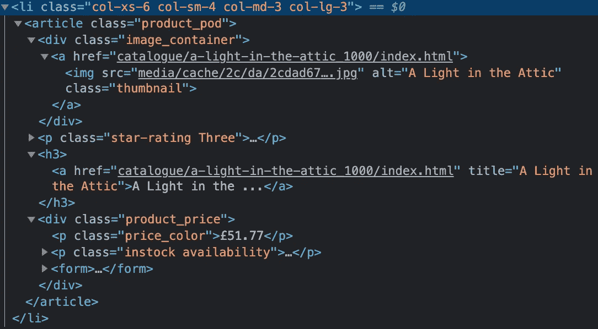

# 如何用 Node.js 做更轻量级的网页抓取

> 原文：<https://betterprogramming.pub/how-to-do-lighter-web-scraping-with-node-js-651737fb2c4>

## 使用 Node.js 进行 web 抓取的另一种方法


照片由 [Kike Salazar N](https://unsplash.com/@kikesalazarn?utm_source=unsplash&utm_medium=referral&utm_content=creditCopyText) 在 [Unsplash](https://unsplash.com/?utm_source=unsplash&utm_medium=referral&utm_content=creditCopyText) 拍摄。

如果你搜索“使用 Node.js 进行网络搜集”，关于[木偶师](https://developers.google.com/web/tools/puppeteer)的文章可能会出现。对于复杂的网络抓取来说，这是一个非常棒的库，因为使用 Puppeteer 时，你实际上是在自动化浏览器。也就是说，我认为对于简单的网络抓取工作来说，这可能是大材小用。

在本文中，我们将研究如何在不使用 Puppeteer 的情况下从 web 中抓取数据。

> 本文原载于我的博客这里:[https://www . christiandimas . com/lighter-web-scraping-using-nodejs/](https://www.christiandimas.com/lighter-web-scraping-using-nodejs/)

# 入门指南

为此，我们需要解决两个问题:

*   怎样才能获取网站的 HTML 代码？
*   我们如何从 HTML 代码中获得我们需要的实际数据？

开始编码吧！首先，通过运行以下命令来搭建一个新的节点项目:

```
yarn init -y
```

现在我们已经有了一个可以使用的项目，让我们安装一些依赖项:

```
yarn install axios cheerio
```

## Axios

您可能对这个包很熟悉，因为它是一个非常流行的用于处理 HTTP 请求的包。现在，我们通常使用它来与 API 交互，并以 JSON 的形式获得结果，但是我们可以调整一个设置，使响应以 HTML 而不是 JSON 的形式出现。

## 再见

从 [npm 包的描述](https://www.npmjs.com/package/cheerio)来看，这是一个“专门为服务器设计的核心 jQuery 的快速、灵活的&精益实现。”我认为这解释得很好。基本上，有了这个包，我们可以在服务器上运行 jQuery 命令。

# 建造铲运机

我们将使用[书籍来测试](https://books.toscrape.com/)刮刀。首先，在项目文件夹根目录下创建一个名为`index.js`的文件。我们将使用这个文件来构建我们的刮刀。

从网站上的书单中，我们会抓取一些东西:

*   标题
*   价格
*   封面图像
*   评级
*   有效性
*   统一资源定位器

让我们开始编码吧！

首先，我们导入`axios`和`cheerio`，然后创建一个名为`scrape`的异步函数。

现在让我们使用`axios`从网站获取 HTML 代码，并将其加载到`cheerio`中，这样我们就可以查询数据了。我们会这样做:

检查网站后，我们可以看到图书列表是这样的。这将有助于我们获得数据。



有了这些信息，让我们首先抓住书籍元素。我们可以这样使用 cheerio:

好了，我们拿到书了。现在是先抓简单数据的时候了。我们可以在元素中直接看到它:

完成后，我们还可以抓取稍微复杂一点的数据(例如`rating`、`availability`、`url`):

首先，对于`rating`，我们可以获取`p`元素并检查该类，因为它包含了该书有多少评级(例如`three`)。接下来，对于可用性，我们只需检查是否有类为`.instock.availability`的 div。我们查询这两个类，以确保`.instock`类确实是为了可用性，而`.availability`有`.instock`类来表明它是可用的。

全部完成！完整的代码如下所示:

# 结论

我认为这是做网页抓取最简单的方法。也就是说，这样做有一些优点和缺点。

## 赞成的意见

*   构建更简单
*   需要的资源更少(像 Puppeteer 这样的库需要安装 Chromium 才能运行)
*   更小的包装尺寸

## 骗局

*   无法抓取需要导航的网站(登录、滚动等。)
*   无法获取页面的屏幕截图

最后还是要看你想刮什么网站，想得到什么数据。如果你想从一个复杂的网站上获得一些东西，那么就使用像木偶师这样的东西！它有一个强大的 API，你可以与一个复杂的网站互动。但是如果你需要简单的东西，那么`axios`和`cheerio`可能是更好的选择。

# 资源

以下是我在本教程中提到的所有内容的一些资源:

*   阿希奥斯:[https://github.com/axios/axios](https://github.com/axios/axios)
*   https://github.com/cheeriojs/cheerio
*   木偶师:[https://github.com/puppeteer/puppeteer](https://github.com/puppeteer/puppeteer)