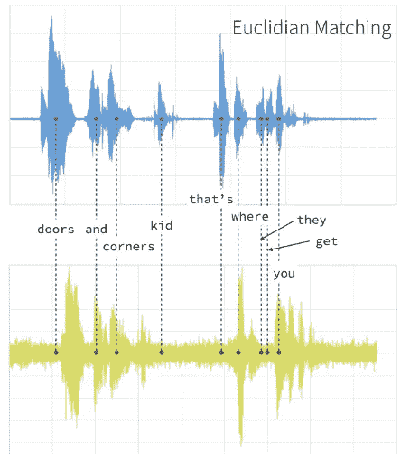
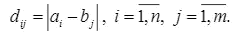
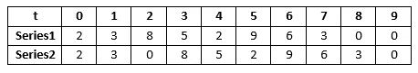
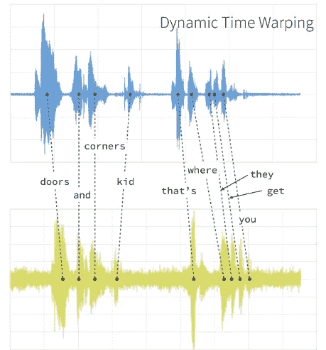
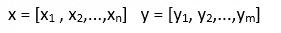
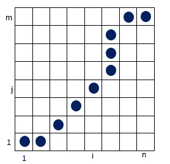
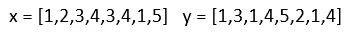
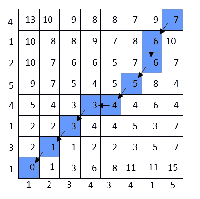
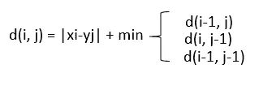
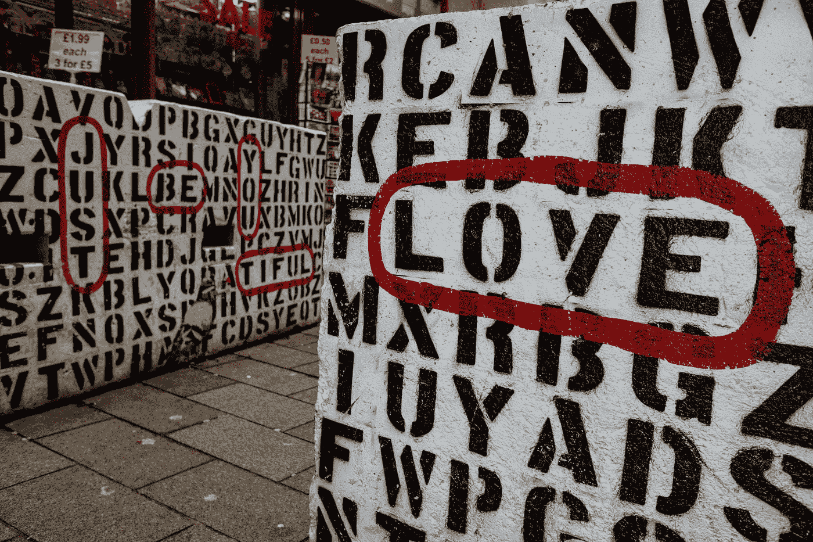

# 如何用动态时间弯曲算法进行语音识别

> 原文：<https://betterprogramming.pub/how-to-do-speech-recognition-with-a-dynamic-time-warping-algorithm-159c2a1bb83c>

## 理解动态时间弯曲算法

照片由[晨酿](https://unsplash.com/@morningbrew?utm_source=medium&utm_medium=referral)在 [Unsplash](https://unsplash.com?utm_source=medium&utm_medium=referral) 拍摄

语音识别是分析音频信号以识别说话者所说的单词的过程。自 1952 年以来，语音识别已经成为我们生活的一部分。我们都在日常生活的许多领域使用这项技术。数字助理 Siri 就是这种技术的一个例子。

由苏联研究人员在 1970 年发明的动态时间弯曲(DTW)算法被用于语音识别。随着时间的推移，新的算法取代了它，但它仍然是一种流行的技术。

动态时间弯曲算法是一种动态规划算法，是语音识别中非常流行的技术。为什么 DTW 算法是语音识别的合适方法？今天我们将看到这项技术是如何用于语音识别的。让我们一起来学习这个。

# **理解问题**

罗斯·斯奈登在 [Unsplash](https://unsplash.com?utm_source=medium&utm_medium=referral) 上的照片

专注于解决方案而没有完全理解问题是我们可能犯的最大错误之一。我们先来了解一下问题。语音识别的问题之一是速度。

图 1:两个不同的人说同样的话的音频信号(图片来源: [Databricks 博客](https://databricks.com/blog/2019/04/30/understanding-dynamic-time-warping.html))

音频信号产生时间序列。上面我们看到两个不同的人的两个音频信号(所以是两个时间序列)。欧几里德匹配是一种传统的时间序列匹配方法。两者之间的时间不匹配。那为什么呢？

图 2:欧几里德距离

它们不匹配，因为在这种方法中，计算的是两个元素值之间的绝对距离。当两个音频信号之间的时间问题如此明显时，这样做是不可靠的。

图 3:依赖于时间的序列

让我们将时间序列形象化，以便更好地理解。我们可以把时间序列想象成一系列的数字。这两个时间序列对比的时候，会因为时间差而看起来不一样。但是，它们是一样的，只是有一个时间问题。DTW 会为我们解决这个问题。那么它是如何解决这个问题的呢？

# 动态时间扭曲的工作原理

肖恩·奥尔登多夫在 [Unsplash](https://unsplash.com?utm_source=medium&utm_medium=referral) 上拍摄的照片

将音频信号(即时间序列)划分成相等部分的解决方案，实际上是将问题分解成子问题。当我们为每个子问题找到最佳路径(最短路径)时，我们就为我们的主问题找到了最佳解决方案。

DTW 创建一个时间偏移，并将一个序列中的每个元素映射到另一个序列中最近的元素。换句话说，DTW 在做这个映射的时候找到了元素之间的最佳距离(这里的最佳距离是最短的距离)。所以会产生一个时间偏移。

图 4:与 DTW 的时光转移(图片来源:[数据博客](https://databricks.com/blog/2019/04/30/understanding-dynamic-time-warping.html)

这些点之间的距离存储在一个表中。这叫做*记忆*。然后添加最短路径，这是我们在两个时间序列之间的相似性度量。记住，我们试图检测两个信号之间的相似性。

图 5:时间序列 x 和时间序列 y

图 6:扭曲路径

在这一切发生的同时，一条被称为*扭曲路径*的路径被创建。时间按照这条路径移动，因此这两个序列达到相同的时间水平。随着弯曲路径变小，两个时间序列之间的相似性增加。扭曲路径根据一些规则出现。扭曲函数代表这些规则。翘曲函数适用于两个系列。时间校准以这种方式发生。该函数包含一些限制:单调性、连续性、边界条件和扭曲窗口。由于这些限制，可以尝试的途径有限。

让我举个例子。我们有两个时间序列。

我们根据时间序列的长度创建一个矩阵。在这个例子中，它是一个 8×8 的矩阵。我们将时间序列中的值放在 x 和 y 平面上。我们使用一个公式来计算一个序列中的每个元素与另一个序列中的每个元素之间的距离:

计算完距离后，我们确定了变形路径。最小距离之和为我们提供了两个时间序列之间相似性的度量。

假设我们有两个不同的人说同一句话的录音。他们会在不同的时间说同样的话。这里使用 DTW 算法来解决时间偏移是合适的。我们说过，一个音频信号产生一个时间序列。因此，要衡量我们拥有的两个时间序列之间的相似性，我们必须做以下工作:

1.  将两个时间序列分成相等的部分。
2.  将时间序列中的一个点与其他时间序列中的每个点进行比较，并将距离存储在表中。(这是记忆化部分。)
3.  对时间序列中的每个点执行步骤 2。
4.  然后对第二个时间序列执行步骤 2 和步骤 3。
5.  创建扭曲路径。
6.  将所有最小距离相加。这是对两个时间序列之间相似性的一种度量。

如果不以这种方式创建时间偏移，两个相似的时间序列将显示为不同的序列，因为单词不是同时说出的。

该算法的复杂度是 O(N*M ),其中 N 和 M 代表每个序列的长度。

# **使用 DTW 算法的单词识别**

照片由[凯文悲伤](https://unsplash.com/@grievek1610begur?utm_source=medium&utm_medium=referral)在 [Unsplash](https://unsplash.com?utm_source=medium&utm_medium=referral)

单词定义有两种方法:信号频谱图的比较或信号的直接比较。

我们已经解释了上面信号的直接比较。但是，序列中的数值可能非常高。在这种情况下，数值应该以一定的灵敏度减小。如果时间序列包含大量元素，这可能会导致一些问题。例如，进行许多距离计算。有一种方法就是为解决这类问题而开发的:FastDTW。

信号频谱图的比较也具有相同的逻辑。声谱图是用来根据时间分析声音的图表。数字信号被分成一定的范围。这称为*窗口*。对每个窗口应用变换(快速傅立叶变换)，并将它们存储在矩阵中。

# 动态编程的痕迹

将一个复杂的问题分成子问题并记忆是动态编程的逻辑。因为它隐藏了每个子问题的解，所以在遇到同一个子问题时，不必再次求解。这样，就节省了时间。但是，因为存储了每个子问题的解，所以需要更多的空间。

# 结论

现在我们明白了为什么 DTW 算法适用于语音识别。我们已经知道 DTW 是如何被用来定义单词和处理音频信号的。我们已经看到它是如何完成这一过程的。我们也看到了与欧几里德的不同，欧几里德是一种传统的匹配方法。

这看起来是一个相当复杂的问题，但它并没有那么难，对不对？记住，如果你明白问题是什么，解决方案对你来说更有意义。大家干得好！

# 资源

*   [https://www . research gate . net/publication/26569937 _ Dynamic _ Programming _ Algorithms _ in _ Speech _ Recognition](https://www.researchgate.net/publication/26569937_Dynamic_Programming_Algorithms_in_Speech_Recognition)
*   [https://databricks . com/blog/2019/04/30/understanding-dynamic-time-warping . html](https://databricks.com/blog/2019/04/30/understanding-dynamic-time-warping.html)