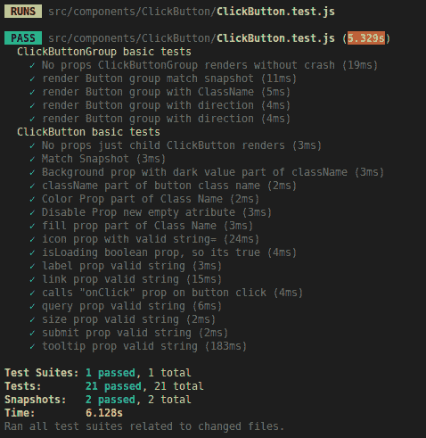
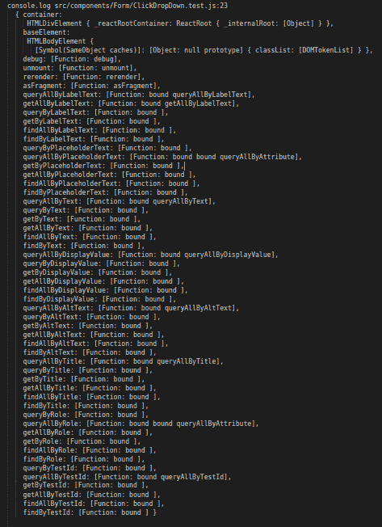
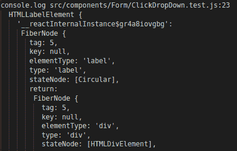
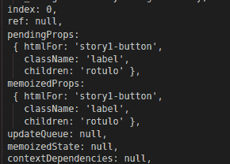
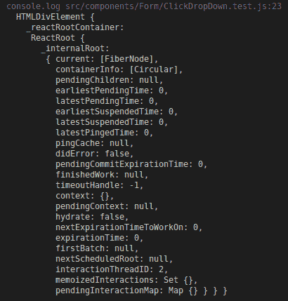
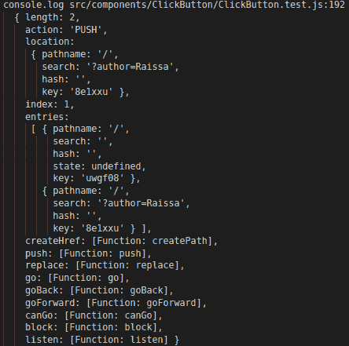

# 如何做好 React 测试库中的基础工作

> 原文：<https://betterprogramming.pub/how-to-do-the-basics-in-react-testing-library-c52cdb3a7726>

## 向非 React 专家介绍 React 测试


[Artem Sapegin](https://unsplash.com/@sapegin?utm_source=medium&utm_medium=referral) 在 [Unsplash](https://unsplash.com?utm_source=medium&utm_medium=referral) 上拍照

几个月前，我受雇成为一个网站的测试员。问题？我对 React 没有什么经验，要遵循 React 的测试文档，从[酶](https://airbnb.io/enzyme/)和 React 测试库是相当复杂的。所以在我理解了这一切之后，我决定制作这个教程。

另一件要说的重要事情是，我试图用酶来做测试，但这不足以轻易做到这一点。它并不比 React 测试库更容易阅读，这也是我最终选择它的原因。

# 基本语法介绍

为了使 [Jest](https://jestjs.io/) 错误报告易于阅读，我们在`nameOfComponent.test.js`中有三个层次的描述——引用组件、`describe`(通过一些上下文标记一组测试)和`it`(描述那个特定的测试和断言组(用`expect`做的)引用什么)。

然后我们有了`render` 函数，这是一个将组件放入 Jest DOM 并放入`renderResult`的方法。这是我们要用来做断言的。`render`参数是一个带有各自属性的 React 元素。在第一个代码示例中，我已经使用 WAI-ARIA 设计模式输入了有效下拉菜单所必需的最小道具。

最后，我们对`expects` 进行了两点考虑:

*   指向 DOM 中元素的指针；HTML 元素。
*   “toBe”断言。

下面是一个例子:



使用“`describe”`和“it”的报告示例

# 什么是“renderResult”？



console.log(渲染结果)

TK *(thing you want be sure)这是技术对话还是垃圾？*知道您作为参数传递的内容的最佳方式是转到`console.log`(“thingyouwantobe sure”)，并检查 [VSCode 终端](https://vscode.readthedocs.io/en/latest/editor/integrated-terminal/)的输出部分，因为终端部分可能会省略一些重要的内容。

`console.log(renderResult)`是一个有几个方法的对象。其中一个是返回`DIV`和`HTMLBodyElement`的容器，里面有我们的`DropDown`组件。

`renderResult`提供了更容易在 DOM 中搜索元素的方法。这就是为什么我们需要“获取方法”，也就是查询，在 [React 测试库 API](https://testing-library.com/docs/dom-testing-library/api-queries) 中描述。

# 查询 API



console . log(render result . get bytext(" lab1))

因为标签的子标签是这个组件中的一个标签元素，所以字符串`rotulo`在文档中。我们可以在`container.innerHTML console.log`中看到。

所以`expect(renderResult.getByText(“lab1)).toBeInTheDocument()`将返回 true。



标签元素的待定属性

`getByText`查询用于在 HTML 文档中可视化显示的唯一字符串中进行断言。这里还有一些例子:



控制台. log(renderResult.container)

`renderResult.container` 返回一个指向 DOM 元素的指针，我们可以访问 DOM API 来搜索其他相关节点，就像这些查询:

`.getElementsByTagName(“span”)[0][“textContent”]`

我们在第一个 span 标记中获取“儿童”文本。

```
.getElementsByTagName(“div”)[0][“id”]
```

从第一个`div`开始的`id`。

```
.getElementsByTagName(“button”)[0].getAttribute(“aria-label”)
```

从第一个`button`开始的`aria-label`内容。

```
.getElementsByClassName(“Extra”)[0]
```

第一个`Element`是一个名为`Extra`的类。

```
.getElementsByTagName(“div”)[1][“classList”].contains(“checkable”)
```

如果它在第二个`div`中，那么它就是包含“可检查”类的`ClassList`。

仅使用这些例子，我就可以做出 12 个 WAI-ARIA 模式组件所需的所有断言——复选框、日期输入、下拉菜单、单选按钮、按钮组、表格、选项卡、多选列表等。但是，这并不适用于各种道具。

# 历史、路由器和表单

下面是一个链接和搜索查询测试链接的示例:

在这两种情况下，我们都需要使用 click 事件，将这个新状态推送到我们的`memoryHistory`中，并将查询放入`location.search`中。为了让点击发生，我们使用`getByText(“Home”)`来引用 span 元素。

记住点击事件传播到链接元素(它的父元素)是很重要的。这就是为什么点击会触发链接和查询方法，但相同上下文中的焦点不会。现在，让我们来看看“历史”:



这就是为什么我们推断链接组件的验证是:

```
fireEvent.click(RenderResult.getByText(“Home”));
expect(history.location.pathname).toBe(“/example”);
```

并测试搜索参数的变化:

```
fireEvent.click(RenderResult.getByText(“Home”)); expect(history.location.search).toBe(“?author=Raissa”);
expect(history.location.pathname).toBe(“/”);
```

如果你不知道也不使用 React 路由器，建议你开始使用。

[](https://www.freecodecamp.org/news/beginner-s-guide-to-react-router-53094349669/) [## React 路由器初学者指南

### 由纳德达比特初学者指南反应路由器或我希望我知道当开始与反应路由器。>点击此处…

www.freecodecamp.org](https://www.freecodecamp.org/news/beginner-s-guide-to-react-router-53094349669/) 

TK *链接到葡萄牙文有帮助吗？*我推荐的另一件事是使用 Formik 创建表单。这里有一篇关于福米克的文章(葡萄牙语)。

[](https://medium.com/reactbrasil/formik-construa-formul%C3%A1rios-em-react-sem-l%C3%A1grimas-a80c52887882) [## formik part 1——constru formuláRios em React，sem lágrimas

### 最近，一项研究表明，这两种形式的反应是复杂的，决定于…

medium.com](https://medium.com/reactbrasil/formik-construa-formul%C3%A1rios-em-react-sem-l%C3%A1grimas-a80c52887882) 

然而，Formik 在测试中也有自己的要求:

这是两个简单的验证，确保渲染不会崩溃。然而，您可以验证`Form`标签的其他属性值，就像我们之前做的例子一样。

# 射击事件和故事书的使用

点火事件需要考虑两个因素。您必须使用哪个 HTML 元素来引发事件，以及事件是否有一些类似于`input`的参数。

像`onClick`、`onBlur`、`onKeyDown`等功能道具应该是有据可查的，这样我们就知道它们的监听器是哪个 HTML 元素了。测试人员能够独立于组件的实现编写测试代码，因为有些事件，比如焦点，不会传播到父组件。

为了容易识别 HTML 元素，它基本上和以前一样——使用`console.log` —来生成期望。要查找哪些事件使用并调用函数 prop，一个想法是使用 [Storybook](https://storybook.js.org/) 来记录孤立的组件、其外观及其行为。这将使测试变得非常真实。

## 密码

[](https://github.com/storybooks/storybook) [## 故事书

### UI 组件开发和测试:React，Vue，Angular，React Native，Ember，Web 组件等等！故事书/故事书

github.com](https://github.com/storybooks/storybook) 

# **点火事件示例**

记住这取决于你的组件总是好的！所以这里我们将关注事件，而不是组件。

只需点击 span 文本，在一个按钮。

```
const onClick = jest.fn();
fireEvent.click(RenderResult.getByText(“label”));
expect(onClick).toHaveBeenCalled();
```

悬停显示内容，就像在工具提示中一样。

```
fireEvent.focus(RenderResult.getByLabelText(“Label”));
expect(RenderResult.getByText(“TooltipContent”)).toBeInTheDocument()
```

单击未选中的选项和多选列表中的一个选中选项。

```
fireEvent.click(RenderResult.getByText(“option 1”));
expect(SelectionFunc).toHaveBeenCalled();
fireEvent.click(RenderResult.getByText(“option 2”));
expect(UnselectionFunc).toHaveBeenCalled();
```

单击选择选项，然后单击提交它。

```
fireEvent.click(RenderResult.getByText(“option 1”));
fireEvent.click(
  RenderResult.container.getElementsByTagName(“button”)[0]
);
expect(onChange).toHaveBeenCalled();
```

在`DateInput`上插入一个日期来调用它的`onChange`模拟函数。

```
fireEvent.change(RenderResult.getByLabelText(“label”), {
  target: { value: “2019–06–25” }
});
expect(onChange).toBeCalled();
```

`Event`类型列表:

[](https://github.com/testing-library/dom-testing-library/blob/master/src/events.js) [## 测试库/DOM-测试库

### 🐙简单完整的 DOM 测试工具，鼓励良好的测试实践。…

github.com](https://github.com/testing-library/dom-testing-library/blob/master/src/events.js) 

# 成为的

我只用过下面这些，但还有很多其他的。

*   `toBeInTheDocument()` —用于断言 DOM 中的文本。段落、按钮标签、工具提示、跨度文本、空内容警告等…
*   `toBe(“someString”)` —确定我在`getMethods`中引用的 HTML 元素中是否存在字符串。如果 expect 中的某个东西是' === '，那么`toBe`中的另一个东西将为真。
*   `toBeDefined()`——确定某事是否是”！== "未定义。最常用的情况是当一个类存在于元素类列表中时，这个类只因为我传递了一个布尔属性而存在，比如:`dark`、`noStyle`、`big`、`small`。
*   `toBeCalled()` —用于测试触发事件后的函数调用。
*   `ToHaveBeenCalled()`、`ToHaveBeenCalledTimes()`、`ToHaveBeenCalledWith()`都是重要的变体。
*   `toMatchSnapshot()` —在一些更复杂的组件中，我更喜欢使用快照测试进行初始化，这是针对这种情况的断言。例如:

```
it(“Match Snapshot Button”, () => {
  const RenderResult = render(<Button>Hello</Button>);
  expect(RenderResult.getByText(“Hello”)).toBeInTheDocument();
  expect(RenderResult).**toMatchSnapshot**();
});
```

关于[快照测试](https://jestjs.io/docs/en/snapshot-testing)的更多信息。

还有更多 [Jest 期待](https://jestjs.io/docs/en/expect.html)。

# 依赖性和测试设置

我已经对这个导入做了所有的测试，而且我们之前已经讨论过了:

```
import React from “react”;
import Component, { ComponentGroup } from “.”;
import { render, fireEvent } from “react-testing-library”;
import { Router } from “react-router-dom”;
import { createMemoryHistory } from “history”;
import { Form, Formik } from “formik”;
```

在 src/setupTests.js 配置文件中，重要的是:

```
 import “react-testing-library/cleanup-after-each”;
```

为了保证每个测试不会干扰下一个测试(等幂)，因为使用 render 挂载的 React 树将被卸载:

```
import “jest-dom/extend-expect”;
```

对于某些特定的断言是必要的:

```
import “mutationobserver-shim”;
```

有些测试需要一个[变异观测器](https://developer.mozilla.org/en-US/docs/Web/API/MutationObserver)。模态是我们组件中的一个例子。

```
Element.prototype.scrollIntoView = () => {};
```

在多选列表中，需要在 DOM 中添加一个`scrollIntoView`模拟函数，默认情况下不存在。

```
const originalConsoleError = console.error;
  console.error = message => {
  if (/(Failed prop type)/.test(message)) {
    throw new Error(message);
  }
  originalConsoleError(message);
};
```

这使得 prop 类型警告显示为测试失败。

`/package.json`中的`devDependencies`:

```
“jest-dom”: “3.2.2”,
“jsdoc”: “3.5.5”,
“mutationobserver-shim”: “0.3.3”,
“react-testing-library”: “7.0.0”
```