# 如何通过 2 个步骤将应用程序分类

> 原文：<https://betterprogramming.pub/how-to-dockerize-an-app-in-2-steps-635edb31fb4a>

## 使用 Docker 和 Node.js 启动容器化的应用程序

弗兰克·麦肯纳在 [Unsplash](https://unsplash.com?utm_source=medium&utm_medium=referral) 上拍摄的照片

# 要求

*   [码头工人](https://docs.docker.com/install/)
*   [Node.js](https://nodejs.org/en/)

如果您已经有了应用程序，请随意跳到步骤 2。

# 第一步。创建应用程序

对于这一部分，我们将使用 Express 创建一个基本的应用程序来生成一个简单的 web 服务器，而不使用视图引擎。

您应该得到以下文件结构:

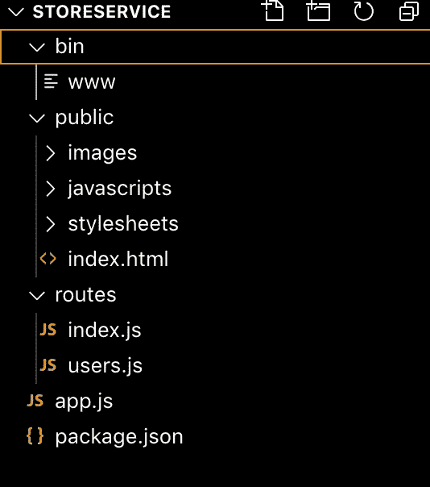

让我们对应用程序做一些更改。首先，我们将更改服务器正在监听的端口。

导航至`bin/www` *。*

改变这一点:

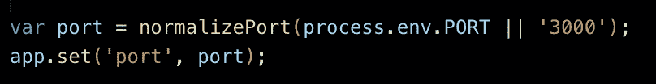

对此:

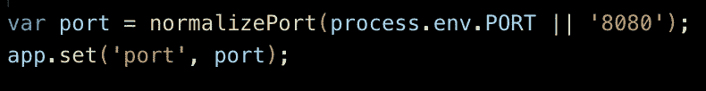

我们所做的只是将端口号从`3000`改为`8080`。

接下来，我们将编辑`/users` 路线的响应。导航到`routes/users.js`T21。

改变这一点:

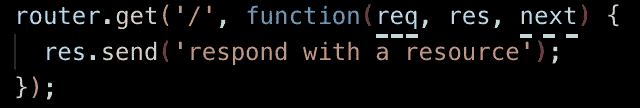

对此:

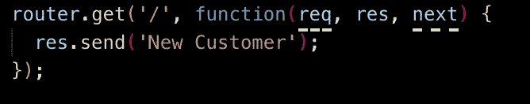

现在，运行您的服务器:

并在[邮差](https://www.getpostman.com/)上测试你的服务。

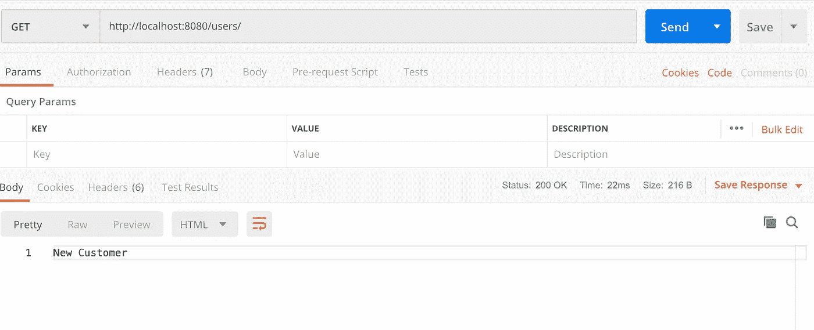

我们现在有一个工作服务！

# 第二步。创建 Docker 图像

首先，我们将向根目录添加一个 Dockerfile 文件。

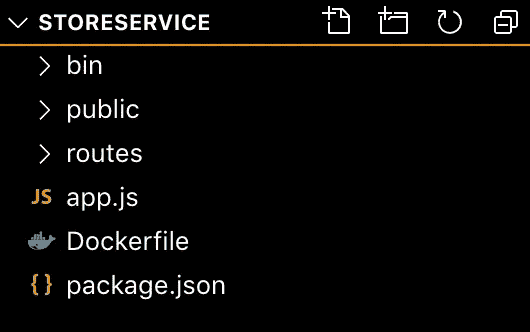

您的 docker 文件应该如下所示:

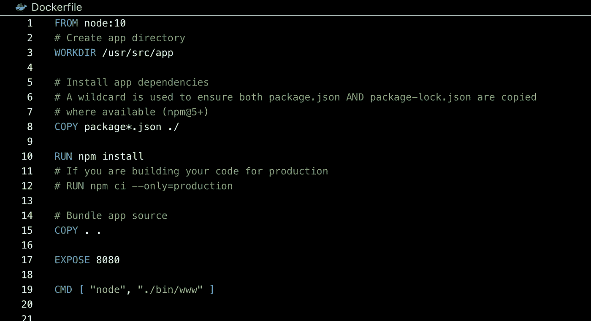

注意，`CMD [“node”, “./bin/www”]` 是运行应用程序的命令。如果您有不同的命令(如`node server.js` ) *，请更改该命令。*

接下来，在根目录下运行以下命令来构建并标记 Docker 映像。

您应该会得到这样的结果:

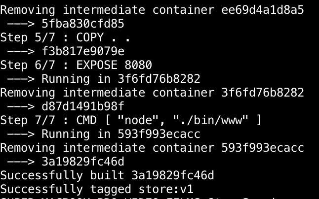

通过运行以下命令查看您的图像:

您应该能够看到构建图像的列表。

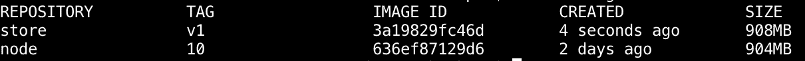

现在，让我们运行容器！

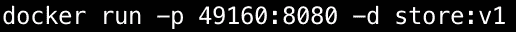

这里，我们将服务器端口`8080`映射到容器端口`49160`。

让我们在 Postman 上测试我们的容器:

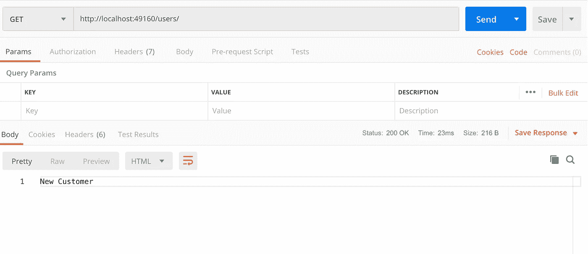

太好了！

现在我们正在与 Docker 容器中的服务进行通信！