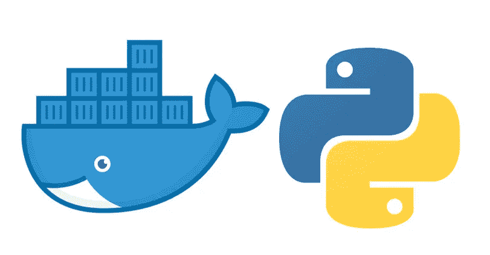

# 如何对你的烧瓶 API 进行分类

> 原文：<https://betterprogramming.pub/how-to-dockerize-your-flask-api-cc95843ab625>

## 探索如何通过几个非常简单的步骤对 Flask 应用程序进行 dockerize



docker + flask (python)

# 烧瓶是什么？

[Flask](https://flask.palletsprojects.com/en/2.1.x/) 是一个 Python 微型 web 框架，帮助你以一种快速简单的方式开发轻量级 web 应用和 API。

它基于 Werkzeg WSGI 工具包和 Jinja 2 模板引擎。

# Docker 是什么？

Docker 是一个使用容器来创建、部署和运行应用程序的工具。在本文中，我不会深入探讨容器的好处，因为这需要一些时间，所以我将只关注如何完成它。有关 docker 的更多信息，请点击[这里](https://docs.docker.com/get-started/overview/#:~:text=Docker%20is%20an%20open%20platform,ways%20you%20manage%20your%20applications.)。

# 项目结构

*我们假设我们有一个基本的工作瓶应用程序。*

无论你的应用程序结构是什么，我们都需要一个关于我们项目的文档。通常，我们把它放在根目录下，但这取决于你想如何设置。

就本文而言，让我们假设一个简单的设置，如下所示:

```
flaskapp
|---app.py
|---Dockerfile
|---requirements.txt
```

首先，让我们看看我们的`app.py`文件中的一个简单的 Flask 应用程序:

```
from flask import Flask
app = Flask(__name__)@app.route('/')
def hello_world():
    return 'Hello, we have Flask in a Docker container'if __name__ == "__main__":
    app.run(debug=True)
```

现在，我们的`requirements.txt`文件:

```
Flask==2.1.2
```

好的……现在主要的事情，docker 文件。

它将包含创建我们的形象所需的所有信息。让我们来看看:

```
FROM python:3.8-slim-busterWORKDIR /app*# We copy just the requirements.txt first to leverage Docker cache*
COPY ./requirements.txt /app/requirements.txtRUN pip install -r requirements.txtCOPY . /appENTRYPOINT **[** "python" **]**CMD **[** "app.py" **]**
```

让我们来看一下这些 Docker 指令:

1.  Docker 文件的第一行告诉 Docker 我们的新图像基于什么图像。为了简单起见，我们选择了`python:3.8-slim-buster`,但是我们可以基于任何其他东西，比如 Ubuntu。
2.  `WORKDIR`在 docker 映像中设置工作目录。以下所有指令都在这个目录中运行。
3.  `RUN`运行命令。在这种情况下，`pip install`我们的要求。
4.  `COPY`将文件从第一个参数复制到第二个参数。
5.  `ENTRYPOINT`配置容器作为可执行文件运行，只执行最后一条`ENTRYPOINT`指令。

# `Build the Image`

剩下的就是使用`docker build`来构建我们的图像。我们还将使用`— tag`标志来指定图像的名称。

从 docker 文件所在的目录中，运行以下命令:

```
docker build --tag my-app .
```

根据项目的大小和要求，此命令可能需要一些时间。

构建完成后，我们可以使用以下命令检查映像是否已创建:

```
docker image lsREPOSITORY      TAG       IMAGE ID       CREATED             SIZE
my-app          latest    ef514c013f1a   About an hour ago   812MB...
```

我们的图像应该和我们设置的标签一起出现在这里。

# 将映像作为容器运行

我们现在可以使用`docker run`命令将图像作为容器运行，并指定图像的名称。

我们还将传递两个标志:

1.  `-d`分离标志，表示我们希望 docker 以分离模式运行。
2.  `-p 5000:5000`端口标志告诉 docker 我们希望他公开并映射端口`5000`，这样我们的应用程序就可以从容器外部访问。

该命令应该如下所示:

```
docker run -d -p 5000:5000 my-app
```

就是这样！让我们试一试。

打开你的浏览器，点击`[http://localhost:5000](http://localhost:5000)`的 API。

您应该会看到`Hello, we have Flask in a Docker container`消息。

我们可以使用以下命令来查看哪些容器当前正在运行:

```
docker ps
```

要停止正在运行的容器，我们可以运行以下命令:

```
docker stop <container-name>
```

这优雅地停止了容器。一种更积极的阻止集装箱的方法是:

```
docker kill <container-name>
```

我们还可以重新启动、暂停和取消暂停容器:

```
docker restart <container-name>
docker pause <container-name>
docker unpause <container-name>
```

要查看容器的日志，我们可以使用:

```
docker logs <container-name>
```

就是这样！

感谢您花时间阅读这篇文章。

你可以在官方[文档](https://docs.docker.com/language/python/)中找到更多关于 Docker 和 Python 的信息。

谢谢！