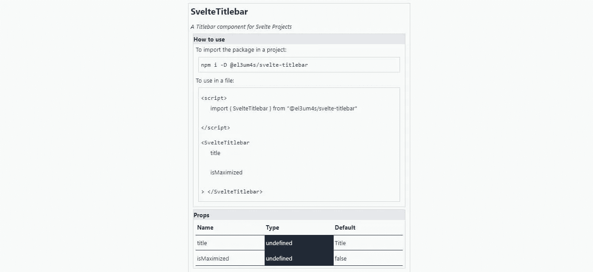

# 如何记录纤细的组件

> 原文：<https://betterprogramming.pub/how-to-document-svelte-components-ab504661a6fc>

## 创建编写自己的文档的组件


[西格蒙德](https://unsplash.com/@sigmund?utm_source=unsplash&utm_medium=referral&utm_content=creditCopyText)在 [Unsplash](https://unsplash.com/@sigmund?utm_source=unsplash&utm_medium=referral&utm_content=creditCopyText) 上拍照

在过去的两周里，我一直专注于如何快速为我的[苗条](https://svelte.dev/)组件创建文档。我不想重复我的经典错误:创建一些有趣的小东西，但却不能保持文档更新。我需要一种方法来编写并保持文档与代码同步。我试图找出如何让斯维特自己照顾它。我还没有完全成功，但我想我已经设定了大致的程序。

# 台阶

我调查了几条街，大部分都是死胡同。第一次尝试是使用[svelte . parse](https://svelte.dev/docs#svelte_parse)——这不符合我的目的。第二次尝试是尝试一些 JavaScript 解析器，从 [acorn](https://github.com/acornjs/acorn) 开始。水中的另一个洞:这些工具对我的目标来说太大了。因此，我必须集中精力从较低的水平开始。为了拥有苗条的自我记录，我必须:

读取尚未编译的细长组件，即原始的`.svelte`文件，并提取我需要的信息:

1.  `props`，以及它们的名称、类型和默认值
2.  可以执行的`actions`**；在这种情况下，如果名称不言自明，就足够了**
3.  **可以使用的插槽**和**名称**
4.  **还有，但我不完全确定，组件使用的 CSS 变量**
5.  **将这些信息保存在 JSON 文件中**
6.  **自动去做，这样你就不用去记了**
7.  **将此信息导入 Svelte**
8.  **使用特定组件读取信息并自动显示**

**因为关于组件的信息只在开发过程中改变，所以如果设置采取几个步骤就不成问题。如果一切都是自动化的，我可以专注于开发本身，而不用担心细节。**

# **总体结构**

**我决定将项目分成两个不同的存储库:**

**[](https://github.com/el3um4s/svelte-get-component-info) [## GitHub—El 3um 4s/svelte-get-component-info:一个提取道具信息的函数

### 一个函数，用于提取一个苗条文件的属性信息。旨在简化文档的创建…

github.com](https://github.com/el3um4s/svelte-get-component-info) 

管理与数据提取相关的部分

[](https://github.com/el3um4s/svelte-component-info) [## GitHub-El 3um 4s/svelte-component-info:显示有关 Svelte 属性的信息…

### 显示苗条组件的属性信息。旨在简化文档的创建— WIP…

github.com](https://github.com/el3um4s/svelte-component-info) 

为了简化各种属性的显示

这两个库还没有完成。我感兴趣的是记录我已经采取的步骤和将要采取的步骤。一旦项目足够成熟，我将把它集成到我的[苗条组件包启动](https://github.com/el3um4s/svelte-component-package-starter)模板中。

# 如何获得一个苗条组件的道具列表

获取一个瘦组件的属性列表的问题大致类似于在文本文件中查找一个单词的问题。它包括读取一个文件，提取其内容，然后通过提取我需要的片段来滚动浏览。

所以我首先创建一个函数来读取一个文件，并将其内容作为文本字符串返回:

我使用 NodeJS [readFileSync](https://nodejs.org/api/fs.html#fsreadfilesyncpath-options) API。获得文件内容后，我开始寻找我感兴趣的内容。为了提取组件的属性，我可以将搜索限制在[脚本块](https://svelte.dev/docs#script)中:

我使用 regex `/<script[\s\S]*?>[\s\S]*?<\/script>/gi`表达式和 [string.match(regex)](https://developer.mozilla.org/en-US/docs/Web/JavaScript/Reference/Global_Objects/String/match) 来获得一个字符串。我使用这个结果来查找组件导出的所有`let`变量，并将它们保存在一个数组中。我使用的正则表达式是`/export let [\s\S]*?;/gi`:

# 获取道具的属性

现在我可以开始查找道具的名称，再次使用正则表达式(`/(?<=let )(.*?)(?=\s|;|=|:)/`):

下一步是提取变量的类型。在本例中，我使用的正则表达式是`/(?<=let [:]|[:])(.*?)(?=;|=)/`:

获取变量的默认值更加复杂。我不能使用正则表达式，有太多可能的歧义情况。我可以使用一个技巧，这要感谢我在开始时做的一个选择，当时我把每个 let 变量保存为一个数组的元素。

这样，我可以将等号(`=`)和字符串的最后一个字符(应该是分号`;`)之间出现的所有内容视为默认值。

当默认值是字符串时，必须删除引号。为此，我使用了`isStringType`和`getStringWithoutQuote`函数:

# 用信息创建对象

现在我有了所有的碎片，我可以开始把它们组合在一起了。我写一个函数，得到`name`、`type`和`defaultValue`:

然后，我创建一个函数来读取文件，提取值，并将其作为对象返回:

# 苗条的部分

在提取了所有的值之后，我必须弄清楚如何显示它们。为了使事情更容易，我正在创建一个苗条的组件([El 3um 4s/Svelte-component-info](https://github.com/el3um4s/svelte-component-info))。我想要这样的东西:



第一件事是创建一个`SvelteInfo.svelte`组件，并决定我需要哪些道具:

我需要组件名、包名(自动插入代码以便从 npm 下载)，当然还有我使用前面创建的代码可以获得的所有信息。

使用这些信息，我可以自动创建一个解释如何将组件导入到项目中的部分:

以及如何使用该组件:

我还可以自动创建一个表格，其中包含关于道具的所有必要信息:

# 全部使用

现在我有了所有不同的部分，我可以把它们放在一起，使创建组件的文档更容易。我从已经创建的组件开始，并开始安装我需要的组件:

```
npm i @el3um4s/svelte-get-component-info @el3um4s/svelte-component-info
```

所以我创建了一个文件来管理`infoSvelteComponents.json`文件的创建，其中包含以下信息:

我通过添加几个脚本来更新`package.json`文件:

我通过导入`InfoSvelte.svelte`和 json 文件来编辑组件文档页面。然后我添加组件:

然后……没什么，就这样。只需导入组件和 JSON 文件，其他什么都不要做。从现在开始，每当我使用`npm run build`创建组件文档时，我将自动导入所有更新的信息。

正如我所说的，这两个库仍在开发中。我计划在接下来的几天里更新它们，但是现在我想把之前的各个步骤整理一下。

感谢阅读！敬请关注更多内容。

***不要错过我的下一篇文章—报名参加我的*** [***中邮箱列表***](https://medium.com/subscribe/@el3um4s)

[](https://el3um4s.medium.com/membership) [## 通过我的推荐链接加入 Medium—Samuele

### 阅读萨缪尔的每一个故事(以及媒体上成千上万的其他作家)。不是中等会员？在这里加入一块…

el3um4s.medium.com](https://el3um4s.medium.com/membership)**