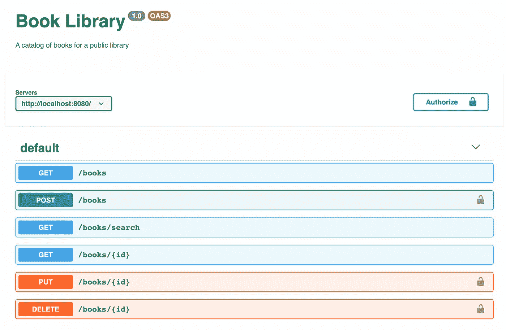
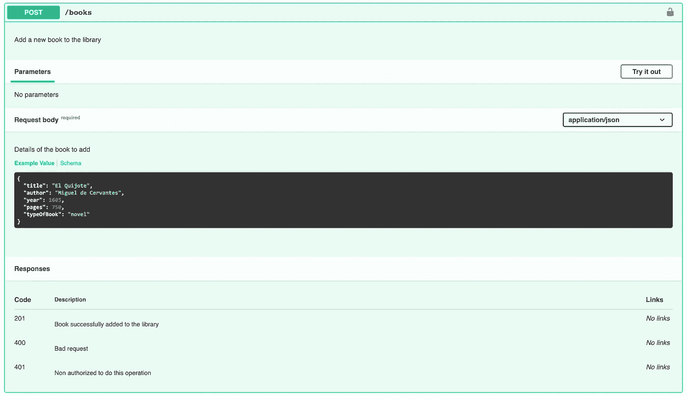
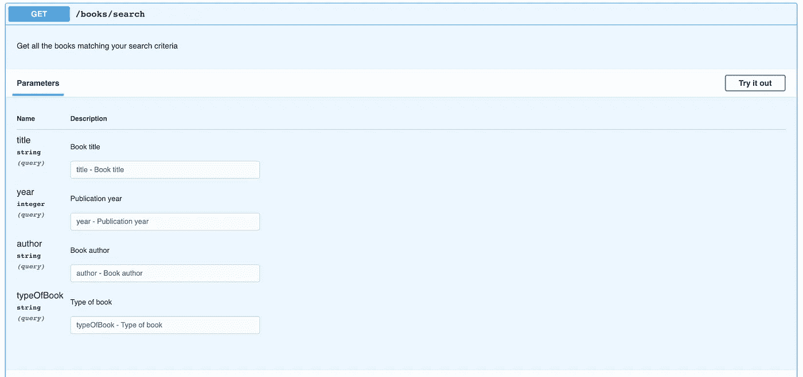

# 如何用 OpenAPI(又名 Swagger)记录 REST APIs

> 原文：<https://betterprogramming.pub/how-to-document-your-rest-api-with-openapi-aka-swagger-b0bcc118ebe7>

## 使用 OpenAPI 为您的 API 创建一流的文档

如果您是一名开发人员，您可能不止一次地使用过 REST API。如果您有，您可能会知道使用一个糟糕的文档化(或者更糟，没有文档化)的 API 是多么痛苦。由于这个原因，当我们设计 API 时，很重要的一点是做好文档记录。这样，您将使想要使用它的开发人员和您未来的自己的生活变得更加轻松。

记录 REST APIs 最流行的标准之一是 [OpenAPI](https://swagger.io/specification/) ，通常称为 Swagger，尽管它也是您用来创建和查看这些文档的工具的名称。OpenAPI 文档是用 JSON 或 YAML 编写的，描述了如何使用 API 公开的端点，以及其他细节，如认证机制。从这个文档中，可以生成用户友好的 HTML 文档，以及各种编程语言和框架中的客户机和服务器存根。

最棒的是，这一切都可以免费完成。今天，我将向您展示如何使用 YAML 风格的 OpenAPI 为图书图书馆编写一个虚拟 API。我们的库 API 将只提供基本的 CRUD 操作:

*   把所有能找到的书都拿来
*   `GET /books/{id}`:获取具有特定 ID 的书籍的详细信息
*   `GET /books/search`:获取所有符合搜索条件的书籍(书名、作者……)
*   `POST /books`:创建一本新书
*   `PUT /books/{id}`:用特定的 ID 更新图书的详细信息
*   `DELETE /books/{id}`:删除具有特定 ID 的图书

对于图书的创建、修改和删除，将需要一个 API 键。我们的`book`对象也将非常简单，具有以下属性:

*   `ID`:唯一标识符
*   `Title`
*   `Author`
*   `Year`(可选)
*   `Pages`(可选)
*   `TypeOfBook`(可选):可以是以下之一:小说、百科、漫画、传记、历史。

你准备好写你的第一个 OpenAPI 文档了吗？我们走吧！

# 关于 API 的基本信息

我们的 OpenAPI 文档应该从我们正在使用的 OpenAPI 规范的版本、关于 API 的基本信息以及服务器的位置开始。

大多数 REST APIs 需要某种类型的认证。在我们的例子中，我们将选择一个简单的 API 键，它将作为查询字符串发送给那些需要身份验证的操作(创建、修改和删除一本书):

# 数据模型(模式)的定义

现在我们来定义一下之前讲过的`Book`数据模型。正如我们所说，一本书应该有一个 id，一个标题和一个作者。可选地，它可以有出版年份、页数和书籍类型(小说、百科全书、漫画、传记或历史)。在`components`标签中，在与`securitySchemes`相同的层次上，我们可以定义我们的`Book`模式:

请注意，由于 ID 将由系统自动分配给新书，所以它没有按照要求进行设置，即使 API 返回的任何`Book`对象都有一个 ID。

# 端点的定义

## 获取/书籍

让我们从最简单的开始。唯一可能的响应是一个 HTTP 200，用一个 JSON 数组保存图书馆中所有可用的书籍，作为我们之前定义的`Book`模式的对象。

## 获取/books/{id}

如果我们只是想获得某本书的详细信息呢？在路径中定义一个参数`id`,然后添加一个 404 响应错误，以防没有具有所请求 ID 的图书:

## 获取/书籍/搜索

对于搜索端点，参数将是可选的，并将作为查询字符串发送。还要注意，我们不会定义 404 响应——因此，如果没有符合搜索条件的书籍，我们的 API 将简单地返回一个空的 JSON 数组:

## 邮件/书籍

当调用这个方法时，客户机将使用先前定义的`Book`模式，在 POST 请求体中以 JSON 对象的形式发送新书细节。由于这是一个`write`操作，用户将需要使用有效的 API 密钥进行认证，以执行该调用(标签`security`)。最后，回想一下现在是如何定义三种可能的响应代码的。

## PUT /books/{ *id* }

正如我们对`GET /books/{id}`端点所做的那样，这里我们从一个路径参数中获取要修改的图书的 id，并从请求体中获取新数据，如`POST /books`所示:

## 删除/books/{id}

与上一个示例相同，但没有请求体:

在本文中，我已经用一些非常简单的例子介绍了 OpenAPI 规范的基本方面。当然，OpenAPI 提供了更多的特性——我鼓励你阅读官方文档并在阅读完之后继续学习。我还想向您推荐一些使用 OpenAPI 的有趣工具:

*   [**OpenAPI (Swagger)编辑器**](https://marketplace.visualstudio.com/items?itemName=42Crunch.vscode-openapi) 对 [Visual Studio 代码的扩展](http://code.visualstudio.com):它审查你的 OpenAPI 代码，提出建议，允许你预览它在 Swagger UI 中的样子…
*   **:Swagger UI 可以在云上免费获得，也可以下载到你的计算机上，Swagger UI 会将你的 JSON 或 YAML 代码转换成非常友好的 HTML 文档，你甚至可以从中试用 API。**
*   **[**Swagger Codegen**](https://swagger.io/tools/swagger-codegen/):这个工具可以把你的 OpenAPI 文档转换成各种编程语言和框架下的服务器端和客户端的存根(skeleton)。**

**我还想与你分享[我们通过这篇文章创建的完整 OpenAPI 文档](https://gist.github.com/gbarreiro/9c40f219b4e832dabd690f4a9a0205be)，并展示它在 Swagger UI 中的样子:**

****

**关于 API、服务器列表、认证按钮和端点列表的基本信息**

****

**POST /books 端点**

****

**GET /books/search 端点**