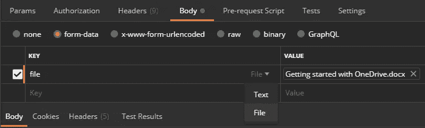
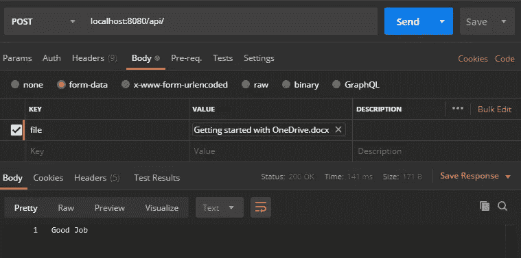
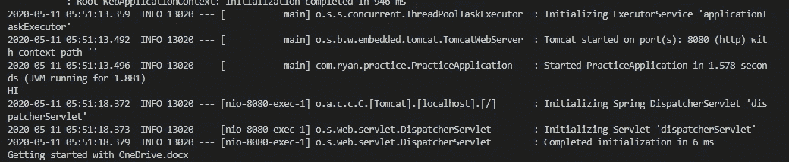

# 如何从 REST API Post 请求上传文件附件

> 原文：<https://betterprogramming.pub/how-to-download-a-file-attachment-from-a-rest-api-post-request-27d53e3de17c>

## 提示:在 Java 代码中使用多部分格式数据

照片由[德鲁·法威尔](https://unsplash.com/@outdoor_junkiez?utm_source=unsplash&utm_medium=referral&utm_content=creditCopyText)在 [Unsplash](https://unsplash.com/s/photos/send?utm_source=unsplash&utm_medium=referral&utm_content=creditCopyText) 上拍摄

在花了数小时寻找从 API POST 请求中下载文件附件的方法后，我终于将不同堆栈溢出和博客帖子的零碎内容放在一起，让它正常工作。

这应该没那么难。老实说，不是的。

我在我的 Spring 项目中使用了这个，但是在其他类型的 Java 项目中，逻辑仍然是相同的。

我还将向您展示如何使用 Postman 测试端点。

# 目标

目标是下载从 API POST 请求发送的文件附件。

如果您想跟进，我建议使用以下工具:

*   代码编辑器/IDE 的 [Visual Studio 代码](https://code.visualstudio.com/)、 [IntelliJ](https://www.jetbrains.com/idea/) 或 [Eclipse](https://www.eclipse.org/ide/)
*   [邮递员](https://www.postman.com/)

# 创建您的 REST 端点

我们首先要设置我们的 REST 端点。这是一个简单的`PostMapping`，它将驻留在我们的`Controller.java`类中。

我们来说说这堂课的每一句台词。

*   第 21 行:返回类型将是一个`ResponseEntity`。这可以是任何东西。我希望看到成功的请求返回一个带有`200`状态代码的“好样的”。
*   第 21 行(续)):`@RequestPart(“file”)`负责我们的表单数据体。“文件”是我们在发送请求时用于文件的标签。在使用 Postman 进行测试时，您将会看到这一点。
*   第 21 行(续)):`MultipartFile`是在多部分请求中接收的上传文件的表示。这是我们将用于文件的数据类型。
*   第 22–23 行:如果文件没有被正确读取(意味着它是`null`)，我们应该返回一个`HttpStatus.BAD_REQUEST`。
*   第 25 行:我们将把它包装在一个`try-catch`块中，因为有些方法会抛出一个`IOException`。这是我们处理这些异常的方式。
*   第 26 行:这一行是关键。我们将把文件的内容存储在一个字节数组中。为了从原始文件中检索这些字节，我们使用了`getBytes()`方法。
*   第 27 行:要找到存储在内存中或临时存储在磁盘上的文件，我们需要指定文件名。`Path`对象帮助我们实现这一点。
*   第 28 行:接下来，我们将把文件写到我们指定的位置。你可以把它放在任何你想放的地方以备将来使用。
*   第 29 行:只是一个简单的控制台输出来验证我们正在读取正确的文件。
*   第 30–32 行:如果 I/O 有问题，这些行处理`IOException`。
*   第 33 行:在一个成功的请求上返回“好样的”。

# 使用邮递员测试

我们现在将向端点发送一个文件附件。

这个请求将是一个发送到`localhost:8080/api`的`POST`请求，它只是我们的本地服务器。

要附加文件，必须将其作为表单数据包含在正文中。

一旦进入正文→表单数据字段，您必须输入一个`KEY`。这应该是“文件”或您在`@RequestPart(“[value]”)`中指定的任何值。

完成后，会出现一个下拉菜单，让您选择文本或文件。选择“文件”选项。

然后点击发送。下面是整个请求和响应的样子。

在 Spring 端，您会看到文件名打印到我们的控制台，如下所示:

正如您在最后一行看到的，我的文件名是`Getting started with OneDrive.docx`。

这就是全部了。就这么简单。

如果您有任何问题、意见或顾虑，请随时回复。