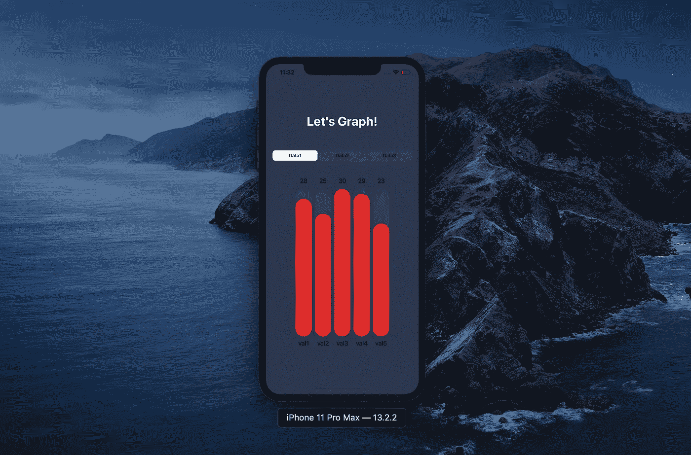
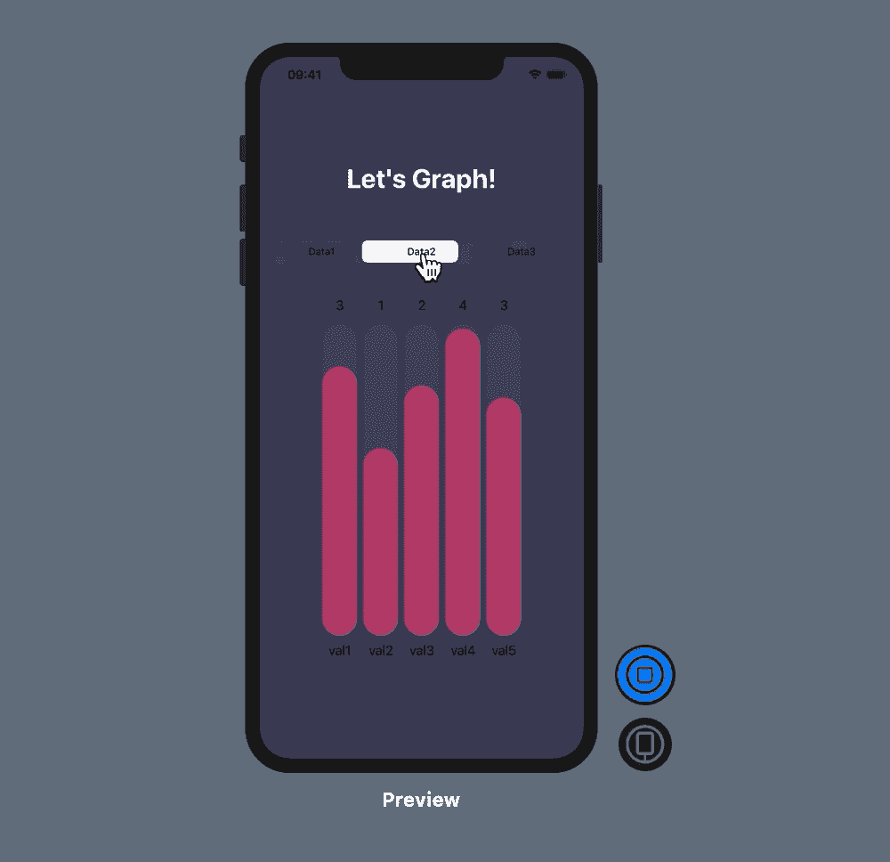

# 如何在 SwiftUI 中绘制漂亮的动画图形—第 3 部分

> 原文：<https://betterprogramming.pub/how-to-draw-beautifully-animated-graphs-in-swiftui-part-1-9f8c26011071>

## 添加背景并组成最终视图



对于我们项目的最后一部分，我们需要添加一些数据来控制每个背景和每个`CapsuleBar`的颜色。

添加这两个包含每个数据集颜色的数组:

```
**private** **var** dataBackgroundColor: [String: ColorRGB] = [
    "Data1": ColorRGB(red: 44 / 255, green: 54 / 255, blue: 79 / 255),
    "Data2": ColorRGB(red: 76 / 255, green: 61 / 255, blue: 89 / 255),
    "Data3": ColorRGB(red: 56 / 255, green: 24 / 255, blue: 47 / 255)
]**private** **var** dataBarColor: [String: ColorRGB] = [
    "Data1": ColorRGB(red: 222 / 255, green: 44 / 255, blue: 41 / 255),
    "Data2": ColorRGB(red: 42 / 255, green: 74 / 255, blue: 150 / 255),
    "Data3": ColorRGB(red: 47 / 255, green: 57 / 255, blue: 77 / 255)
]
```

现在我们有了颜色，我们需要给我们的主视图添加一个背景。

将我们之前的视图封装在`ContentView`、**、**的`body`变量中的`ZStack`中，这样我们就可以将我们的颜色放在背景中:

```
**var** body: **some** View {
    ZStack {
        Color(.sRGB,
              red: **self**.dataBackgroundColor[dataPicker]!.red,
              green: **self**.dataBackgroundColor[dataPicker]!.green,
              blue: **self**.dataBackgroundColor[dataPicker]!.blue
        ).edgesIgnoringSafeArea(.all)
        .animation(.default) VStack {
            Text("Let's Graph!")
                .foregroundColor(.white)
                .font(.largeTitle)
                .fontWeight(.bold)
                .padding() Picker("", selection: $dataPicker) {
                 Text("Data1").tag("Data1")
                 Text("Data2").tag("Data2")
                 Text("Data3").tag("Data3")
             }.pickerStyle(SegmentedPickerStyle())
             .padding()
        }
    }
}
```

我们现在只是缺少图形，我们将通过添加`CapsuleGraphView`到我们的`ContentView` `VStack`来创建它:

```
VStack {
    Text("Let's Graph!")
        .foregroundColor(.white)
        .font(.largeTitle)
        .fontWeight(.bold)
        .padding()

    Picker("", selection: $dataPicker) {
         Text("Data1").tag("Data1")
         Text("Data2").tag("Data2")
         Text("Data3").tag("Data3")
    }.pickerStyle(SegmentedPickerStyle())
    .padding() CapsuleGraphView(data: data[dataPicker]!, maxValueInData: data[dataPicker]!.max()!, spacing: 24, capsuleColor: dataBarColor[dataPicker]!)}
```

如您所见，我们将数据传递给`CapsuleGraphView`来显示它们。

您现在就可以试用我们的图表！按实时预览上的播放，开始享受。

