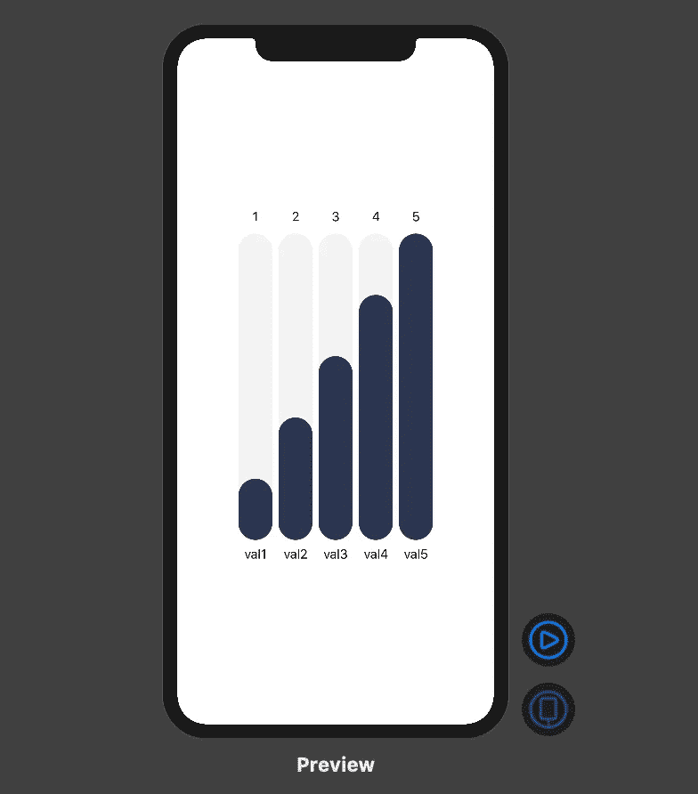

# 如何在 SwiftUI 中绘制漂亮的动画图形—第 2 部分

> 原文：<https://betterprogramming.pub/how-to-draw-beautifully-animated-graphs-in-swiftui-part-2-597d7e1ef79e>

## 通过重用我们在上一篇文章中创建的**胶囊栏**来组合**胶囊图视图**


让我们继续第 1 部分的条形图项目。

首先，创建一个新的结构，并将其命名为`CapsuleGraphView`:

```
struct CapsuleGraphView: View { var data: [Int]
    var maxValueInData: Int
    var spacing: CGFloat
    var capsuleColor: ColorRGB var body: some View { Text("Hello") }}
```

在初始设置中，我们创建了:

*   一个`data` 变量，它将是我们要显示的值的数组；
*   `maxValueInData`，用数组中的 max 值来设置填充的最大高度值；
*   `spacing`、**、**用于间隔图形；
*   和`capsuleColor`，用于为每个胶囊分配一种颜色。

现在，我们将实现图形本身。为此，我们需要一个`GeometryReader`来正确检索显示尺寸，一个`HStack`来水平对齐胶囊:

```
struct CapsuleGraphView: View { var data: [Int]
    var maxValueInData: Int
    var spacing: CGFloat
    var capsuleColor: ColorRGB

    var body: some View { GeometryReader { geometry in HStack { CapsuleBar(value: self.data[0], 
                           maxValue: self.maxValueInData, 
                           width: (CGFloat(geometry.size.width) - 8          * self.spacing) / CGFloat(self.data.count), 
                           valueName: "val1", 
                           capsuleColor: self.capsuleColor
                 ) CapsuleBar(value: self.data[1], 
                           maxValue: self.maxValueInData, 
                           width: (CGFloat(geometry.size.width) - 8 * self.spacing) / CGFloat(self.data.count), 
                           valueName: "val2", 
                           capsuleColor: self.capsuleColor
                 ) CapsuleBar(value: self.data[2], 
                           maxValue: self.maxValueInData, 
                           width: (CGFloat(geometry.size.width) - 8 * self.spacing) / CGFloat(self.data.count), 
                           valueName: "val3", 
                           capsuleColor: self.capsuleColor
                 ) CapsuleBar(value: self.data[3], 
                           maxValue: self.maxValueInData, 
                           width: (CGFloat(geometry.size.width) - 8 * self.spacing) / CGFloat(self.data.count), 
                           valueName: "val4", 
                           capsuleColor: self.capsuleColor
                 ) CapsuleBar(value: self.data[4], 
                           maxValue: self.maxValueInData, 
                           width: (CGFloat(geometry.size.width) - 8 * self.spacing) / CGFloat(self.data.count), 
                           valueName: "val5", 
                           capsuleColor: self.capsuleColor
                 ) } }.frame(height: 500)
}
```

不幸的是，我们不能在这里使用`ForEach`来按照我们想要的方式制作胶囊动画(希望这只是一个 bug)，所以我们必须在`HStack`中硬编码`CapsuleBar` 组件五次。

我已经设置了框架，这样图表就不会一直垂直延伸，但是如果你想让它更高，你可以取消这个限制。

仅此而已！现在，当我们预览代码时，应该会看到类似这样的内容:

```
**struct** ContentView_Previews: PreviewProvider {
    **static** **var** previews: **some** View {
    CapsuleGraphView(data: [1, 2, 3, 4, 5],
                     maxValueInData: 5,
                     spacing: 24,
                     capsuleColor: ColorRGB(red: 44 / 255, green: 54 / 255, blue: 79 / 255)) }}
```



在第 3 部分中，我们将在选择一个分段的选取器项目时，组合我们的视图并动画显示背景和图形。那里见！