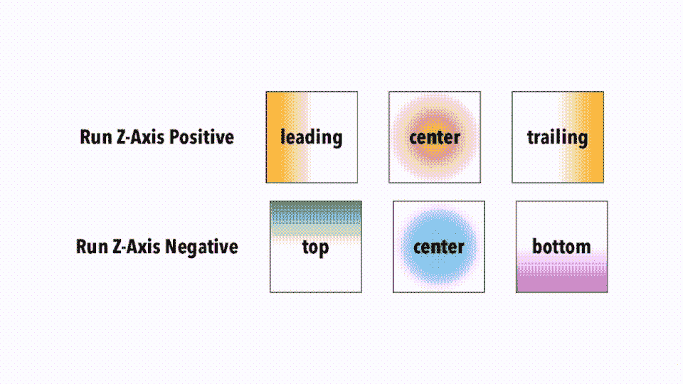
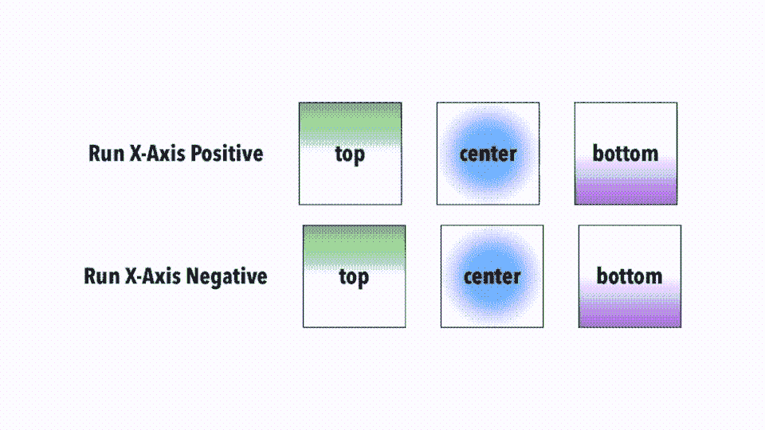
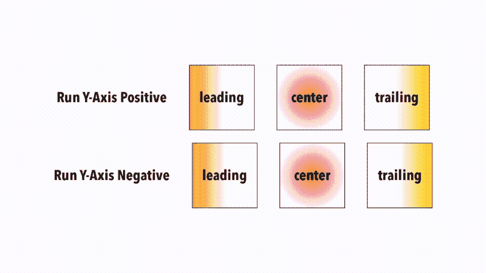
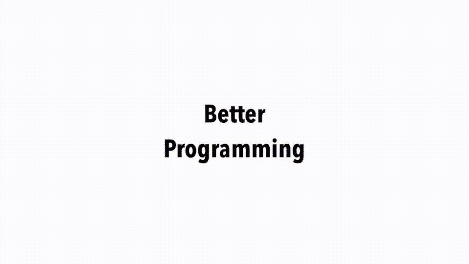
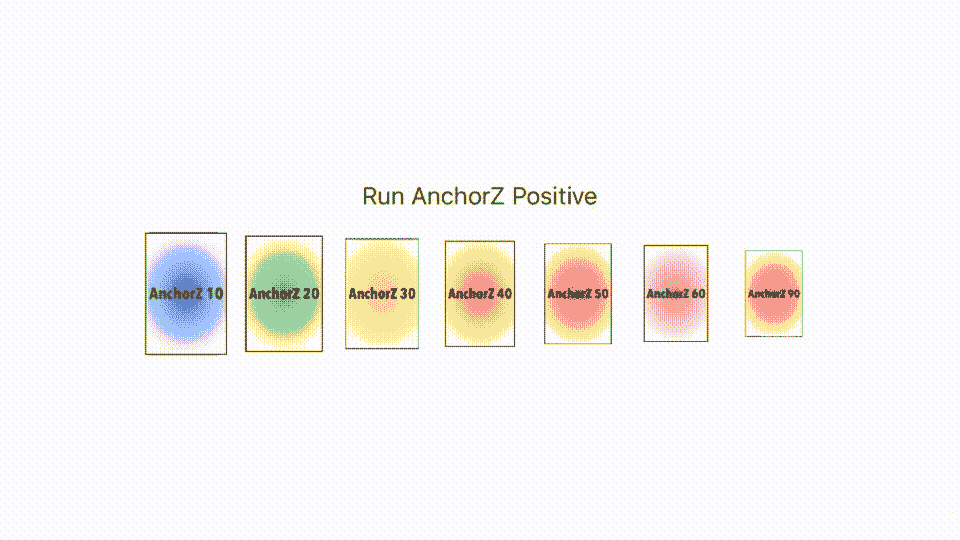
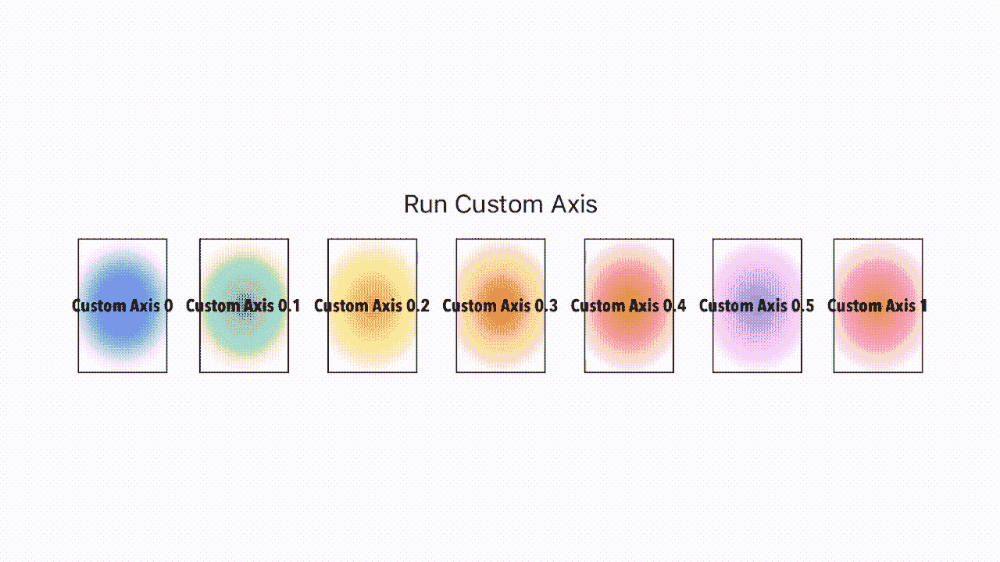
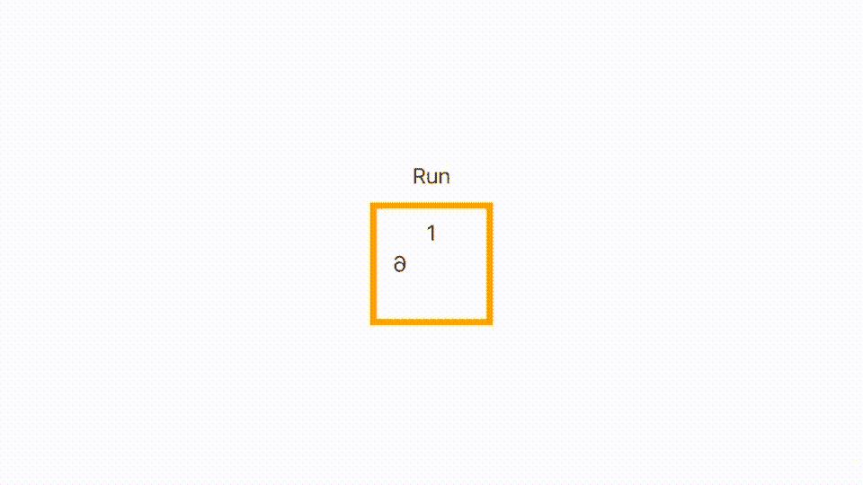

# 如何使用 SwiftUI 进行 3D 绘图

> 原文：<https://betterprogramming.pub/how-to-draw-in-3d-with-swiftui-7989cfcd35fc>

## 使用原生 SwiftUI 代码在 3D 中绘图


照片由[марьянблан| @ marjanblan](https://unsplash.com/@marjan_blan?utm_source=medium&utm_medium=referral)在 [Unsplash](https://unsplash.com?utm_source=medium&utm_medium=referral) 上拍摄。

在我四月份发表的一篇文章中，我使用 SwiftUI 中的`rotate`标签来旋转多米诺骨牌。所讨论的标签可以被认为是一个方便的选项。我这么说是因为有一种更先进的技术可以给你更多的控制。

前两个元素——移动的角度和要旋转对象的轴——与便捷版本完全相同。但是在高级方法中，您可以使用另外三个变量。因此，这个标签是 SwiftUI 军械库中最复杂的标签之一。希望这种复杂性会随着你的阅读而消失。

先说主播。这基本上决定了你想在哪一边旋转。锚的效果与你旋转的轴紧密相连。



绕 Z 轴旋转 360 度。

在上面的例子中，我改变了 360 度的旋转角度，最初是在 Z 轴上。下面是幕后的代码(注意，这个要点是为下面的部分准备的):

你可以清楚地看到上面代码中的`rotation3DEffect`标签，我制作动画的唯一变量是`pivotDegree`。下面是运行中的代码，它使绿色、蓝色和紫色的盒子转动:



绕 X 轴旋转 360 度。

当然，你也可以在 Y 轴上旋转。下一个例子正好说明了这一点:



绕 Y 轴旋转 360 度。

现在我没有提到它，但我们确实在这里也使用/设置了透视，设置为 0.5。它控制摆动的幅度。数字越高，摆动幅度越大。下面是一张 GIF 图，展示了 1.2 的视角和一些至理名言:



透视设置为 4 的每个文本对象的旋转。

注意:当我们转过 90 度时，它消失了。我们稍后会用到它。

这给我们带来了最具挑战性的变量:T3。将运行下面动画的代码设置为值 10、20、30、40、50、60 和 90。我选择这些值是因为它们符合我正在移动的矩形的大小。`anchorZ`控制你旋转的直径的中心点。你可以最清楚地看到最末端的红色/粉色方块的效果，它拉向后面，然后向前摆动到前面。



在 Z 锚上旋转 360 度。

事实上，我只是把事情简化了一点点。你看，我使用的锚值是类型`UnitPoint`。预置很少，但是您可以混合和匹配自己的组合，以获得一些非常酷的效果:

```
@State var anchorPView: UnitPoint = UnitPoint(x: 0, y: 0)
```



围绕自定义轴旋转 360 度。

这些值有点奇怪，因为我们在 X 轴上旋转并改变了`UnitPoint`变量中的 Y 值。这里的值 0 实际上是一个`UnitPoint.top`，值 1 是一个`UnitPoint.bottom`。其他值介于两者之间。就度数而言，我们正在 360 度旋转，所以是一个完整的圆。请注意，它看起来与前面的示例非常相似。它使用透视，但值只有 0.5。我们在动画结尾的卡片在队伍中前后摆动。

这是这段代码的一部分:

请注意，事情可能会变得混乱，因为许多属性是相互关联的。所以如果你不小心改变了两个相反的变量，它们会互相抵消，看起来你什么都没改变。

我们在 SwiftUI 中讨论了很多关于 3D 旋转的基础知识，但是关于一个物体呢？

让我们专注于建立一个立方体。它有六个方面，尽管为了简单起见，我只担心其中的四个方面。我们的两条边将从 90 度开始，使它们不可见，我们的两条边将处于 0 度(因此面朝上)。当我们旋转物体时，我们需要在两个面上使用偏移来保持所有的东西在一起。为了帮助我们获得正确的旋转，我们使用至少 0.5 的透视值，这样我们就可以在旋转时看到我们是否获得了正确的旋转。如果我们在每个面上添加一行文字，这样我们就可以知道它在转动时向哪个方向翻转，这也很有帮助。有时候，这并不明显。最后，我们使用不透明度，因为我们建立它来掩盖脸是好的。在最后使用不透明度，让你的正面和背面看起来正确。把视角也缩小到最小。否则，根本行不通。

请记住，正如我之前所说的，许多参数是相互影响的，所以在前进时要小心，不要一次更改多个参数。

遵循这些规则，很快你就会发现自己正在看一个像这样的立方体——一个你可以留下来作为线框或者添加皮肤的立方体。



使用 SwiftUI 旋转立方体。

下面是这个 GIF 的代码:

正如我所说，一旦建成，你可以添加一个皮肤和一些微妙的阴影。现在你有了:SwiftUI 中的一个 3D 对象。

