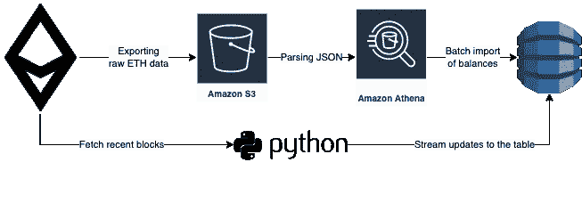
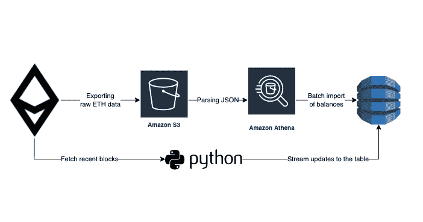

# 如何将以太坊区块链的完整历史输出到 S3

> 原文：<https://betterprogramming.pub/how-to-dump-full-ethereum-history-to-s3-296fb3ad175>

## 使用公共以太坊节点或公共 BigQuery 数据集


照片由 [Unsplash](https://unsplash.com?utm_source=medium&utm_medium=referral) 上的 GuerrillaBuzz Crypto PR 拍摄

如果你来这里只是为了一个简单的指南，这里有一些主要的要点:

*   **理想情况下，运行自己的节点**。以太坊节点的实现有很好的同步设施，所以让节点先和一个区块链同步，然后通过一个 IPC 接口使用 JSON RPC API 直接从节点卸载数据。
*   或者，使用[一个公共节点提供者](https://ethereumnodes.com/)。它们中的大多数不需要任何身份验证，因此请求将像`curl -XPOST [https://cloudflare-eth.com/](https://cloudflare-eth.com/) -d '{"method":"eth_blockNumber", "params": [], "id": 1, "jsonrpc": "2.0"}'`一样简单
*   遵循 KISS(“保持简单，愚蠢”)原则:**简单地从 0 到`eth.block_number`(当前最新块)循环通过块**。首先，取出`hydrated`参数设置为`true`的块。这将包括块响应中的交易数据。如果你需要日志(比如提取 ERC-20 `Transfer`事件)，也要获取收据(每笔交易一张)。收据包括日志。
    基本管道相当简单:



从以太坊节点到面向客户的 DynamoDB 表的批处理和实时获取

*   **使用批处理请求**:将一组请求作为有效负载发送给 JSON RPC API。例子:`[{"method":"eth_getBlockByNumber","params":["0x1",true],…},{"method":…},…]`。在批量响应中，您将获得一系列单独的响应。重要提示:规格不能保证响应**顺序**。
*   并行化批处理请求:**运行异步或多线程**。
*   作为最佳数据工程实践:转储原始数据而不进行转换(以 JSON 这样的原始格式)。例如，您可以将其存储在 S3(块+交易+收据+日志现在总计约为 4.5TB)。这将允许您基于整个历史重新运行任何计算，而无需再次接触 JSON RPC API。
*   使用这些方法的组合没有花费我们任何额外的成本(除了 EC2 实例的几个小时),并且花费了 **10 天来导出**完整的历史。在 S3 托管一个未压缩的 JSON 数据集每月花费 110 美元。
*   为了快速初始化您的数据湖，您可以使用[公共 BigQuery 数据集和以太坊数据](https://console.cloud.google.com/bigquery(cameo:product/ethereum/crypto-ethereum-blockchain))。这种方法花费了我们大约 100 美元，并且花费了大约 **24 小时来导出**数据块、交易和令牌传输数据集。

本文的其余部分将详细介绍上述内容。

🎞更喜欢看视频？在 YouTube 上观看我的演讲，获得这篇文章的快速摘要。或者看[我的转录](https://medium.com/@bryzgaloff/ethereum-data-analysis-and-integration-youtube-talk-transcription-3a9b45c7ed2f)看带幻灯片的视频。或者甚至是一个超级简短的摘要(2 分钟阅读)[在这里可以得到](https://blockchain.works-hub.com/learn/how-to-export-a-full-ethereum-history-into-s3-efficiently-f37df)。

# 里面是什么？

下面是这篇文章的简要计划:

*   目标和需求:为什么我们决定导出这些数据？
*   从 BigQuery 公共数据集中导出数据:这是个好主意吗？如何高效的做到？这要花多少钱？
*   天真的方法——从一个节点获取以太坊数据:完全同步需要多长时间？托管结果数据集的成本是多少？
*   低延迟服务令牌平衡:如何实现？如何在 Athena 中处理 uint256？
*   正在进行的以太坊更新:实时获取最近的块。
*   我们的方法的架构的当前状态，带有图表可视化。

# 为什么我们需要区块链以太坊的全部历史？

在 CoinStats.app 中，我们构建了一个高级加密组合管理器。除了余额跟踪和交易列表等标准功能，我们还帮助用户搜索新的代币进行投资。

然而，代币余额跟踪仍然是我们的核心功能。最初，我们一直依赖各种第三方服务。但是他们有几个缺点:

*   往往不准确/不完整，
*   从最近的街区落后很多，
*   和/或不允许在单个请求中检索钱包的所有代币余额。

总的来说，这导致了以下一组要求:

*   该解决方案必须尽可能少地滞后于区块链
*   提供 100%精确的天平
*   并返回一个完整的钱包组合在一个单一的回应
*   此外，为了进一步扩展我们基于分析的产品功能，该解决方案必须在区块链数据的基础上提供 SQL 接口
*   我们不能运行自己的以太坊节点。

是的，我知道，最后一个要求是有争议的。但是，我加入的团队已经有过维护一个节点的不愉快经历。他们坚持使用节点提供商。所以，现在让我们把它当作一个不可协商的要求。

总的来说，我们的目标是(1)将区块链交易和收据的完整历史导出到低成本存储(AWS S3)，(2)附加一个 SQL 引擎(AWS Athena)，以及(3)在*实时*应用中使用它，如余额跟踪。

# 现有解决方案

我们希望加快新数据平台 MVP 版本的发布，因此我们决定寻找现有的解决方案。现在最耀眼的是[以太坊 ETL](https://github.com/blockchain-etl/ethereum-etl) 。它是一个开源(托管在 GitHub 上)工具集，用于导出区块链数据(主要是以太坊)。

事实上，`ethereum-etl` repository 是一个更大的[区块链 ETL](https://github.com/blockchain-etl/) 的核心部分——一系列将区块链数据导出到各种数据目的地的解决方案，从 [Postgres](http://ethereum-etl-postgres) 到 [BigQuery 和 PubSub+Dataflow](https://github.com/blockchain-etl/bigquery-to-pubsub) 。甚至有一个特殊的库[使所有的脚本适应气流 Dag。](https://github.com/blockchain-etl/ethereum-etl-airflow)

一个令人惊讶的事实是，Google [托管着具有完整以太坊历史的公共 BigQuery 数据集](https://github.com/blockchain-etl/public-datasets)，这些数据集是使用以太坊 ETL 项目收集的。在 BigQuery 控制台上亲自查看它们[。重要提示:即使数据集是公开的，你(作为谷歌云用户)也要为查询它们付费。所以，如果你不想破产，就不要做`SELECT *`😅](https://console.cloud.google.com/bigquery(cameo:product/ethereum/crypto-ethereum-blockchain))

然而，以太坊 ETL 有一些缺点:

*   它是高度面向谷歌云的。存储库对 AWS 有一些支持，但是它们看起来维护得很差。我贡献的动力支持已经过期几个月了。而对于数据相关的项目，我更喜欢 AWS。
*   解决方案在创作的时候用文章([一个](https://evgemedvedev.medium.com/exporting-and-analyzing-ethereum-blockchain-f5353414a94e)、[两个](https://cloud.google.com/blog/products/data-analytics/ethereum-bigquery-how-we-built-dataset)、[三个](https://medium.com/coinmonks/how-to-export-the-entire-ethereum-blockchain-to-csv-in-2-hours-for-10-69fef511e9a2)、…)覆盖的很好，现在看起来很过时。Airflow 版本非常旧，数据模式(尤其是 AWS Athena)与实际的导出格式不同步。
*   以太坊 ETL 不保留数据的原始格式。它在摄取时进行了太多的转换。因此，它是一个 ETL(提取-转换-加载)解决方案，而现代的方法是 ELT(提取-加载-转换)。CoinStats.app 用于最佳实践

# 我们是如何开始的:将 BigQuery 卸载到 S3

反正以太坊 ETL 已经为我们自己主动打下了很好的基础。通过请求 public node 的 JSON RPC API 天真地获取原始数据需要一个多星期才能完成。因此，我们决定使用 BigQuery 来初始化我们的 S3 存储桶。

简而言之，我们将执行以下步骤:将 BigQuery 表导出到 Google 云存储(gzipped Parquet 格式)，使用`gsutil rsync`将其复制到 S3，然后在 Athena 中查询这些数据。

下面你会找到如何做到这一点的详细说明。

## 1.在 BigQuery 上发现公共以太坊数据集

在谷歌云平台打开 [BigQuery 控制台。在数据集搜索字段(左侧)中输入`crypto_ethereum`或`bigquery-public-data`，然后点击“扩大搜索范围”。](https://console.cloud.google.com/bigquery)

**❕你必须有一个付费的 GCP 账户**(配置了账单明细)才能发现公共数据集:否则搜索结果将是空的。您*尚未支付任何费用*，但是如果没有配置好的账单，您将一无所获。

为了进一步方便导航，我建议您找到后锁定`bigquery-public-data`项目。

## 2.将表格导出到 Google 云存储

选择任意表格，例如`blocks`。要导出完整的表格，请单击右上角的“导出”并选择“导出到 GCS”。

您可以导出特定查询的结果，而不是导出整个表:每个查询都会生成一个新的临时表(显示在底部“个人历史”中的作业详细信息中)。执行后，单击作业详细信息中的临时表名，并将其导出为普通表。这对于过滤掉大型表格中的一些不必要的数据非常有用(例如`logs`或`traces`)。不要忘记在查询设置中选中“允许大结果”。否则，您将只能看到数据样本(≈128MB)。

**注意**:如果你*在一个公共数据集上运行一个查询*，那么*你*作为一个 GCP 用户为其付费(参见 [BQ 分析定价](https://cloud.google.com/bigquery/pricing#on_demand_pricing))。导出一个完整的表格是免费的(详见下文)。

对于导出，选择任何 GCS 位置。随意使用默认设置创建一个新的 bucket(标准存储对于我们的用例来说是最便宜的)。您可以在数据复制到 S3 后立即删除该时段(这是下一步)。

唯一重要的 GCS 配置选项是 region:“选择与您的目标 S3 存储桶相同的区域”。在这种情况下，你的转移成本和速度将是最佳的。

`Export format = Parquet. Compression = GZIP` **。**这种组合提供了最佳的压缩率，因此它将加速从 GCS 到 S3 的数据传输。

⏱通常，这项工作在 **≈30 秒**内完成(参见底部“个人历史”中的工作进度)。

导出作业每天免费高达 50TB(参见 [BQ 定价](https://cloud.google.com/bigquery/pricing))，而总`crypto_ethereum`大小为< 10TB。

您只需为廉价的 GCS 存储每月支付 0.02 美元。数据是压缩的(`blocks`截至 2022 年 8 月约为 65 GB)，存储时间不会超过几天，因此**这将花费你< $5** 。

## 3.将数据从 GCS 复制到 S3

一旦 BQ 导出作业完成，您可以将数据导出到 S3。这可以使用方便的 CLI 实用程序`[gsutil](https://cloud.google.com/storage/docs/gsutil)`来完成。要设置它:

1.  创建一个 EC2 实例。选择实例大小时，考虑 [EC2 网络吞吐量限制](https://docs.aws.amazon.com/AWSEC2/latest/UserGuide/ec2-instance-network-bandwidth.html)。理想情况下，**选择与 GCS 和 S3 存储桶相同的区域**。
2.  [遵循`gsutil`的安装说明](https://cloud.google.com/storage/docs/gsutil_install)。
3.  运行`gsutil init`来配置 GCS 凭证。
4.  用 AWS 凭证填充`~/.boto`配置文件:只需将`aws_access_key_id` 和`aws_secret_access_key`设置为适当的值。对于 AWS，拥有 S3 多部分上传和列表桶权限的用户就足够了。当然，为了简单起见，您可以使用您的个人 AWS 密钥，但我不应该告诉您…相关文档: [Boto 配置参考](https://cloud.google.com/storage/docs/boto-gsutil#config-file-structure)，[管理 IAM 访问密钥](https://docs.aws.amazon.com/IAM/latest/UserGuide/id_credentials_access-keys.html)。
5.  如果还没有，创建一个 S3 存储桶。为了加速传输，你必须**在与 GCS 桶**相同的区域创建 S3 桶。
6.  要复制文件，请使用`gsutil rsync -m`。`-m`选项通过在多线程模式下运行传输作业来实现传输作业的并行化。

我们使用单个`m5a.xlarge` EC2 实例来传输数据。这不是最佳方式:EC2 有[带宽限制](https://docs.aws.amazon.com/AWSEC2/latest/UserGuide/ec2-instance-network-bandwidth.html)和难以预测的“突发”网络吞吐量。我们已经考虑过使用 AWS 数据同步服务的[:然而，它也依赖 EC2 虚拟机(你必须自己部署一个代理)，所以我不期望与`gsutil rsync`相比有很大的好处，除非你选择一个更大的实例。](https://aws.amazon.com/ru/blogs/storage/migrating-google-cloud-storage-to-amazon-s3-using-aws-datasync/)

对我们来说，**从 Google 云存储中以 gzipped Parquet 格式导出块、事务和日志数据集花了大约 24 个小时。**

在这个阶段**你将支付**:

*   [GCS 网络出口](https://cloud.google.com/storage/pricing#network-egress)(到 GCS 外部)。我们总共花了大约 100 美元买了几个压缩数据集。
*   [S3 存储](https://aws.amazon.com/s3/pricing/):压缩数据集每月占用< 1TB 的数据总量≈20 美元。
*   [S3 把作战](https://aws.amazon.com/s3/pricing/)。导出的事务数据集包含 8k 个对象，因此结果总计为 0.05 美元。
*   [GCS 数据检索操作](https://cloud.google.com/storage/pricing#process-pricing)≈0.01 美元。
*   显然，[小时的 EC2 实例](https://aws.amazon.com/ec2/pricing/on-demand/)是用来传输数据的。
*   你还需要支付将数据临时存储在 GCS 中的费用[，但是与上面的费用相比，这是非常便宜的:<1 美元。](https://cloud.google.com/storage/pricing#price-tables)

## 4.使用 Athena 使数据可进行 SQL 查询

一旦数据到达 S3，您可以使用 [AWS Athena](https://aws.amazon.com/athena/) 在其上附加一个 SQL 引擎。你可以在这里找到我最近更新的模式。

最初，导出的数据没有在 S3 上进行分区，因此您必须创建一个指向导出数据的非分区表。然后，我建议您按月对数据集进行分区:Athena 不能一次写入 100 个以上的分区，因此每日分区将需要额外的工作。每月分区查询将会非常简单:

```
INSERT INTO partitioned SELECT *, date_trunc('month', block_timestamp) FROM nonpartitioned
```

在 Athena 中，您需要为扫描的数据量付费。所以，现在**你不会有任何损失**。

现在，您可以在导出的数据上运行 SQL 查询。例如，我们用它来计算每个钱包的代币余额…

…但是基于 BQ 数据集的**计算似乎不完整！**🤯原因是`bigquery-public-data.crypto_ethereum.token_transfer`表仅包含 ERC-20/ERC-721 `Transfer`事件，但是也需要一些其他事件(例如`Deposit`)的完整视图。

因此，我们已经切换到另一种导出方法——从一个公共以太坊节点获取完整的原始历史。

# 我们从以太坊节点获取数据

与使用 Ethereum ETL 公共数据集相比，这种方法有一个显著的优势:数据从一个节点按原样导出。我们可以以原始格式存储它，并无限制地进一步重用它，甚至模仿以太坊节点“离线”响应。

⏱然而，以这种方式获取数据需要*更长的时间*。在带有[批处理请求](https://github.com/blockchain-etl/ethereum-etl/blob/develop/ethereumetl/providers/rpc.py)的多线程模式(16 个内核上的 20 个线程)下，导出全部历史并将其存储到 S3 总共需要大约 10 天时间。

一些开销来自每天管理该导出的气流。对于块范围计算，使用了[以太坊 ETL 函数](https://github.com/blockchain-etl/ethereum-etl/blob/be1892dffa54a83c130a950bf7aa6986e25a28be/ethereumetl/cli/get_block_range_for_date.py#L46) `get_block_range_for_date`。

我们使用了带有回退机制的[公共节点](https://ethereumnodes.com/)，在失败的情况下一个接一个地请求提供者。

💰生成的原始数据集(包含交易的块+包含日志的收据，作为未压缩的 JSON，具有[非压缩](https://docs.python.org/3/library/json.html#json.JSONEncoder) `[separators](https://docs.python.org/3/library/json.html#json.JSONEncoder)=(', ', ': ')`)的总大小约为 4.5 TB，这**每月花费我们 110 美元**。

为了降低成本，您可以使用 GZIP 压缩将数据集重新格式化为拼花格式:这是最佳选择。这将节省存储和 Athena 查询成本。

快速提示:大多数节点提供程序在批处理模式下允许多达 1000 个请求，但事实上，当请求超过 200 个带有水合事务的块(`eth_getBlockByNumber`)时，它们就会超时。因此，将批量大小限制为块 200，收据 1000(后者几乎不会超时)。

# 导入到 DynamoDB

作为一个 web 应用程序，CoinStats.app 需要一个低延迟且经济高效的存储来检索个人钱包的余额。雅典娜和 S3 不是这项工作的合适工具，这就是为什么需要一个 OLTP 数据库。我们使用 DynamoDB，它允许我们快速构建原型。

⚡️幸运的是，AWS 最近引入了一个很棒的特性: [DynamoDB 表现在可以从 S3 导入](https://aws.amazon.com/ru/blogs/database/amazon-dynamodb-can-now-import-amazon-s3-data-into-a-new-table/)！这允许您创建一个新表，并最初用来自 S3 的数据填充它。

💰使用这个，你只需为从 S3 插入的*未压缩的*数据量付费。我们的余额数据集为 28.5 GB，导出**的成本为<5 美元**。文件没有提到任何与 S3 相关的额外费用。

⏱该操作的执行速度非常快:30GB 的数据集在 3 小时内导入**。**

相比之下:一个简单的方法，通过批量`PutItem`呼叫和 3K wcu 的配置容量，我们花了 21 个小时才完成。由于 EC2 实例吞吐量限制，更高的写入容量未得到充分利用。并行化是一种选择，但需要不必要的额外努力。

表导入功能的另一个显著优点是它不会消耗 DynamoDB 表的写容量！因此，您可以创建一个按需表，最初用来自 S3 的大量数据填充。

## 天平计算:挑战

你可能想知道:如果令牌转移值类型是`uint256`，Athena 本身不支持，我们如何计算令牌余额？

Athena 数字类型受十进制数的限制，十进制数最多可表示 128 字节的数字。为了克服这个限制，我在 Athena 中实现了长运算。细节值得另文讨论，但简单来说，方法就像这样简单:

1.  将一个传输的十六进制值拆分成几部分:`regexp_extract_all(reverse(value), ‘.{1,8}’)`。`uint256`值表示为 64 个十六进制字符，因此该提取产生 8 个部分，每个部分表示一个`uint32`数字。这些数字将是我们的长算术“数字”。
2.  解析各部分:`from_base(reverse(digit), 16)`。
3.  每个数字单独求和:`SELECT ARRAY[SUM(digits[0]), SUM(digits[1]), …]`。
4.  将数字归一化为余数:`SELECT ARRAY[sums[0] % uint32, sums[1] % uint32 + sums[0] // uint32, …]`。对每个数字重复此操作。

运行`SUM(digits[*])`整体来看，历史可能会溢出雅典娜的类型。为了避免这种情况，我建议你每月累计计算余额*。*

*⏱从最开始(2015 年 7 月)到现在(2022 年 8 月)**用这种方法计算余额需要 2 分钟**。*

*💰我们使用压缩的 Parquet 数据集进行历史余额计算，因此查询执行(=使用 Athena 读取完整历史)花费了我们**大约 0.65 美元**。*

*如果你熟悉 Java，你会更喜欢用[的雅典娜 UDF 功能](https://docs.aws.amazon.com/athena/latest/ug/querying-udf.html#udf-creating-and-deploying)进行这种操作，因为 Java [有一个内置的](https://docs.oracle.com/javase/7/docs/api/java/math/BigInteger.html) `[BigInteger](https://docs.oracle.com/javase/7/docs/api/java/math/BigInteger.html)` [类](https://docs.oracle.com/javase/7/docs/api/java/math/BigInteger.html)。Athena UDFs 不支持其他语言。*

## *转换为导入格式*

*将数据上传到 DynamoDB 之前的最后一步是转换成一种[支持的导入格式](https://docs.aws.amazon.com/amazondynamodb/latest/developerguide/S3DataImport.Format.html)。我们也决定使用 Athena 进行这种转换，并尝试了所有三种格式，但都有缺点:*

*   *CSV 是最简单的选项，但是不支持数字类型:所有非键属性都作为字符串导入。*
*   *DynamoDB JSON 格式需要显式的属性类型:例如，一个数值字段被表示为`{"field_name": {"N": "1234"}}`。*
*   *Ion 和 DynamoDB 都区分大小写，而 Athena 将所有字段名小写。*

*有趣的事情，但我已经完成了一个`ROW FORMAT DELIMITED`(又名 CSV)雅典娜表，但模仿 DynamoDB JSON 格式使用字符串连接:*

```
*'{"Item": {"wallet": "' || wallet || '", …}}' as csv_field*
```

*这工作得很好！*

# *流式传输部分:实时获取块*

*DynamoDB 表导入功能的唯一限制([除了标准配额](https://docs.aws.amazon.com/amazondynamodb/latest/developerguide/S3DataImport.Validation.html))是它只能填充一个新创建的*表。不能以这种方式覆盖现有的表。**

*然而，这非常适合我们的用例:我们使用 Athena 基于*完整历史*计算余额，将它们上传到一个新的 DynamoDB 表，然后继续获取*最近的*块以就地更新 DynamoDB 余额表。*

*最新的部分非常简单:我们轮询以太坊节点以获取最新的块号，当新的块出现时，我们使用`eth_getBlockByNumber`获取它们。与我们获取历史数据时的方式相同，但是是连续的，并且是随着新数据块的出现。*

*更好的方法是使用`[eth_subscribe](https://geth.ethereum.org/docs/rpc/pubsub)` [方法](https://geth.ethereum.org/docs/rpc/pubsub)，但是轮询只是一种更简单的方法。*

# *结论*

**

*整体架构:从以太坊节点到 DynamoDB 平衡表*

*现在我们有:*

*   *一个气流管理的数据管道，每天导出新的以太坊块(包含交易)和收据(包含日志)。*
*   *使用 Athena 解析原始 JSON 数据。*
*   *然后，数据被重新格式化为拼花格式，以便进行更便宜的扫描。*
*   *这使我们可以在大约 2 分钟内轻松地重新计算代币的余额和交易历史，并且只需 0.65 美元。*
*   *在管道的最后，我们还可以手动触发一个数据导入作业到 DynamoDB 中。为此，首先，我们使用 Athena 将输出数据重新格式化为 DynamoDB JSON，然后我们调用 AWS API 从 tokens balances 数据集创建一个新的 DynamoDB 表。*
*   *一旦一个新表被部署到 DynamoDB，我们就给它“附加”一个脚本，该脚本将新块更新直接传输到该表。*

*这种方法允许我们将完整的以太坊块和日志数据集保持在每月 100 美元，以 0.65 美元的价格从头开始重新计算令牌余额，在 3 小时内部署一个具有新余额计算的 DynamoDB 表，并将新块处理延迟减少到主要概念的<1 second.*

*Thank you for reading!*

```
***Want to discuss further or even hire me?**Drop me a direct message through [LinkedIn](https://www.linkedin.com/in/bryzgaloff/) or [Telegram](https://t.me/bryzgaloff), and I will be happy to reply!*
```

*To better grasp the knowledge and browse this article in other formats:*

*   *A [简短摘要](https://blockchain.works-hub.com/learn/how-to-export-a-full-ethereum-history-into-s3-efficiently-f37df)(2 分钟阅读)。对你以后回忆很有用。*
*   *[我在 YouTube 上的演讲](https://www.youtube.com/watch?v=MtBakcKJUCQ)是基于这篇文章:幻灯片和演讲，为了更好地澄清，增加了一些额外的细节。*
*   *我为 YouTube 演讲准备的带幻灯片的[文稿。](https://medium.com/@bryzgaloff/ethereum-data-analysis-and-integration-youtube-talk-transcription-3a9b45c7ed2f)*