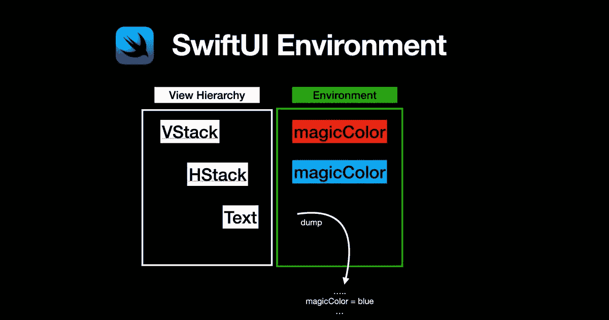

# 如何高效转储 SwiftUI 环境

> 原文：<https://betterprogramming.pub/how-to-dump-swiftui-environment-efficiently-1bdf12ef37ed>

## 了解如何为调试目的有效地打印环境值



这篇博客文章将解释如何有效地打印环境值用于调试目的。因此，您可以检查在特定的视图层次结构级别上使用了哪个实际值。

# 快速回顾 SwiftUI 环境

SwiftUI 使用环境将[预定义类型](https://www.fivestars.blog/articles/swiftui-environment-values/)的值向下传递到视图层次结构。

通过使用`@Environment`属性包装器，我们可以读取和订阅所选值的更改。

我们还可以[创建您的自定义环境值](https://useyourloaf.com/blog/swiftui-custom-environment-values/)。

我们使用环境视图修饰符将我们的自定义环境值注入 SwiftUI 环境。可以在较低的视图层次结构级别上覆盖值。这里有一个例子:

# 转储一个简单值

低调调试选项是结合使用 Swift 标准库中的`transformEnvironment`函数和`dump`函数。

`Dump`将给定对象的内容使用其镜像打印到标准输出。Xcode 调试控制台中的打印结果显示，在这个视图层次级别上，神奇的颜色是`blue`(如预期)。

```
▿ blue
  ▿ provider: SwiftUI.(unknown context at $7fff5dc005b0).ColorBox<SwiftUI.SystemColorType> #0
    - super: SwiftUI.AnyColorBox
      - super: SwiftUI.AnyShapeStyleBox
    - base: SwiftUI.SystemColorType.blue
```

# 转储所有值

Chris Eidhoff 在他的文章 [SwiftUI:设置环境值](https://www.objc.io/blog/2019/10/29/swiftui-environment/)中分享了一段代码，使用下面的实用包装器视图检查视图的当前环境:

例如，我们可以为上面视图的叶节点转储环境:

这个解决方案运行良好，可以很容易地复制并用于其他项目。但是当我们运行代码时，它打印出一个巨大的序列化属性列表树。

```
▿ _plist: [EnvironmentPropertyKey<MagicColorKey> = blue, EnvironmentPropertyKey<MagicColorKey> = red, EnvironmentPropertyKey<RedactionReasonsKey> = RedactionReasons(rawValue: 2), EnvironmentPropertyKey<SceneStorageValuesKey> = Optional(SwiftUI.WeakBox<SwiftUI.SceneStorageValues>(base: Optional(SwiftUI.SceneStorageValues))), EnvironmentPropertyKey<StoreKey<SceneBridge>> = Optional(SceneBridge: rootViewController = Optional(<_TtGC7SwiftUI19UIHostingControllerGVS_15ModifiedContentVS_7AnyViewVS_12RootModifier__: 0x7f915800c530>)), EnvironmentPropertyKey<AppNavigationAuthorityKey> = Optional(SwiftUI.WeakBox<SwiftUI.AppNavigationAuthority>(base: Optional(SwiftUI.AppNavigationAuthority))), EnvironmentPropertyKey<EditModeKey> = Optional(SwiftUI.Binding<SwiftUI.EditMode>(transaction: SwiftUI.Transaction(plist: []), location: SwiftUI.StoredLocation<SwiftUI.EditMode>, _value: SwiftUI.EditMode.inactive)), EnvironmentPropertyKey<InputAccessoryKey> = WeakBox<InputAccessoryGenerator<SwiftUIToolbar>>(base: nil), EnvironmentPropertyKey<CanTakeFocusKey> = false, EnvironmentPropertyKey<IsPlatformFocusSystemEnabled> = false, EnvironmentPropertyKey<IsFocusedKey> = false, EnvironmentPropertyKey<FocusBridgeKey> = WeakBox<FocusBridge>(base: Optional(SwiftUI.FocusBridge)), EnvironmentPropertyKey<AllowedBehaviorsKey> = HostingControllerAllowedBehaviors(rawValue: 16), EnvironmentPropertyKey<ActiveContextMenuKey> = ViewIdentity(seed: 0), EnvironmentPropertyKey<Key> = Optional(SwiftUI.NavigationAuthority(host: Optional(<_TtGC7SwiftUI14_UIHostingViewGVS_15ModifiedContentVS_7AnyViewVS_12RootModifier__: 0x7f91581066f0; frame = (0 0; 390 844); autoresize = W+H; gestureRecognizers = <NSArray: 0x600003b52fa0>; layer = <CALayer: 0x6000035073c0>>))), EnvironmentPropertyKey<PresentationModeKey> = Binding<PresentationMode>(transaction: SwiftUI.Transaction(plist: []), location: SwiftUI.LocationBox<SwiftUI.FunctionalLocation<SwiftUI.PresentationMode>>, _value: SwiftUI.PresentationMode(isPresented: false)), EnvironmentPropertyKey<AccessibilityRequestFocusKey> = AccessibilityRequestFocusAction(onAccessibilityFocus: nil), EnvironmentPropertyKey<AccentColorKey> = Optional(#007AFFFF), EnvironmentPropertyKey<HostingViewOpenURLActionKey> = Optional(SwiftUI.OpenURLAction(handler: SwiftUI.OpenURLAction.Handler.system((Function)), isDefault: false)), EnvironmentPropertyKey<UndoManagerKey> = Optional(<NSUndoManager: 0x60000161a620>), EnvironmentPropertyKey<SceneSessionKey> = Optional(SwiftUI.WeakBox<__C.UISceneSession>(base: Optional(<UISceneSession: 0x600002066140; scene = <UIWindowScene: 0x7f9158008d60; sceneIdentifier: "sceneID:us.eidinger.DateExample-F8369E9A-67DA-48FC-BAB6-EC1A5D8D56CC">; role = UIWindowSceneSessionRoleApplication; sceneConfiguration = <UISceneConfiguration: 0x600002066240>; persistentIdentifier = F8369E9A-67DA-48FC-BAB6-EC1A5D8D56CC; userInfo = <(null): 0x0>))), EnvironmentPropertyKey<SystemColorSchemeKey> = light, EnvironmentPropertyKey<ExplicitPreferredColorSchemeKey> = nil, EnvironmentPropertyKey<AccessibilityLargeContentViewerKey> = false, EnvironmentPropertyKey<EnabledTechnologiesKey> = AccessibilityTechnologies(technologySet: SwiftUI.(unknown context at $7fff5dc3e438).AccessibilityTechnologySet(rawValue: 0)), EnvironmentPropertyKey<AccessibilityButtonShapesKey> = false, EnvironmentPropertyKey<AccessibilityPrefersCrossFadeTransitionsKey> = false, EnvironmentPropertyKey<AccessibilityInvertColorsKey> = false, EnvironmentPropertyKey<AccessibilityReduceMotionKey> = false, EnvironmentPropertyKey<AccessibilityReduceTransparencyKey> = false, EnvironmentPropertyKey<AccessibilityDifferentiateWithoutColorKey> = false, EnvironmentPropertyKey<BackgroundInfoKey> = BackgroundInfo(layer: 0, groupCount: 0), EnvironmentPropertyKey<VerticalUserInterfaceSizeClassKey> = Optional(SwiftUI.UserInterfaceSizeClass.regular), EnvironmentPropertyKey<HorizontalUserInterfaceSizeClassKey> = Optional(SwiftUI.UserInterfaceSizeClass.compact), EnvironmentPropertyKey<DisplayScaleKey> = 3.0, EnvironmentPropertyKey<ColorSchemeKey> = light, EnvironmentPropertyKey<ColorSchemeContrastKey> = standard, EnvironmentPropertyKey<DisplayGamutKey> = displayP3, EnvironmentPropertyKey<LegibilityWeightKey> = Optional(SwiftUI.LegibilityWeight.regular), EnvironmentPropertyKey<DynamicTypeSizeKey> = large, EnvironmentPropertyKey<LayoutDirectionKey> = leftToRight, EnvironmentPropertyKey<ScenePhaseKey> = inactive, EnvironmentPropertyKey<TimeZoneKey> = America/Los_Angeles (fixed (equal to current)), EnvironmentPropertyKey<CalendarKey> = gregorian (current), EnvironmentPropertyKey<LocaleKey> = en_US (current)]
    ▿ elements: Optional(EnvironmentPropertyKey<MagicColorKey> = blue)
      ▿ some: EnvironmentPropertyKey<MagicColorKey> = blue #0
        ▿ super: SwiftUI.PropertyList.Element
          - keyType: SwiftUI.(unknown context at $7fff5dca9ff0).EnvironmentPropertyKey<DateExample.(unknown context at $1011eaf88).MagicColorKey> #1
          - before: nil
          ▿ after: Optional(EnvironmentPropertyKey<MagicColorKey> = red)
            ▿ some: EnvironmentPropertyKey<MagicColorKey> = red #2
              ▿ super: SwiftUI.PropertyList.Element
                - keyType: SwiftUI.(unknown context at $7fff5dca9ff0).EnvironmentPropertyKey<DateExample.(unknown context at $1011eaf88).MagicColorKey> #1
                - before: nil
                ▿ after: Optional(EnvironmentPropertyKey<RedactionReasonsKey> = RedactionReasons(rawValue: 2))
                  ▿ some: EnvironmentPropertyKey<RedactionReasonsKey> = RedactionReasons(rawValue: 2) #3
                    ▿ ...
```

太大了！

整个环境及其所有层次级别上的所有值都被转储。

我们需要从上到下读取输出，并忽略同一个`EnvironmentPropertyKey`的后续条目(因为`EnvironmentPropertyKey`的顶层值是使用的值)

在大多数情况下，更有效的方法是使用自定义函数打印出环境值。

我最初的方法是将`EnvironmentValues`的`description`作为`EnvironmentValues`符合`CustomStringConvertible`。

但是，这对于包含逗号的值描述不正确，并且打印输出仍然包含同一个键的多个条目。

我最终得到了下面这个“足够好”的实现

现在~ 50 行(而不是~ 1160 行！！！)被打印出来。

示例:

```
--- Environment Values - BEGIN ---
EnvironmentPropertyKey<MagicColorKey> = blue
EnvironmentPropertyKey<SceneStorageValuesKey> = Optional(SwiftUI.WeakBox<SwiftUI.SceneStorageValues>(base: Optional(SwiftUI.SceneStorageValues)))
EnvironmentPropertyKey<StoreKey<SceneBridge>> = Optional(SceneBridge: rootViewController = Optional(<_TtGC7SwiftUI19UIHostingControllerGVS_15ModifiedContentVS_7AnyViewVS_12RootModifier__: 0x7f97bcb0aef0>))
EnvironmentPropertyKey<AppNavigationAuthorityKey> = Optional(SwiftUI.WeakBox<SwiftUI.AppNavigationAuthority>(base: Optional(SwiftUI.AppNavigationAuthority)))
EnvironmentPropertyKey<EditModeKey> = Optional(SwiftUI.Binding<SwiftUI.EditMode>(transaction: SwiftUI.Transaction(plist: []), location: SwiftUI.StoredLocation<SwiftUI.EditMode>, _value: SwiftUI.EditMode.inactive))
EnvironmentPropertyKey<InputAccessoryKey> = WeakBox<InputAccessoryGenerator<SwiftUIToolbar>>(base: nil)
EnvironmentPropertyKey<CanTakeFocusKey> = true
EnvironmentPropertyKey<IsPlatformFocusSystemEnabled> = false
EnvironmentPropertyKey<IsFocusedKey> = false
EnvironmentPropertyKey<FocusBridgeKey> = WeakBox<FocusBridge>(base: Optional(SwiftUI.FocusBridge))
EnvironmentPropertyKey<AllowedBehaviorsKey> = HostingControllerAllowedBehaviors(rawValue: 16)
EnvironmentPropertyKey<ActiveContextMenuKey> = ViewIdentity(seed: 0)
EnvironmentPropertyKey<Key> = Optional(SwiftUI.NavigationAuthority(host: Optional(<_TtGC7SwiftUI14_UIHostingViewGVS_15ModifiedContentVS_7AnyViewVS_12RootModifier__: 0x7f97bcb0b670; frame = (0 0; 390 844); autoresize = W+H; gestureRecognizers = <NSArray: 0x600000d47cf0>; layer = <CALayer: 0x60000032e980>>)))
EnvironmentPropertyKey<PresentationModeKey> = Binding<PresentationMode>(transaction: SwiftUI.Transaction(plist: []), location: SwiftUI.LocationBox<SwiftUI.FunctionalLocation<SwiftUI.PresentationMode>>, _value: SwiftUI.PresentationMode(isPresented: false))
EnvironmentPropertyKey<AccessibilityRequestFocusKey> = AccessibilityRequestFocusAction(onAccessibilityFocus: nil)
EnvironmentPropertyKey<AccentColorKey> = Optional(#007AFFFF)
EnvironmentPropertyKey<HostingViewOpenURLActionKey> = Optional(SwiftUI.OpenURLAction(handler: SwiftUI.OpenURLAction.Handler.system((Function)), isDefault: false))
EnvironmentPropertyKey<UndoManagerKey> = Optional(<NSUndoManager: 0x600002039270>)
EnvironmentPropertyKey<SceneSessionKey> = Optional(SwiftUI.WeakBox<__C.UISceneSession>(base: Optional(<UISceneSession: 0x600001641200; scene = <UIWindowScene: 0x7f97bcb0a040; sceneIdentifier: "sceneID:us.eidinger.DateExample-F8369E9A-67DA-48FC-BAB6-EC1A5D8D56CC">; role = UIWindowSceneSessionRoleApplication; sceneConfiguration = <UISceneConfiguration: 0x600001641300>; persistentIdentifier = F8369E9A-67DA-48FC-BAB6-EC1A5D8D56CC; userInfo = <(null): 0x0>)))
EnvironmentPropertyKey<SystemColorSchemeKey> = light
EnvironmentPropertyKey<ExplicitPreferredColorSchemeKey> = nil
EnvironmentPropertyKey<AccessibilityLargeContentViewerKey> = false
EnvironmentPropertyKey<EnabledTechnologiesKey> = AccessibilityTechnologies(technologySet: SwiftUI.(unknown context at $7fff5dc3e438).AccessibilityTechnologySet(rawValue: 0))
EnvironmentPropertyKey<AccessibilityButtonShapesKey> = false
EnvironmentPropertyKey<AccessibilityPrefersCrossFadeTransitionsKey> = false
EnvironmentPropertyKey<AccessibilityInvertColorsKey> = false
EnvironmentPropertyKey<AccessibilityReduceMotionKey> = false
EnvironmentPropertyKey<AccessibilityReduceTransparencyKey> = false
EnvironmentPropertyKey<AccessibilityDifferentiateWithoutColorKey> = false
EnvironmentPropertyKey<BackgroundInfoKey> = BackgroundInfo(layer: 0, groupCount: 0)
EnvironmentPropertyKey<VerticalUserInterfaceSizeClassKey> = Optional(SwiftUI.UserInterfaceSizeClass.regular)
EnvironmentPropertyKey<HorizontalUserInterfaceSizeClassKey> = Optional(SwiftUI.UserInterfaceSizeClass.compact)
EnvironmentPropertyKey<DisplayScaleKey> = 3.0
EnvironmentPropertyKey<ColorSchemeKey> = light
EnvironmentPropertyKey<ColorSchemeContrastKey> = standard
EnvironmentPropertyKey<DisplayGamutKey> = displayP3
EnvironmentPropertyKey<LegibilityWeightKey> = Optional(SwiftUI.LegibilityWeight.regular)
EnvironmentPropertyKey<DynamicTypeSizeKey> = large
EnvironmentPropertyKey<LayoutDirectionKey> = leftToRight
EnvironmentPropertyKey<ScenePhaseKey> = active
EnvironmentPropertyKey<TimeZoneKey> = America/Los_Angeles (fixed (equal to current))
EnvironmentPropertyKey<CalendarKey> = gregorian (current)
--- Environment Values - END ---
```

SwiftUI 环境处理的内部工作是隐藏的。这在大多数情况下是可以的。一个明显的缺点是`Font`的打印结果没有帮助，因为它的描述不包含字体名称/样式信息。

```
**Want to Connect?**Originally published at [https://blog.eidinger.info](https://blog.eidinger.info/dump-swiftui-environment-efficiently).
```