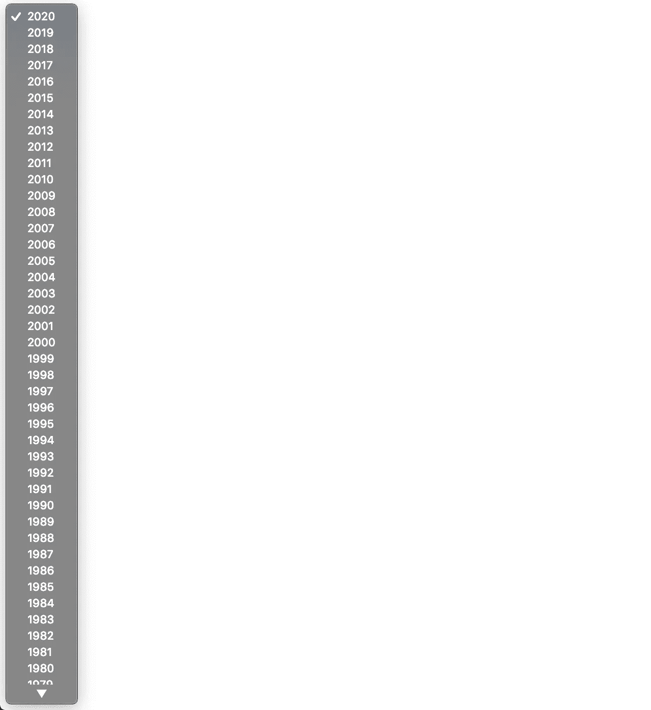

# 如何用 JavaScript 动态填充年份下拉列表

> 原文：<https://betterprogramming.pub/how-to-dynamically-populate-a-year-dropdown-with-javascript-bcf4f849bc4f>

## 删除硬编码的样板文件


[Roman Bozhko](https://unsplash.com/@romanbozhko?utm_source=medium&utm_medium=referral) 在 [Unsplash](https://unsplash.com?utm_source=medium&utm_medium=referral) 上拍摄的照片

你的网络应用需要一个可选择年份的下拉列表吗？这里有一种简单快捷的方法，不用硬编码所有的年份，而是使用 JavaScript 动态填充一个年份范围(当然是您自己选择的)。

因为这是一个非常基本的例子，我们将使用一个简单的 HTML 样板作为起点。

其实我用的是你打感叹号的时候 Emmet 自动输出的东西(！).顺便说一下，Emmet 是一个面向前端开发人员的非常棒的插件，我强烈推荐它，它适用于大多数代码编辑器。

接下来，在`body`标签中键入开始和结束的`select`标签，并给它一个描述性的 ID。对于这个例子，我只是使用`date-dropdown`。

```
<select id='date-dropdown'>
</select>
```

在你的`select`标签下面，添加开始和结束`script`标签。在这些`script`标签中，添加以下代码(当你看到它时，解释发生了什么会容易得多)。

首先，我们通过找到给定 ID 为`date-dropdown`的元素来定位日期下拉列表。

接下来，我们将获取当前年份(截至本文撰写之时，2020 年)并声明我们想要填充下拉列表的时间，在本例中是 1970 年。

之后，我们将使用一个`while`循环，对于每一次迭代，在添加到`select`下拉列表之前，将创建一个`option`标签，并为其分配一年的文本和值。

这将不断地向下拉列表中添加年份，直到`currentYear`小于或等于 `earliestYear`的*为止，因为每循环一次，我们就将`currentYear`减 1。*

这是最后一个例子的样子:



你有它，动态填充的年份下拉菜单！

您还可以重新使用`currentYear`变量来动态设置网页页脚的版权( )年份，而不必每年都更改它！

下面是完整的例子: