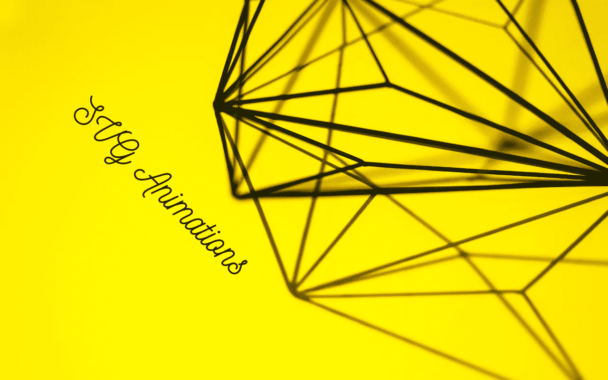
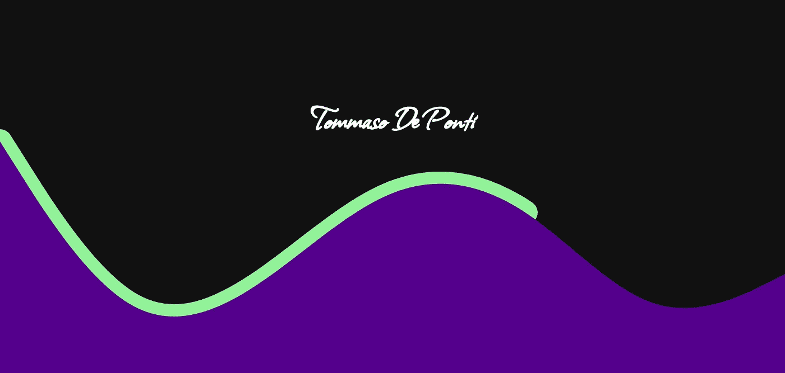

# 如何用几行 CSS 代码轻松制作 SVG 动画

> 原文：<https://betterprogramming.pub/how-to-easily-animate-svg-with-a-few-css-lines-77c999ea3aea>

## 开始在你的前端使用令人敬畏的动画形状

作者在 Canva.com

如果您从未在前端使用过 SVG，那么您就错过了，如果您不知道如何将它制作成动画，您会错过更多。这就是为什么在这篇文章的最后，您将开始构建您的第一个 SVG 图形，制作动画，并可能将其添加到您的文件夹或其他项目中。

该作品分为两个主要部分:

*   使用在线工具创建出色的 SVG 形状
*   仅用 CSS 制作这些形状的动画

但是在开始之前，我想为那些从未使用过 SVG 的人简单介绍一下 SVG:Scalable Vector Graphics 是一种用于创建二维图形(也支持动画)的标记语言，您可以通过`<svg>`标签在 HTML 标记中引入它。

现在让我们深入研究我用来生成令人惊叹的 SVG 图形的过程和工具。

# 创建 SVG 设计

您可以自己创建 SVG 图形，但这会变得很棘手，所以为什么不使用一些非常棒的在线工具呢？

我主要使用两种工具:

*   [墨景](https://inkscape.org/)
*   [海经](https://app.haikei.app/)

Inkscape 是我用来创建复杂图形的随身工具，而 Haikei 是一个很棒的工具，只需点击几下就可以创建“抽象”的图形。这是一个海凯设计的例子:

大紫波和浅绿色的“蛇”是两个 SVGs Haikei 建造在大约十个点击。以上设计来自[我的网站](https://heytdep.github.io/)，使用 CSS 制作动画。

现在，让我们开始制作我们的 SVG 动画。

# 动画

我已经在这里写了关于 CSS 动画的文章，这是一个很好的资源，我也推荐阅读，因为它很好地概述了 CSS 动画是什么以及它们是如何工作的。

在这个作品中，我想给大家展示的是笔画偏移动画，这是我个人最喜欢的动画之一。

我刚刚用 Inkscape 创建了一个非常简单的形状:

我们用 SVG 构建 HTML，id 为“line”的`path`标签是我们的形状:

现在，让我们进入我们的 CSS 代码:

*   创建一个`fill-line`动画(用`@keyframes`和`stroke-ashoffset`属性)
*   将这个动画添加到`line`(id)SVG 模式中。

这是结果(在 GIF 中滞后，但在浏览器中看不到):

现在，您已经看到，您可以像处理 CSS 艺术作品等时一样制作 SVG 形状的动画。

作为总结，我想分享我创造这种设计的过程:

1.  创建您的 SVG 形状(Haikei，Inkscape，Adobe)，并将其插入 HTML。
2.  给你的 SVG 中你想要制作动画的`<path>`一个 id(或者类，取决于你的需要)。
3.  使用 CSS(或 JS，甚至一些动画框架)，移动，旋转等你想要的 SVG 路径。

学习 SVG 动画中级内容的一个很好的练习是创建一个人旋转硬币的设计(没有手指动画，这是更高级的内容，可能会在另一篇文章中讨论)。

在这种情况下，我的方法(假设我做的是纯 CSS)是用 Inkscape 创建人和硬币。然后给其中一只手和硬币分配一个 id，在我的 CSS 中，我会为手创建一个旋转动画，为硬币创建一个平移动画(为了更好的美观，可能还会有旋转)。

我希望这篇文章能让你从事 SVG 动画，提高你的 CSS 技能，并改进你的设计。

感谢您的阅读！