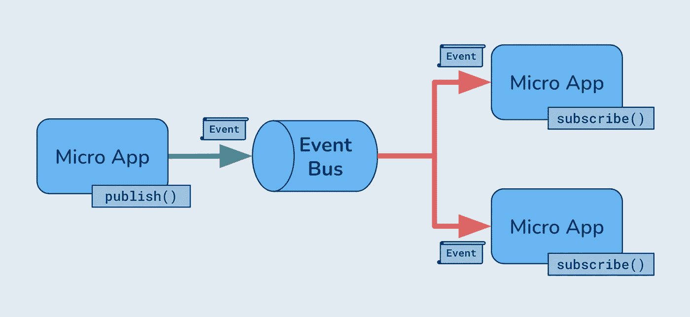

# 如何轻松地为微前端创建事件总线

> 原文：<https://betterprogramming.pub/how-to-easily-create-an-event-bus-for-a-micro-frontend-ac6aad373a31>

## 如何在微前端架构中构建用于通信和状态管理的事件总线？



事件总线架构

微前端中的通信和状态管理是具有挑战性的问题——就像它们对于使用微服务的后端系统一样。

分布式系统中应用程序之间的任何共享状态都会产生一系列令人头痛的问题:可伸缩性、瓶颈、版本控制、部署、回滚、变更管理和团队协作等等。

使用带有事件总线的发布和订阅模式，我们可以在没有直接耦合的情况下实现应用程序间的通信，从而完全避免这些问题。

# 发布和订阅(发布订阅)

发布和订阅(又名 PubSub)模式是一种基于事件的机制，用于在系统中发送和接收消息。它允许应用程序向中间人发布消息，而不知道谁(如果有)在监听应用程序。

类似地，应用程序可以订阅这些消息，而不知道是谁发布了它们。这个中间人可以是负责接收、管理和发送消息的事件总线或消息队列。

这创造了应用程序和平台之间的独立性。任何人都可以按照自己的意愿自由订阅和发布消息，而不用担心直接与其他系统进行协调或通信。

通常，我们在 PubSub 中创建单独的通道，用于将不同类型的消息相互分离。这允许发布者和订阅者只接收特定于他们用例的消息。

这些类型的事件驱动模式对于基于事件的交互、事务或者在系统间的协调具有挑战性的分布式系统中非常强大——微前端就是这种情况。

事件对前端来说并不陌生。浏览器调度事件来指示 DOM 的变化或来自用户的交互。DOM 元素可以充当事件总线来调度和监听新事件。在某种程度上，我们已经在前端应用程序中使用了事件总线。

# 考虑

以下是为您的微前端架构设计通信时需要考虑的一些关键问题。这些问题的答案将有助于确定哪种实现机制、公开接口和结构最适合您的特定需求。

*   消息的顺序重要吗？需要保修吗？
*   是否有任何消息需要存储或持久化？
*   所有应用程序都同时初始化吗？如果应用程序在一些消息已经发送后初始化，会发生什么？
*   你想要什么样的开发者体验？固执己见和结构化还是想给开发者更多的自由？
*   您将如何测试和部署您的应用程序？如何调试正在发送的消息？
*   你有在微应用之间共享状态的单独策略吗？我们是否也想为此使用事件总线？

# 实施机制

对于在前端创建事件总线实现，我们有几种选择。这些是我们将要讨论的内容:

1.  自定义事件是我们可以在浏览器中创建并在特定对象或 DOM 节点上调度的事件。事件本身可以包含我们传递的任何数据，我们使用的对象充当事件总线。
2.  `BroadcastChannel`:广播通道是一个创建事件总线的浏览器 API。这个 API 是独一无二的，因为它允许我们跨相同来源的浏览上下文进行通信。这意味着我们可以跨窗口、标签、框架和 iframes 发送相同来源的消息。
3.  自定义`PubSub`:我们可以自己创建一个发布机制，这需要更多的跑腿工作，但是给了我们对系统最直接的控制。

# 1.自定义事件

[自定义事件](https://developer.mozilla.org/en-US/docs/Web/API/CustomEvent)是一个用于创建新的合成事件的 API。与[事件](https://developer.mozilla.org/en-US/docs/Web/API/Event) API 不同，使用自定义事件，我们可以使用其`detail`属性向事件添加自定义数据，如下所示。

为了发布和订阅，我们使用浏览器本地 API 来添加事件监听器和调度事件。但是我们需要将它们附加到页面上的 DOM 元素中。

这可以是任何浏览器对象或 DOM 节点——一个很好的选择是使用 comment DOM 元素，因为它附加在 HTML 上，但对最终用户不可见。这有助于隐藏它，同时让我们的应用程序可以访问它。

使用 CustomEvent 的事件总线示例。

使用自定义事件的优势在于简单性和开箱即用的跨浏览器兼容性。我们不需要创建任何新的东西——只需重用现有的 API。

# 2.广播频道

[广播频道](https://developer.mozilla.org/en-US/docs/Web/API/Broadcast_Channel_API)是一个相对较新的 API，但所有现代浏览器都支持，并且可以使用 [Web Workers](https://developer.mozilla.org/en-US/docs/Web/API/Web_Workers_API) 获得。它允许我们用给定的通道名创建一个事件总线，其他人可以向它订阅和发布消息。

它是为跨上下文通信而设计的，因此发布者和订阅者可以跨相同来源的窗口、选项卡、框架和 iframes 进行通信。这对于某些用例来说非常强大——特别是在微前端实现中使用 iframes 时——但是对于相同上下文中的简单消息传递系统来说可能有点大材小用。

尽管如此，广播频道使用起来非常简单:

使用 BroadcastChannel 的事件总线示例。

消息由 API 自动序列化，因此您可以安全地发送各种数据。API 本身并不限制消息的结构或数据，但是在订阅时添加一个过滤器来保护自己免受格式错误的消息是明智的。

# 3.自定义发布订阅

自定义的 PubSub 机制非常强大，因为它让我们可以完全控制系统——特别是，允许哪些消息和主题。与前两种机制不同，我们可以构建验证来确保只传递预期的消息格式。

首先，我们需要三种方法:

1.  我们的应用程序需要一种方法来发送消息到事件总线。这些消息可以是完全自由的形式，或者我们可以根据用例实施严格的结构。
2.  `subscribe()`:应用程序需要一种方法来监听任何新创建的消息。
3.  `unsubscribe()`:为了帮助保持整个系统的整洁，我们需要一个应用退订的机制

# 主题

我们希望在事件总线中为特定的主题提供专用的通道，以便根据它们的用例来分离消息。这些主题将用一个唯一的字符串来表示。

为简单起见，主题总是需要发布或订阅。您可以通过引入不需要主题的发布和订阅方法来扩展这个实现，这样您就可以跨主题发送或接收消息。

# 设置

我们将在 TypeScript 中使用一个带有三个私有对象的类来将订阅者映射到主题和侦听器函数。

# 订阅()

首先，我们需要订阅特定主题的新消息。该方法将需要一个我们想要监听的给定的`topic`和一个回调`onMessage`函数，该函数将在给定主题上发布新消息时被触发。

示例用法:

# 发布()

既然我们可以订阅消息，我们需要一种发布机制。我们的`publish()`函数还需要一个`topic`参数来指定将消息发送到哪个通道。以及消息本身。

为了简单起见，`message`参数可以是任何 JavaScript 对象，但是如果我们愿意，我们可以通过在`publish()`方法中使用模式验证来限制它。

示例用法:

*注意:如果您的微前端架构依赖 iframes 来呈现来自不同来源的微应用程序，您可以使用* `*postMessage*` *API 作为将消息从事件总线传递到子应用程序的方式。*

# 取消订阅()

最后，每当消费组件不再需要订阅数据时，我们需要一种机制来清理它们。当组件卸载或不再呈现在页面上时，您应该这样做。

此方法应该接收一个订阅 id，该 id 可用于清理与其相关的私有对象。

# 公开发布订阅

为了在我们的微应用中使用这个 PubSub，我们需要一个机制让父应用初始化它，并与所有子应用共享它。

这可以通过在初始化时将类的实例作为属性或参数传递给每个微应用来实现。或者我们可以使用`window`对象或其他机制来全局公开实例。

全局共享实例简单、方便，并允许我们使用浏览器的开发工具与 PubSub 服务进行交互。但这可能有风险，所以应该小心行事——确保使用`Object.freeze()`等方法锁定实现，以避免任何微应用程序意外修改核心逻辑。

# 持续的主题

现在我们有了一个系统，允许微应用程序通过事件总线独立发送和接收消息。如果我们想将这种模式也用于状态管理，我们可以通过持久化特定主题的消息来进一步实现这种模式。

在任何给定的时刻，我们可能需要一些主题来表示应用程序的状态。例如，我们可能希望向所有微前端传达购物车中有多少商品。

如果在添加任何项目之前，首先加载所有微前端，这就足够简单了。但是，如果我们将商品存储在本地存储或其他地方，以便用户稍后可以回到他们的购物车，会发生什么呢？每当初始化新的微应用程序时，我们需要一种机制让 PubSub 传播这些数据。

为了做到这一点，我们可以引入“持久化主题”,在这种情况下，我们存储自应用程序启动以来给定主题的所有消息，并且只要新订户订阅了这些主题，他们就会立即收到所有以前的消息。

为此，我们将引入一个新的私有对象来存储持久化主题的消息。在 PubSub 的构造函数中，我们可以指定要持久保存的主题:

```
**const PS = new PubSub({ persistedTopics: ["cart"] });**
```

**应该修改** `**subscribe()**` **方法，以便每当存储新订户时，我们通过遍历它们并立即调用订户的** `**onMessage()**` **函数来“清除”当前保存的任何消息。**

**如果想要持久保存给定的主题，应该更新** `**publish()**` **方法，以便将消息存储在新的私有对象中。**

# **实例**

**实现的完整示例代码可以在这里找到:**[**https://github . com/RAU TiO/micro-frontend-demo/blob/main/main/src/services/pubsub . ts**](https://github.com/rautio/micro-frontend-demo/blob/main/main/src/services/pubsub.ts)

**在这个演示应用程序中，它用于支持产品商店:**[**https://micro-frontend-demo-main.vercel.app/**](https://micro-frontend-demo-main.vercel.app/)**其中，PubSub 跨一个父应用程序和两个子应用程序管理购物车中的商品。**

# **最后的想法**

**微前端架构中的通信可能具有挑战性，但事件总线模式正是我们在应用程序之间创建可扩展、易于使用且面向未来的状态管理所需要的。**

我们可以使用一些本地 API 来快速启动和运行，但是定制的解决方案在我们需要更多功能和对系统的控制的大型应用中更实用。

请在评论中告诉我你的想法。