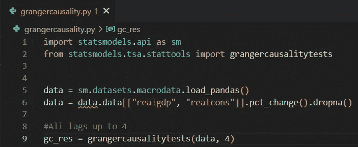
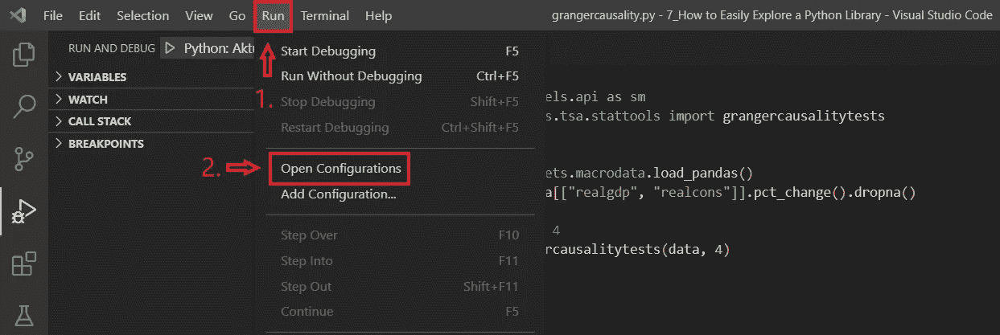
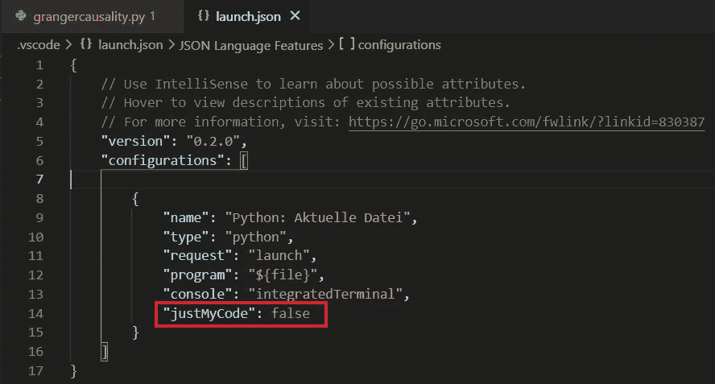
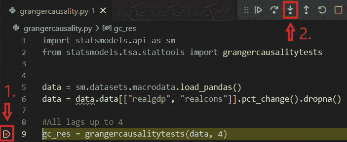

# 如何使用真实数据轻松探索 Python 库

> 原文：<https://betterprogramming.pub/how-to-easily-explore-a-python-library-with-real-data-5e496316213a>

## 让我们在 Visual Studio 代码中使用调试器的强大功能

照片由[通讯社跟随](https://unsplash.com/@olloweb?utm_source=medium&utm_medium=referral)于 [Unsplash](https://unsplash.com?utm_source=medium&utm_medium=referral) 拍摄

想象一下，你想探索一个 Python 库，详细了解一个特定方法的不同步骤。当然，你可以去相应的 Github 页面浏览代码。

您甚至可以将方法和相关的导入语句复制到一个空的 Python 文件中，并使用真实数据运行它。结合调试器或打印语句，您可能会达到您的目标。一切都好，但那不是很方便，更不用说笨重。

这就是为什么我在寻找一种替代方法，并最终在 Visual Studio 代码中找到了一种很好的方法，它允许您深入研究，甚至超越您想要检查的实际方法。在这种情况下，调试器不仅会检查您的代码，还会跳转到已加载库的方法中。所以，在这篇文章中，我会一步一步地告诉你要做什么。

# 1.代码设置

首先，我们需要一种方法，一种我们想要探索的方法。在我们的例子中，它将是`statsmodels`库的[格兰杰因果检验](https://en.wikipedia.org/wiki/Granger_causality)。

因此，我们将通过加载数据并对其执行格兰杰因果关系测试来设置代码:

图像:代码设置

# 2.开放式发布配置

下一步，我们必须打开发布配置。因此，我们单击顶部菜单栏上的“运行”,然后单击“打开配置”。

请记住，您在这里所做的更改将应用于当前打开的整个模块及其所有子文件夹。但是，其他模块不会受到影响，因为它不是全局设置:

图:开放启动配置

# 3.调整启动配置

在配置文件中，我们添加了参数`justMyCode`，并将其设置为`false`。顾名思义，现在不仅要调试我们编写的代码，还要调试加载的库的执行方法:

图:调整 justMyCode 参数

# 4.开始调试会话

最后，我们在想要检查的方法上设置一个断点，并启动调试会话。一旦代码到达断点，它将停止，在下一步中，您可以进入该方法，并使用实际数据逐步探索它。

这意味着，一旦声明了相应的变量，您可以在左侧的“变量”部分看到变量的当前值。还要注意，如果该方法本身使用更多的库，您也可以在感兴趣的情况下进入这些库:

图像:调试会话

# 结论

试图理解一个方法内部实际发生的事情可能会很乏味。在本文中，我展示了一种使用 Visual Studio 代码探索已加载库的方法的简单而有效的方法。

您唯一需要做的就是将调试器的启动配置文件中的参数`justMyCode`设置为`false`，启动调试会话，并在感兴趣的方法处设置断点。

探索愉快！如果您喜欢这篇文章，您可能也会对以下内容感兴趣:

 [## 识别支撑位和阻力位的基于梯度的方法

### 研究一个简单而有效的三步法，通过计算来检测支撑位和阻力位。

medium.datadriveninvestor.com](https://medium.datadriveninvestor.com/a-gradient-based-approach-for-identifying-support-and-resistance-levels-defc97539258)