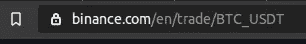

# 如何使用 Python 轻松获取币安历史交易

> 原文：<https://betterprogramming.pub/how-to-easily-fetch-your-binance-historical-trades-using-python-174a6569cebd>

## **创建一个可靠的脚本，从币安提取历史贸易数据**


由 [Austin Distel](https://unsplash.com/@austindistel?utm_source=unsplash&utm_medium=referral&utm_content=creditCopyText) 在 [Unsplash](https://unsplash.com/s/photos/trading?utm_source=unsplash&utm_medium=referral&utm_content=creditCopyText) 上拍摄

*注意:本文仅供娱乐和教育之用，并非理财建议。*

作为一家加密货币交易所的前首席技术官，我参与了几个主要交易所的 API。在本文中，我将指导您创建一个可靠的 Python 脚本来从币安提取历史贸易数据。

# 基本原理

当回测交易策略时，也就是说，用过去的数据执行我们的策略，分析回报和其他重要因素时，我们必须确保我们有合适的数据来处理。这个过程并不总是如此简单，因为有些策略需要水平簿数据，其他策略可能只需要一小时蜡烛线就可以了，并且基础架构、可用性和连接性等元素可能会因您需要的数据类型而有很大不同。

如果你不知道这些*级别的书籍数据是什么意思，也没有必要担心，因为我们不会在这篇文章中触及这些。*

所需数据主要由交易策略的频率决定。交易策略类别是我将在我的算法交易系列中写的另一个主题，但是你可以在 [Investopedia 中找到一些可靠的信息。](https://www.investopedia.com/articles/active-trading/11/four-types-of-active-traders.asp)

好的，但是为什么这篇文章仅仅是关于获取“交易”数据，为什么我们要使用币安 API？你，读者，一定对我的文章内容有点困惑。

## 数据频率和币安

我认为，贸易数据端点主要存在于 99.99%的交易所。它是细粒度的，为回溯测试[高频交易(HFT)](https://www.investopedia.com/terms/h/high-frequency-trading.asp) 策略提供了足够的细节(在某些非常特殊的情况下)，也为 [OHLC 蜡烛线](https://www.investopedia.com/terms/o/ohlcchart.asp)(1 秒到 24H，或者更多，如果你愿意的话)。

交易数据是多用途的，允许对不同频率的策略进行大量实验。

为什么[币安](https://binance.com)？这只是因为它是我倾向于回测的交易所之一，因为它的交易量很大。我与币安没有任何关系。我们将在我的算法交易系列中查看其他交易所。

> “空谈是廉价的。给我看看代码。”——莱纳斯·托瓦尔兹

# 我们将编码什么

我们将创建一个 Python 脚本，它接收成对符号、开始日期和结束日期作为命令行参数。它会将包含所有交易的 CSV 文件输出到磁盘。该过程可以通过以下步骤来详述:

*   解析`symbol`、`starting_date`和`ending_date`参数。
*   获取起始日发生的第一笔交易，得到第一笔`trade_id`。
*   循环提取每个请求 1000 笔交易(币安 API 限制)，直到达到`ending_date`。
*   最后，将数据保存到磁盘。对于这个例子，我们将把它保存在 CSV 中，但是您还有其他几个选项可以选择。

我们将使用`pandas`、`requests`、`time`、`sys`和`datetime`库。在代码片段中，不会显示错误验证，因为它不会给解释增加任何价值。当然，你可以在 [GitHub](https://github.com/tgcandido/binance-data-fetcher) 上查看完整代码。

# 编码时间

## 解析参数

该脚本将使用以下参数:

*   `symbol`:交易对的符号，由币安定义。可以在这里查询[，也可以从币安 web app 的网址复制，不包括`_`字符。](https://api.binance.com/api/v1/ticker/allPrices)



从 URL 的最后一部分去掉“_”，就得到这个符号

*   `starting_date and ending_date`:不言自明。期望的格式是`mm/dd/yyyy`，或者用 Python 俚语来说是`%m/%d/%Y`。

为了获得参数，我们将使用内置的`sys`(这里没有什么特别的)，为了解析日期，我们将使用`datetime`库。

```
symbol = sys.argv[1]
starting_date = datetime.strptime(sys.argv[2], '%m/%d/%Y')
ending_date = datetime.strptime(sys.argv[3], '%m/%d/%Y') + timedelta(days=1) - timedelta(microseconds=1)
```

我们增加一天，减去一微秒，这样`ending_date`的时间部分总是在`23:59:59.999`处，使得获得同一天的时间间隔更加实际。

## 获取交易

使用[币安的 API](https://github.com/binance-exchange/binance-official-api-docs/blob/master/rest-api.md) 和使用`[aggTrades](https://github.com/binance-exchange/binance-official-api-docs/blob/master/rest-api.md#compressedaggregate-trades-list)`端点，我们在一个请求中最多可以获得 1000 笔交易，如果我们使用 start 和 end 参数，它们最多可以相差一个小时。在一些失败之后，通过利用时间间隔(在某个时候，流动性会变得疯狂，我会失去一些宝贵的交易)，我决定尝试`from_id`策略。

选择`aggTrades`端点是因为它返回压缩的交易。这样，我们就不会丢失任何珍贵的信息。

进行压缩、汇总交易。在同一时间、同一订单、以相同价格成交的交易将对数量进行汇总。

`from_id`策略是这样的:我们将通过向端点发送日期间隔来获得`starting_date` 的第一笔交易。之后，我们将获取 1000 个交易，从第一个获取的交易 ID 开始。然后，我们将检查最后一笔交易是否发生在我们的`ending_date`之后。如果是这样，我们已经完成了所有的时间段，我们可以将结果保存到文件中。否则，我们将更新我们的`from_id`变量以获得最后一个交易 ID，并再次开始循环。

唉，说够了，让我们编码吧。

## 获取第一个交易 ID

首先，我们创建一个`new_end_date`。这是因为我们通过传递一个`startTime`和一个`endTime` 参数来使用`aggTrades`。现在，我们只需要知道这个周期的第一个交易 ID，所以我们给这个周期增加了 60 秒。在低流动性对中，这个参数是可以改变的，因为不能保证交易发生在被请求的当天的第一分钟。

然后，使用我们的 helper 函数解析日期，通过使用`calendar.timegm`函数将其转换为 Unix 毫秒表示。最好使用`timegm`函数，因为它以 UTC 格式保存日期。

```
def get_unix_ms_from_date(date):
    return int(calendar.timegm(date.timetuple()) * 1000 + date.microsecond/1000)
```

该请求的响应是一个按日期排序的交易对象列表，格式如下:

因此，当我们需要第一个交易 ID **、**时，我们将返回`response[0]["a"]`值。

## 主循环

现在我们有了第一个交易 ID，我们可以一次获取 1000 笔交易，直到到达我们的`ending_date`。下面的代码将在我们的主循环中被调用。它将使用`from_id`参数执行我们的请求，放弃`startDate`和`endDate`参数。

现在，这里是我们的主循环，它将执行请求并创建我们的`[DataFrame](https://pandas.pydata.org/pandas-docs/stable/reference/api/pandas.DataFrame.html)`。

我们检查包含最近获取的交易日期的`current_time`是否大于我们的`to_date`，如果是，我们:

*   使用`from_id`参数提取交易
*   更新`from_id`和`current_time`参数，两者都使用从最新交易中获取的信息
*   打印一条`nice`调试信息
*   `[pd.concat](https://pandas.pydata.org/pandas-docs/stable/reference/api/pandas.concat.html)`我们的`DataFrame`中的交易与之前的交易一起提取
*   稍微睡一会儿，这样币安就不会给我们一个难看的 429 HTTP 响应

## 清洁和保存

组装完我们的`DataFrame`之后，我们需要执行一个简单的数据清理。我们将删除重复的和`trim`在我们的`to_date`之后发生的交易(我们有这个问题，因为我们正在获取 1000 个交易的大块，所以预计我们会在我们的目标结束日期之后执行一些交易)。

我们可以封装我们的`trim`功能:

```
def trim(df, to_date):
    return df[df['T'] <= get_unix_ms_from_date(to_date)]
```

并执行我们的数据清理:

```
df.drop_duplicates(subset='a', inplace=True)
df = trim(df, to_date)
```

现在，我们可以使用`[to_csv](https://pandas.pydata.org/pandas-docs/stable/reference/api/pandas.DataFrame.to_csv.html)`方法将其保存到文件中:

```
filename = f'binance__{symbol}__trades__from__{sys.argv[2].replace("/", "_")}__to__{sys.argv[3].replace("/", "_")}.csv'
df.to_csv(filename)
```

我们也可以使用其他数据存储机制，比如 Arctic。

# 奖励:验证您的数据

在制定交易策略时，相信我们的数据是很重要的。通过应用以下验证，我们可以很容易地对提取的交易数据进行验证:

在代码片段中，我们将我们的`DataFrame`转换为一个 [NumPy 数组](https://numpy.org/doc/stable/reference/arrays.html)，并逐行迭代，检查交易 ID 是否每行增加 1。

币安交易 id 是递增编号的，并且是为每个符号创建的，因此很容易验证您的数据是否正确。

# 结论

创建成功交易策略的第一步是拥有正确的数据。

我的算法交易系列还在进行中，所以我欢迎你在评论区给我任何反馈或建议。你可以在我的 GitHub [库](https://github.com/tgcandido/binance-data-fetcher)中查看这个小教程的完整代码。

我希望你喜欢阅读这篇文章。

*如果你有，考虑在*[*Twitter*](https://twitter.com/ogaihtcandido)*上关注我。*

谢谢你的时间。保重，继续编码！