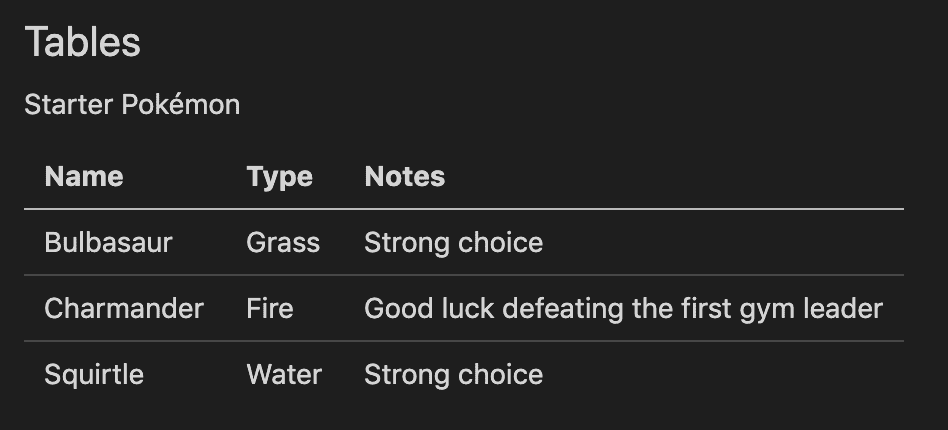
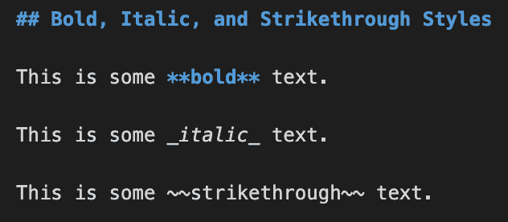
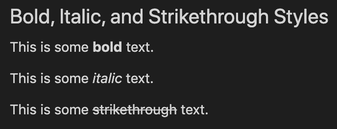
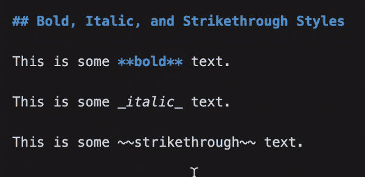
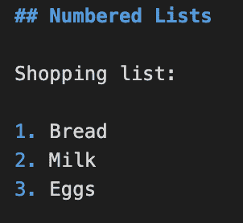
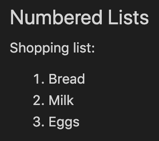
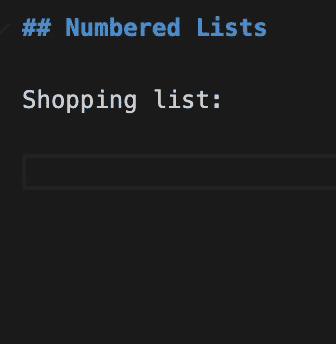
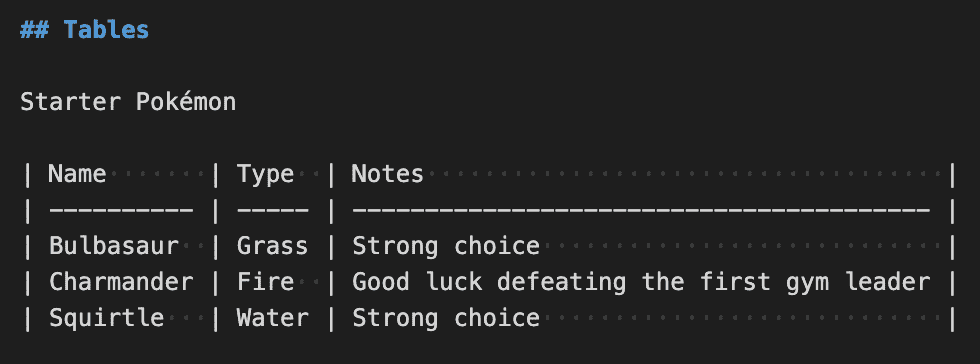
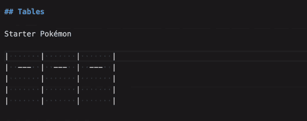

# 如何在 VS 代码中轻松格式化 Markdown 文件

> 原文：<https://betterprogramming.pub/how-to-easily-format-markdown-files-in-vs-code-9c6bcecbe6f2>

## VS 代码降价扩展拯救！

减价文件中的示例表

每个值得尊敬的软件项目都需要一个`README`。该文件为开发人员提供了关于项目是什么、如何使用项目以及其他相关信息的重要信息。`README`文件是用一种特殊的标记语法 *markdown* 编写的。markdown 的语法很简单，但是手动输入会很麻烦，而且很容易出现简单的错误和打字错误。

难道你不想使用`Cmd+B`键盘快捷键来加粗一些文本，而不是在文本周围键入`**`吗？或者如何在您的`README`中创建一个格式良好的表格，尤其是在编辑一个现有的表格时？如果表格格式和列宽的调整都由我们来负责，那不是很好吗？Markdown 很棒，但在应用格式时，它不像使用 Google doc 那么容易。

[SF docs Markdown Assistant VS Code extension](https://marketplace.visualstudio.com/items?itemName=salesforce.sfdocs-markdown-assistant)是来帮忙的！

# 常见使用案例

在这篇文章中，我们将会看到一些在编写 markdown 文件时常见的用例。我们首先来看看简单的文本格式，比如粗体、斜体或删除线。接下来，我们将看看如何编写编号列表。最后，我们将看看如何创建和修改表。

我们开始吧！

# 粗体、斜体和删除线文本

让我们从简单的东西开始。在 markdown 语法中，您可以通过在`**`中换行来使文本加粗，通过在`_`中换行来使文本倾斜，以及通过在`~~`中换行来删除文本。输入这些字符并不是一个很大的负担，但是如果我们可以像使用谷歌文档一样使用键盘快捷键来格式化文本，那就太好了。

以下是我们将用于应用这些样式的降价:

粗体、斜体和删除线文本的标记

下面是查看降价文件时的输出:

粗体、斜体和删除线文本的输出

现在，让我们展示在使用 VS 代码扩展时应用这些不同的样式是多么容易！我们可以使用`Cmd+B`将文本加粗，使用`Cmd+I`将文本斜体，使用`Option/Alt+S`将文本删除。

编写粗体、斜体和删除线文本的演示

# 编号列表

接下来，我们来看看列表。当在 Google 文档中创建一个编号列表时，在输入第一个列表项后按下`Enter`键会创建第二个带有前缀`2.`的列表项。但是，在减价文件中，您必须手动为每个项目键入数字前缀。如果我们能自动做到这一点就好了！

下面是我们将用来创建编号列表的降价:

编号列表的降价

下面是查看降价文件时的输出:

编号列表的输出

现在，让我们展示使用 VS 代码扩展创建一个编号列表是多么容易！我们首先输入`1\. Bread`来创建列表中的第一个项目。然后，当我们按下`Enter`键时，下一个数字前缀会自动为我们添加！

创建编号列表的演示

# 桌子

最后，让我们看看在 markdown 中创建和修改表。表格很容易创建，但修改起来很麻烦，尤其是当列宽发生变化时。

下面是我们将用来创建表格的降价:

桌子降价

下面是查看降价文件时的输出:

表的输出

现在，让我们看一个演示，演示在不使用 VS 代码扩展的情况下从头开始创建表需要多长时间。注意我们花了多少时间来修改列宽，而且我们只对一个有三行的表这样做！想象一下，用一个大得多的数据集来做这件事，会有多么令人头痛。

手动创建表格的演示

现在，让我们展示在使用 VS 代码扩展时创建和修改一个表是多么容易。首先，我们可以插入一个空表，方法是在文件中右键单击打开上下文菜单，然后选择“Table >> Table: Add”然后我们可以指定列数和行数，点击`Enter`来创建虚拟布局。

然后，当我们在表格中输入文本时，我们可以使用`Tab`和`Shift+Tab`在单元格之间导航。每当按下这些键导航到不同的表格单元格时，列宽会自动调整。这大概是我最喜欢的功能吧！

使用 VS 代码扩展创建表格的演示

你可以在右键上下文菜单中或者通过阅读[扩展的文档](https://marketplace.visualstudio.com/items?itemName=salesforce.sfdocs-markdown-assistant)找到更多很酷的特性。

# 结论

这个 markdown 工具非常简单，但通常是简单的事情让开发者体验更好。SFDocs Markdown 助手看起来像一个我将随身携带的 VS 代码扩展！