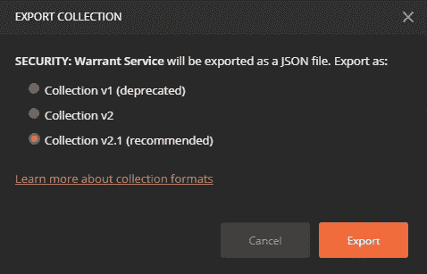
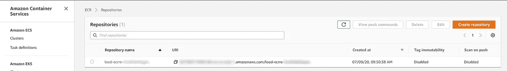
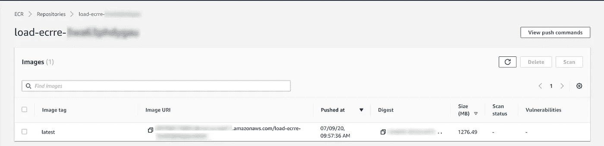
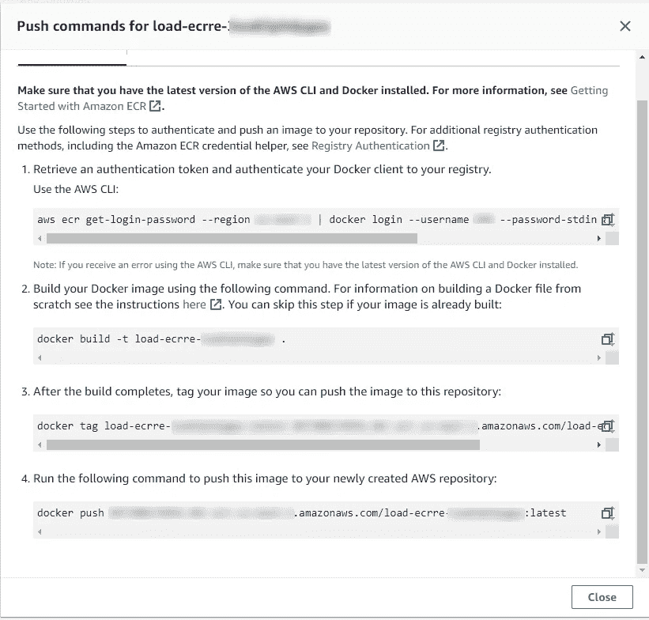
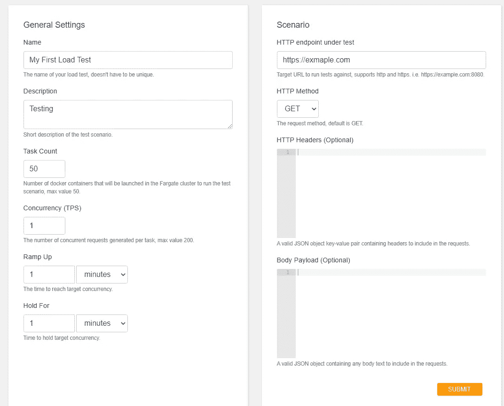
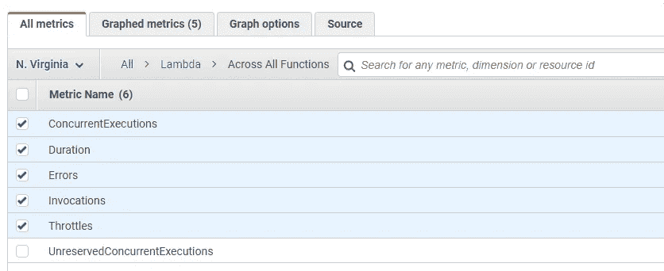
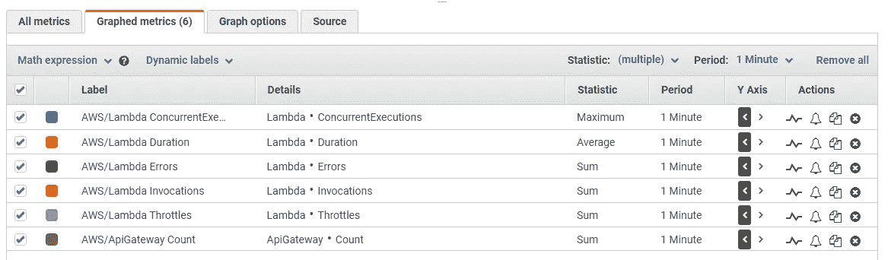
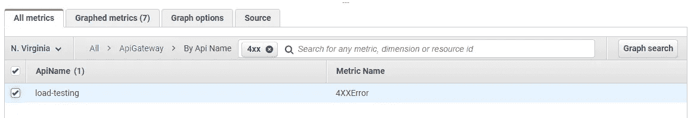

# 如何用 Postman 和 AWS 轻松加载测试无服务器应用

> 原文：<https://betterprogramming.pub/how-to-easily-load-test-serverless-apps-with-postman-and-aws-912de7f1f7e0>

## 负载测试应该需要几天，而不是几周。我们有现成的工具…免费的

丹·弗里曼在 [Unsplash](https://unsplash.com?utm_source=medium&utm_medium=referral) 上拍摄的照片

当你向一个软件工程师提到负载测试时，十有八九你会看到他们脸上有一丝畏缩。为什么？因为历史上，负载测试是痛苦的。

构建自动化测试脚本是单调乏味的，开发人员在最初的构建过程中没有考虑到大规模的性能，并且没有人知道如何解决由此产生的问题。

听起来像是一场灾难。不可避免的灾难，但还是一团糟。

[马太·亨利](https://unsplash.com/@matthewhenry?utm_source=medium&utm_medium=referral)在 [Unsplash](https://unsplash.com?utm_source=medium&utm_medium=referral) 上拍照

输入无服务器。如果你已经用 FaaS(作为服务的功能)开发了你的应用，你很幸运。你可能已经知道 AWS Lambda 的许多好处，但是你现在也可以在上面添加*易负载测试*。

无服务器应用背后的一个核心原则是 API 第一，这意味着你能够通过端点充分运用系统。为了加载测试，您所需要的只是一种将这些请求链接在一起以构建您的测试脚本的方法。

一旦你有了你的测试脚本，你需要一个工具来大规模运行它们。我们在 AWS 的好朋友为我们提供了这样一个工具。

最后，您需要能够在负载测试运行时监控系统健康。你猜怎么着？AWS 也让我们了解了这一点。

# 使用 Postman 来构建您的测试脚本

[科学高清照片](https://unsplash.com/@scienceinhd?utm_source=medium&utm_medium=referral)上 [Unsplash](https://unsplash.com?utm_source=medium&utm_medium=referral)

邮差将作为你的脚本生成器。您应该有一组您希望看到在负载下执行的业务流程，Postman 将帮助协调这些流程。

如果您已经使用了 Postman 并构建了贯穿业务流程的[集合](https://www.postman.com/collection/)——太好了！您可以使用它们，无需任何额外的设置。如果您没有，我强烈推荐您使用 [Postman Interceptor](https://www.postman.com/product/postman-interceptor/) 并浏览一些业务流程。

拦截器将记录所有通过您的浏览器发出的请求，留给您一个集合，该集合与您的应用程序完全一样。之后你所要做的就是参数化请求(如果必要的话),这样它们就可以正确地[链接在一起](https://blog.postman.com/extracting-data-from-responses-and-chaining-requests/)进行多次运行。

当您根据自己的喜好配置了集合后，将其作为集合 v2.1 导出到 JSON。

# 配置负载测试工具

我们将使用 AWS 创建的[负载测试机制](https://aws.amazon.com/solutions/implementations/distributed-load-testing-on-aws/)。开箱即用，它不支持 Postman 集合，但我们可以通过 Postman 的 CLI 快速修改它以运行集合— [Newman](https://learning.postman.com/docs/running-collections/using-newman-cli/command-line-integration-with-newman/) 。

按照网页上的部署说明将负载测试资源堆栈部署到您的 AWS 帐户中。当栈正在部署时，我们可以进行支持 Postman 所需的代码修改。

为 AWS 负载测试工具克隆 [GitHub 存储库](https://github.com/awslabs/distributed-load-testing-on-aws)并导航到`.\source\container`文件夹。接下来，执行以下步骤:

1.  将导出的 Postman 集合 JSON 添加到文件夹中。
2.  添加一个名为`test.json`的新文件，内容如下:

您可以将第 5 行的`iterations`中的值更改为您希望收集运行的次数。

第 11 行的`script`值将是您从 Postman 导出的集合的名称。

3.更新`Dockerfile`以包含新的 JSON 文件

至此，我们完成了对源代码的编辑。现在我们需要将我们的变更推进到 ECS 中。

# 更新 AWS 中的负载测试

到目前为止，我们部署到 AWS 中的堆栈应该已经完成了。我们现在可以进入 [ECS 服务](https://console.aws.amazon.com/ecs/home)并导航到页面左侧的 Amazon ECR Repositories 链接。

在您的列表中选择负载测试存储库，以显示图像列表。

在这里，您想要点击右上角的`View push commands`按钮来获得一组特定于您的存储库的命令。给出了四个命令来用我们的更改更新存储库。

在本地机器上，打开命令提示符并导航到`.\source\container`文件夹。复制并粘贴 AWS 给您的四个命令，以便更新图像。

注意:如果您需要对映像进行多次更改，请确保在步骤 2 的命令末尾添加'— no-cache '。

命令运行完毕后，我们就可以运行测试了！

# 运行负载测试

在堆栈完成部署之后，您应该会收到一封电子邮件，其中包含用户名、密码和负载测试仪表板的链接。找到那封邮件，点击控制台链接，用给定的凭证登录。

点击页面顶部的`Create Test`按钮，导航到负载测试设置。在名称、描述和任务计数字段中填入测试所需的值。

我们对`Dockerfile`和`test.json`的修改使得*并发*、*上升*、*等待*和*测试中的 HTTP 端点*字段变得无用，但是它们仍然是提交表单所必需的。只需在字段中填入您想要的任何值—当您点击提交时，这些值将被忽略。

*任务计数*字段将在您的集群中旋转 X 数量的容器来运行您的收集。Fargate 一次最多只能运行 100 个容器，但是这个表单最多只能运行 50 个。如果您希望将吞吐量增加到 100，您可以打开浏览器开发工具，将限制从 50 更改为 100。

当你点击提交按钮，它将旋转所有的容器，并开始执行你的邮差收集！

# 监视

照片由[克里斯·阮](https://unsplash.com/@cspek?utm_source=medium&utm_medium=referral)在 [Unsplash](https://unsplash.com?utm_source=medium&utm_medium=referral) 上拍摄

当负载测试运行时，您需要监控应用程序的性能。对于无服务器应用，我们希望关注两个方面:

*   基础设施如何扩展
*   您的代码如何处理缩放

为此，我们可以制作两个 CloudWatch 图来进行实时监控。

# **基础设施扩展**

我们想全面了解一下 API Gateway 和 Lambda 函数。如果我们的应用程序不能优雅地处理负载，我们将得到节流事件，应用程序将变得缓慢和无响应。

在 [Cloudwatch](https://console.aws.amazon.com/cloudwatch/home) 中，导航至指标控制台。点击所有职能部门的 Lambda 指标>。您想要启用*并发执行*、*持续时间*、*错误*、*调用*和*节流*。

接下来，我们要查看 ApiGateway >跨所有 API >计数指标。

单击图表化指标选项卡，并更改统计类型和周期以匹配下图。

就基础设施扩展而言，这将涵盖大部分无服务器应用程序。如果您使用其他 AWS 服务，请随意添加其他指标。图表将实时更新，向您显示所有这些统计数据的值。

# **应用缩放**

您还想看看您的应用程序在测试期间是否抛出了任何错误。由于系统是通过 API Gateway 运行的，我们希望监控 API 消息的响应。

在一个新的 CloudWatch 图中，您想要查看所有 API 的`4XXError`和`5XXError`指标。点击 ApiGateway >的 Api 名称>过滤`4xx`，选择所有结果。

取下过滤器，对`5XX`进行同样的操作。

如果您遇到 lambda 函数使用的 AWS 服务的任何节流问题，它们必定会通过您的 API 出现 400 或 500 响应。

这两个图表将向您展示无服务器应用程序在负载测试中的运行状况。如果您看到错误开始出现，您可以修改图形以显示特定的 lambda 函数，并开始深入研究日志。

# 结论

负载测试不一定很难。您希望看到您的应用程序在规模上是否像在开发环境中一样无缝地运行。

Postman 使您能够通过浏览器记录和回放您的业务流程。这是该领域将要做的工作的一对一副本。

AWS 使您能够扩展回放，并以每分钟数千个请求的速度访问您的应用程序。它还为您提供了一种机制来查看应用程序的运行状况，因为它可以根据工作负载进行调整。

最重要的是，当你完成了负载测试，你就对你的应用程序的运行成本有了一个很好的了解。正如我以前写过的，[预测无服务器成本可能很困难](https://medium.com/better-programming/5-steps-to-making-a-predictable-cost-model-for-aws-serverless-projects-78d78909bb82)，但这可以被视为事实的来源。使用生产工作负载测试系统，并通过 AWS 计费服务查看成本明细。

不要跳过负载测试。当你的应用达到黄金时段时，你需要知道它将会执行。你已经做出了正确的选择，选择无服务器构建你的应用。让我们在它上面打个蝴蝶结，证明它在规模上的表现有多好。

玩得开心！