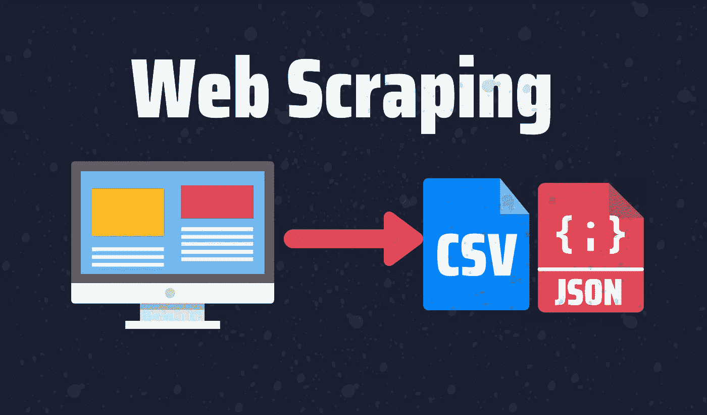
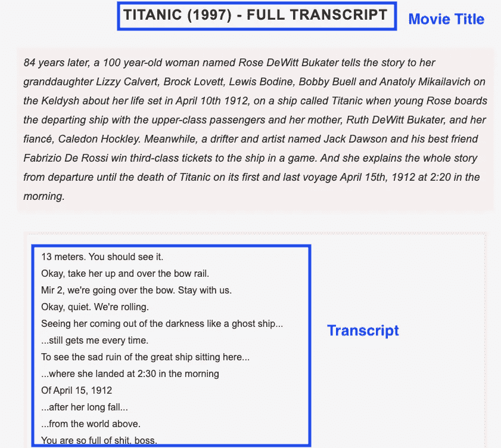
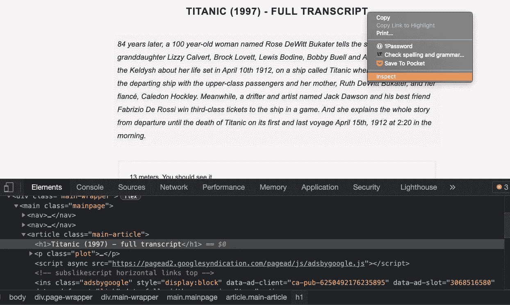
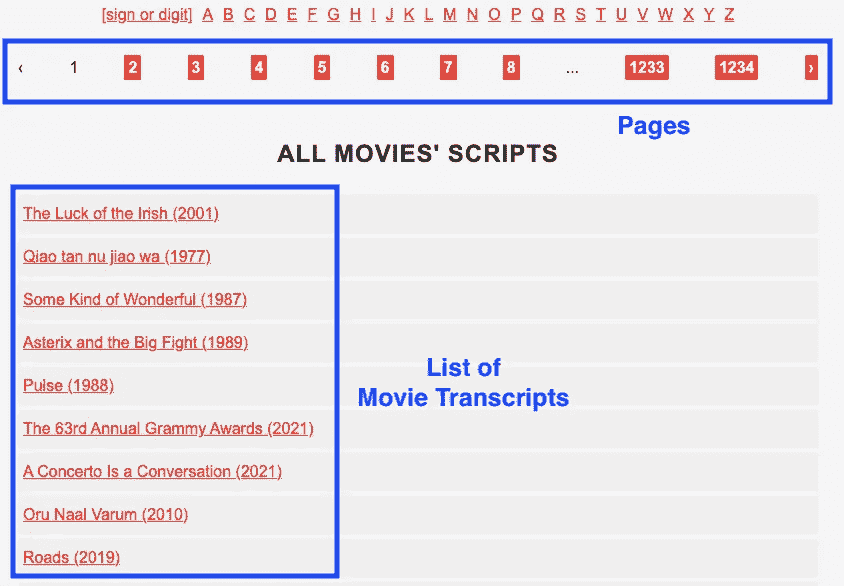
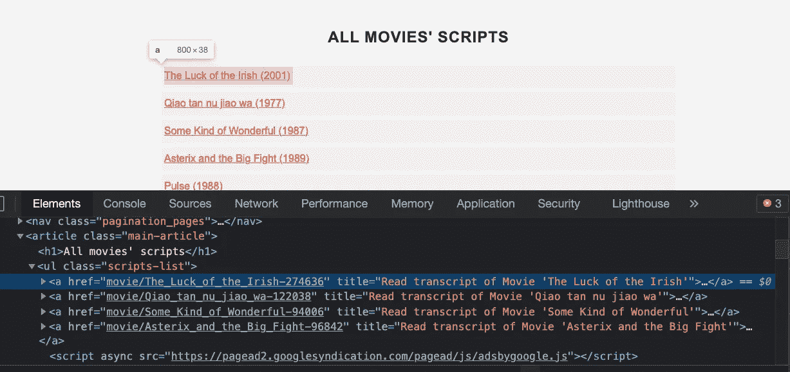

# 如何使用 Python 轻松抓取网站的多个页面

> 原文：<https://betterprogramming.pub/how-to-easily-scrape-multiple-pages-of-a-website-using-python-73e85bd06f8c>

## 使用 Python 从网站提取数据的简单指南



图片由作者提供。

数据无处不在。您访问的每个网站都包含一些以可读格式显示的数据，您可以在项目中使用这些数据。虽然您可以轻松地复制和粘贴这些数据，但对于大量数据，web 抓取是最佳解决方案。

学习网络抓取在开始时可能很有挑战性，但是如果你从正确的网络抓取库开始，事情会变得容易得多。这就是为什么在这个分步指南中，我将向您展示如何使用 Python 最简单的 web 抓取库 [Beautiful Soup](https://www.crummy.com/software/BeautifulSoup/bs4/doc/) 来抓取一个网站的多个页面。

本指南将分为两个部分。在第一部分中，我将向您展示如何抓取单个页面，而第二部分将基于第一部分中使用的代码重点抓取多个页面。

下面，您将找到本指南涵盖的主题:

```
**Table of Contents** 1\. [What Do You Need To Scrape the Web?](#3441)
2\. [Setting Up Beautiful Soup](#571e)
3\. [Section 1: Scraping a Single Page](#ef80)
 - [Importing Libraries](#9e17)
 - [Get the HTML of the website](#8b1b)
 - [Analyzing the website and HTML code](#d3ec)
 - [Locating an element with Beautiful Soup](#f337)
 - [Exporting data in a txt file](#6fb2)
4\. [Section 2: Scraping Multiple Transcripts and Pages](#7dcc)
 - [Getting the href attribute](#3b90)
 - [Locating multiple elements with Beautiful Soup](#bb9d)
 - [Looping through each link](#7c40)
```

# 刮网需要什么？

1.  美汤:是一个 Python 包，用于抓取不运行 JavaScript 的网站。美丽的汤帮助我们解析 HTML 和 XML 文档。它为解析过的页面创建一个解析树，可以用来从 HTML 中提取数据。不需要之前的美汤知识。你将从零开始学习这里的一切！
2.  [请求](https://pypi.org/project/requests/)库:请求库是用 Python 发出 HTTP 请求的标准。我们将使用它和美丽的汤一起得到一个网站的 HTML。
3.  Python:要学习本教程，你不需要成为 Python 专家。然而，你至少需要知道`for`循环和列表在 Python 中是如何工作的。

在我们开始之前，请确保您的计算机上安装了 Python 3.x。如果有，那就从教程开始用 Python 设置美汤吧！

*注:我之前提到过，美汤会帮我们刮不运行 JavaScript 的网站，所以如果你打算刮 JavaScript 驱动的页面，可以查看我做的这个另外的* [*指南*](https://medium.com/swlh/web-scraping-basics-scraping-a-betting-site-in-10-minutes-8e0529509848) *。*

我们会看到很多在美汤里经常用到的函数和方法。要记住所有这些，查看我创建的**网页抓取备忘单**。

[](https://medium.com/geekculture/web-scraping-cheat-sheet-2021-python-for-web-scraping-cad1540ce21c) [## 网络抓取备忘单(2021)，用于网络抓取的 Python

### 网页抓取完全指南:美丽的汤，硒，刺痒，XPath，等等！

medium.com](https://medium.com/geekculture/web-scraping-cheat-sheet-2021-python-for-web-scraping-cad1540ce21c) 

# 设置漂亮的汤

*   安装 Beautiful Soup:在命令提示符或终端中运行以下命令:

```
pip install bs4
```

*   安装解析器:我们需要一个解析器从 HTML 文档中提取数据。在本指南中，我们将使用`lxml`解析器。要安装此解析器，请运行以下命令:

```
pip install lxml
```

*   安装请求库:在命令提示符或终端中运行以下命令:

```
pip install requests
```

该编码了！

# 第 1 部分:抓取单个页面

我将指导您完成我们构建第一个 scraper 所需的每一行代码。您可以在本文末尾找到完整的代码。我们开始吧！

## 导入库

以下是美汤刮痧需要的库:

```
from bs4 import BeautifulSoup
import requests
```

## 获取网站的 HTML

我们要刮一个网站，里面有几百页的电影抄本。我们将从抓取一页开始，然后我将向您展示如何抓取多页。

首先，我们定义链接。在这种情况下，我选择电影*泰坦尼克号*的抄本，但你可以选择任何你想要的电影。然后，我们向网站发送一个请求，并获得一个响应，我们将该响应保存在`result`变量中。在这之后，我们使用`.text`的方法来获取网站的内容。最后，我们使用`lxml`解析器获得`soup`，它是包含嵌套结构中所有数据的对象，我们稍后将重用这些数据。

```
website = 'https://subslikescript.com/movie/Titanic-120338'
result = requests.get(website)
content = result.text
soup = BeautifulSoup(content, 'lxml')
print(soup.prettify())
```

一旦我们有了`soup`对象，使用`.prettify()`就可以很容易地获得可读格式的 HTML。虽然我们可以使用文本编辑器中打印的 HTML 来定位元素，但是直接找到我们想要的特定元素的 HTML 代码要好得多。我们将在下一步中这样做。

## 分析网站和 HTML 代码

在我们继续编写代码之前，重要的一步是分析我们想要抓取的网站和获得的 HTML 代码，以便找到抓取网站的最佳方法。下面，你可以找到一张成绩单的截图。要抓取的元素是电影片名和剧本。



要获取特定元素的 HTML 代码，请按照下列步骤操作:

1.  去你想要的成绩单的网站。
2.  将鼠标悬停在电影标题或脚本上，然后右键单击。将显示一个列表。选择“Inspect”打开页面的源代码。



下面，您可以找到单击 inspect 后获得的 HTML 代码的较小版本。在下一步中，我们将使用这个 HTML 代码作为定位元素的参考。

## 用美丽的汤定位元素

在美丽的汤里找到一个元素很简单。你只需要将`.find()`方法应用到之前创建的汤里。

例如，让我们定位包含电影标题、描述和脚本的盒子。它在一个`article`标签中，有一个名为`“main-article”`的类。我们用以下代码找到了这个盒子:

```
box = soup.find('article', class_='main-article')
```

现在我们来定位电影片名和剧本。电影标题在一个`h1`标签中，没有类名。定位后，我们使用`.get_text()` 方法获取节点内的文本:

```
title = box.find('h1').get_text()
```

这个脚本在一个`div`标签中，有一个名为`”full-script”`的类。为了获得本例中的文本，我们将修改`.get_text()`方法中的默认参数。首先，我们设置`strip=True`来删除前导和尾随空格。然后我们在分隔符`separator=’ ‘` 上添加一个空格，这样单词在每一个新行之后都有一个空格(`\n`)。

```
transcript = box.find('div', class_='full-script')
transcript = transcript.get_text(strip=True, separator=' ')
```

到目前为止，我们已经成功地收集了数据。打印`title`和`transcript`变量，确保到目前为止一切正常。

## 在 txt 文件中导出数据

如果需要，您可以导出抓取的数据，以便以后重复使用。您可以用 CSV、JSON 和更多格式存储数据。对于这个例子，我将把提取的数据存储在一个`.txt`文件中。

为此，我们需要使用`with`关键字，如下面的代码所示:

```
with open(f'{title}.txt', 'w') as file:
    file.write(transcript)
```

请记住，我正在使用`f` -string 将文件名设置为电影标题。运行代码后，一个`.txt`文件应该位于您的工作目录中。

既然我们已经成功地从一页中抓取了数据，我们就可以从多页中抓取文本了！

# 第 2 部分:抓取多个抄本和页面

下面，你可以找到有电影抄本的网站首页截图。该网站有 1234 页，每页大约有 30 个电影脚本。



在第二部分中，我将向您展示如何通过获取每个链接的`href`属性来抓取多个链接。首先我们要修改网站来刮。上面显示的网站链接是[subslikescript.com/movies](https://subslikescript.com/movies)

我们新的网站变量如下:

```
root = 'https://subslikescript.com'
website = f'{root}/movies'
```

我还定义了一个`root`变量，它将帮助我们稍后抓取多个页面。

## 获取 href 属性

让我们首先获得一页上列出的 30 部电影的`href`属性。为此，检查上面截图中“电影抄本列表”框内的任何电影标题。

在这之后，你应该得到 HTML 代码。一个`a`标签应该以蓝色突出显示。每个`a`标签属于一个电影标题。



如您所见，`href` 中的链接不包含根`subslikescript.com`。这就是为什么我在之前定义了一个`root`变量，以便以后连接它。

让我们定位页面上的所有`a`元素。

## 用美丽的汤定位多种元素

为了在美丽的汤里找到多种元素，我们必须使用`.find_all()`方法。我们需要添加参数`href=True`来提取对应于每个电影脚本的链接。

```
box.find_all('a', href=True)
```

为了从`href`中提取链接，我们必须将`['href']`添加到上面的表达式中。然而，`.find_all()`方法将返回一个列表，所以我们必须循环遍历它，并在循环中逐个获取`hrefs`。

```
for link in box.find_all('a', href=True):
    link['href']
```

为了存储链接，我们可以使用列表理解，如下所示:

```
links = [link['href'] for link in box.find_all('a', href=True)]
print(links)
```

如果你打印链接列表，你会看到我们想要刮的链接。下一步我们将刮去每一页。

## 在每个链接中循环

为了抓取每个链接的副本，我们将遵循之前对一个副本所做的相同步骤。这一次，我们将在下面的`for`循环中包含这些步骤。

```
for link in links:
    result = requests.get(f'{root}/{link}')
    content = result.text
    soup = BeautifulSoup(content, 'lxml')
```

您可能还记得，我们之前存储的链接不包含根`subslikescript.com`，所以我们必须用表达式`f’{root}/{link}’`将它连接起来。

代码的其余部分与我们为本指南的第一部分编写的代码相同。该项目的完整代码如下:

如果您想浏览网上列出的页面，您有两种选择:

*   选项 1:检查网站上显示的任何页面(例如 1、2、3…1234)。您应该获得一个包含每个页面链接的`href`属性的`a`标签。一旦有了链接，将它们与根连接起来，并遵循第 2 节中所示的步骤。
*   选项 2:转到第 2 页，复制获得的链接。应该是这样的:[subslikescript.com/movies?page=2](https://subslikescript.com/movies?page=2)。如你所见，网站的每个页面都遵循一种模式:`f’{website}?page={i}’`。如果你想浏览前十页，你可以重复使用网站变量，在数字`1`和`10`之间循环。

# 观看视频教程

就是这样！您刚刚学习了如何使用 Python 抓取网站的多个页面。如果有什么不清楚的，查看下面的视频教程。

[*与 3k+人一起加入我的电子邮件列表*](https://frankandrade.ck.page/bd063ff2d3) *以获得我在所有教程中使用的 Web 抓取小抄(免费 PDF)。*