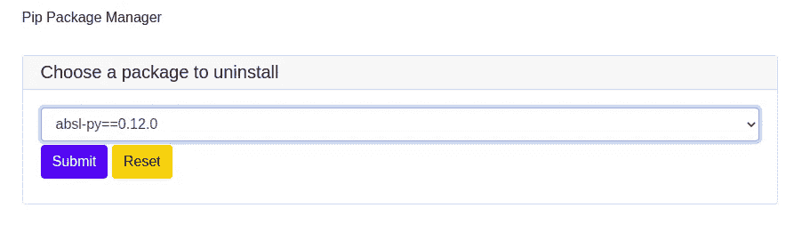
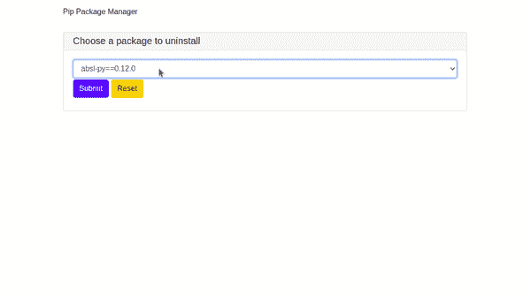
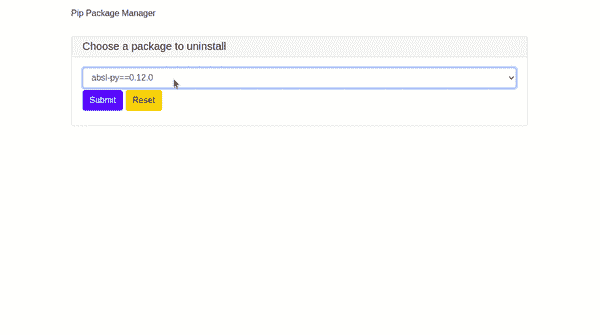

# 如何通过 PyWebIO GUI 轻松卸载 Python 包

> 原文：<https://betterprogramming.pub/how-to-easily-uninstall-python-packages-through-a-pywebio-gui-ab33fb66a4ce>

## 创建您自己的软件包卸载程序 GUI


Christopher Gower 在 [Unsplash](https://unsplash.com?utm_source=medium&utm_medium=referral) 上拍摄的照片。

当我们试验新项目时，我们最终会安装许多 Python 库。有时候，我们想做一次大扫除，把那些我们不再需要的旧的清除掉。通常，您会运行`pip list`命令来获取已安装的包。但是要找到我们想要的有点难，因为结果很长。此外，它也没有很好地概述安装了哪些包。

为了解决这个问题，我们将使用 [PyWebIO](https://pywebio.readthedocs.io/en/latest/) Python 库创建一个简单的 GUI。它将显示所有已安装的软件包，我们可以很容易地选择哪些要删除。

我们开始吧！

# 创建图形用户界面

PyWebIO 是一个 Python 库，用于创建简单的 web 应用程序。它不需要任何 HTML 或 JavaScript 知识。

我写了一篇关于如何使用另一个用于创建 web 应用程序的库 [Streamlit](https://docs.streamlit.io/en/stable/) 构建日语发音检查器的文章 [asyncio](/how-to-build-a-japanese-pronunciation-checker-with-python-and-wit-ai-7f25d63c896d#) 库的[协程](https://docs.python.org/3/library/asyncio-task.html#coroutine)来等待卸载任务完成。进度条会相应更新。

*   我们将使用`select`输入类型显示一个包含按字母顺序排序的包的下拉菜单。*   最后，我们将显示一条消息，说明包删除已经完成。

现在让我们运行代码:

```
python3 remove_packages.py
```

您的浏览器将自动打开。您应该会看到这样一个页面:



pip 管理器 GUI 的屏幕截图

这个下拉列表的优点是它有一个内置的自动选择特性。这使得包搜索更加容易。我只需要输入软件包名称的第一个字母，它就会自动被选中:



搜索以字母 P 开头的包

我知道我不再需要`pipman`的包裹了。我将点击“提交”来删除它:



移除包

如果您检查您的终端窗口，您应该会看到如下输出:

```
Found existing installation: pipman 0.0.3
Uninstalling pipman-0.0.3:
Successfully uninstalled pipman-0.0.3
```

厉害！请注意，没有提示进行是/否确认，软件包已被成功删除。

# 结论

在这篇简短的教程中，我向您展示了如何使用 PyWebIO 库用几行代码创建一个 GUI。现在您知道了如何从脚本中移除 Python 包。您还学习了如何使用`asyncio`库调用异步函数。

在 web 浏览器中显示包给了我们一个更好的概览。

我很高兴看到 Khuyen Tran 的文章概述了 PyWebIO 的基本特性。如果您对更多示例感兴趣，请查看。

我希望你今天学到了有用的东西。感谢您的阅读和快乐编码！