# 如何在 VS 代码中一次编辑多行

> 原文：<https://betterprogramming.pub/how-to-edit-multiple-lines-at-once-in-vs-code-290373328a12>

## 有针对性实践的真实使用案例


作者图片(通过 Canva.com)

作为一名程序员，你在代码编辑器中花费了大量的时间，所以减少与编辑器的摩擦是至关重要的。

在 VS 代码中，我最喜欢的减少摩擦的特性之一是多游标。您可以在单行或多行上插入多个光标，并同时编辑代码中的多个位置。例如，多游标允许您以惊人的速度在几个 CSS 行中更改值:

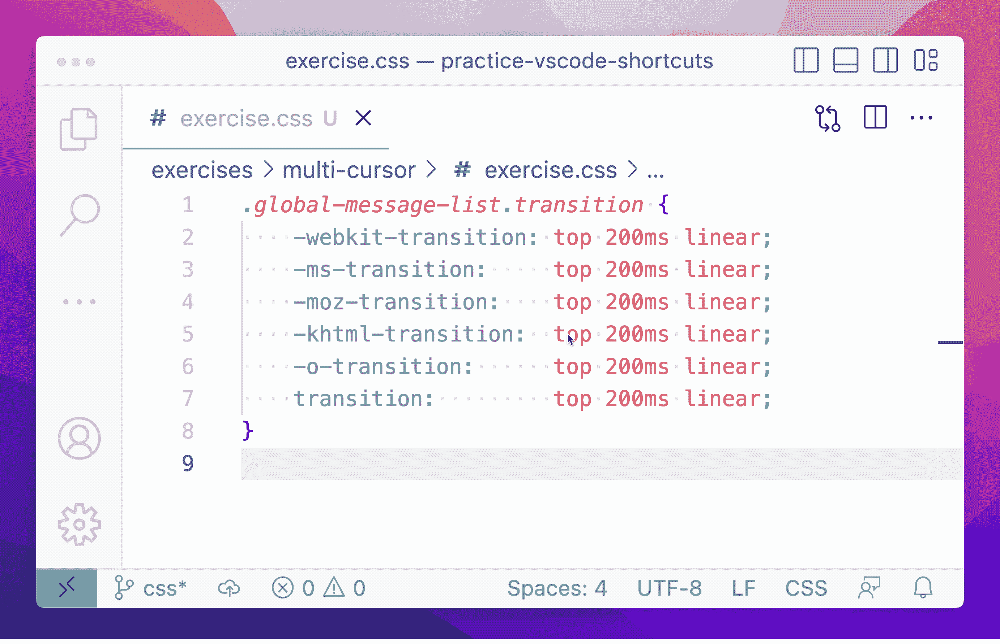

作者提供的所有图片和 gif

我将向您展示如何:

*   使用或不使用鼠标创建多个光标
*   自定义多光标行为
*   使用引导练习在各种场景中练习多光标

我们将使用 CSS 示例来说明添加多光标的不同方式。如果您想将其复制并粘贴到编辑器中，下面是代码，并按照示例进行操作:

但是，正如您将在练习中看到的，多光标实用程序远远超出了 CSS 的范围。

# 用鼠标创建多个光标

您可以使用鼠标在任意位置插入多光标，也可以选择多行并在每一行的末尾插入多光标。

## 插入单个光标

在 Linux 和 Windows 上按住`Alt`,或者在 macOS 上按住`Option`,同时在鼠标指针下单击插入多光标:

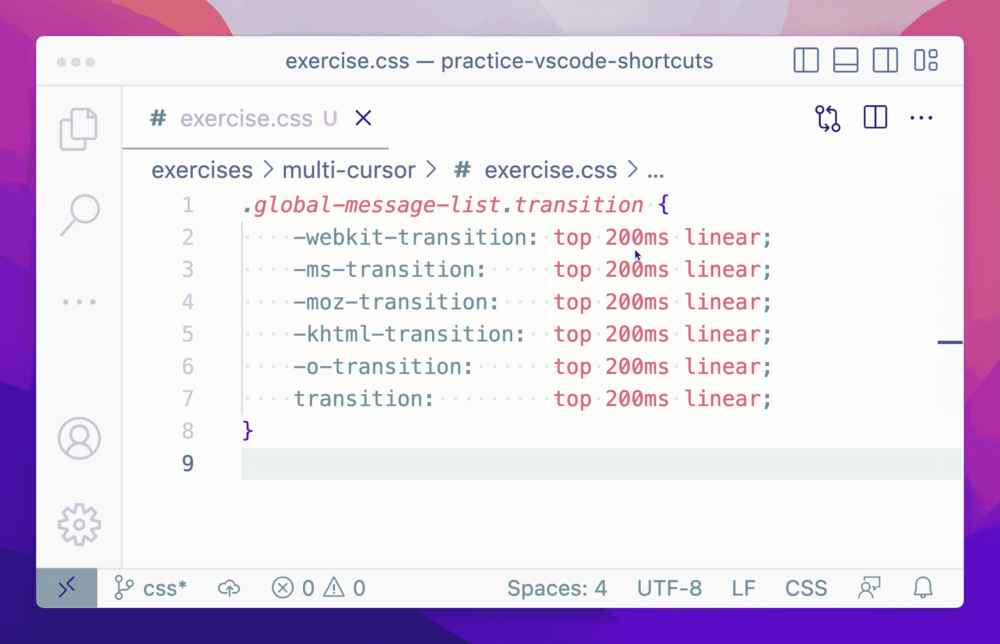

当你完成后，按下`Esc`移除你所有的多重光标。如果`Alt`不适合您，您可以在 VS 代码首选项中更改多光标修饰键。这在自定义多光标行为一节中有所描述。

## 在选定行的末尾插入光标

用鼠标突出显示几行，在 Linux 和 Windows 上按`Shift` + `Alt` + `I`，在 macOS 上按`Shift` + `Option` + `I`，在每一行的末尾插入多光标:


# 不用鼠标创建多个光标

在大多数情况下，避免使用鼠标是值得的。VS 代码有键绑定，可以在光标上下插入多个光标，或者在匹配某些选定文本的位置添加多个光标。

所有这些都不需要从键盘上抬起你的手。

## 在当前光标的上方和下方插入光标

在 Linux 和 Windows 上按`Ctrl` + `Alt` + `Down` / `Up`，或者在 macOS 上按`Cmd` + `Option` + `Down` / `Up`，在当前光标的上方或下方插入多个光标:


## 在下一个匹配位置插入光标

选择一些文本，在 Linux 和 Windows 上按`Ctrl` + `D`，或者在 macOS 上按`Cmd` + `D`，将多个光标放在文档中与您的选择相匹配的下一位文本上:

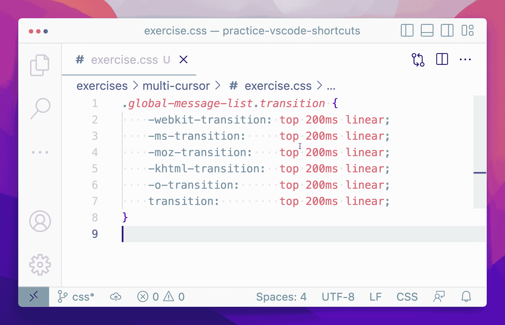

如果添加了过多的多光标，可以在 Linux 和 Windows 上使用`Ctrl` + `U`，或者在 macOS 上使用`Cmd` + `U`逐个撤销。

## 在所有匹配的位置插入光标

选择一些文本，在 Linux 和 Windows 上按`Ctrl` + `Shift` + `L`，或者在 macOS 上按`Cmd` + `Shift` + `L`，在所选文本的所有出现处插入多光标:

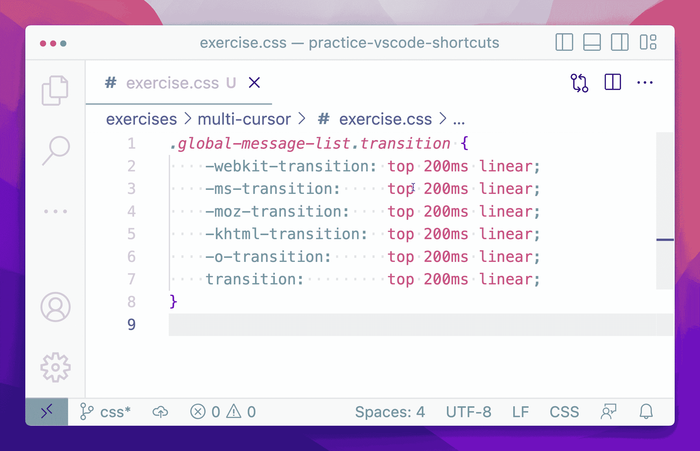

此快捷方式适用于整个打开的文件。如果您不小心处理最初选择的文本，您可能会在非预期的行上出现多个光标。

# 自定义多光标行为

您可以在 VS 代码设置中修改多光标的某些方面。例如，您可以更改多光标修饰键、重叠的多光标如何交互，以及修改所有多光标组合键来满足您的需要。

## 更改多光标修改器

在 Linux 和 Windows 上按`Ctrl` + `,`，在 macOS 上按`Cmd` + `,`，打开 VS 代码设置编辑器。然后，在搜索栏中搜索`multiCursorModifier`。

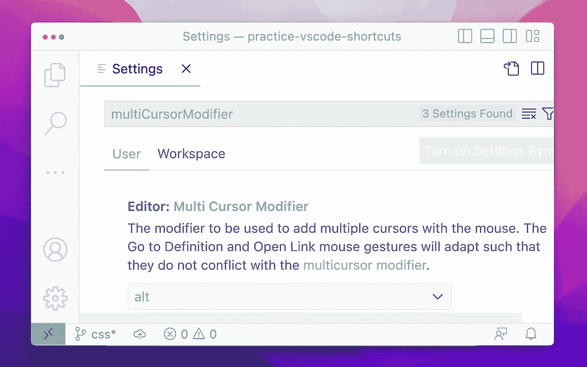

默认情况下，多光标修改键被设置为`alt`。在这个设置中，你可以在 Linux 和 Windows 上使用`Alt`或者在 macOS 上使用`Option`在你点击鼠标的任何地方插入多光标。

您可以将设置更改为`ctrlCmd`以使用 Linux 和 Windows 上的`Ctrl`键或 macOS 上的`Cmd`键。

## 更改重叠多光标行为

打开 VS 代码设置编辑器，搜索`multiCursorMergeOverlapping`:

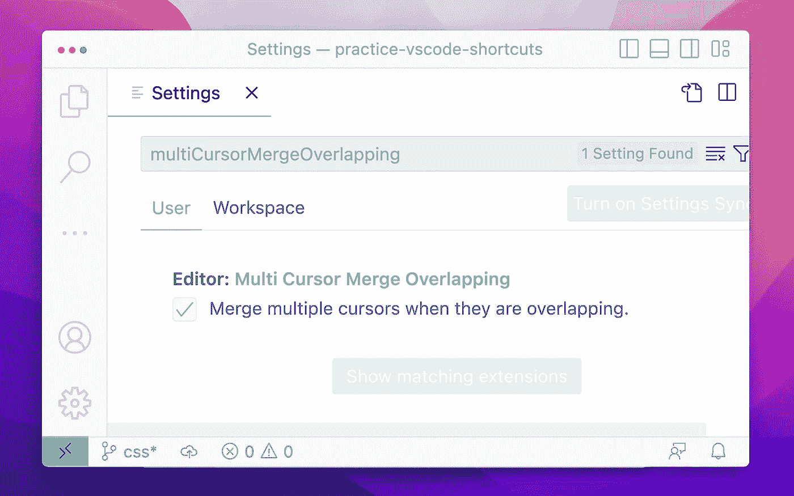

选中该框后，多个光标重叠时会合并:

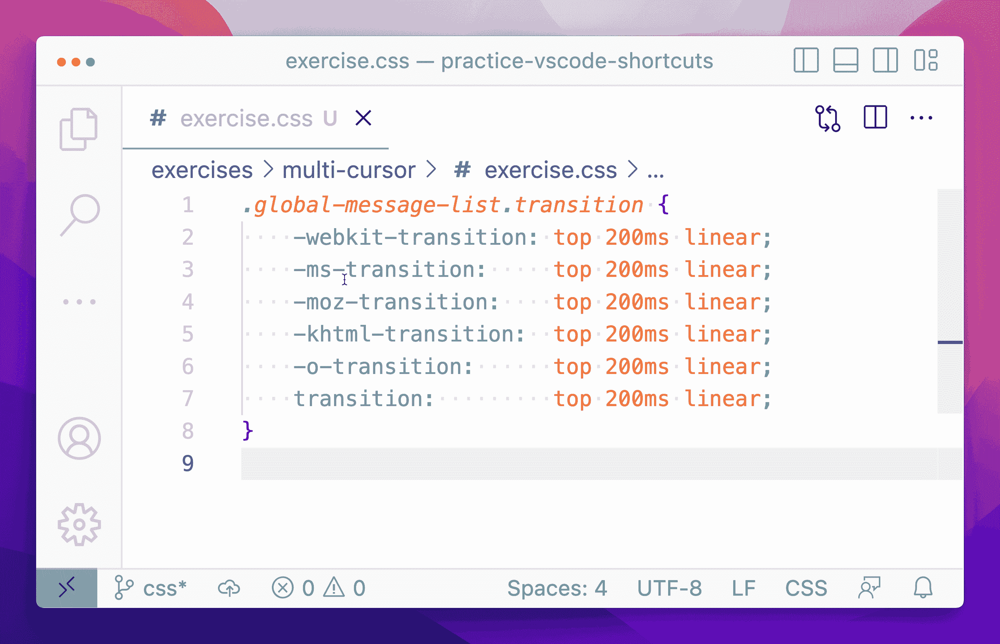

取消选中该框时，您可以创建具有重叠选择的多光标:


我个人不使用重叠的多光标。

## 修改多光标按键绑定

您可以使用 VS Code 的键盘快捷键编辑器来更改多光标操作的键绑定。

通过在菜单栏中导航到文件>首选项>键盘快捷键，或者在 Linux 和 Windows 上按`Ctrl` + `K` + `Ctrl` + `S`，或者在 macOS 上按`Cmd` + `K` + `Cmd` + `S`，打开编辑器:

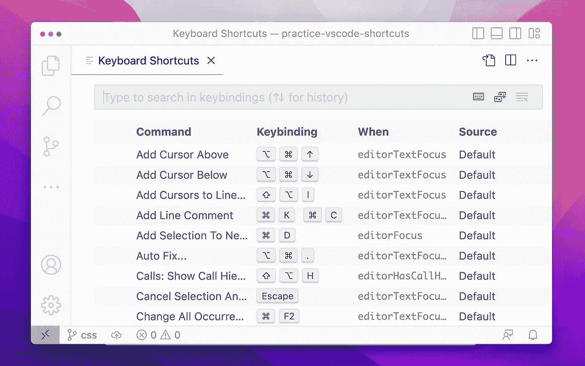

您可以修改几个多光标快捷方式:

*   `editor.action.insertCursorAtEndOfEachLineSelected`
*   `editor.action.insertCursorBelow`
*   `editor.action.insertCursorAbove`
*   `editor.action.addSelectionToNextFindMatch`
*   `editor.action.selectHighlights`
*   `editor.action.changeAll`
*   `cursorUndo`

首先，在搜索栏中键入要更改的快捷方式的 ID。然后单击列表中快捷项目左侧的编辑图标。

VS 代码提示您为快捷键输入新的击键序列:

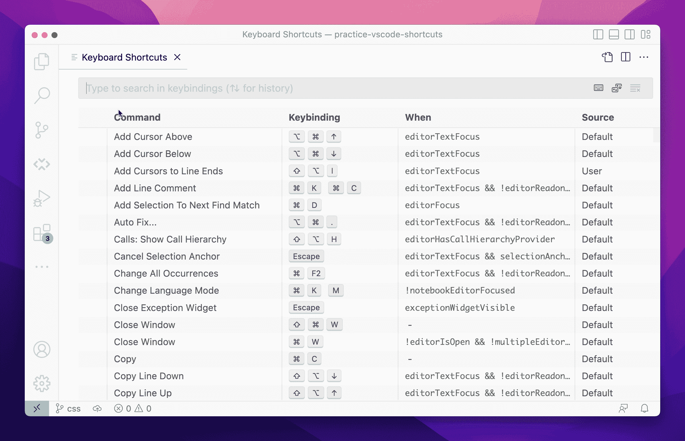

# 练习多光标

键盘快捷键只有在你能把它们输入肌肉记忆时才有用。

当你不得不停下来思考一个键盘快捷键时，你就中断了当前的思考过程，将一堆新信息转储到你的工作记忆中。因此，它会减慢你的编码速度，并通过用不相关的信息塞满你的大脑而使解决问题变得更加困难。

为了帮助你建立肌肉记忆，我整理了一些基于实际使用案例的指导性练习，这些练习让我的生活变得更加轻松。你可以修改它们，并将其作为[刻意练习](https://medium.com/gitconnected/the-secret-to-mastering-programming-777813442e15)计划的一部分。

## 练习 1:改变项目符号列表中的动词时态

我的日常工作是技术写作，也就是说我会写很多要点清单。

我发现自己经常做的一件事是改写一个介绍性的句子，并改变列表中所有动词的时态。例如，下面是我如何在初稿中写一个要点列表:

```
# Introduction

In this guide, you'll learn how to use multi-cursors in VS Code by:
- Creating multi-cursors with and without your mouse.
- Customizing multi-cursor behavior.
- Practicing multi-cursors through guided exercises.
```

后来在编辑的时候，我经常会选择缩短引导句，把列表中的动词时态改成祈使句:

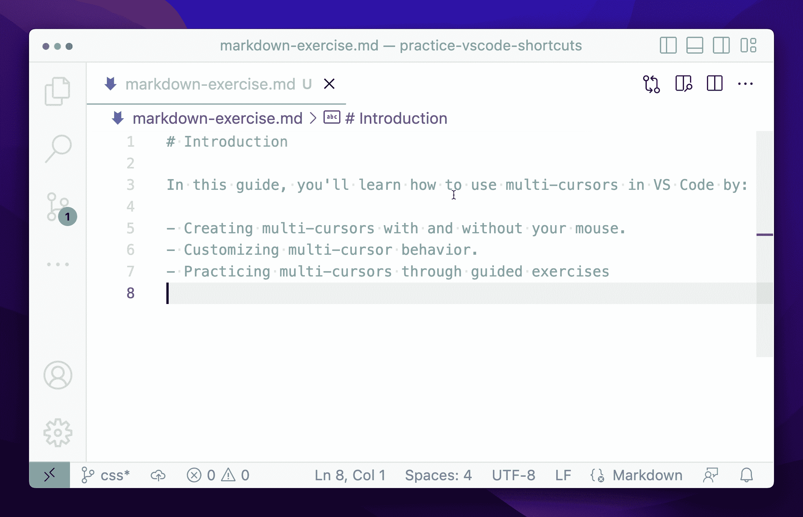

诀窍是选择列表中一个动词的-ing 结尾，然后按`Ctrl` + `D`将多个光标添加到列表中每个其他动词的 ing 部分。然后键入`e`替换每个动词的结尾。

当然，大多数列表中的动词并不像这个练习中的那样完美。你不能通过用 *e* 代替 *ing* 来把每个动词都转换成祈使句。但是这个技巧可以让您在一行中转换几个动词，并且可以大大减少许多列表的编辑时间。

相信我；我写了很多单子。

## 练习 2:垂直格式化数组

假设您想要重新格式化以下 Python 列表，以便每个项目都在单独的一行上:

```
my_list = ["one", "two", "three", "four", "five"]
```

您可以使用多光标快速重新格式化:

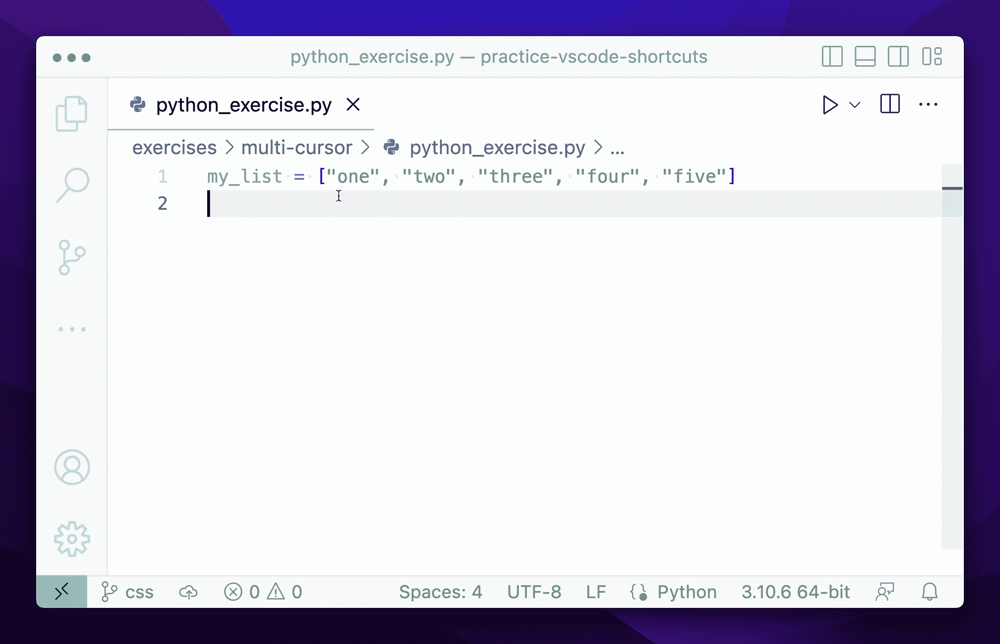

突出显示第一个逗号后的空格。然后按`Ctrl` + `D`(或者在 macOS 上按`Cmd` + `D`来匹配剩余逗号后的空格。最后，使用`Alt` + `Click`(或者 macOS 上的`Option` + `Click`)在列表的开头和结尾手动插入光标。

当然，有些语言有自动格式化程序可以自动完成这项工作，但我仍然发现自己做这件事的频率相对较高。将 markdown 中逗号分隔的列表转换成项目符号列表非常方便，我已经在几种配置语言中使用过它。

## 练习 3:编辑 JSON 对象

多游标可以让编辑 JSON 变得稍微容易一些。

例如，假设您想要将以下 JSON 数组中类型为`"B"`的每个 JSON 对象的维度更改为 500 乘 500:

有四个类型为`"B"`的对象，但是它们不是连续的。

通过高亮显示一行上的`type: "B"`并按下`Ctrl` + `D`(或 macOS 上的`Cmd` + `D`)在包含`type: "B"`的其他行上插入多个光标，选择`"B"`类型的所有对象。然后使用箭头键将每个光标移动到每个对象的尺寸:


当然，只有当所有对象都具有相同的结构时，这种方法才能完美地工作，如果您曾经花过五分钟时间查看真实世界的 JSON 数据，您就会知道情况并非如此。

不过，我仍然觉得这个技巧很有帮助。当你浏览一个文档时，你通常可以用它同时编辑至少六个左右的对象。

这仍然是一个重要的时间节省！