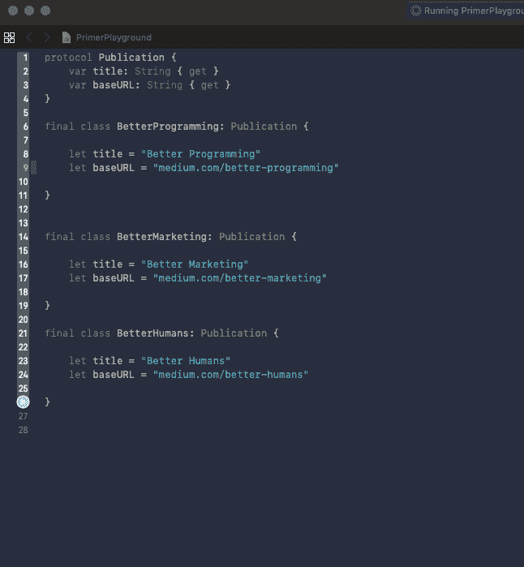
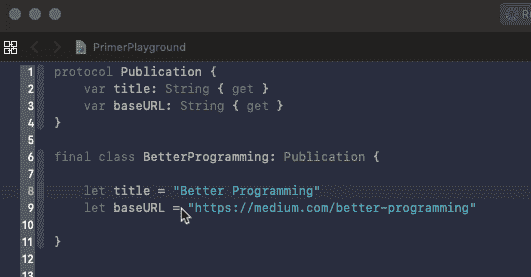
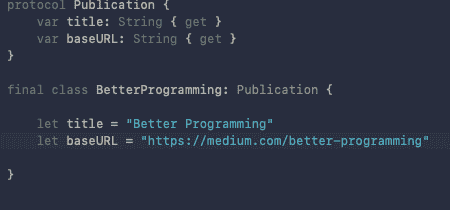

# 如何在 Xcode 中编辑文件的多行

> 原文：<https://betterprogramming.pub/how-to-edit-multiple-lines-of-a-file-in-xcode-5d7c43f01405>

## 重构变得简单多了

[王占山](https://unsplash.com/@jdubs?utm_source=unsplash&utm_medium=referral&utm_content=creditCopyText)在 [Unsplash](https://unsplash.com/search/photos/peace?utm_source=unsplash&utm_medium=referral&utm_content=creditCopyText) 上拍照

像 Sublime Text、Atom 和 VSCode 这样的 ide 已经有能力编辑多行代码很多年了，它为我节省了大量的时间。然而，Xcode 在这方面一直落后。

苹果在 2017 年推出 Xcode 9 时，推出了一个巨大的 Xcode 重构，但在新的 Edit All In Scope 之外，缺少多行编辑支持。

最后，在 Xcode 10 中，我们有能力选择多行来编辑我们的代码！

# Shift + Control +单击

首先，按住`Shift`和`Control (^)`然后点击你想要选择多行的地方，然后开始打字。一个小小的警告:不像其他文本编辑器，你可以点击同一行来取消多行选择，Xcode 还不支持。

按住 Shift + Control +点按，然后在 Xcode 10 中编辑多行

# Option +拖动

接下来，如果您按住`Option`并拖动多行，您可以选择这些行并开始键入以编辑您的代码:

按住 Option 键并拖移鼠标来选择 Xcode 10 中的多行

# Shift + Control +上/下箭头键

最后，如果您按下`Shift`、`Control`以及向上或向下箭头，您可以选择上一行或下一行的相同位置，然后编辑您的代码:

Shift + Control +上/下箭头键在 Xcode 10 中选择多行

你有它！我希望这能节省你大量的时间！