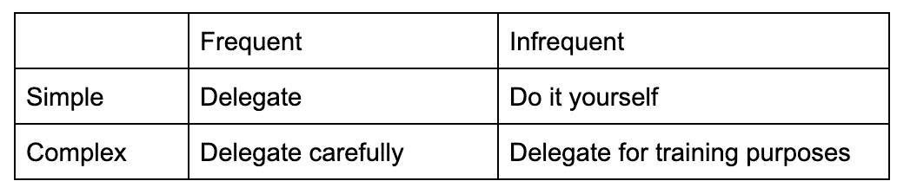

# 作为技术领导，有效地授权

> 原文：<https://betterprogramming.pub/how-to-effectively-delegate-tasks-as-a-technical-leader-b6d634497512>

## 工程领导中的教训和失误

由 [Unsplash](https://unsplash.com?utm_source=medium&utm_medium=referral) 上的[地图框](https://unsplash.com/@mapbox?utm_source=medium&utm_medium=referral)拍摄

做一名技术领导者很难。

作为一名技术负责人，你经常被期望作为一名个人贡献者继续表现出色，同时还承担额外的责任来帮助团队。这些额外的职责可能包括将工作分解为明确定义的任务，整理积压工作，区分工作的优先级，指导初级工程师，以及为团队解决障碍。

作为一名技术领导者，最难的部分是学会平衡你个人的工作和团队的需求。

你如何在帮助团队保持高效的同时完成自己的工作？你不可能什么都做，当然你也不想因为工作时间变长而累垮自己。

管理这种额外工作量的一个解决方案是学会有效地授权。所以问题是，什么时候你应该授权，什么时候你应该自己做一些事情？

# 委托矩阵

任务通常可以分为两类——复杂性和频率。任务可能简单，也可能复杂，并且可能需要频繁或不频繁地执行。我们可以使用这些属性来决定何时应该或不应该委派工作。

委托矩阵(空)

# 简单而频繁的任务

工程师喜欢将单调乏味的工作自动化。理想情况下，您必须经常做的任何事情都应该尽可能自动化。例如，如果您需要在每个 sprint 中收集团队工作的度量标准，看看是否有一种方法可以自动化这个过程。

在任务不能自动化的情况下，简单和频繁的任务应该被委派。这些可能是像主持站立会议或执行简单的代码审查这样的事情。简单和频繁的任务是团队中的任何人都应该能够在很少或没有额外培训的情况下完成的事情，所以不要错误地认为你必须自己做所有的事情。你是来帮助你的团队的，但你的团队也是来帮助你的。

# 简单且不常见的任务

如果一项任务很简单，很少需要做，那就自己做。如果你向别人解释如何完成任务比你自己去做要花更长的时间，那就自己去做吧。

请不要误会。培训团队成员和帮助他人成长有很多价值。然而，这些简单而不常见的任务通常不是某人工作的核心职责，对任何人的职业发展都不是必不可少的。

一个简单且不常见的任务示例可能是每季度运行一次脚本来生成报告。或者是购买即将到来的团队活动的门票——不要太激动人心，也不要太费时间。

# 复杂而频繁的任务

再次强调，尽你所能实现自动化。如果你能接受一项复杂而频繁的任务，并自动完成它，你应该这样做！

假设你不能自动完成任务，复杂和频繁的任务应该委派给你的团队成员，以帮助他们成长。作为一名技术主管，你擅长分解工作、规划项目、解决障碍和处理事件。培训你的团队成员来发展这些技能！

请一名团队成员领导您的团队被分配的下一个项目的规划会议。将把复杂的工作分解成小任务的练习委托给同事。下一次发生事件时，邀请一个队友和你一起调试问题。

当你能训练你的团队处理这些复杂和频繁的任务时，他们将在职业生涯中取得进步。这也解放了你，让你把时间和精力集中在其他地方，因为你不再是唯一有能力做这种工作的人。

# 复杂且不常见的任务

复杂和不常见的任务通常是最难委派的。这些任务不会定期发生，所以不会消耗你太多时间。他们可能对其他团队成员学习有价值，但是由于任务的不频繁，培训和委派工作的投资回报并不高。

复杂和不常见的任务应该作为延伸任务委派给你团队中的上升领导者。你可以请一位高级工程师帮助对他们去年夏天指导的实习生进行绩效评估。或者你可以请一位高级工程师做一些研究，然后对产品管理部门正在考虑但尚未承诺的新功能给出一个高水平的评估。

这些类型的任务并不经常出现，但对所有参与者来说都是很好的学习经历。

# 摘要

让我们回到委派矩阵。在这里，都填好了:

委托矩阵(已填写)

如你所见，你的大部分工作都可以被委派！作为技术负责人，您的职责是帮助团队保持高效，通常最好的方法是提前投入一些时间来培训团队成员，这样他们很快就可以独立处理最复杂的任务。

感谢阅读！