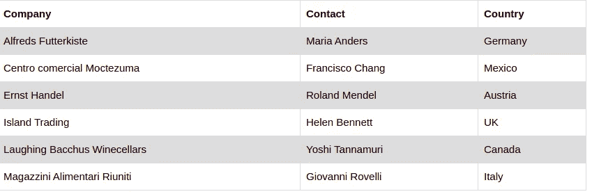
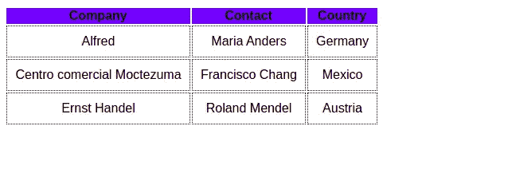
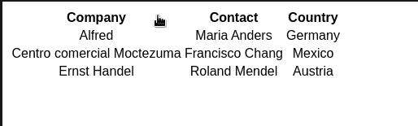
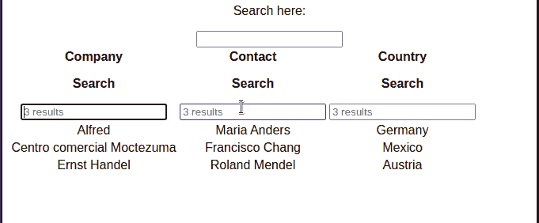
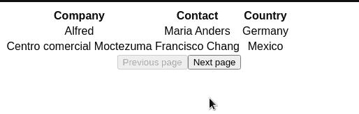
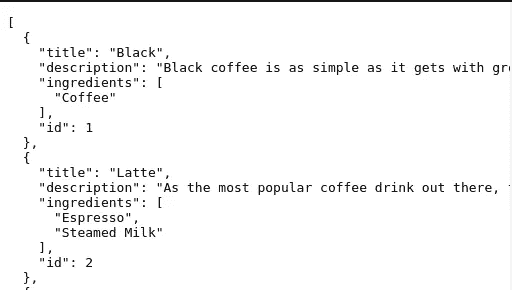
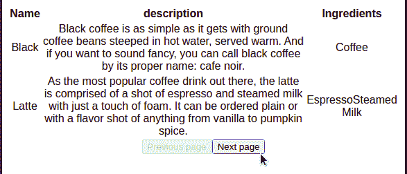

# 如何用 React 高效地显示表格中的数据

> 原文：<https://betterprogramming.pub/how-to-efficiently-display-data-in-tables-with-react-7e133bad5719>

## 使用 React Table 为您的桌子增压


照片由 [Xavier Foucrier](https://unsplash.com/@xavierfoucrier?utm_source=medium&utm_medium=referral) 在 [Unsplash](https://unsplash.com?utm_source=medium&utm_medium=referral) 上拍摄

在本文中，您将了解以下内容:

*   什么是反应表以及何时使用它
*   呈现基本表格
*   设计您的表格
*   使用 React 表库进行排序、过滤和分页
*   使用 React Table 将数据从 API 显示到表中

# 介绍

在普通的 JSX 生成表格已经很容易了。例如，要呈现一个简单的表，您可以编写以下代码:

虽然这适合于呈现数据，但是请考虑这样一种情况，您必须显示来自 API 的数百条记录。此外，在此之后，您将不得不编写额外的代码来排序和过滤您的单元格。因此，这将使你的应用程序逻辑更加复杂，难以阅读。

这就是[反应表](https://react-table.tanstack.com/)的用武之地。这是一个久经考验的库，通过几个简单的步骤呈现大量数据，使您的工作变得更容易。除此之外，它还内置了对排序、过滤和分页的支持。这意味着你可以花更少的时间编写不必要的逻辑，花更多的时间优化或增加新应用的功能。

既然说了它的优点，那就开始吧！

# 入门指南

## 项目初始化和设置

要具体化 React 项目，请运行以下终端命令:

```
npx create-react-app table-tutorial
```

完成后，安装 react-table 库，如下所示:

```
npm i react-table 
```

让我们现在写一些代码！为了尝试一下，我们将首先尝试渲染一个基本的表格。

# 反应表:基本用法

## 简单渲染

在本节中，我们将使用以下数据集:



来源: [W3 学校](https://www.w3schools.com/html/html_tables.asp)

在您的`src`文件夹中，创建一个名为`components`的目录。在`components`中，创建一个名为`BasicTable.js`的文件。

在`components/BasicTable.js`中，编写以下代码:

让我们一点一点地解构代码。

*   第四行:我们的`BasicTable`会接受两个道具`columns`和`data`。我们将通过这些道具加载数据集。
*   第 7–13 行:`[useTable](https://react-table.tanstack.com/docs/api/useTable)`钩子包含了一系列函数和数组，它们是我们显示记录所必需的。
*   第 14–15 行:将我们的数据集传递给`useTable`钩子。

现在让我们来呈现我们的表格 UI。为此，在`components/BasicTable.js`中添加以下代码:

尽管这段代码看起来有些吓人，但它还是比较容易理解的。

*   第 3 行:使用析构来传入我们的桌子道具。如果你想了解更多，巴哈伊·古勒·比尔吉已经写了一篇关于数组析构的[文章](https://medium.com/swlh/javascript-array-destructuring-es6-ec6b0d70e83c)。
*   第 5–11 行:告诉 React Table 呈现我们的标题。
*   第 13 行:再次使用析构将我们的道具传递给我们的`tbody`。
*   第 18–23 行:在这个部分呈现我们的记录。

我们现在已经对表格的后端进行了编码。留给我们的就是用代码复制我们的数据集。

在`App.js`中，编写下面的代码块:

*   第 1 行:创建标题。这里我们用的是`[React.useMemo](https://reactjs.org/docs/hooks-reference.html#usememo)`。这告诉 React 我们的数据并没有在每次渲染时被重新创建。因此，这将确保我们的应用程序保持优化。
*   第 18 行:创建我们的数据值。

我们现在需要将这些变量传递给我们的`BasicTable`组件。在`App.js`的`return`块中，编写以下代码:

```
return (
  <BasicTable columns={columns} data={data}/>
)
```

运行代码。这将是结果:


代码的输出

太神奇了！在下一节中，您将学习向该表添加 CSS。

最后，`components/BasicTable.js`应该是这样的:

## 样式化表格

向我们的`BasicTable`组件添加样式是一个简单的过程。我们只需要通过 props 将 CSS 添加到我们的`table`元素中。

在您的`BasicTable.js`中，添加一个`styles`对象，如下所示:

接下来，在`components/BasicTable.js`中，找到您的`return`块，并将其更改如下:

这些变化出现在第 3 行和第 19 行:

*   第 3 行:将我们的`thead`样式传递给我们的`thead`元素。
*   第 19 行:将我们的`td`样式传递给我们的`td`元素。

再次运行代码。这将是结果:



代码的输出

我们的桌子现在看起来稍微好一点了！在下一节中，我们将学习如何构建一个包含排序功能的表。

最后，`BasicTable.js`应该是这样的:

## 排序选项

借助 React Table 的强大功能，我们无需编写数百行代码就可以添加排序功能。

在你的`components`文件夹中，创建一个名为`SortingTable.js`的文件。这里，从编写以下代码块开始:

与`BasicTable.js`相比，唯一的区别出现在第 17 行。

*   第 17 行:我们将`useSortBy`钩子作为`useTable`中的参数之一传入。这意味着我们现在可以在表上实现行排序了。

接下来，在`SortingTable.js`中编写以下代码:

这个代码块和`BasicTable`类似，除了几行。

*   第 7 行:这个函数将告诉 React 在单击时对表中的列进行排序。
*   第 10 行:检查 React Table 当前是否正在对表进行排序。如果是，则显示一个可视指示器。

我们现在需要向 DOM 显示我们的`SortingTable`组件。为此，转到`App.js`并像这样改变`return`块:

```
return (
  <SortedTable columns={columns} data={data} />
);
```

我们完事了。运行代码。



代码的输出

这毕竟不是很难！在下一节中，我们将执行全局过滤。

最后，`SortingTable.js`应该是这样的:

## 全局过滤

使用全局过滤，过滤器被应用于表中的所有列。例如，如果您搜索字符串`hello`，React 将返回任何包含字符串`hello`的列的结果。

在您的`components`文件夹中，创建一个名为`GlobalFilter.js`的新文件。在这里，编写以下代码:

如您所见，这是一个标准的 React 组件。

*   第 5 行:我们的`input`组件的默认值应该是`filter`属性的值。如果用户写了一些文本，那么调用`setFilter`方法。

接下来，在你的`components`文件夹中，创建一个名为`FilterTable.js`的文件。在这里，写下这段代码:

该准则的要点是:

*   第 13 行和第 14 行:我们已经执行了对象析构来获取`state`和`setGlobalFilter`函数。`state`变量包含表的状态，而`setGlobalFilter`更新我们的过滤器值。
*   第 22 行:从`state`变量中提取`globalFilter`。这将返回当前的过滤器值。
*   第 30 行:使用`GlobalFilter`组件在表上应用和修改过滤器。

我们快完成了！要在您的应用程序中使用它，请转到`App.js`并编写以下代码:

```
return (
  <FilterTable column={columns} data={data}/>
);
```

运行代码。这将是结果:


代码的输出

太好了！我们的产量和预期的一样。现在是时候使用基于列的过滤了。

## 列过滤

通过列过滤，我们可以从特定的列中搜索数据。

在您的`components`目录中，创建一个名为`ColumnFilter.js`的组件。在这里，编写以下代码:

这个街区的几个要点:

*   第 2 行:从`column`对象中提取`filterValue`、`setFilter`和`preFilteredRows`变量。
*   第 3 行:`count`变量包含结果的总数。

让我们现在使用它。在您的`FilterTable.js`文件中，添加`useFilter`导入:

```
import { useGlobalFilter, useTable, useFilters } from "react-table";
```

接下来，在`FilterTable.js`中编写以下代码:

目前最大的变化是:

*   第 4 行:告诉 React Table 我们的默认过滤器将是`ColumnFilter`组件。
*   第 26 行:`useFilters`钩子将允许我们应用基于列的过滤。

最后一步，修改`FilterTable.js`中的`return`块，如下所示:

*   第 11 行:如果该列具有过滤能力，那么呈现我们的过滤器功能。在这种情况下，它是`ColumnFilter`组件。

运行代码。这将是结果:



代码的输出

现在是时候学习分页了。

最终，修改后的`FilterTable.js`文件应该是这样的:

## 页码

在某些情况下，您必须将数千条记录呈现在一个表中。为了让您的界面看起来更好，您可以应用分页。这样，您可以显示所有数据，而不会占用太多空间。

创建一个名为`PaginationTable`的文件，并在其中编写以下代码:

这个文件类似于`BasicTable.js`的文件。最大的区别是:

*   第 10 行:这一次，我们提取的是`page`而不是`rows`。`page`属性检索表的页数。
*   第 11–12 行:`nextPage`和`previousPage`是改变页码的功能。
*   第 13–14 行:`canNextPage`和`canPrevious`页是`boolean`值。它们向用户指示它们是在第一页还是最后一页。
*   第 20 行:告诉 React 我们每页只需要两个条目。
*   第 22 行:`usePagination`钩子将构建分页功能。

我们剩下的工作就是显示表格界面。为此，在`PaginationTable.js`中添加以下代码:

*   第 26 行:单击时，将用户带到上一页。如果用户在第一页，则禁用此按钮。
*   第 29 行:单击时，将用户带到下一页。如果用户无法继续操作，则禁用此按钮。

我们完事了。这将是以下代码的结果:



代码的输出

太神奇了！在下一节中，您将学习如何对 API 获取的数据使用 React Table。

最后，`PaginationTable.js`应该是这样的:

## 将 React 表与 API 一起使用

在本节中，我们将从 [Coffee API](https://sampleapis.com/api-list/coffee) 中获取数据。在写一些代码之前，我们先来分析一下数据:



来自 API 的数据

注意，服务器返回三列:`title`、`description`和`ingredients`。

在您的`components`文件夹中，创建一个名为`TableWithAPI.js`的文件。在这里，编写以下代码:

*   第 6 行:`cells`钩子将包含我们的 API 数据。
*   第 8 行:从 Coffee API 获取响应，并将其存储在`cells`钩子中。
*   第 13 行:创建我们的标题。
*   第 34 行:存储我们的`cells`数据，这样我们就可以用它来呈现我们的表格。
*   第 36 行:最后，呈现表格并传入标题和单元格值。

这将是结果:



代码的输出

我们完事了。

# 额外资源

## GitHub 知识库

此项目的所有[源代码](https://github.com/HussainArif12/react-table-tutorial/tree/main/src)

## 进一步阅读

*   [介绍反应过来表](/an-introduction-to-react-table-6ebd34d8059e)作者[詹妮弗·傅](https://medium.com/u/faf2e58f3d28?source=post_page-----7e133bad5719--------------------------------)
*   [React Table:带示例的完整教程](https://blog.logrocket.com/complete-guide-building-smart-data-table-react/)
*   [协同进化反应表教程播放列表](https://www.youtube.com/playlist?list=PLC3y8-rFHvwgWTSrDiwmUsl4ZvipOw9Cz)

# 结论

虽然 React 表库乍一看似乎令人生畏，但实际上它很容易设置和使用。用最少的代码，我们能够设置分页、排序和过滤工具。此外，这个库的大小很小，因此减少了程序的膨胀。正因为如此，像亚马逊、沃尔玛和苹果这样的大公司利用它来增强他们的网站。

非常感谢您的阅读！