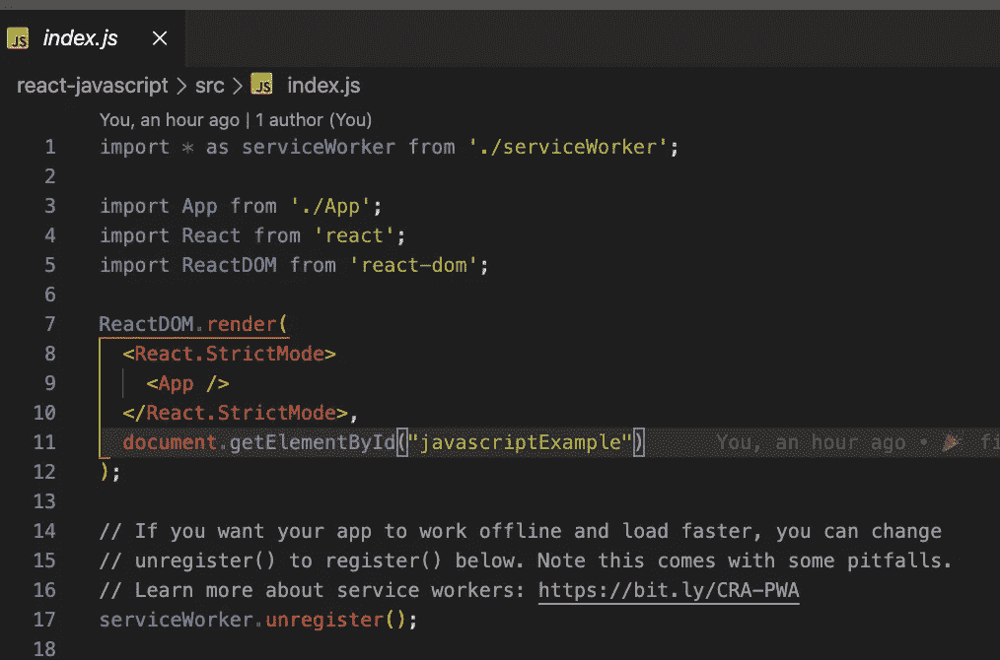
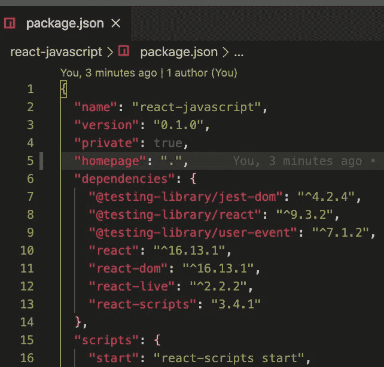
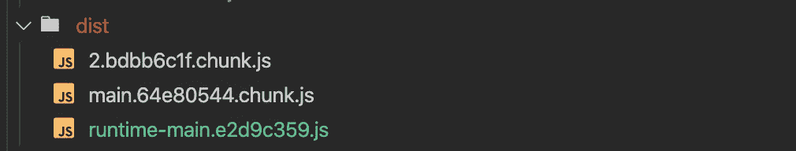
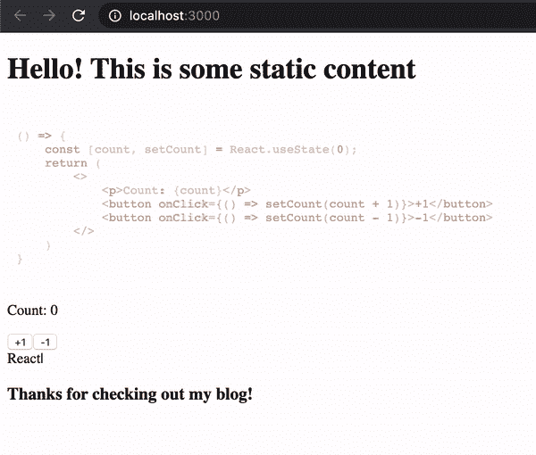

# 如何在任何网站中嵌入 React 应用程序

> 原文：<https://betterprogramming.pub/how-to-embed-a-react-application-on-any-website-1bee1d15617f>

## 使用 create-react-app，然后将其嵌入到现有项目中


哈尔·盖特伍德拍摄。

假设你有一个静态网站——可以是 WordPress、Wix、Squarespace 或服务器上的 HTML 你想给它添加一些令人眼花缭乱的功能。

“要是我能用 React 就好了！”你对自己说，但是时间和预算的限制阻止了对你的网站进行全面检查。

好消息是你并不孤单，好消息是本指南将向你展示如何在你的网站中创建和嵌入一个 React 小部件！我们只需要学会以稍微不同的方式思考反应…

> “React 可以在任何 web 应用程序中使用。它可以嵌入到其他应用程序中，只要稍加注意，其他应用程序也可以嵌入到 React 中。”— [React 的官方文档](https://reactjs.org/docs)

# 入门指南

本指南假设读者对 React 和一般 web 开发有一定的了解。如果你以前从未启动过 React 应用程序，React 网站上有一个[很棒的教程](https://reactjs.org/tutorial/tutorial.html)！

我们也将使用[纱线](https://yarnpkg.com/)和[精简服务器](https://www.npmjs.com/package/lite-server)。

让我们像当今许多开发人员一样，首先运行:

```
yarn create react-app example-widget
```

这个样板文件包含一个函数式 React 应用程序，您可以在其中开发自己喜欢的任何东西。为了这个例子，我创建了一个简单的组件，它使用了优秀的 [react-live](https://www.npmjs.com/package/react-live) 库。

该组件呈现了一个 web IDE，您可以在其中编写代码并立即看到结果——这在 WordPress 网站上很难实现，但在 React 中只需要 28 行代码。

# 4 步流程——无需弹出！

1.  我们希望我们的应用程序安装在一个我们可以控制的独一无二的`<div></div>`上。让我们将应用程序的目标 div 更改为一些独特的内容:



第 11 行:将目标 div ID 改为“javascriptExample”

2.我们需要更新应用程序的[主页](https://create-react-app.dev/docs/deployment/),以便为您网站的构建提供服务。这是通过将`"homepage": “.”`添加到`package.json`文件中来实现的:



第 5 行

注意:如果您的应用程序中有前端路由，事情会有所不同。更多信息见[这些文件](https://create-react-app.dev/docs/deployment/)。

3.现在，我们需要构建应用程序并提取 Webpack 包，作为我们另一个网站上的静态资产。

首先，运行`yarn build`生成一个缩小的构建。

其次，创建一个文件夹来保存应用程序运行所需的三个文件。我给我的取名`dist`。您将需要这三个文件:

*   这个文件包含了你正在使用的库的缩小版本。

```
./build/static/js/2.<someUniqueNumbers>.chunk.js
```

*   这个文件包含了你的代码的缩小版本。

```
./build/static/js/main.<someUniqueNumbers>.chunk.js
```

*   保存启动应用程序的代码的文件。

```
./build/static/js/runtime-main.<someUniqueNumbers>.js
```

当你有了这些文件，你的`dist`目录应该是这样的:



4.最后，我们可以将新的静态资产称为 JS 文件，并指示 React 小部件在我们的网站上安装一个`<div></div>`！

下面是我的 HTML 页面示例，其中有两个 React 应用程序作为 React 小部件安装:

请注意，这些文件的顺序很重要！

现在，如果我使用 lite-server 提供 HTML 页面…



哒哒！一个极具互动性的网站，在其他静态内容中包含两个React 应用程序！

# 结论

我希望这篇教程能够揭示 React 作为一个灵活的 JavaScript 库的强大之处。如果你对*为什么*所有这些工作感兴趣，我会鼓励你查看[这些文档](https://reactjs.org/docs/add-react-to-a-website.html)。

你可以在 GitHub 上浏览我的范例库[！](https://github.com/jollyjerr/react-widget)

对于在外部库/内容中使用 React，还有其他的技巧吗？滴一个回复让我知道！

保持安全和健康，一如既往地快乐编码。