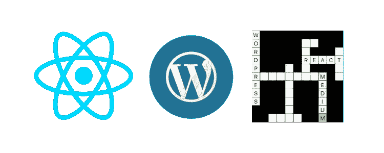

# 如何在 WordPress 网站中嵌入 React 应用

> 原文：<https://betterprogramming.pub/how-to-embed-react-apps-in-wordpress-sites-96a21b995290>

## 使用 React 在 WordPress 站点创建交互式填字游戏的初学者指南



作者照片。

一个潜在的客户最近要求一个 React 应用程序，该应用程序具有一个灵活和响应的纵横字谜组件，可以与他们现有的 WordPress 网站集成(类似于[《卫报》](https://www.theguardian.com/crosswords/quick/15631))。读了一圈，我发现执行这项任务没有明确的最佳实践，在 [WordPress 和 React](https://wp-and-react.com/#/) 上提出了各种不同的方法。然而，这些往往侧重于重新设计网站架构或涉及 WordPress 插件。

经过多次尝试和错误，我得到了这个工作没有任何一个，所以这篇文章将提供一个初学者的一步一步的指导我的实现。我将提供外部资源的链接，以便在每一步进行彻底的调试。您可以使用任何文本编辑器来完成这项任务。我的偏好是 [Atom](https://atom.io/) 。

# 创建新的 React 应用程序

React 是一个用于构建用户界面的 JavaScript 库。为了创建一个新的 React 项目，我们将使用 [create-react-app](https://create-react-app.dev/) 。您需要在本地开发机器上安装 [Node.js](https://nodejs.org/) > = 8.10。安装完成后，打开命令提示符/终端，转到要创建项目的目录，运行以下代码行:

```
cd path/to/directory
```

注意，你应该把你自己的`path/to/directory`放在这里(在我的 Mac 上，我经常只是把一个文件夹从我的 Finder 拖到命令行)。然后，我们将运行以下代码行来创建项目:

```
npx create-react-app crossword-app
```

`crossword-app`是我的项目的名称，所以您可以随意更改。接下来，我们将使用`cd`再次打开终端中的项目目录，并在开发模式下运行我们新创建的应用程序，代码如下:

```
npm start
```

如果您现在打开 [http://localhost:3000](http://localhost:3000/) ，您应该会看到一个带有 React 徽标的登录页面和一些带有 React 学习链接的文本。如果你已经走了这么远，干得好！如果没有，你可能有一些调试要做/冲突的依赖，所以检查一下 [create-react-app 文档](https://create-react-app.dev/docs/getting-started)。

# 添加主页属性

我们需要告诉我们的应用程序它将在服务器上的什么位置。由于使用了`create-react-app`，在编辑`package.json`文件之前，您现在需要在您的终端中运行以下代码，并打开您的项目目录:

```
yarn eject
```

现在，打开项目文件夹顶层的`package.json`文件，在`“name”`下面，添加新属性`homepage`。此属性将采用您希望应用程序在服务器上驻留的 URL 的值:

```
"homepage": "[http://localhost:8888/2020/06/24/react/](http://localhost:8888/2020/06/24/react/)"
```

请注意，我使用的是本地服务器。`localhost:8888`可能会被您的网站域名替换。但是，最好先在本地运行它，这样在运行之前就不必对站点进行修改。塔尼亚·拉西亚写了一篇关于建立当地环境的伟大文章。

# 添加 React DOM

文档对象模型(DOM)可以是网页的面向对象的表示。我们希望我们的应用程序被加载到 WordPress post 上，所以我们将使用`React DOM`包来完成这个任务。首先，在打开项目目录的情况下，通过在终端中运行来安装这个包:

```
npm install --save react-router-dom
```

现在，我们需要给我们的目标 DOM 元素一个惟一的 ID，这样应用程序就知道我们的 post 要加载到哪里。在你的文本编辑器中打开`public/index.html`，将`div`替换为你的唯一 ID`root`(例如，我选择了`my-crossword`)。

```
<div id="my-crossword"></div>
```

要告诉应用程序使用 ID`my-crossword`呈现此`div`，请打开`src/index.js`并更新到以下代码行:

`src/index.js`

# 添加纵横字谜组件

麻省理工学院的贾里德·雷辛格在 GitHub 上为这个纵横字谜组件提供了开源代码。您需要在项目目录打开的情况下，通过在终端中再次执行以下代码来安装 Jared 的包:

```
npm install --save @jaredreisinger/react-crossword
```

安装完成后，在文本编辑器中打开`src/App.js`。现在，删除它的内容并粘贴以下内容:

`src/App.js`

请注意，您可以通过向`across`和`down`添加更多条目来定制`data`。现在，您可以保存文件，并在项目目录打开的情况下在终端中再次运行:

```
npm start
```

这一次，如果你现在打开 [http://localhost:3000](http://localhost:3000/) ，你应该会看到你新的交互式填字游戏。如果您有问题或者想要进一步定制，请参考 Jared 的 [GitHub](https://github.com/JaredReisinger/react-crossword) 页面，并尝试运行[代码沙箱](https://codesandbox.io/s/new)中的代码。这将有助于您确定问题是由您的代码引起的，还是由您的本地环境引起的，因为包之间存在冲突。请注意，代码沙箱中的样式表是不同的，因此使用:

```
import "./styles.css";
```

而不是:

```
import "./App.css";
```

# 构建 React 应用程序

我们现在已经准备好通过运行`npm run build`来构建我们的 React 应用程序了。然而，最新版本的`create-react-app`安装了一个依赖项 [webpack](https://webpack.js.org/) ，其配置会将我们的构建文件分成“块”我们不希望这样，因此我们必须执行以下重新配置。通过在终端中运行以下代码来安装`react-app-rewired`开始:

```
npm install react-app-rewired --save-dev
```

接下来，在主项目目录中创建一个名为`config-overrides.js`的文件，并向其中添加以下代码行:

`config-overrides.js`

现在在`package.json`中，将`build`、`start`和`test`脚本替换为以下几行:

```
"start": "react-app-rewired start",
"build": "react-app-rewired build",
"test": "react-app-rewired test",
```

最后，在终端中打开项目目录，再次运行:

```
npm start
```

其次是:

```
npm run build
```

# 部署

现在，您需要将您的应用程序上传到您的网站服务器。要做到这一点，在服务器上你的 WordPress 站点目录中创建一个名为`react`的文件夹，在你设置主页的路径下。例如，我在`/2020/06/24/react/`中创建了我的`react`文件夹。关于[堆栈溢出](https://stackoverflow.com/questions/19272954/different-between-on-file-pathurl-in-asp-net)的文件路径符号有一个很好的解释。最后，将你的`react` `build`文件夹的全部内容复制到你在服务器上的新的 WordPress `react`文件夹。

打开 WordPress，创建一个你想嵌入 React 应用的新帖子。该页面的永久链接应该与您的`package.json`中的`homepage`属性相匹配。例如，我的永久链接是`http://localhost:8888/2020/06/24/react/`。切换到代码编辑器模式，插入以下代码:

WordPress 代码编辑器

注意，这里的`src`应该设置为网站目录中的路径，该路径从 React 项目的`/build/static`文件夹中指向主 JS 文件。

就是这样！如果你点击预览，你应该会看到你的 React 应用嵌入到你的 WordPress 文章中。在下面的代码沙箱中查看我完成的纵横字谜应用程序。

我希望你已经发现这个将 React 应用嵌入 WordPress 站点的分步指南是有用的！让我知道你的进展，并在评论中留下任何问题。

我在代码沙盒上的纵横字谜

# 资源

*   [wp-and-react](https://wp-and-react.com/#/) (关于 WordPress 和 react 开发的教程和资源集合)
*   Atom(Atom 文本编辑器的网站)
*   [创建-反应-应用](https://create-react-app.dev/)(创建反应应用包的网站)
*   [node . js](https://nodejs.org/)(node . js 运行环境网站)
*   [创建反应应用文档](https://create-react-app.dev/docs/getting-started)(创建反应应用包的文档)
*   建立一个本地服务器环境
*   r [eact-crossword](https://github.com/JaredReisinger/react-crossword) (贾里德·雷辛格的 GitHub 知识库)
*   [代码沙箱](https://codesandbox.io/s/new)(代码沙箱在线代码编辑器和原型工具网站)
*   [路径组件快捷键](https://stackoverflow.com/questions/19272954/different-between-on-file-pathurl-in-asp-net)(堆栈溢出讨论线程)