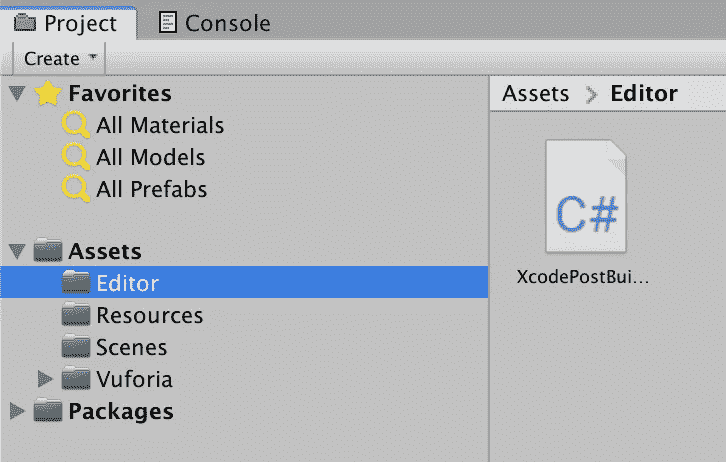
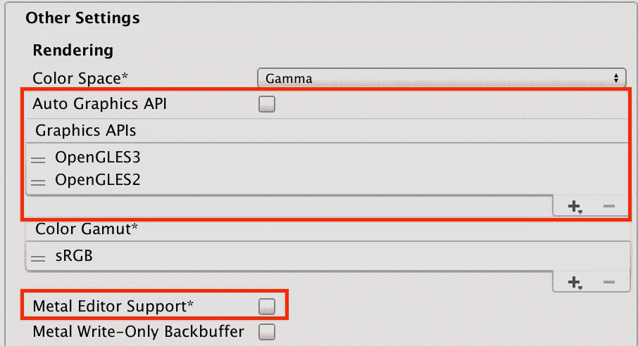
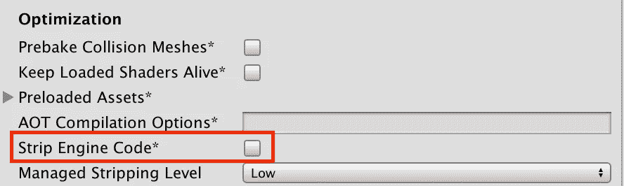
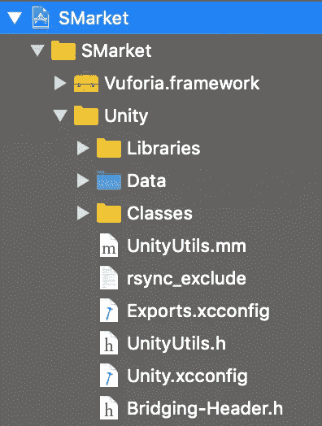
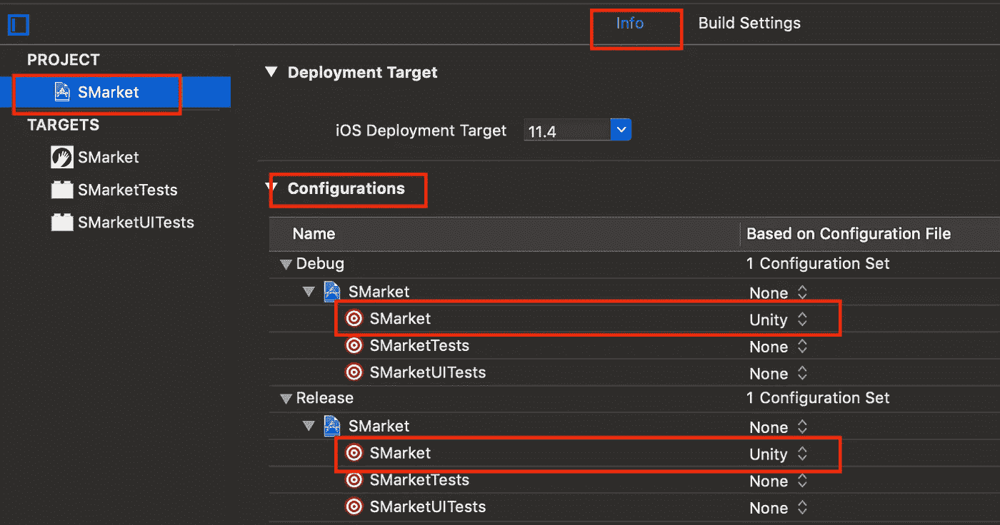
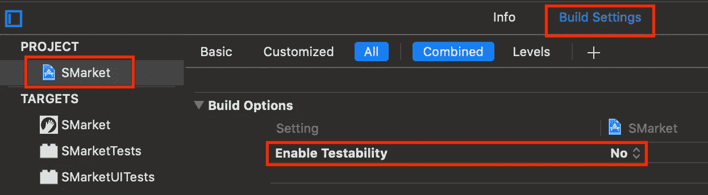
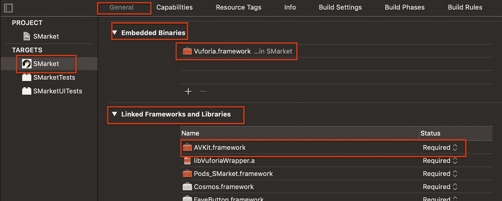
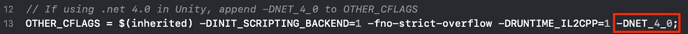
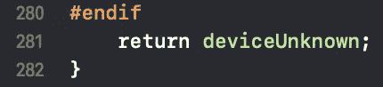
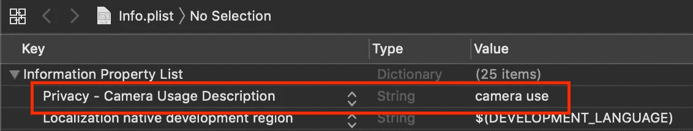

# 如何在原生 iOS Swift 项目中嵌入 Unity

> 原文：<https://betterprogramming.pub/how-to-embed-unity-with-vuforia-in-a-native-ios-swift-project-e9c82dfe53c>

## 使用 Vuforia 将 Unity 嵌入 Swift 项目的视图控制器

我正在使用 Unity 实现 Vuforia 的云识别，并希望将场景嵌入到我的 Swift 项目的视图控制器中。


我在网上找到的大部分教程要么用的是老版本的 Unity 和 Objective-C，要么不用 Vuforia。所以，我创建了这个教程。

仅供参考，我用的是:Xcode 版本:`Version 10.2.1`，Unity 版本:`2018.3.8f1`，Vuforia 版本:`8.0.10`

# 第 1 部分:导出 Unity 项目

导出是该过程的关键部分，请确保您正确遵循所有播放器设置。

1.  将这个[后期构建脚本](https://github.com/jiulongw/swift-unity/blob/master/XcodePostBuild.cs)复制到`YourUnityProjName/Assets/Editor`文件夹。



将后期生成脚本添加到资源/编辑器文件夹

2.根据我在脚本中所做的注释，找到并编辑下面两行:

3.文件->构建设置->切换到`iOS`平台如果你还没有

4.文件->构建设置->播放器设置->其他设置

a.取消勾选`Auto Graphics API`

b.如果使用的是`Vuforia`，在`Graphics API`中，删除`Metal`，添加`OpenGLES3`、`OpenGLES2`。如果您不使用`Vuforia`，您可以跳过这一步。

c.取消勾选`Metal Editor Support` & `Strip Engine Code`



取消选中自动图形 API 和金属编辑器支持，选择打开栅格 3，打开栅格 2



取消选中剥离引擎代码

d.构建并记下您导出 Unity 项目的位置。

5.转到您的 Xcode 目标文件夹(包含`YOUR_PROJ_NAME.xcodeproj`文件的文件夹)——已经创建了一个包含`Exports.xcconfig`的`Unity`文件夹。

# 第 2 部分:在 iOS 项目中嵌入 Unity

1.  下载 [Unity](https://github.com/jiulongw/swift-unity/tree/master/demo/xcode/DemoApp/Unity) 文件夹，将里面的所有项目复制到 Xcode 目标文件夹下的`Unity`文件夹。
2.  在项目导航器中打开`.xcworkspace`，将刚刚下载的`Unity`文件夹拖拽到目标位置。选择`Copy items if needed`和`Create Groups`。
3.  转到 Unity 项目导出文件夹(不是步骤 2 中的那个)，将`Classes`和`Libraries`文件夹拖到项目导航器中的目标文件夹(一次一个文件夹)，选择`Copy items if needed`和`Create Groups`。
4.  拖动`Data`文件夹，取消`Copy items if needed`选择`Create Group Reference`。
5.  拖动`Framework`文件夹下的`Vuforia.framework`，选择`Copy items if needed`和`Create Groups`。



您的项目的层次结构现在应该如下所示

6.在项目导航器中选择您的项目，并转到`info`选项卡。在`Configurations`下，你应该看到`Pods-YOUR_PROJ_NAME.debug`和`Pods-yourproj.release`被默认设置为你的目标的`Debug`和`Release`配置文件。都改成`Unity`。



更改配置文件

7.转到`Build Settings`选项卡，搜索`Enable Testability`并将其设置为`No`。



将启用可测试性设置为否

8.点击你的目标，进入`General`标签。在`Embedded binaries`下，增加`Vuforia.framework`。在`Linked Frameworks and Libraries`下，增加`AVKit.framework`。



添加 Vuforia.framework 和 AVKit.framework

9.如果您在原生 iOS 项目中使用`Cocoapods`，请在`Unity.xcconfig`文件的开头添加以下几行。

```
#include "../../Pods/Target Support Files/Pods-YOUR_PROJ_NAME/Pods-YOUR_PROJ_NAME.debug.xcconfig"
#include "../../Pods/Target Support Files/Pods-YOUR_PROJ_NAME/Pods-YOUR_PROJ_NAME.release.xcconfig"
```

10.如果使用`.NET 4.0`T34，`Unity.xcconfig`中的，将`*-DNET_4_0*`追加到`*OTHER_CFLAGS*`中



将`*-DNET_4_0*`追加到`*OTHER_CFLAGS*`

11.使用项目导航器中的过滤器搜索这两个文件:`Unity/Classes`文件夹下的`DynamicLibEngineAPI-functions.h`、`DynamicLibEngineAPI.mm`，并使用`Remove references only`删除它们。

12.在`Unity/Classes/UI`下搜索`SplashScreen.mm`，将`#include “Classes/Unity/UnitySharedDecls.h”` 替换为`#include “../Classes/Unity/UnitySharedDecls.h”`。

13.在`Unity/Classes/Unity`下搜索`DeviceSettings.mm`，在第`280` ( `#endif`)行和第`281` ( `}`)行之间添加`return deviceUnknown;`。



添加“返回设备未知”;'

14.如果您正在使用`Vuforia`，请转到您的`Info.plist`，添加键`Privacy — Camera Usage Description.`在这里您可以添加一条消息，告诉用户该应用程序需要使用摄像头。



向 Info.plist 添加隐私-相机使用说明

# 第 3 部分:编辑原生 iOS Swift 文件

1.  按照[这个代码](https://github.com/jiulongw/swift-unity/blob/master/demo/xcode/DemoApp/AppDelegate.swift)编辑你的`AppDelegate.swift`。
2.  为您的 Unity view 添加新的视图控制器。
3.  创建新的`UnityViewController.swift`
4.  在`func viewDidLoad()`中添加这些行:

# 第 4 部分:运行项目

就是这样，您应该能够在您的设备上运行您的项目了！

注意:如果你正在使用 Vuforia **你将不能在模拟器中运行它——你将会得到无数的错误信息。**

# 参考

这里有一些我发现有用的其他教程。如果您仍然需要帮助，请尝试以下资源:

[**将 Unity 项目集成到 Xcode Swift 项目**](https://github.com/jiulongw/swift-unity)

[**Unity-iOS**](https://github.com/rocketinsights/Unity-iOS)

[**如何将 Unity 游戏嵌入 iOS 原生 Swift App**](https://medium.com/@IronEqual/how-to-embed-a-unity-game-into-an-ios-native-swift-app-772a0b65c82)

[**如何在 iOS 应用内使用 Unity 3D**](https://github.com/blitzagency/ios-unity5)